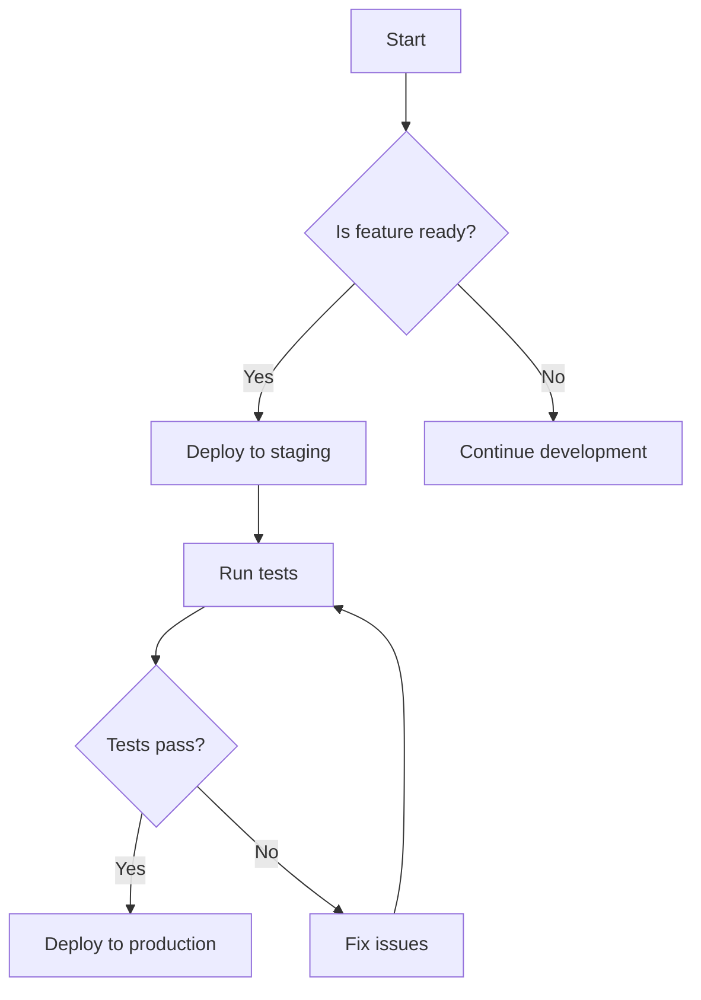

# Documentation Guidelines for ttoss Project

## Core Documentation Philosophy

**MOST IMPORTANT RULE**: **Less is More - Prioritize Essential Information**

Modern readers have limited attention spans and want direct, actionable information. Our documentation must be ruthlessly concise and focus only on what truly matters:

- **Remove over add**: It's better to remove less important documentation than to keep adding more information
- **Essential information only**: Every sentence must provide clear value to the reader
- **Minimum viable documentation**: Deliver maximum impact with minimum cognitive load
- **Scannable content**: Readers should get key information within seconds

**Guiding Questions for Content:**

- Is this information absolutely necessary for the reader to succeed?
- Can this be said in fewer words without losing meaning?
- Would removing this paragraph make the documentation less effective?
- Does this help the reader take action or just add noise?

**When in doubt, cut it out.** Clear, concise documentation is more valuable than comprehensive but overwhelming content.

## Before Making Any Changes - Required Analysis

**CRITICAL**: Before creating or editing any documentation, you MUST:

1. **Scan Related Documentation**: Always search and read related content across ALL documentation sections (blog, product, engineering, design) to understand existing coverage
2. **Identify Cross-References**: Look for existing internal links, references, and connections that might be affected by your changes
3. **Check for Redundancy**: Ensure you're not duplicating existing content - instead, reference or expand existing documentation
4. **Understand Context**: Read at least 2-3 related documents to understand the broader context and messaging consistency
5. **Map Dependencies**: Identify which other documents might need updates when you make changes

### Documentation Interconnectedness

This project's documentation is **highly interconnected**:

- **Blog posts** often reference and expand on concepts from product/engineering docs
- **Engineering processes** are tied to product development workflows
- **Design decisions** impact both engineering and product documentation
- **Cross-pollination** of ideas between all sections is common and encouraged

### Analysis Workflow

When asked to modify documentation:

1. **Search First**: Use semantic search to find related content across the entire docs folder
2. **Read Connections**: Identify how the topic connects to other areas (product ↔ engineering ↔ design ↔ blog)
3. **Plan Holistically**: Consider how your changes might affect or enhance other documentation
4. **Suggest Cross-References**: Always propose relevant internal links to strengthen the documentation web
5. **Flag Potential Updates**: Identify other documents that might benefit from updates or references to your new content

## Project Structure Overview

This project uses Docusaurus for documentation and follows a structured approach to organize content:

- **Blog** (`docs/website/blog/`): Contains blog posts about product development, engineering practices, and technical insights
- **Product Documentation** (`docs/website/docs/product/`): Describes product development processes, strategy, and workflow
- **Engineering Documentation** (`docs/website/docs/engineering/`): Contains engineering processes, guidelines, career information, and technical proposals
- **Design Documentation** (`docs/website/docs/design/`): Covers design processes and design system documentation

## Writing Standards

### Front Matter Requirements

Always include proper front matter at the beginning of markdown files:

**For Documentation Pages:**

```yaml
---
title: Clear, Descriptive Title
slug: /path-to-page
---
```

**For Blog Posts:**

```yaml
---
title: 'Compelling Blog Post Title'
description: Brief description of the post content (1-2 sentences)
authors:
  - authorname
tags:
  - relevant-tag1
  - relevant-tag2
  - category-tag
---
```

### Content Structure

1. **Start with Context**: Begin documentation with a brief explanation of what the reader will learn or accomplish
2. **Use Clear Headings**: Structure content with descriptive headings following markdown hierarchy (##, ###, ####)
3. **Include Practical Examples**: Provide code examples, configurations, or real-world scenarios when applicable
4. **Cross-Reference Related Content**: Link to related documentation using relative paths

### Writing Style

- **Use English Language**: All documentation must be written in English to ensure consistency and accessibility for the international team
- **Prioritize Brevity**: Every word must earn its place - remove anything that doesn't add clear value
- **Use Active Voice**: Write in active voice whenever possible
- **Be Concise but Complete**: Provide all necessary information without unnecessary verbosity - favor removing over adding
- **Technical Accuracy**: Ensure all technical information is accurate and up-to-date
- **Consistent Terminology**: Use consistent terms throughout documentation
- **Scannable Format**: Use bullet points, headers, and short paragraphs for easy scanning

### Blog Post Specific Guidelines

- **Include Truncate Comment**: Add `<!-- truncate -->` after the introduction to create proper excerpt on blog index
- **Use Engaging Introductions**: Start with compelling hooks that explain the value proposition
- **Include Internal Links**: Reference relevant internal documentation using `/docs/` paths
- **Tag Appropriately**: Use relevant tags for discoverability (e.g., agile, product-development, engineering, startup)

### File Naming Conventions

- **Documentation Files**: Use numbered prefixes for ordered content (e.g., `01-introduction.md`, `02-setup.md`)
- **Blog Posts**: Use date prefix format `YYYY-MM-DD-title-with-hyphens.md`
- **Use Lowercase**: All file names should be lowercase with hyphens for spaces

### Markdown Best Practices

- **Code Blocks**: Always specify language for syntax highlighting
- **Lists**: Use consistent list formatting (prefer `-` for unordered lists)
- **Links**: Use descriptive link text, avoid "click here" or "read more"
- **Images**: Include alt text for accessibility
- **Tables**: Use markdown tables for structured data presentation
- **Mermaid Diagrams**: Use Mermaid diagrams whenever possible to visualize processes, workflows, architectures, and relationships instead of static images or text descriptions

### Visual Documentation with Mermaid

**CRITICAL**: Use Mermaid diagrams to replace lengthy text explanations and make complex concepts immediately understandable.

**When to Use Mermaid:**

- **Process flows**: User journeys, development workflows, deployment processes
- **System architecture**: Component relationships, data flow, service interactions
- **Decision trees**: Conditional logic, approval processes, troubleshooting guides
- **Timelines**: Project phases, feature releases, migration steps
- **Relationships**: Entity relationships, class hierarchies, dependencies

**Common Mermaid Diagram Types:**

- `flowchart`: For processes, workflows, and decision paths
- `sequenceDiagram`: For interactions between systems/users over time
- `classDiagram`: For software architecture and entity relationships
- `gitgraph`: For branching strategies and release workflows
- `journey`: For user experience flows
- `timeline`: For chronological processes or milestones

**Best Practices:**

- Keep diagrams focused on essential information only
- Use clear, descriptive labels
- Prefer multiple simple diagrams over one complex diagram
- Always add a brief explanation after the diagram
- Test diagrams render correctly in the documentation

**Example:**



### Content Organization

- **Logical Flow**: Organize content from general to specific
- **Scannable Content**: Use bullet points, numbered lists, and subheadings for easy scanning
- **Progressive Disclosure**: Start with high-level concepts before diving into details
- **Call-to-Action**: End sections with clear next steps when appropriate

### Quality Checklist

Before publishing documentation:

- [ ] **Content Optimization Complete**: Removed all non-essential information and optimized for brevity
- [ ] **Essential Information Only**: Every sentence provides clear value to the reader
- [ ] **Cross-Documentation Analysis Complete**: Searched for related content across all sections
- [ ] **No Redundancy**: Confirmed content doesn't duplicate existing documentation
- [ ] **Internal Links Added**: Included relevant cross-references to strengthen documentation web
- [ ] **Consistency Check**: Ensured terminology and messaging aligns with existing content
- [ ] **Impact Assessment**: Identified other documents that might need updates
- [ ] **Scannable Format**: Used bullet points, short paragraphs, and clear headers
- [ ] Front matter is complete and accurate
- [ ] All internal links work correctly
- [ ] Code examples are tested and functional
- [ ] Content follows the established writing style
- [ ] Spelling and grammar are correct
- [ ] Content is logically organized and flows well

### Content Optimization Guidelines

**Essential vs. Nice-to-Have**: Before publishing any documentation, apply this hierarchy:

1. **Must-have information**: Critical for user success - keep and optimize
2. **Should-have information**: Helpful but not critical - consider condensing
3. **Could-have information**: Interesting but not essential - usually remove
4. **Won't-have information**: Tangential or obvious - always remove

**Optimization Techniques**:

- Replace paragraphs with bullet points when possible
- Use tables instead of long explanations for structured information
- Link to external resources instead of explaining everything inline
- Use examples that teach multiple concepts simultaneously
- Remove redundant explanations and cross-references

**Red Flags for Removal**:

- Information that repeats what's already documented elsewhere
- Background context that doesn't help with the immediate task
- Multiple ways to do the same thing (pick the best one)
- Detailed explanations of obvious concepts
- Historical information that doesn't affect current practice

### Documentation as a Living System

Think of ttoss documentation as an **interconnected ecosystem** where:

- Each piece of content strengthens and references others
- Changes in one area often necessitate updates in related areas
- The goal is to create a comprehensive, non-redundant knowledge base
- Readers should be able to follow natural paths between related concepts

**Key Principle**: Never work in isolation. Every documentation change should consider and enhance the broader documentation ecosystem.

## Self-Improvement of Documentation Instructions

### Continuous Evolution Requirement

**CRITICAL**: This instructions file (`docs.instructions.md`) must evolve alongside the documentation it governs. After completing any documentation work, you MUST evaluate whether these instructions need updates.

### When to Update These Instructions

Update `docs.instructions.md` when you discover:

1. **New Documentation Patterns**: Recurring structures or approaches that should be standardized
2. **Process Gaps**: Missing guidance that would have prevented issues or improved efficiency
3. **Project Evolution**: Changes in project structure, tools, or methodologies that affect documentation
4. **Quality Issues**: Repeated problems that could be prevented with better instructions
5. **Cross-Reference Discoveries**: New interconnection patterns between documentation sections

### What NOT to Add

Be selective and only add:

- ✅ **Systematic patterns** that apply broadly across the documentation
- ✅ **Critical quality standards** that prevent real problems
- ✅ **Structural guidance** that improves consistency
- ✅ **Cross-referencing rules** that strengthen the documentation ecosystem

Avoid adding:

- ❌ **One-off solutions** specific to single documents
- ❌ **Overly detailed formatting** that should be obvious from examples
- ❌ **Redundant guidance** already covered elsewhere
- ❌ **Temporary project-specific** details that may change frequently

### Intelligent Update Process

When updating these instructions:

1. **Identify the Pattern**: What systematic issue or opportunity did you discover?
2. **Generalize the Solution**: How can this guidance apply to future documentation work?
3. **Find the Right Section**: Where does this guidance best fit in the existing structure?
4. **Keep it Concise**: Add only essential guidance that will genuinely improve future work
5. **Test Against Real Examples**: Ensure the new guidance would have helped with actual documentation tasks

### Update Documentation

When you update `docs.instructions.md`, briefly note:

- **What pattern/issue prompted the update**
- **How the new guidance improves the documentation process**
- **Which section of the instructions was enhanced**

This creates a living document that becomes more valuable with each documentation task, without becoming bloated or unwieldy.

### Recent Updates

**June 30, 2025 - Added Mermaid Diagram Guidelines**:

- **Pattern Identified**: Complex processes and architectures were being explained with lengthy text that was hard to scan and understand
- **Solution**: Mandated use of Mermaid diagrams for visualizing processes, workflows, architectures, and relationships, with specific guidance on diagram types and best practices
- **Impact**: Documentation will now be more visual and scannable, with complex concepts represented as clear diagrams instead of dense text explanations

**June 27, 2025 - Added Core Documentation Philosophy**:

- **Pattern Identified**: Documentation was becoming too verbose and overwhelming for modern readers
- **Solution**: Established "Less is More" as the most important rule, prioritizing essential information over comprehensive coverage
- **Impact**: All future documentation must now pass the "essential information only" filter, with clear guidelines for content optimization and removal of non-critical information
