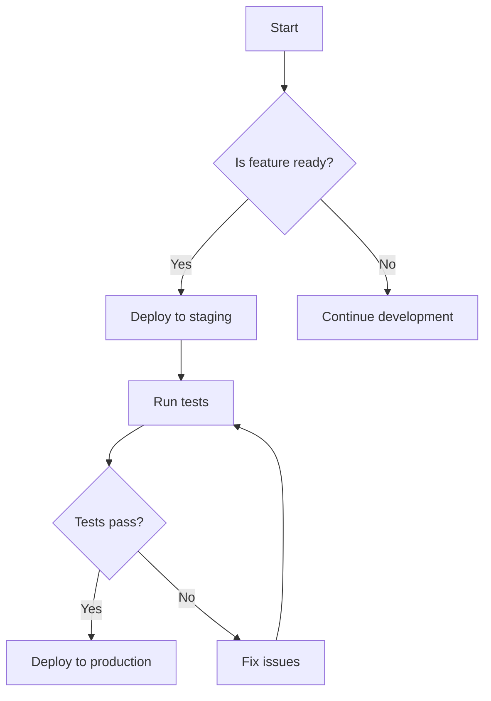
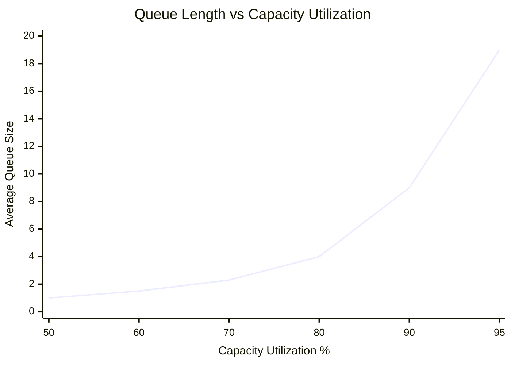

# Documentation Guidelines for ttoss Project

## Core Documentation Philosophy

**MOST IMPORTANT RULE**: **Less is More - Prioritize Essential Information**

Modern readers have limited attention spans and want direct, actionable information. Our documentation must be ruthlessly concise and focus only on what truly matters:

- **Remove over add**: It's better to remove less important documentation than to keep adding more information
- **Essential information only**: Every sentence must provide clear value to the reader
- **Minimum viable documentation**: Deliver maximum impact with minimum cognitive load
- **Scannable content**: Readers should get key information within seconds

**Guiding Questions for Content:**

- Is this information absolutely necessary for the reader to succeed?
- Can this be said in fewer words without losing meaning?
- Would removing this paragraph make the documentation less effective?
- Does this help the reader take action or just add noise?

**When in doubt, cut it out.** Clear, concise documentation is more valuable than comprehensive but overwhelming content.

## Before Making Any Changes - Required Analysis

**CRITICAL**: Before creating or editing any documentation, you MUST:

1. **Scan Related Documentation**: Search and read related content across ALL sections (blog, product, engineering, design)
2. **Identify Cross-References**: Find existing internal links and connections affected by your changes
3. **Check for Redundancy**: Ensure you're not duplicating content - reference or expand existing documentation
4. **Understand Context**: Read 2-3 related documents for broader context and messaging consistency
5. **Plan Holistically**: Consider how changes affect or enhance other documentation
6. **Suggest Cross-References**: Propose relevant internal links to strengthen the documentation ecosystem

This project's documentation is **highly interconnected** - blog posts reference product/engineering docs, engineering processes tie to product workflows, and design decisions impact all areas. Always work with this interconnected ecosystem in mind.

## Project Structure Overview

This project uses Docusaurus for documentation and follows a structured approach to organize content:

- **Blog** (`docs/website/blog/`): Contains blog posts about product development, engineering practices, and technical insights
- **Product Documentation** (`docs/website/docs/product/`): Describes product development processes, strategy, and workflow
- **Engineering Documentation** (`docs/website/docs/engineering/`): Contains engineering processes, guidelines, career information, and technical proposals
- **Design Documentation** (`docs/website/docs/design/`): Covers design processes and design system documentation

## Writing Standards

### Front Matter Requirements

Always include proper front matter at the beginning of markdown files:

**For Documentation Pages:**

```yaml
---
title: Clear, Descriptive Title
slug: /path-to-page
---
```

**For Blog Posts:**

```yaml
---
title: 'Compelling Blog Post Title'
description: Brief description of the post content (1-2 sentences)
authors:
  - authorname
tags:
  - relevant-tag1
  - relevant-tag2
  - category-tag
---
```

### Content Structure

1. **Start with Context**: Begin documentation with a brief explanation of what the reader will learn or accomplish
2. **Use Clear Headings**: Structure content with descriptive headings following markdown hierarchy (##, ###, ####)
3. **Include Practical Examples**: Provide code examples, configurations, or real-world scenarios when applicable
4. **Cross-Reference Related Content**: Link to related documentation using relative paths

### ttoss Principles Integration

**CRITICAL**: The [Product Development Principles](https://ttoss.dev/docs/product/product-development/principles) documented in `/docs/website/docs/product/03-product-development/02-principles.md` are the **foundational framework** for all ttoss operations and decision-making.

**When Writing Any Documentation:**

- **Reference Principles When Relevant**: Always link to specific principles that support or explain the concepts being documented
- **Use Principle-Based Reasoning**: When explaining "why" something is done a certain way, reference the underlying economic principles
- **Maintain Consistency**: Ensure all processes, tools, and guidelines align with and reinforce these core principles
- **Cross-Reference Format**: Use descriptive links like `[The Economic View](https://ttoss.dev/docs/product/product-development/principles#the-economic-view)` or `[E1: The Principle of Quantified Overall Economics](https://ttoss.dev/docs/product/product-development/principles#e1-the-principle-of-quantified-overall-economics-select-actions-based-on-quantified-overall-economic-impact)`

**Example Integration:**
Instead of: "We use small iterations to get faster feedback"
Write: "We use small iterations to get faster feedback, following [B3: The Batch Size Feedback Principle](https://ttoss.dev/docs/product/product-development/principles#b3-the-batch-size-feedback-principle-reducing-batch-sizes-accelerates-feedback) and [FF8: The Fast-Learning Principle](https://ttoss.dev/docs/product/product-development/principles#ff8-the-fast-learning-principle-use-fast-feedback-to-make-learning-faster-and-more-efficient)"

This approach transforms documentation from isolated instructions into an interconnected system grounded in proven economic principles.

### Writing Style

- **Use English Language**: All documentation must be written in English to ensure consistency and accessibility for the international team
- **Prioritize Brevity**: Every word must earn its place - remove anything that doesn't add clear value
- **Use Active Voice**: Write in active voice whenever possible
- **Be Concise but Complete**: Provide all necessary information without unnecessary verbosity - favor removing over adding
- **Technical Accuracy**: Ensure all technical information is accurate and up-to-date
- **Consistent Terminology**: Use consistent terms throughout documentation
- **Minimize Structural Breaks**: Prefer flowing paragraphs over excessive bullet points and subheadings to improve readability

### Blog Post Specific Guidelines

- **Include Truncate Comment**: Add `<!-- truncate -->` after the introduction to create proper excerpt on blog index
- **Use Engaging Introductions**: Start with compelling hooks that explain the value proposition
- **Include Internal Links**: Reference relevant internal documentation using `/docs/` paths
- **Tag Appropriately**: Use relevant tags for discoverability (e.g., agile, product-development, engineering, startup)

### File Naming Conventions

- **Documentation Files**: Use numbered prefixes for ordered content (e.g., `01-introduction.md`, `02-setup.md`)
- **Blog Posts**: Use date prefix format `YYYY-MM-DD-title-with-hyphens.md`
- **Use Lowercase**: All file names should be lowercase with hyphens for spaces

### Markdown Best Practices

- **Code Blocks**: Always specify language for syntax highlighting
- **Lists**: Use consistent list formatting (prefer `-` for unordered lists)
- **Links**: Use descriptive link text, avoid "click here" or "read more"
- **Images**: Include alt text for accessibility
- **Tables**: Use markdown tables for structured data presentation
- **Mermaid Diagrams**: Use Mermaid diagrams whenever possible to visualize processes, workflows, architectures, and relationships instead of static images or text descriptions

### Visual Documentation with Mermaid

**CRITICAL**: Use Mermaid diagrams to replace lengthy text explanations and make complex concepts immediately understandable.

**When to Use Mermaid:**

- **Process flows**: User journeys, development workflows, deployment processes
- **System architecture**: Component relationships, data flow, service interactions
- **Decision trees**: Conditional logic, approval processes, troubleshooting guides
- **Timelines**: Project phases, feature releases, migration steps
- **Relationships**: Entity relationships, class hierarchies, dependencies

**Common Mermaid Diagram Types:**

- `flowchart`: For processes, workflows, and decision paths
- `sequenceDiagram`: For interactions between systems/users over time
- `classDiagram`: For software architecture and entity relationships
- `gitgraph`: For branching strategies and release workflows
- `journey`: For user experience flows
- `timeline`: For chronological processes or milestones
- `xychart`: For data relationships, trends, correlations, and quantitative analysis

**Best Practices:**

- Keep diagrams focused on essential information only
- Use clear, descriptive labels
- Prefer multiple simple diagrams over one complex diagram
- Always add a brief explanation after the diagram
- Test diagrams render correctly in the documentation

**Example:**



**XY Chart Example:**



### Content Organization

- **Logical Flow**: Organize content from general to specific
- **Scannable Content**: Use bullet points, numbered lists, and subheadings for easy scanning
- **Progressive Disclosure**: Start with high-level concepts before diving into details
- **Call-to-Action**: End sections with clear next steps when appropriate

### Reducing Visual Fragmentation

**CRITICAL**: Minimize excessive structural breaks that fragment reader attention and interrupt content flow.

**Guidelines for Structural Elements:**

- **Limit Subheadings**: Use H3 (###) and H4 (####) sparingly - prefer flowing paragraphs over fragmenting content into micro-sections
- **Consolidate Lists**: Transform bullet points into flowing sentences when the information doesn't require explicit enumeration
- **Combine Related Sections**: Merge closely related topics into cohesive paragraphs rather than separate subsections
- **Preserve Essential Structure**: Maintain clear H2 (##) sections for major topics, but avoid over-segmentation within them

**When to Use Lists vs. Paragraphs:**

- **Use Lists**: For actionable steps, distinct options, or items that readers need to reference individually
- **Use Paragraphs**: For explanatory content, connected concepts, or information that flows naturally together
- **Use Tables**: For structured data comparisons or specifications

**Example Transformation:**
Instead of:

```markdown
### Benefits of WIP Limits

- Faster delivery
- Better quality
- Improved morale
- Economic optimization
```

Write:

```markdown
WIP limits unlock faster delivery, better quality, improved morale, and economic optimization by constraining work-in-process flow.
```

### Quality Checklist

Before publishing documentation:

- [ ] **Content Optimization Complete**: Removed all non-essential information and optimized for brevity
- [ ] **Essential Information Only**: Every sentence provides clear value to the reader
- [ ] **Cross-Documentation Analysis Complete**: Searched for related content across all sections
- [ ] **No Redundancy**: Confirmed content doesn't duplicate existing documentation
- [ ] **Internal Links Added**: Included relevant cross-references to strengthen documentation web
- [ ] **Principles Integration**: Connected content to relevant ttoss principles with proper links and reasoning
- [ ] **Consistency Check**: Ensured terminology and messaging aligns with existing content
- [ ] **Impact Assessment**: Identified other documents that might need updates
- [ ] **Scannable Format**: Used bullet points, short paragraphs, and clear headers
- [ ] **Reduced Fragmentation**: Minimized excessive subheadings and consolidated lists into flowing content where appropriate
- [ ] Front matter is complete and accurate
- [ ] All internal links work correctly
- [ ] Code examples are tested and functional
- [ ] Content follows the established writing style
- [ ] Spelling and grammar are correct
- [ ] Content is logically organized and flows well

### Content Optimization Guidelines

**Essential vs. Nice-to-Have**: Before publishing any documentation, apply this hierarchy:

1. **Must-have information**: Critical for user success - keep and optimize
2. **Should-have information**: Helpful but not critical - consider condensing
3. **Could-have information**: Interesting but not essential - usually remove
4. **Won't-have information**: Tangential or obvious - always remove

**Optimization Techniques**:

- Replace paragraphs with bullet points when possible
- Use tables instead of long explanations for structured information
- Link to external resources instead of explaining everything inline
- Use examples that teach multiple concepts simultaneously
- Remove redundant explanations and cross-references

**Red Flags for Removal**:

- Information that repeats what's already documented elsewhere
- Background context that doesn't help with the immediate task
- Multiple ways to do the same thing (pick the best one)
- Detailed explanations of obvious concepts
- Historical information that doesn't affect current practice

### Documentation as a Living System

Think of ttoss documentation as an **interconnected ecosystem** where:

- Each piece of content strengthens and references others
- Changes in one area often necessitate updates in related areas
- The goal is to create a comprehensive, non-redundant knowledge base
- Readers should be able to follow natural paths between related concepts

**Key Principle**: Never work in isolation. Every documentation change should consider and enhance the broader documentation ecosystem.

This instructions file must evolve alongside the documentation it governs. After completing documentation work, evaluate whether these instructions need updates based on:

- **New systematic patterns** that should be standardized across documentation
- **Process gaps** that would improve efficiency or prevent quality issues
- **Project evolution** that affects documentation structure or methodology

When updating these instructions, keep changes focused on broadly applicable guidance that genuinely improves future work. Avoid one-off solutions or overly detailed formatting rules.
