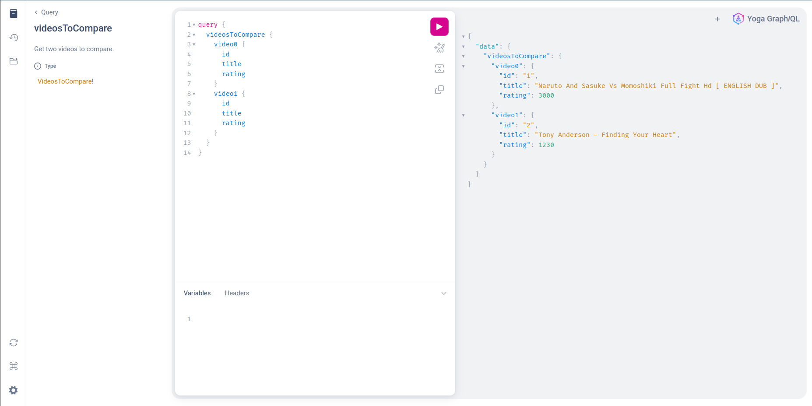

# ttoss Challenge - API GraphQL with DynamoDB

This is a challenge to create a GraphQL API with DynamoDB. This project has an initial setup with a GraphQL API and DynamoDB, but it's not working. Your task is to make it work.



## Getting Started

Install the dependencies:

```bash
pnpm install
```

Build the GraphQL schema and types ([read more about this](https://ttoss.dev/docs/modules/packages/graphql-api/#building-schema-and-types)):

```bash
pnpm build-schema
```

Run in development mode:

```bash
pnpm dev
```

Once the server is running, you can access the API playground at [http://localhost:4000](http://localhost:4000) (or the URL that the server is running).

## Tasks

Some tasks you can do to complete this challenge:

- [ ] Retrieve and configure AWS credentials and table info to server connect with DynamoDB (_file: [./src/modules/DynamoDB/dynamodb.ts](./src/modules/DynamoDB/dynamodb.ts)_)
- [ ] Create a query that returns two videos to compare (_file: [./src/modules/Videos/Query-videosToCompare.ts](./src/modules/Videos/Query-videosToCompare.ts)_)
- [ ] Create a mutation to vote on a video (_file: [./src/modules/Videos/Mutation-Mutation-videosContest.ts](./src/modules/Videos/Mutation-videosContest.ts)_)
