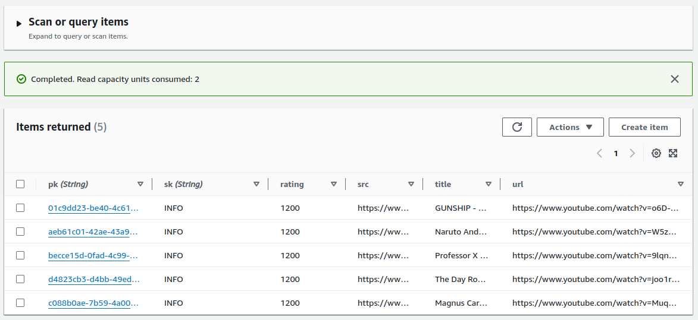

# ttoss Challenge - DB DynamoDB

This is a challenge to create a DynamoDB table with a single-table design. This project has an CloudFormation template with a DynamoDB table, and a seed script to populate the table with some data. Your task is to create the table and add the seed data. You may need to modify the table design to fit the requirements of the challenge.



## Getting Started

Create a table on Console or using the CloudFormation template—run the following command to create the table:

```bash
pnpm run deploy-challenge
```

After creating the table, get the table name and save it in the `.env` file, then run the following command to seed the table:

```bash
pnpm run seed-table
```

If everything goes well, you'll see a message with some created item.

## Table Design

### Items

- Partition key: `pk` (string)
- Sort key: `sk` (string)

| pk         | sk    | title    | url    | src    | rating    |
| ---------- | ----- | -------- | ------ | ------ | --------- |
| ${videoId} | VIDEO | ${title} | ${url} | ${src} | ${rating} |

### Indexes

- `sk-rating-index` ([GSI](https://docs.aws.amazon.com/amazondynamodb/latest/developerguide/GSI.html))
  - Partition key: `sk` (string)
  - Sort key: `rating` (number)
