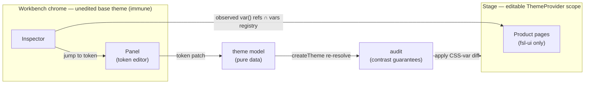

# FSL Studio — Blueprint

> **The product definition and implementation route for the Studio**,
> consolidated from the owner sessions of 2026-07-23. This file is written to
> be sufficient context for a fresh implementation session: read it top to
> bottom, then [`FRICTION.md`](./FRICTION.md), then work exactly one slice.
> Program-level rulings (the fsl-ui gate, scope, the evidence rule) live in
> [`packages/fsl-ui/INTERNAL/ROADMAP.md`](../../packages/fsl-ui/INTERNAL/ROADMAP.md);
> that file wins on conflict. Update the slice status lines here as work lands.

## The problem

Three feedback loops around the design system are broken, and each Studio
surface exists to close one:

1. **The theme author's loop.** The distance between "I changed a token" and
   "I saw what it did to a real product" is an edit → build → screenshot →
   test-suite cycle. Minutes at best — the P3 brand-neutral retune ran exactly
   this way.
2. **The adopter's loop.** Whoever evaluates FSL asks "can I make this mine
   without breaking it?". Today the answer is "trust the ADRs" — and nobody
   adopts on trust.
3. **The consumer's loop.** "Why does this button look like this — which token
   governs it, which part is this?" Today's answer is reading source or
   CONTRACT.md. Browser DevTools shows CSS, not semantics.

## Product definition

The Studio is a **theme workbench wrapped around a real product**: a fictional
SaaS with complete screens (login, dashboard, team settings, billing) rendered
inside a tool chrome with three surfaces.

| Surface       | Job                                                                                                          | Loop it closes                                  |
| ------------- | ------------------------------------------------------------------------------------------------------------ | ----------------------------------------------- |
| **Stage**     | The fictional product's complete pages, built exclusively with fsl-ui on the editable theme                  | adopter (quality bar; proof of zero hidden CSS) |
| **Panel**     | Edit any fsl-theme token and watch the impact across the whole product live; export the result as theme code | theme author                                    |
| **Inspector** | Select any component on the Stage and see its identity, anatomy, and the tokens it receives                  | consumer                                        |

The surfaces compose into one loop: select a component → see its tokens → jump
to editing exactly those tokens → watch the whole product change → export.

**Non-goals.** The Studio is not a component catalog, not a docs site, and not
a Storybook. Component-level browsing belongs to the dedicated fsl Storybook
(slice S1); long-form documentation stays in `docs/website/docs/design`.

## Why FSL can build this cheaply

These affordances already exist; the Studio is their projection, not new
infrastructure:

- **Live editing is nearly free.** fsl-theme resolves everything to CSS
  variables (`--tt-*`) and `createTheme` is a pure function over data. An edit
  is: patch the theme object → re-resolve → re-apply vars. No build, no
  reload.
- **Inspection needs no manual annotation.** Components stamp
  `data-scope`/`data-part` on the DOM, export `*Meta` identity objects, and
  their inline styles preserve literal `var(--tt-…)` references. Inverting the
  `vars` map (token path → var name) makes any node's tokenization
  **observable from the DOM**. For any other design system this tool would
  need a hand-maintained manifest; here it falls out of the architecture — the
  Inspector is visible proof that the semantic layer is real.
- **Guarantees are executable.** The contrast/distinguishability predicates
  that gate the theme in CI can run in the browser on every edit. No theme
  playground on the market has this.
- **The AI surface predates the AI.** `llms.txt` + CONTRACT.md were built for
  a machine consumer; the v2 capabilities below are that consumer arriving.

## Decisions (binding)

- **D-001 — Studio × Storybook boundary.** Storybook answers component-level
  questions ("what exists, how do I use it") from stories + JSDoc autodocs;
  the Studio answers system-level ones ("how does it look real, how do I make
  it mine"). A dedicated instance at `docs/fsl-storybook` hosts **only** fsl,
  with a ThemeProvider decorator and mode + theme toolbar switchers. This is a
  deliberate exception to the repo default of `docs/storybook/stories/…`, so
  the general ttoss Storybook stays untouched. Once it ships, the Studio's
  catalog and theme-lab pages are deleted.
- **D-002 — Token consumption hierarchy (Stage code).** First choice: fsl-ui
  component props (`evaluation`, `tone`, `gap`, `level`, …) — ~95% of code.
  Second: `vars` from `@ttoss/fsl-theme/vars`, only for bespoke widgets no
  primitive covers (the dashboard chart is the canonical case). **Never the
  resolved theme object for styling** — a JS-read value is a frozen snapshot
  that goes stale on the first Panel edit. Only the Panel/Inspector/audit
  machinery may touch the theme object, because the model layer is their job.
  This rule is what makes the Stage live-themable by construction. Needing
  more than props is friction-log evidence before it is a problem to work
  around.
- **D-003 — Edit pipeline.** Edits mutate the **model**, never CSS vars
  directly: patch → `createTheme` re-resolve → audit → apply the var diff to
  the Stage provider. Writing `style.setProperty` from the editor would break
  the `{core.*}` reference chain and make the guarantees unauditable.
- **D-004 — Observed tokenization.** No hand-authored anatomy/token manifest
  anywhere (it would drift). Identity comes from the `*Meta` registry, anatomy
  from `data-scope`/`data-part`, token bindings from inline + computed styles
  intersected with the inverted `vars` registry, and state values from the
  theme data's role grammar.
- **D-005 — Workbench immunity.** The editable ThemeProvider wraps the Stage
  only; the workbench chrome runs the unedited base theme, so no edit can
  break the editor itself.
- **D-006 — States from data, not forced DOM.** Hover/pressed/disabled values
  render as a state table read from the theme, never by forcing React Aria
  states from outside.
- **D-007 — Export is code.** A Panel session exports as a `createTheme`
  overrides snippet (clipboard, v0). The Studio is thereby the official fsl
  theme-authoring tool, not a demo.
- **D-008 — Repository residency.** The Studio stays in this monorepo: it runs
  fsl-ui/fsl-theme at HEAD via `workspace:^` + src-pointing exports, which is
  what makes the same-day friction loop possible. Named extraction triggers
  (any one): (a) a backend beyond static hosting becomes necessary; (b)
  external contributors or users demand a release cadence independent of the
  ttoss train; (c) the Studio needs _released_ fsl versions instead of HEAD —
  at which point it has become a consumer product and extraction is correct by
  definition. The likely extraction unit is the workbench machinery
  (`fsl-devtools`), not the app.
- **D-009 — AI principles (v2).** The AI proposes, the pipeline disposes:
  every AI capability is a thin layer over a deterministic one that works
  without it (Panel before theme-by-prompt; playground before component
  generation). Model access is BYOK (client-side key, no backend) until demand
  triggers D-008(a).
- **D-010 — Generation scope.** The component studio generates **composites
  and blocks only** — self-contained TSX with a fixed import surface (`react`,
  `@ttoss/fsl-ui`, `@ttoss/fsl-theme/vars`). Never pages, routes, or apps. The
  fixed surface is what makes in-browser transpile + scope injection and
  static verification tractable.
- **D-011 — fsl-bench's future.** Stays parked through v1; unparks at v2 as
  the regression harness for the AI capabilities (golden prompts → expected
  patches/components; the audit suite as oracle) — the instrument finds its
  real consumer.

## Route

Slices are strictly ordered by risk and each delivers standalone value. Work
one slice per session. **The fsl-ui v1.0 gate rides S1+S2 only** — S3–S5 are
the Studio's own product route and do not block fsl-ui v1.0 (ROADMAP §gate).

### v1 — the workbench

**S1 — fsl Storybook** · status: ☐

Dedicated instance at `docs/fsl-storybook`, fsl only (D-001). Stack decisions
from the 2026-07-23 Storybook 10.5 study:

- Builder: `@storybook/react-vite` — fresh ESM stack; the general ttoss
  Storybook stays on its webpack5 setup, untouched.
- ThemeProvider decorator (the provider's `themeId` prop exists for exactly
  this — runtime theme swap); toolbar globals for mode (light/dark) and theme
  (`baseTheme`/`bruttal`).
- Every component exported from `packages/fsl-ui/src/index.ts` gets a default
  story plus meaningful variant stories with `tags: ['autodocs']` (JSDoc is
  already mandatory on all fsl-ui components, so autodocs is free).
- `@storybook/addon-a11y`: axe per story in the toolbar — the jest-axe
  discipline made visible.
- **AI surface** (the study's main finding — Storybook 10.5 ships first-party
  agent infrastructure that plugs straight into the FSL thesis):
  - `features.componentsManifest`: the static build emits
    `manifests/components.json`, a machine-readable component catalog derived
    from stories + JSDoc. Ship it with the deploy — it complements fsl-ui's
    hand-authored `llms.txt` (contract vs. examples catalog) and is the input
    `@storybook/mcp` consumes.
  - `@storybook/addon-mcp` (dev server only): exposes an MCP endpoint at
    `/mcp` so coding agents write and verify stories tool-assisted — our own
    implementation sessions are the first consumers.
  - Self-hosting `@storybook/mcp` needs a serverless function — that is a
    D-008(a) trigger, parked. Static manifests deliver most of the value
    meanwhile: any consumer can run the MCP package locally against the
    deployed manifests.
  - llms.txt extraction from the built Storybook (the
    `storybook-llms-extractor` pattern the general ttoss instance already
    runs).
  - Maturity note: both MCP packages are 0.x — adopt as dev/experimental
    surface, never as a gate dependency.
- Deployed as a static app like the Studio was.
- **AC:** every public component browsable in both modes and both themes;
  manifests + llms.txt present in the build output; zero fsl stories in the
  general Storybook.

**S2 — the Studio becomes the product** · status: ☐

> **Reset 2026-07-23 (owner decision).** The v2 app was deleted wholesale —
> src, tests, configs, package — before any v3 work started. S2 begins from an
> empty directory with a **new visual identity, design, and UX, deliberately
> unbiased by v2** (whose design was judged below the bar). What carries over
> is knowledge, not code: the FRICTION.md lessons, the P3 base theme, and this
> blueprint. The v2 flows exist only in git history; the deployed v2 stays
> live at studio.ttoss.dev until S2 deploys over it.

Build a named fictional SaaS (the workspace/deploys narrative — name it
in-slice) as a real application, from scratch:

- Login is the real entry: any credentials pass after client-side validation
  succeeds, so the validation pipeline stays demonstrable.
- Real routes with product navigation, not a gallery: Dashboard, Team
  (settings), Billing (pricing) — four complete flows (the gate requirement).
- No catalog or theme-lab surfaces (D-001) — component browsing is S1's job,
  which ships before S2.
- Patterns worth re-deriving from v2, recorded here so no code archaeology is
  needed: component identity derives from the fsl-ui `*Meta` exports (the
  Inspector reuses that derivation in S4); hash routing was sufficient;
  `@fontsource-variable/inter` self-hosts the base theme's first-choice font.
- **AC:** entering and navigating feels like an application, not an exhibit;
  the quality ritual (side-by-side against reference-grade products, light +
  dark screenshots) applied.

**S3 — Token Panel v0** · status: ☐

Collapsible workbench rail hosting the editor.

- Edit surface v0: the core leverage points — neutral + brand ramps, font
  stacks, radii, spacing scale — plus the existing mode toggle.
- Pipeline per D-003; Stage-scoped provider per D-005. If the provider cannot
  scope cleanly, that is a **friction entry against fsl-theme**, not a
  workaround.
- Export (D-007) and reset.
- **AC:** a core edit updates every page live without reload; the chrome never
  changes; the exported snippet compiles.

**S4 — Inspector v0** · status: ☐

Inspect mode: hover outlines parts; click pins the panel.

- Identity (displayName, entity — from the Meta registry), anatomy tree (parts
  within the selected scope), per-part observed tokens grouped by family,
  value swatches, semantic → core chain.
- Tokenization per D-004.
- **AC:** any fsl-ui-rendered element yields non-empty identity + tokens; no
  manifest file exists in the codebase.

**S5 — closing the loop** · status: ☐

- Live guarantees: expose the audit predicates as an importable subpath of
  fsl-theme (evidence rule satisfied — the Studio is the consumer); run on
  every edit; violations flagged on Panel rows plus a count badge.
- Inspector → Panel jump: clicking a token opens the Panel filtered to it.
  This is how "edit **any** token" is satisfied — by navigation, not by
  rendering thousands of inputs.
- State table per D-006.
- **AC:** an edit that breaks a guarantee is flagged within the same
  interaction; every token the Inspector shows is editable via the jump.

### v2 — AI-assisted (post-gate; each layer over a working deterministic one)

**v2.1 — theme by prompt** · status: ☐

Prompt + theme grammar → LLM emits a token patch (structured output, never
CSS) → the S3/S5 pipeline validates, audits, and previews it as a reviewable
diff the user accepts, rejects, or iterates. BYOK (D-009). fsl-bench unparks
as the eval harness from here on (D-011). Honest framing: the LLM is a theme
assistant with a guaranteed accessibility floor, not an art director.

**v2.2 — on-system playground (no AI)** · status: ☐

Paste composite/block TSX → in-browser transpile (sucrase/esbuild-wasm) →
scope-injected render (imports resolve to the Studio's bundled modules) in a
sandboxed iframe with an error boundary. Verifications: import whitelist,
off-system literal detector (raw colors, raw `px`), renders clean, automated
axe. Output is Inspector-inspectable and Panel-themable for free, because it
is made of fsl-ui primitives.

**v2.3 — component studio** · status: ☐

Prompt → code → live render → iterate, layered on v2.2 (D-010 scope). Few-shot
corpus: the existing blocks. Exits: copy the code; file a prefilled
`ttoss/ttoss` issue carrying the prompt, the generated code, and the usage
context — the evidence rule operationalized: every user becomes a friction
logger, and built-in decisions aggregate from real demand. Governance stays
human: the studio produces candidates, never library entries. Candidate
knowledge infra: the S1 component manifests + `@storybook/mcp`, so the
generator and fsl-bench (D-011) query the same component knowledge agents in
the wild would.

### Parking lot (Studio-local)

- Stage in an iframe (responsive preview + hard isolation) — v2.2 brings the
  sandbox anyway; revisit then.
- Share links / URL-encoded theme state; personal component libraries;
  multi-file generation.
- AI proxy backend (kills BYOK) — trigger D-008(a).
- `fsl-devtools` extraction — triggers in D-008.

## Session protocol

1. Read this file, then [`FRICTION.md`](./FRICTION.md), then ROADMAP §Program.
   CLAUDE.md covers repo mechanics (pnpm, turbo, lint, i18n).
2. Work **one slice**; do not start the next in the same PR.
3. The ritual per delivery is unchanged and mandatory: friction entries filed
   the moment a gap appears; zero hand-rolled layout CSS (one justified
   comment per bespoke rule); **visual verification in a real browser, light
   and dark** (the F-012 lesson: DOM-level suites cannot see rendering
   failures); coverage never decreases.
4. Done = the slice's AC + the ritual + tests/lint green + this file's status
   line updated.
