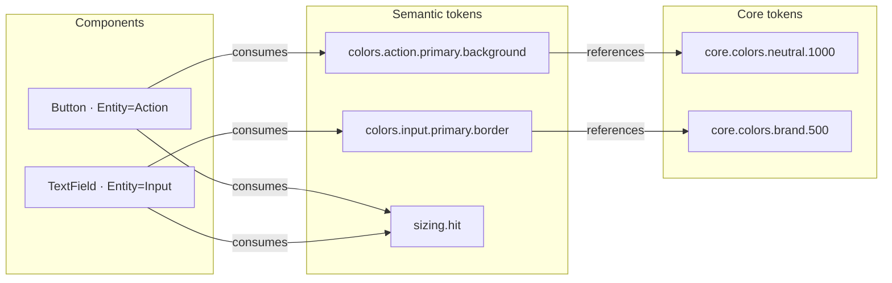

# FSL Studio — Product Requirements Document (v2)

> **Status:** 🧊 FROZEN (2026-07-22) · **Owner:** @enniolopes
> The Studio's diagnostic job is done (`packages/fsl-ui/INTERNAL/EVOLUTION.md`
> WS-E: exit criteria met). This PRD is **not** being executed: no further
> product investment until the fsl-ui adoption gate is met — see
> `packages/fsl-ui/INTERNAL/ROADMAP.md` §Program. The deployed site
> (`studio.ttoss.dev`) stays up as a living demo of the packages; whether to
> keep or tear down the deploy stack is an owner decision.
>
> Original header: Draft for review · Date: 2026-07-19 ·
> Supersedes the 2026-07-17 PRD (v1), archived in git history.

---

## 0. Why this document exists (the honest reset)

v1 shipped a working app that was **built right but framed wrong**. The engine is
sound — client-side theme re-derivation, live light/dark preview, contrast checks,
DTCG/CSS/TS export, URL-shareable state. The **information architecture failed**:

- A **Home screen** ("What do you want to do?") whose three cards each opened the
  **same** three-pane shell with a different "lens" active — three doors into one room.
- A header **lens switcher** (Theme | Components | Generate) that **duplicated** those
  three cards.
- An orthogonal **altitude switcher** (Component | Page | Grid) crossed on top, and a
  **dead "Generate" lens** that led to an empty placeholder.

Net: three navigation systems (home cards ≈ lens tabs, plus altitudes, plus a dead
route) that the user had to reconcile to do anything. As the owner put it: _"any button
on the home leads to practically the same page, just changing a tab… not intuitive… it
became more confusing than helpful."_

The root cause was not Tazuna UX (which is correct) and not the code. It was **an
abstraction miss**: v1's problem statement was _strategic_ — "close the loop
experience → use → verify → evolve", tied to internal launch gates (D1/D2) and an AI
benchmark. The IA therefore encoded an **internal narrative**, not **user jobs**. When
you organize an app around your own strategy instead of the user's tasks, you get modes
that make sense on a roadmap and nowhere else.

v2 re-derives everything from **what real people are trying to do**, and lets the FSL
system's own structure — the fact that _meaning is a graph of components and tokens_ —
dictate the architecture. The result is **simpler, more robust, and more useful at
once**, because it stops inventing navigation and starts exposing the model.

This document is a full replacement. It keeps v1's sound technical decisions (§12) and
the hard-won engineering findings (Appendix A), and throws away its IA.

---

## 1. Problem

### 1.1 What we are really solving

FSL's thesis is that **meaning defined once survives every projection** — a component's
Entity determines its tokens; a token change re-themes every consumer; the same
semantics are legible to humans and to AI agents. That is a powerful claim, and today it
is **invisible and unusable outside the monorepo**. To see a component you read source;
to test a theme you clone and rebuild; to know what a token change breaks you grep; to
know which props are legal you read a 500-line contract.

The people who would benefit — app developers, designers, the system's own maintainers,
and AI agents — have **no place to do their actual jobs against FSL**. Those jobs span a
clear spectrum:

- **Basic (consume):** _find the right component, understand it, see the tokens it uses,
  copy correct code_ — the job Storybook and a docs site serve.
- **Advanced (author & maintain):** _create and tune a theme; create/update a component
  or token; test it; **see the blast-radius of changing one token** across every
  component and page; verify nothing drifts; export for adoption_ — jobs **no existing
  tool serves well**, because no other design system has FSL's machine-readable
  component↔token contract.

The problem is not "FSL lacks a docs site." It is: **FSL has no operational surface
where its meaning can be browsed, authored, tested, and its consequences seen — by the
humans and agents who build with it.**

### 1.2 The market gap that makes this worth building

Surveying the field (Storybook, Chromatic, Backlight, Supernova, Knapsack, zeroheight,
Tokens Studio, Style Dictionary, Radix Themes, Material Theme Builder, Leonardo, Polaris,
Chakra/MUI editors, Tailwind), the job spectrum is served **unevenly** and **one band is
essentially empty**:

- **Browse/consume** is well served (Storybook autodocs, Polaris component pages).
- **Configure/try** is well served (Storybook Controls, Radix ThemePanel).
- **Author tokens** is served by expert tools (Tokens Studio, Style Dictionary) with no
  visual consequence view.
- **Impact / blast-radius** is served by **nobody** end-to-end. The closest partials —
  Radix's live global re-theme (shows the ripple but not _what_ changed) and Chromatic's
  post-hoc visual diff (enumerates changed stories but is **cause-blind**: "40 stories
  changed", never "…because you edited `semantic.action.primary`") — do not draw the
  causal chain _token → semantic alias → components → screens_, and none is
  **legality-aware**.

FSL uniquely **can** own that band, because it owns the graph: `*Meta.entity` +
the Entity→Token map (`CONTRACT.md §1`) + `createTheme` reference resolution make the
dependency chain **computable**. "Edit a semantic token → instantly see the enumerated,
previewed, contract-checked dependent set" is a capability the entire surveyed market
lacks. **That is FSL Studio's headline, not a footnote.**

### 1.3 Success criteria (solution-agnostic)

- **SC-1 — Consume in seconds.** A newcomer with no monorepo finds a component, sees its
  anatomy, legal props, and the tokens it consumes, and copies correct code — **without
  choosing a "mode"** and without reading the contract. First render, zero navigation
  training.
- **SC-2 — Author a theme in minutes.** A designer changes a brand token and watches a
  real page re-theme in light **and** dark in **< 400 ms**, then exports a valid theme
  (DTCG / CSS / `createTheme`) in **< 15 min**. The "wow" — one token rippling across the
  whole system live — happens in **< 60 s**.
- **SC-3 — See consequences before committing.** A maintainer edits one semantic token
  and, **in place**, sees exactly which components, states, and pages change, **which (if
  any) legality contracts break**, and can accept or revert per token. No CI round-trip,
  no grep.
- **SC-4 — Agent-legible.** The same graph that renders the UI is exportable to an AI
  agent (llms.txt + skill + a machine endpoint), and agent output passes mechanical
  verification.
- **SC-5 — One coherent surface.** A user never asks "which tab/mode am I supposed to be
  in?" There is one workbench; everything else is selection and progressive disclosure.

---

## 2. Vision

**FSL Studio is one workbench for the FSL semantic graph:** select any component or any
token, see everything true about it — anatomy, legal props, the tokens it consumes or the
components that consume it — edit in place, and watch the consequences ripple, verified,
before you commit. It guides without grabbing (Tazuna), it never makes you pilot it, and
it is as useful to an AI agent as to a person.

> **One-liner:** _See the meaning, change the meaning, and see what the change touches —
> in one place._

---

## 3. Design tenets (binding)

1. **The model is the map.** The IA mirrors FSL's data model — a graph of
   components ↔ tokens — not a table of contents and not an internal roadmap. If a
   navigation element does not correspond to a real object or a real job, it does not
   exist.
2. **One workbench, no false forks.** There is a single working surface. We never ship
   two controls that do the same thing, nor a screen whose only purpose is to pick which
   tab opens.
3. **Tazuna: guide without grabbing.** Eyes on the goal, presence in the periphery,
   semantically clean signals, steering over restart, directed assistance over
   theatrical autonomy (§9).
4. **Consequence is first-class.** Every edit shows its blast-radius. The system absorbs
   the graph complexity so the user never has to (Tesler's Law).
5. **Legal-by-construction.** Illegal states are **absent**, not disabled. The UI speaks
   FSL's vocabulary verbatim (`Entity`, `evaluation`, `consequence`, `data-part`).
6. **Live, never stale.** Everything renders off the real packages and the real graph;
   nothing is hand-authored prose that can drift.
7. **AI-first, human-first — same surface.** What an agent needs (the semantic contract
   as data) is what a human needs. We expose one graph to both.

---

## 4. Personas

| #   | Persona                       | One-line profile                                                                                                                          | Primary altitude |
| --- | ----------------------------- | ----------------------------------------------------------------------------------------------------------------------------------------- | ---------------- |
| P1  | **App developer (consumer)**  | Building a product with `@ttoss/fsl-ui`; needs the right component, legal props, correct copy-paste, and to know which tokens it touches. | Basic → mid      |
| P2  | **Designer / theme author**   | Owns a brand's look; tunes tokens, checks contrast and light/dark, exports a theme to hand to engineering.                                | Mid → advanced   |
| P3  | **Design-system maintainer**  | Owns `fsl-ui`/`fsl-theme`; adds/edits components and tokens, and must know the **blast-radius** of a change before shipping it.           | Advanced         |
| P4  | **AI agent**                  | A first-class consumer activated via `llms.txt` + skill; must produce FSL-correct output that passes mechanical verification.             | Cross-cutting    |
| P5  | **Evaluator / PM / newcomer** | Needs to understand _what FSL is and why it's better_ in minutes, by touching it.                                                         | Basic            |

These are not equal in weight. **P3's blast-radius job is the differentiator**; P1's
consume job is the on-ramp that earns the audience; P4 is the strategic multiplier.

---

## 5. Jobs-to-be-Done → capability matrix

JTBD phrased as _"When I ***, I want to ***, so I can \_\_\_."_ Tier = basic|advanced.
Priority = P0 (Studio v1) | P1 (fast-follow) | P2 (later).

| #   | Job (abbrev.)                        | Persona   | The Studio must let them…                                                                                                                       | Tier      | Prio   |
| --- | ------------------------------------ | --------- | ----------------------------------------------------------------------------------------------------------------------------------------------- | --------- | ------ |
| J1  | Find the right component             | P1,P5     | Search/browse components grouped by Entity; land directly, no menu                                                                              | basic     | P0     |
| J2  | Understand a component               | P1,P5     | See it rendered, its anatomy (`data-scope`/`data-part`), and its states                                                                         | basic     | P0     |
| J3  | Know its legal props                 | P1        | See the legality matrix; pick only legal `evaluation`/`consequence`; illegal absent                                                             | basic     | P0     |
| J4  | Know the tokens it consumes          | P1,P3     | See the exact token set for its Entity, each linking to the token node                                                                          | basic     | P0     |
| J5  | Copy correct code                    | P1        | Copy JSX for the current legal config, with required i18n labels flagged                                                                        | basic     | P0     |
| J6  | Try a component's props live         | P1        | Manipulate legal props on a live instance (Controls-style)                                                                                      | basic     | P1     |
| J7  | Create / tune a theme                | P2        | Edit core & semantic tokens; remap semantic→core; presets as starting points                                                                    | advanced  | P0     |
| J8  | See a token change ripple            | P2,P3     | Live re-theme of a real page/board in light+dark, < 400 ms                                                                                      | advanced  | P0     |
| J9  | Check contrast / a11y                | P2        | Ambient WCAG contrast on token pairs, both modes                                                                                                | advanced  | P0     |
| J10 | **See the blast-radius of a token**  | **P3,P2** | **Edit one token → enumerated + previewed set of affected components/states/pages, with legality violations surfaced, accept/revert per token** | advanced  | **P0** |
| J11 | Create / maintain a component config | P3        | Compose a legal component variant/state, test it on the stage, keep it as a session composition                                                 | advanced  | P1     |
| J12 | Verify nothing drifts                | P3        | On a token edit, see contract violations introduced (legality-aware impact)                                                                     | advanced  | P1     |
| J13 | Export for adoption                  | P1,P2     | Export theme as DTCG / CSS / `createTheme` TS; copy component code                                                                              | basic→adv | P0     |
| J14 | Activate an AI agent                 | P4        | Get `llms.txt` + skill install + a machine-readable snapshot of the graph                                                                       | basic     | P1     |
| J15 | Get AI directed assistance           | P2,P3     | Ask for a token diff or a component config; receive a **proposal** in the same diff/impact UI                                                   | advanced  | P2     |
| J16 | Return friction as evolution         | P3,P1     | File a structured `fsl-ui` proposal from a component/token in context                                                                           | advanced  | P2     |
| J17 | Understand FSL fast                  | P5        | A live system overview that teaches the thesis by being touched                                                                                 | basic     | P0     |

---

## 6. The core model — the Component ↔ Token semantic graph

Everything in the Studio is a view over one graph, **derived automatically** (no hand
wiring):

- **Component nodes** — every export from `@ttoss/fsl-ui` with a `*Meta` (34 components +
  13 composites today). Each declares an `Entity`, a `structure`, and legality
  (`legalEvaluations`/`legalConsequences` from the matrices).
- **Token nodes** — every leaf of `@ttoss/fsl-theme` in two layers: `core` (primitives)
  and `semantic` (`{core.*}` references). Modes remap semantic refs.
- **Consumes edges** — derived from `CONTRACT.md §1` (Entity → Token Map): an Action
  component consumes `colors.action`, `radii.control`, `border.outline.control`,
  `sizing.hit`, `spacing.inset.control`, `typography.label`, `motion.feedback`,
  `elevation.flat`, plus cross-cutting focus/opacity. This is the **legal** set; it can be
  refined to **actually-read** by scanning `vars.*` usage where precision matters (OQ-2).
- **References edges** — `semantic → core`, from `createTheme`/`toFlatTokens` resolution.



Two consequences follow directly, and they are the whole product:

- **Forward (component → tokens):** select a component, list the tokens it consumes. (J4)
- **Reverse (token → consumers = blast-radius):** select/edit a token, list every
  component/state/page downstream, and — uniquely — flag any that a change turns
  **contract-illegal**. (J10, J12)

No competitor can do the reverse cleanly because none has a machine-readable
component↔token contract. FSL does. The Studio is the cockpit for it.

---

## 7. Information Architecture (the decision)

### 7.1 The shape: one workbench, three regions, no modes

One persistent surface. The only top-level control is **what the navigator lists**
(Components or Tokens) — because in a semantic system both hierarchies are first-class.
That is a change of _object under inspection_, not a change of _app mode_, and it does
**not** duplicate any other control.

```
┌───────────────────────────────────────────────────────────────────────────┐
│  FSL Studio        [ ⌘K search ]        theme: Base ▾   ◑ mode   ⭳ Export   │  header
├──────────────┬─────────────────────────────────────────────┬───────────────┤
│ NAVIGATOR    │  CANVAS                                       │ INSPECTOR     │
│              │                                               │ (contextual)  │
│ ◉ Components │   ┌─ Light ──────────┐  ┌─ Dark ───────────┐  │  ── if a      │
│ ○ Tokens     │   │  <selection       │  │  <selection      │  │   component:  │
│              │   │   rendered live>   │  │   rendered live> │  │  · legality   │
│ ▸ Action     │   │                    │  │                  │  │    matrix     │
│   Button     │   └────────────────────┘  └──────────────────┘  │  · props(live)│
│   ToggleBtn  │                                               │  · tokens used│
│ ▸ Input      │   [ viewport: Fit · Component · Page · Board ]│  · anatomy    │
│   TextField  │   [ anatomy ⌑ ]  [ states: default/hover/… ] │  · copy JSX   │
│   Select     │                                               │  ── if a token│
│ ▸ Structure  │                                               │  · value/ref  │
│   …          │                                               │  · modes      │
│              │                                               │  · consumers →│
│              │                                               │  · contrast   │
└──────────────┴─────────────────────────────────────────────┴───────────────┘
```

- **Header (persistent):** brand/logo (returns to system overview), **⌘K** universal
  search over components _and_ tokens, the active **theme/preset** picker, the light/dark
  **mode** toggle, and **Export** (a peak surface, always one click away). Ambient
  validation (broken refs, contrast failures) appears here as a **peripheral counter** —
  never a modal (Tazuna P2).
- **Navigator (left):** one searchable tree with a segmented root toggle
  **Components ◉ / Tokens ○**. Components group by Entity (Jakob: like Storybook).
  Tokens group by family, **semantic first, core on demand** (Miller/Hick: never 500
  leaves at once).
- **Canvas (center):** renders the current selection **live, in light and dark
  side-by-side**. A single **viewport** control (Fit / Component / Page / Board) is an
  in-context zoom — **this is where v1's "altitude" belongs**, demoted from a global mode
  to a canvas property. An **anatomy** toggle overlays `data-part` outlines; a **states**
  row shows legal interaction states.
- **Inspector (right):** the **contract panel**, contextual to the selection (§7.2).

There is **no home menu**, **no lens tabs**, and **no global altitude axis**. Boot lands
directly in the workbench (§7.4).

### 7.2 The inspector adapts to the selected object

**When a component is selected** — the contract panel answers _"how do I use this
correctly, and what does it touch?"_:

- **Legality matrix** — interactive grid of legal `evaluation` × `consequence`; illegal
  cells are **absent**. Picking a cell re-renders the canvas instance.
- **Props (live)** — a Storybook-Controls-style table of the component's _legal_ props,
  bound to the canvas instance. (J6)
- **Tokens consumed** — the exact set from the Entity→Token map, each a link that jumps
  the navigator to that token node (forward edge). (J4)
- **Anatomy** — `data-scope` / `data-part` list, synced with the canvas overlay. (J2)
- **Copy JSX** — the current legal config as a snippet, required i18n labels flagged. (J5)
- **Contract link** — deep link into `CONTRACT.md` for the Entity.

**When a token is selected** — the panel answers _"what is this, and what depends on
it?"_:

- **Value & reference** — raw value or `{core.*}` ref; editable in place (Postel: accept
  hex/rgb/hsl/ref, normalize).
- **Modes** — light/dark values; edits target the alternate remap.
- **Consumers / fan-out** — the reverse index: every component (and example page) that
  consumes this token, each a link (reverse edge). Selecting expands into the impact
  drawer (§7.3).
- **Contrast** — WCAG ratio for the paired text/background token, both modes. (J9)

### 7.3 Blast-radius as a first-class flow (the headline, J10/J12)

Editing any token opens the **impact drawer** — the capability no competitor has:

1. **Enumerate (causal, not cause-blind).** Compute the dependent set from the graph:
   _edited core token → semantic aliases referencing it → components binding those
   semantics → states → example pages._ Show a count with drill-down: _"touches 2
   semantic tokens · 11 components · 34 states · 4 pages."_
2. **Preview, scoped.** Render **exactly the affected components/states** side-by-side
   **before / after**, light and dark — a Radix-ThemePanel-style live ripple, but scoped
   to the computed set so it is complete without noise. Re-render **< 400 ms** (Doherty).
3. **Contract-check (unique).** Because FSL owns legality, flag any change that turns a
   previously-legal combination **illegal** or breaks a contrast contract — e.g. _"2 of
   11 now fail AA in dark."_ This is drift detection at edit time, not in CI.
4. **Gate (steering, not restart).** Accept or revert **per token**; every edit is an
   origin-tagged history entry (✎ manual / ✦ AI). Browser back always works (URL = state).

### 7.4 Boot & the "empty" state (no interstitial)

- No URL hash → land **directly** in the workbench showing a **system overview board**
  (many real components under the current theme) with the navigator ready. The overview
  _is_ the SC-1/J17 experience: touch a token, watch it ripple. An inline hint
  ("select a component, or edit a token") teaches one idea in place — never a tour.
- Resume: autosaved drafts surface as a discreet **"continue"** affordance in the
  overview (Zeigarnik: unfinished work pulls toward completion), not a separate screen.
- A URL hash (`#s=…`) opens as a **fork** of that shared state (privacy by architecture).

### 7.5 Export & adopt (peak surface, J13/J14)

Export is **not a mode** — it is a peak surface reached from the persistent header button
or ⌘K, from anywhere. Three theme outputs (**DTCG** via `toDTCG`, **CSS** via
`getThemeStylesContent`, **TS** `createTheme` codegen) in tabs with one-click copy, plus
the **component** copy-JSX from the inspector, plus the **agent activation** block
(`npx skills add ttoss/skills --skill fsl` and a machine-readable graph snapshot). The
"end" is deliberately satisfying (Peak-End): a "what changed" summary of the exported diff.

### 7.6 How AI folds in later (J15) — without a new mode

AI is **directed assistance on the same surface**, never a "Generate lens." A prompt
affordance in the inspector proposes either a **token diff** (→ rendered in the exact
impact drawer of §7.3) or a **component config** (→ rendered as a live proposal with
verification badges stating precisely what ran: `typecheck ✓ · render ✓ · semantic lint
✓ · behavior: not verified here`). Proposals are accepted/refined/discarded through the
**same** history/diff mechanism as manual edits (Tazuna P4/P5). No parallel system, no
theater.

### 7.7 Alternatives considered (and why this won)

Three IA models were designed and scored against simplicity, robustness, scalability,
JTBD coverage, Tazuna alignment, discoverability, redundancy-avoidance, and
AI-foldability:

- **A — JTBD "modes"** (Explore vs Author vs Review as distinct surfaces). _Rejected._
  "Modes" are exactly what produced v1's redundant tabs. Distinct working surfaces for
  the same objects re-introduce the false-fork and the reconciliation tax (Hick, Tesler,
  Prägnanz). The jobs are not separated by surface; they are separated by _which object
  you select and what you do to it_.
- **B — Object-first workbench** (one persistent Storybook-like shell; object drives
  everything). _Strong._ Matches Jakob (users know this shell), collapses navigation to
  selection.
- **C — Unified graph canvas** (component and token are two views of one linked graph;
  selecting either reveals the other; blast-radius is native). _Winner, and it subsumes
  B._ It is the only model that makes the reverse edge (token → consumers) a first-class
  citizen, which is the differentiator. B is _how it looks_; C is _why it's powerful_.

**Decision: C, realized through B's familiar shell.** One workbench (B's ergonomics) over
the component↔token graph (C's power). The dual-navigator toggle is the one legitimate
switch; everything else is selection + progressive disclosure.

---

## 8. Feature set

Grouped by capability area. Each feature → the JTBD it serves, tier, priority.

### 8.1 Component workbench (consume) — J1–J6

- **F-C1** Component navigator grouped by Entity, searchable; direct landing. _(J1, basic, P0)_
- **F-C2** Live canvas render, light+dark, with anatomy overlay + legal states row. _(J2, basic, P0)_
- **F-C3** Interactive legality matrix; illegal combinations absent. _(J3, basic, P0)_
- **F-C4** "Tokens consumed" list derived from Entity→Token map, cross-linked to token nodes. _(J4, basic, P0)_
- **F-C5** Copy-JSX for the current legal config; required i18n labels flagged. _(J5, basic, P0)_
- **F-C6** Live props/Controls table bound to the instance (legal props only). _(J6, basic, P1)_

### 8.2 Token & Theme lab (author) — J7–J9

- **F-T1** Token navigator, semantic-first, core on demand; family grouping. _(J7, advanced, P0)_
- **F-T2** In-place token editing: core overrides + semantic remaps; Postel-liberal input, normalized. _(J7, advanced, P0)_
- **F-T3** Preset starting points — only the built-in themes the package actually exports (`base`, `bruttal`); grows when it ships more. _(J7, advanced, P0)_
- **F-T4** Live re-theme of canvas/board in light+dark, < 400 ms. _(J8, advanced, P0)_
- **F-T5** Ambient WCAG contrast on token pairs, both modes; peripheral counter. _(J9, advanced, P0)_

### 8.3 Impact / blast-radius (the differentiator) — J10, J12

- **F-I1** Reverse index: token → consumers (components, states, example pages). _(J10, advanced, P0)_
- **F-I2** Impact drawer: enumerate + scoped before/after preview. _(J10, advanced, P0)_
- **F-I3** Legality-aware & contrast-aware violation flags introduced by a change. _(J12, advanced, P1)_
- **F-I4** Per-token accept/revert; origin-tagged history; URL = state. _(J10, advanced, P0)_

### 8.4 Export & adopt — J13, J14

- **F-X1** Theme export: DTCG / CSS / `createTheme` TS, one-click copy, "what changed" summary. _(J13, P0)_
- **F-X2** Component copy-JSX (shared with F-C5). _(J13, P0)_
- **F-X3** Agent activation: skill install command + machine-readable graph snapshot. _(J14, P1)_

### 8.5 Maintain & compose — J11

- **F-M1** Session compositions: build a legal component variant/state, test on the stage, keep it as a draft (localStorage, shareable via URL). _(J11, advanced, P1)_

### 8.6 AI directed-assistance (later) — J15

- **F-A1** Inspector prompt → token-diff proposal into the impact drawer. _(J15, advanced, P2)_
- **F-A2** Inspector prompt → component-config proposal with honest verification badges. _(J15, advanced, P2)_

### 8.7 Feedback / evolution — J16

- **F-E1** "Propose to fsl-ui" from a component/token in context → prefilled GitHub issue. _(J16, advanced, P2)_

---

## 9. Tazuna principles → concrete rules

| Tazuna principle                                    | Concrete rule in FSL Studio                                                                                                                                    | Banned anti-pattern                                                                                          |
| --------------------------------------------------- | -------------------------------------------------------------------------------------------------------------------------------------------------------------- | ------------------------------------------------------------------------------------------------------------ |
| **1. Eyes on the goal, not the mechanism**          | Land in the workbench; navigation is _selecting an object_, not piloting modes. No interstitial menu.                                                          | A home/menu screen whose buttons just pick a tab.                                                            |
| **2. Presence without foregrounding**               | Validation (broken refs, contrast, drift) is a **peripheral header counter** + on-row badges; the live preview _is_ the confirmation. Silent autosave.         | Toasts for saves; modals for validation; loading spectacle.                                                  |
| **3. Semantically clean signals**                   | FSL vocabulary verbatim (`Entity`, `evaluation`, `consequence`, `data-part`). Illegal states absent, not disabled. Verification badges state exactly what ran. | A control that both saves and publishes; a badge that means two things; claiming "verified" beyond what ran. |
| **4. Steering over restart**                        | Per-token history + revert; AI refine-in-place with version diffs; browser back = state; edits never wipe the session.                                         | "Start over" as the only correction; losing work on a bad edit.                                              |
| **5. Directed assistance, not theatrical autonomy** | AI proposes into the _same_ diff/impact UI; never auto-applies; calm progress then a verified proposal.                                                        | A separate "Generate" mode; token-by-token code streaming theater; auto-apply.                               |

---

## 10. Laws of UX → concrete decisions (and the v1 violations we correct)

| Law                                    | Decision                                                                                                                                         | v1 violation corrected                                   |
| -------------------------------------- | ------------------------------------------------------------------------------------------------------------------------------------------------ | -------------------------------------------------------- |
| **Jakob**                              | Storybook/Figma shell: navigator + canvas + inspector; no invented nouns ("lens", "altitude").                                                   | v1 invented lens/altitude axes users had to learn.       |
| **Hick**                               | One top-level toggle (Components/Tokens); progressive disclosure for the rest.                                                                   | v1 multiplied choices (home × lens × altitude).          |
| **Tesler**                             | The system computes blast-radius; the user never reconciles the graph by hand.                                                                   | v1 pushed a lens×altitude matrix onto the user.          |
| **Prägnanz / Occam**                   | One canonical view per object; delete duplicate navigation and dead routes.                                                                      | v1 had home cards ≈ lens tabs, and a dead Generate lens. |
| **Miller / Common Region / Proximity** | Tokens chunked into ~7 families, semantic-first; a token's name+value+edit sit together; component + its consumed tokens share a bounded region. | v1 token tree usable but cramped in the narrow rail.     |
| **Doherty**                            | Every edit re-renders < 400 ms; nothing added to the edit path may break same-frame preview.                                                     | (kept from v1 — sound.)                                  |
| **Peak-End / Von Restorff**            | Export is the designed peak; the primary action is visually distinct; overridden/changed tokens stand out.                                       | v1's peak was reachable but the journey to it was noisy. |
| **Zeigarnik / Goal-Gradient**          | Resume-draft affordance; a visible "unresolved refs / ready to export" indicator.                                                                | v1 had drafts but no completeness signal.                |
| **Postel**                             | Accept messy token input (hex/rgb/hsl/ref/paste); export strict valid formats.                                                                   | new.                                                     |

---

## 11. Anti-patterns (banned — review-blocking)

No interstitial menu whose buttons pick a tab. No two controls doing the same job. No
global mode axis crossed with another. No dead/placeholder routes in navigation (gate
unbuilt features as clearly-disabled or omit them). No onboarding tours/overlays. No
decorative toasts. No modal interrupting an edit. No AI action without explicit request.
No verification claim beyond what actually ran. No hand-authored content that can drift
from the packages.

---

## 12. Technical architecture (carried from v1 where sound)

- **AD-1 — Location & name.** Workspace app at `docs/fsl-studio`, package `@docs/fsl-studio`.
- **AD-2 — Stack.** Vite + React 19 + TypeScript strict, SPA, ESM-only. Not Docusaurus
  (needs a runtime), not Storybook (this is an operational tool over the _system graph_,
  which Storybook's story-centric model cannot express).
- **AD-3 — Zero backend (Studio v1).** All state client-side (memory + localStorage +
  URL). No auth, no abuse surface, privacy by architecture. AI is BYOK direct-from-browser
  when it lands.
- **AD-4 — Deploy.** `carlin deploy static-app` to a dedicated subdomain (OQ-1).
- **AD-5 — Theme editing = client re-derivation.** `createTheme({ overrides, alternate })`
  → `getThemeStylesContent` → swap one `<style>` element. No rebuild, no network. Ref
  validity is checked by resolution, not console capture (Appendix A).
- **AD-6 — The graph is derived, not authored.** Component nodes from `*Meta`; consumes
  edges from the Entity→Token map (`CONTRACT.md §1`); references edges from
  `toFlatTokens`. Adding a component/token to the packages adds a graph node with **zero**
  Studio changes (auto-discovery verified in v1 — Appendix A).
- **AD-7 — Legality is data.** Legal props come from the exported matrices
  (`ENTITY_EVALUATION`/`ENTITY_CONSEQUENCE`, `legalEvaluations`/`legalConsequences`),
  never hardcoded in the Studio.
- **AD-8 — State model.** `SessionState = { themeDiff, selection, viewport, compositions[],
history }` in one store; URL-hash (lz-string) serialization; fork-on-open;
  `applyToStudio` is never serialized (a shared link must not re-skin the receiver).

The v1 IA constructs — `lenses.ts`, the home task-cards, the altitude axis as a global
switcher, the Generate lens placeholder — are **removed**. The v1 engine constructs —
`themeStore`, `createTheme` re-derivation, contrast, export codegen, session/URL, catalog
auto-discovery, the matrix-driven props panel — are **retained and re-hosted** in the new
shell.

---

## 13. Success metrics

| SC   | Metric                                                               | Target                                                       |
| ---- | -------------------------------------------------------------------- | ------------------------------------------------------------ |
| SC-1 | Time for a newcomer to find a component + copy correct code, no docs | < 2 min, zero mode choices                                   |
| SC-2 | Token edit → live light+dark re-theme                                | < 400 ms; theme exported < 15 min; first ripple "wow" < 60 s |
| SC-3 | Token edit → enumerated + previewed + contract-checked impact        | in place, no CI round-trip                                   |
| SC-4 | Agent activated + output passes mechanical verification              | delta measured by fsl-bench                                  |
| SC-5 | "Which mode am I in?" confusion                                      | zero — one workbench                                         |

---

## 14. Non-goals (Studio v1)

Hosted LLM backend or shared keys (BYOK only, later). Real-time collaboration
(fork-by-URL instead). DTCG **import**. A browser code IDE (Backlight proved that
unsustainable — build the _system view_, not the editor). Visual drag-drop component
_editing_ (components are grammar, not canvas; props are editable, structure is not).
Telemetry/auth. Mobile-optimized _editing_ (responsive rendering yes; editing is
desktop-first).

---

## 15. Phasing

- **Phase 0 — Workbench shell + consume (P0):** the one-workbench IA, dual navigator,
  component canvas (anatomy/states/light-dark), legality matrix, tokens-consumed,
  copy-JSX, boot-to-overview, ⌘K, URL state. Delivers J1–J5, J17, SC-1, SC-5.
- **Phase 1 — Token lab + blast-radius (P0):** token navigator/edit, live re-theme,
  contrast, the reverse index + impact drawer + per-token history, export. Delivers
  J7–J10, J13, SC-2, SC-3. **This phase is the differentiator — do not descope it.**
- **Phase 2 — Legality-aware drift, live Controls, compositions, agent activation
  (P1):** J6, J11, J12, J14.
- **Phase 3 — AI directed assistance + feedback channel (P2):** J15, J16.

Each phase lands with the package DoD (contract/a11y/behavior tests, 100% coverage,
JSDoc, live verification) and, where architectural, an ADR.

---

## 16. Open questions

- **OQ-1** Final subdomain (`studio.ttoss.dev`?) — needs DNS/ACM.
- **OQ-2** Consumes edges: legal set (from Entity→Token map) vs actually-read (scan
  `vars.*`)? Start with legal set; refine to actually-read if impact previews feel noisy.
- **OQ-3** Auto-discovery of new components vs one-line registration — v1 proved full
  auto-discovery works; confirm it holds for the graph edges too.
- **OQ-4** Machine endpoint for agents: a static JSON graph snapshot in v1; an MCP server
  later? (zeroheight/Supernova precedent.)
- **OQ-5** Should the "system overview board" be curated example pages or an
  auto-generated gallery of all components? Lean curated + a "show all" toggle.

---

## 17. Glossary & references

- **Entity** — a component's semantic kind (Action, Input, Navigation, …) that determines
  its legal token set (`CONTRACT.md §1`).
- **Blast-radius** — the set of components/states/pages affected by a token change, plus
  any legality/contrast violations it introduces.
- **Consumes / references edges** — component→token (Entity map) / semantic→core
  (`createTheme` resolution).
- **Tazuna UX** — `docs/website/blog/2026-03-09-tazuna-ux.md` (guide without grabbing).
- **Laws of UX** — [lawsofux.com](https://lawsofux.com/) (Jakob, Hick, Fitts, Miller,
  Tesler, Doherty, Peak-End, Von Restorff, Zeigarnik, Goal-Gradient, Proximity/Common-
  Region/Similarity/Prägnanz, Occam, Postel).
- **Prior art:** Storybook (Controls/autodocs), Radix Themes `ThemePanel` (live re-theme),
  Chromatic (change review), Tokens Studio (core→semantic sets), Style Dictionary
  (reference resolution), Polaris (component-page template).
- **Ground-truth sources:** `packages/fsl-ui/src/tokens/CONTRACT.md` (§1 Entity→Token
  map, legality), `packages/fsl-ui/src/semantics/*` (matrices), `packages/fsl-theme/src/
createTheme.ts` / `css.ts` / `dtcg.ts` (engine), `packages/fsl-ui/llms.txt`.

---

## 18. Appendix A — retained engineering findings from v1 (heed on rebuild)

These are hard-won facts from the v1 build; the IA changed, but the physics did not.

- **Client re-derivation is fast enough.** One core-color edit re-themed a live page in
  ~120 ms in Chromium (well under the Doherty 400 ms). The edit loop
  (`createTheme(overrides)` → `getThemeStylesContent` → swap one `<style>`) is proven.
- **Diff-as-source-of-truth.** The override map _is_ the state: history, revert, preview,
  and export are one structure. Reverting a leaf = deleting it from the diff; the diff is
  the `overrides` argument to `createTheme`. Keep this — it avoids edit-log ambiguity.
- **React 19 `<style>` hoisting gotcha.** `ThemeProvider`'s `theme` prop injects an
  href-keyed `<style>` that React 19 hoists and does **not** reliably update when the
  bundle changes — applied edits won't reach `:root`. Fix: inject the chrome's `:root` CSS
  with a plain `<style>` text child yourself, and let `ThemeProvider` own only the
  color-mode runtime. (Confirmed both ways in Chromium.)
- **Ref validity is resolution-based, not console-based.** `toFlatTokens` leaves an
  unresolved ref as `{path}` in its output; any surviving brace expression marks a broken
  token. Browser-safe, no `NODE_ENV` gating needed. Surface ambiently (row badge +
  peripheral counter); the one sanctioned escalation is a confirm dialog on _export_ with
  broken refs.
- **Catalog auto-discovery works.** Enumerate the `@ttoss/fsl-ui` barrel and keep every
  `*Meta`-shaped export; a test asserts the count equals the number of `*Meta` exports.
  New components appear with zero registration — the same principle extends to graph nodes.
- **Legality panel must be matrix-driven** from `@ttoss/fsl-ui/semantics`; property-test
  that offered props are always a subset of the matrices (the "no illegal combination"
  guarantee).
- **Preview + copy-JSX must be one registry** so a live render and its snippet never
  drift; only emit a snippet for components with a verified entry.
- **Presets = built-in themes only.** Expose only what `@ttoss/fsl-theme` actually
  exports (`base`, `bruttal`). Do **not** invent presets from style-reference stubs —
  that conflates a style reference (a visual language below the contract) with a built-in
  theme (a concrete token implementation).
- **Toolchain.** Node ≥ 24 (tsdown's formatjs plugin fails under Node 22). `tsc --noEmit`
  runs clean over the packages (v1 fixed the latent type errors at source).
- **Testing gotcha.** `userEvent.setup()` installs a lingering clipboard stub that shadows
  manual mocks; keep clipboard/copy tests in their own `fireEvent`-only file.
