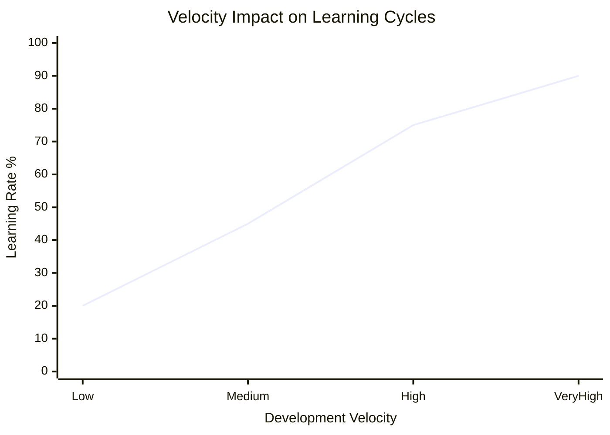
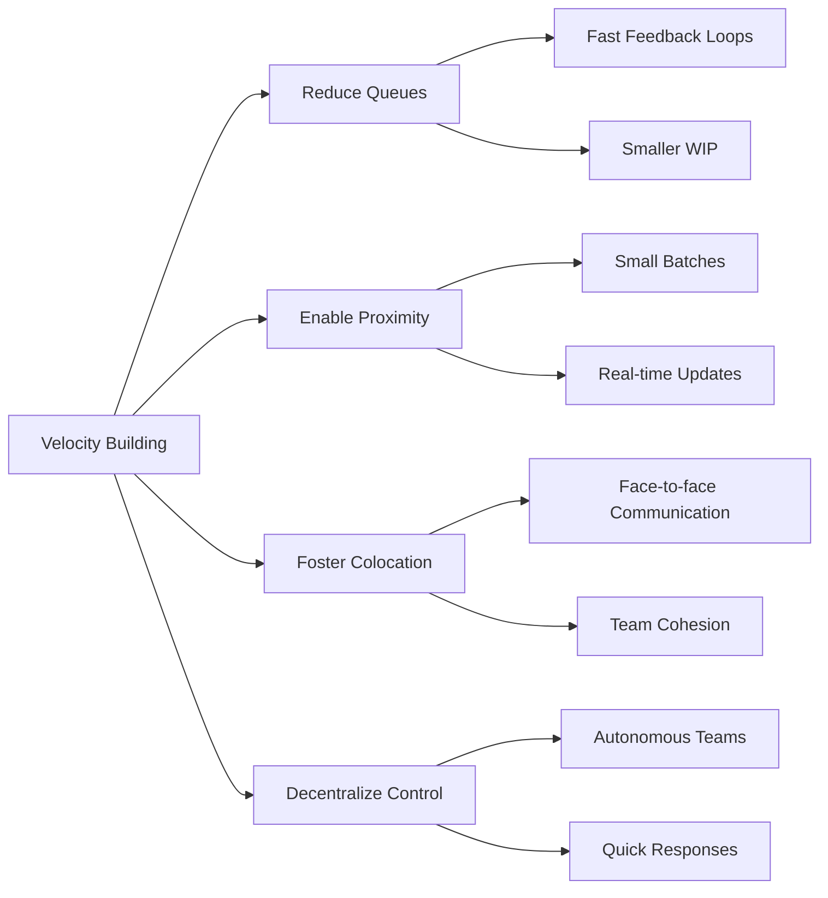
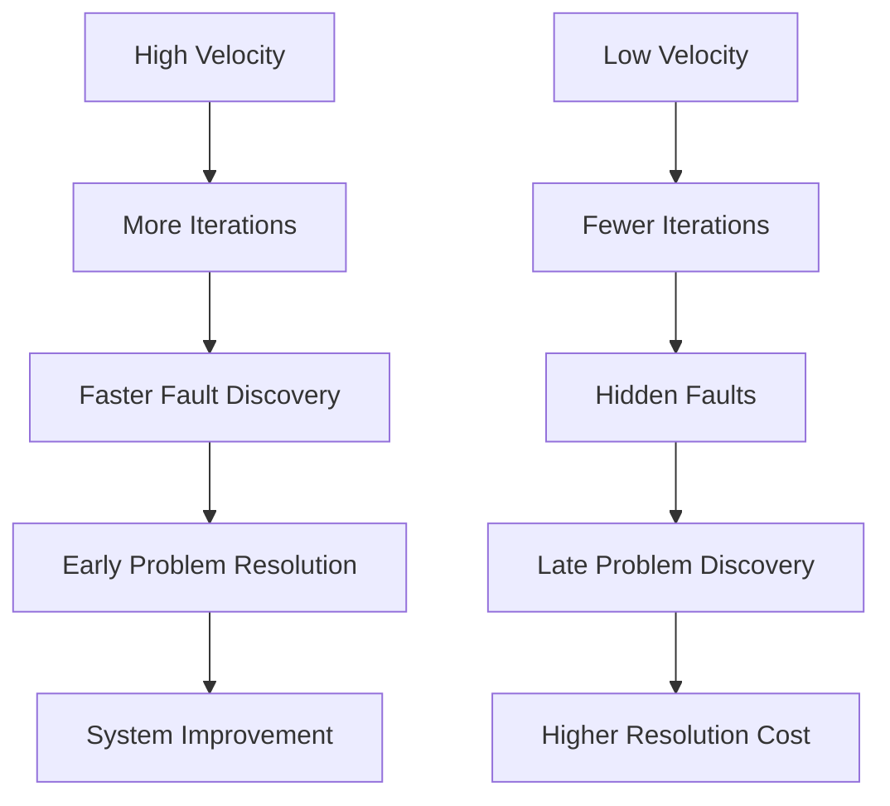

## The Power of Velocity

Velocity creates momentum that drives learning and adaptability. In product development, speed enables teams to experiment, learn, and adjust before competitors react, following [E3: The Principle of Quantified Cost of Delay](/docs/product/product-development/principles#e3-the-principle-of-quantified-cost-of-delay-if-you-only-quantify-one-thing-quantify-the-cost-of-delay). This unlocks two critical advantages: faster learning cycles and precision pivoting capability.

<!-- truncate -->

### Velocity's Economic Impact

**Magnitude: Learning Faster**

Fast feedback compresses time between action and learning, following [FF8: The Fast-Learning Principle](/docs/product/product-development/principles#ff8-the-fast-learning-principle-use-fast-feedback-to-make-learning-faster-and-more-efficient). Benefits include:

- **Market Learning**: Rapid feature releases generate real customer feedback
- **Technical Learning**: Accelerated development cycles reveal feasibility sooner
- **Efficiency Gains**: Shorter cause-effect cycles reduce external variables, improving learning accuracy

**Direction: Adapting Faster**

Agility ensures velocity serves the right direction, enabling quick responses to market shifts per [FF10: The First Agility Principle](/docs/product/product-development/principles#ff10-the-first-agility-principle-we-dont-need-long-planning-horizons-when-we-have-a-short-turning-radius):

- **Short Turning Radius**: Focus on manageable projects enabling quick adjustments
- **Minimized Planning Overhead**: Reduce exhaustive upfront planning through nimble projects
- **Resilience Through Adaptability**: Handle uncertainty by adjusting trajectory without losing momentum

## Building Velocity

### Reducing Queues for Fast Feedback

Fast feedback loops reduce work-in-progress and delays by minimizing time between cause and effect. Less WIP means fewer distractions and faster value delivery, following [FF7: The Queue Reduction Principle of Feedback](/docs/product/product-development/principles#ff7-the-queue-reduction-principle-of-feedback-fast-feedback-enables-smaller-queues).

### Proximity for Small Batches

Physical or operational proximity enables smaller, manageable batches. Shorter communication distances reduce information transmission costs and enable frequent, real-time updates per [B17: The Proximity Principle](/docs/product/product-development/principles#b17-the-proximity-principle-proximity-enables-small-batch-sizes).

### Colocation for Communication

Colocation accelerates feedback through real-time, face-to-face interactions, reducing asynchronous update needs and speeding decision-making. Beyond speed, colocation builds trust and team cohesion for more efficient collaboration, as detailed in [FF19: The Principle of Colocation](/docs/product/product-development/principles#ff19-the-principle-of-colocation-colocation-improves-almost-all-aspects-of-communication).

### Decentralized Control

Empowering teams with autonomy accelerates work pace by distributing responsibility and enabling faster responses without approval delays. This approach was explored in [Building the Foundation for Effective Decentralized Control](/blog/2024/09/17/building-the-foundation-for-effective-decentralized-control).

## Velocity Exposes Faults, Not Causes Them

Velocity doesn't create faults—it reveals existing issues faster. This exposure provides opportunities to identify and address problems early, before they become costly risks.

### Velocity as Diagnostic Tool

High velocity acts like a stress test, revealing system and workflow limits. Teams viewing this exposure as improvement opportunities build resilience, refine processes, and eliminate inefficiencies. When problems surface, ask: "What did this reveal about our system, and how can we fix it?"

This diagnostic capability transforms velocity from potential friction into an innovation catalyst, following [E18: The Principle of Buying Information](/docs/product/product-development/principles#e18-the-principle-of-buying-information-the-value-of-information-is-its-expected-economic-value).

## Conclusion: Velocity as Strategic Advantage

Velocity creates sustainable pace enabling rapid learning, adaptation, and continuous improvement through [The Economic View](/docs/product/product-development/principles#the-economic-view) principles. While revealing process weaknesses, this transparency drives workflow refinement and system strengthening.

Organizations prioritizing velocity as strategic advantage will thrive in rapidly changing markets, delivering impactful products while continuously learning and improving—balancing speed, quality, and adaptability to navigate evolving product development landscapes.
