Fast-moving agile teams face a common challenge: **bugs reaching production despite having solid workflows**. Even with code reviews, staging environments, and automated deployments, issues still slip through. We experienced this problem firsthand and developed a systematic 4-task approach to reduce production bugs without sacrificing velocity.

<!-- truncate -->

## The Problem: Speed vs. Quality Isn't a Real Trade-off

Our [engineering workflow](/docs/engineering/workflow) follows agile principles with trunk-based development, daily deployments, and fast feedback loops. The process works well:

1. Developer creates Pull Request
2. Code review and approval
3. Merge to main branch
4. Automatic staging deployment
5. Production deployment via tags

However, bugs were still reaching production. The issue wasn't our workflow design—it was missing **quality gates** within the existing process.

```mermaid
flowchart TD
    A[Developer creates PR] --> B[Code Review]
    B --> C[Merge to main]
    C --> D[Staging Deploy]
    D --> E[Production Deploy]
    E --> F[😞 Bug discovered in production]

    style F fill:#ffcccc
```



_Our workflow had solid structure but lacked targeted quality checks_

## Our 4-Task Solution: Quality Gates That Enhance Velocity

Rather than slow down our process, we added four strategic quality gates that actually **improve** our development speed by catching issues earlier. This aligns with our [product development principles](/docs/product/product-development/principles), specifically the Fast Feedback principles (FF1-FF10).

### Task 1: Pull Request Templates for User Flow Validation

**Problem**: Developers weren't consistently testing user flows before merging.

**Solution**: We implemented PR templates that require developers to check which user flows they've tested.

**Implementation**:

```markdown
## User Flow Testing Checklist

- [ ] Login flow tested
- [ ] Main user journey tested
- [ ] Error handling tested
- [ ] Mobile responsiveness verified
- [ ] Edge cases considered

## Deployment Readiness

- [ ] Staging environment validated
- [ ] Feature flags configured (if applicable)
- [ ] Rollback plan identified
```

**Impact**: Forces developers to think systematically about testing before requesting review.

### Task 2: Small Daily Pull Requests

**Problem**: Large PRs were difficult to review thoroughly, leading to missed issues.

**Solution**: Enforce one small PR per day maximum. This implements [Principle V7: Many small experiments produce less variation than one big one](/docs/product/product-development/principles#v7-the-principle-of-small-experiments-many-small-experiments-produce-less-variation-than-one-big-one).

**Benefits**:

- **Easier reviews**: Reviewers can focus on smaller code changes
- **Faster feedback**: Issues identified within hours, not days
- **Reduced risk**: Smaller changes limit blast radius of potential bugs
- **Better collaboration**: Frequent integration reduces merge conflicts


_Small batches enable thorough reviews and faster issue detection_

### Task 3: Feature Flags for Every Feature

**Problem**: Even with good testing, production environments expose unexpected edge cases.

**Solution**: Implement feature flags for all new features, providing instant rollback capability.

**Strategic advantages**:

- **Risk mitigation**: Instant disable without deployment
- **Gradual rollouts**: Test with subset of users first
- **A/B testing**: Compare feature performance
- **Decoupled deployment**: Ship code without activating features

This supports [Principle F28: For fast responses, preplan and invest in flexibility](/docs/product/product-development/principles#f28-the-principle-of-preplanned-flexibility-for-fast-responses-preplan-and-invest-in-flexibility).

_Check out our [feature flags guidelines](/docs/engineering/guidelines/feature-flags) for implementation details._

### Task 4: Progressive Test Coverage Goals

**Problem**: Comprehensive test coverage felt overwhelming and slowed development.

**Solution**: Start with 10% minimum test coverage, then improve with small increments when the team can manage it.

**Why this works**:

- **Achievable start**: 10% isn't intimidating
- **Flexible improvement**: Each package can progress at its own pace
- **Habit formation**: Gradual increases build testing discipline
- **Sustainable progress**: Avoids overwhelming the team

Since each package has different complexity and requirements, teams can increase coverage incrementally when they have capacity, rather than following a rigid schedule.

## How These Changes Align with Our Principles

Our 4-task approach directly implements several [product development principles](/docs/product/product-development/principles):

### Fast Feedback (FF7): Queue Reduction Through Better Feedback

Fast feedback from PR templates and small PRs reduces the queue of issues that reach production.

### Small Batch Size (B17): Proximity Enables Small Batches

Daily small PRs make thorough code review feasible, enabling higher quality with faster integration.

### Beneficial Variability (V7): Small Experiments Reduce Risk

Multiple small features with feature flags create less overall risk than large releases.

### Leading Indicators (FF3): Predictive Control Variables

Test coverage and PR checklist completion serve as leading indicators of code quality.

## Expected Results

We expect these four changes to deliver:

- **Significant reduction** in production bugs through multiple quality gates
- **Faster issue resolution** when problems do occur (thanks to feature flags)
- **Improved team confidence** in deployments and releases
- **Enhanced code review quality** due to smaller, focused PRs
- **Better testing habits** through gradual coverage improvement
- **Reduced rework time** from fixing production issues

## Key Insight: Quality Gates Accelerate Velocity

The counterintuitive expectation: these quality gates should **increase** our development velocity by:

1. **Reducing rework** from production bugs
2. **Improving confidence** in releases
3. **Enabling faster feedback** loops
4. **Building better development habits**

As noted in [First, We Aim for Velocity](/blog/2024/12/17/first-we-aim-for-velocity-driving-fast-and-adaptive-product-development), velocity exposes faults rather than causing them. Our systematic approach will address the underlying process weaknesses that high velocity revealed.

## Implementation Approach

We plan to implement all four changes simultaneously rather than incrementally:

- **PR Templates**: Create comprehensive user flow checklists
- **Small Daily PRs**: Establish daily PR limits and adjust story sizing
- **Feature Flags**: Set up feature flag system for all new features
- **Test Coverage**: Establish 10% minimum with flexible improvement as teams have capacity

This coordinated approach ensures all quality gates work together from day one, creating a comprehensive safety net for our development process.

## Conclusion

Reducing production bugs doesn't require slowing down development. By implementing strategic quality gates that align with agile principles, teams can achieve both high velocity and high quality.

The key insight: **fast feedback is better feedback**. Our 4-task approach creates multiple fast feedback loops that catch issues before they impact users, ultimately making the entire development process faster and more reliable.

For teams struggling with production bugs, start with one task and build momentum. The compound effect of multiple quality gates creates dramatic improvements in both code quality and team confidence.

---

_This approach builds on the [product development principles](/docs/product/product-development/principles) and [engineering workflow](/docs/engineering/workflow) documented in our open-source methodology. For implementation details, see our [engineering guidelines](/docs/engineering/guidelines)._
