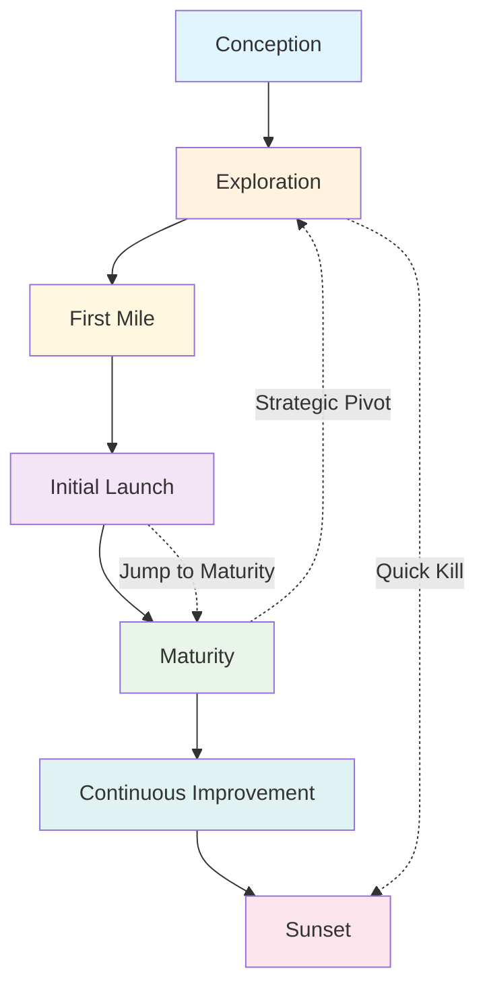

Modern SaaS companies rarely build monolithic products. Instead, they develop **product features**—distinct capabilities that evolve independently while contributing to the overall platform. Managing these features effectively requires understanding their lifecycle: where each one stands in its journey from initial conception to eventual retirement.

<!-- truncate -->

Every product feature follows a predictable maturity progression through seven distinct stages. Not every feature completes the full journey—some will stop at exploration, others will jump quickly from launch to maturity. The value lies in bringing structure to what can otherwise be a chaotic process, enabling teams to make strategic decisions about investment, scaling, and retirement.

## The Seven Stages of Feature Evolution

### 1. Conception: Strategic Opportunity Identification

Every product feature begins as a **strategic hypothesis**—a problem to solve, unmet user need, or market opportunity. At this ideation stage, there's no code, just insights from users, stakeholders, and market analysis.

**Key Activities:**

- Validate strategic alignment with company goals
- Assess market opportunity and user demand
- Define success criteria and economic impact
- Ask "should we do this?" not "how will we do this?"

This aligns with [economic decision-making principles](/docs/product/product-development/principles#the-economic-view), where we evaluate opportunities based on their quantified overall economic impact.

### 2. Exploration: Rapid Learning Through Small Experiments

If the idea demonstrates strategic promise, it enters exploration—a **learning-focused phase** designed to validate assumptions quickly and cheaply. Teams build prototypes, conduct user tests, and gather qualitative feedback.

**Key Activities:**

- Build minimum viable prototypes
- Test with controlled user groups
- Validate core value propositions
- Implement fast feedback loops for rapid learning

Following [Principle V7: Many small experiments produce less variation than one big one](/docs/product/product-development/principles#v7-the-principle-of-small-experiments-many-small-experiments-produce-less-variation-than-one-big-one), this stage embraces controlled failure to reduce overall risk.

### 3. First Mile: Controlled Real-World Validation

With positive exploration results, the feature enters its **most critical phase**—real users engaging with functional software in controlled conditions. This might involve feature flags, private betas, or opt-in access.

**Key Activities:**

- Deploy behind feature flags for controlled rollout
- Monitor user behavior and satisfaction closely
- Establish tight feedback loops with early adopters
- Prove value delivery in real-world conditions

This stage implements [Principle F28: For fast responses, preplan and invest in flexibility](/docs/product/product-development/principles#f28-the-principle-of-preplanned-flexibility-for-fast-responses-preplan-and-invest-in-flexibility) through flexible deployment strategies.

### 4. Initial Launch: Broader Access with Clear Expectations

After proving stability and value, the feature becomes available to broader audiences—whether through open beta, public opt-in, or default availability with clear "evolving" messaging.

**Key Activities:**

- Create documentation and onboarding experiences
- Establish support processes and escalation paths
- Monitor adoption, retention, and satisfaction metrics
- Communicate evolutionary nature to manage expectations

**Milestone to Maturity:** A critical milestone for transitioning to maturity is passing the [Test of Time](/blog/2025/03/29/the-test-of-time-in-software-development)—sustained, problem-free operation in production that builds genuine trust among users, stakeholders, and the development team. Even with thorough testing, true confidence in a feature's reliability only develops through prolonged uptime and observed stability under real-world conditions.

### 5. Maturity: Stable Business Asset

Successful features reach maturity as **proven, stable components** integrated into core business operations. This is the "maintenance mode" where the focus shifts from validation to operational excellence.

**Key Characteristics:**

- Stable usage patterns with predictable metrics
- Minimal bugs and reliable performance
- Established support processes and documentation
- Full integration with business infrastructure

**Primary Focus:** Operational stability, bug fixes, and maintaining existing functionality without major feature additions.

### 6. Continuous Improvement: Strategic Enhancement

While mature features are stable, **continuous improvement** represents active strategic investment in evolution and competitive positioning. This distinguishes growth-focused products from maintenance-mode assets.

**Key Differences from Maturity:**

- **Maturity**: Maintain what exists
- **Continuous Improvement**: Actively enhance and expand

**Strategic Activities:**

- Roadmap-driven feature enhancements
- Competitive feature gap analysis
- User experience optimization
- Strategic capability expansion

This stage embodies [Principle FF8: Use fast feedback to make learning faster and more efficient](/docs/product/product-development/principles#ff8-the-fast-learning-principle-use-fast-feedback-to-make-learning-faster-and-more-efficient) through continuous user feedback integration.

### 7. Sunset: Strategic Resource Reallocation

Eventually, some features outlive their strategic value due to declining usage, market shifts, or strategic pivots. **Sunsetting isn't failure—it's strategic portfolio management.**

**Key Activities:**

- Communicate timeline and rationale transparently
- Provide migration paths for existing users
- Gradually remove technical dependencies
- Reallocate resources to higher-impact opportunities

## Strategic Framework Benefits

This lifecycle framework enables teams to make **informed investment decisions** by understanding each feature's stage and prioritizing resource allocation accordingly. Exploration-stage features need research investment, while mature products require maintenance and enhancement resources.

**Cross-functional alignment** becomes natural when product, engineering, support, and leadership teams understand what to expect from each feature and how to support it appropriately. Clear stage definitions eliminate confusion about responsibilities and expectations.

**Team capacity planning** becomes strategic when you understand your feature portfolio distribution. Teams can assess whether they have adequate resources for each stage:

- **Exploration & First Mile**: Require senior developers and product researchers
- **Initial Launch**: Need full-stack developers and support team readiness
- **Maturity**: Require maintenance-focused developers and operational excellence
- **Continuous Improvement**: Demand feature-development specialists and UX resources

**Common resource allocation pitfalls become avoidable** with this structured approach:

- **Premature scaling**: Investing heavily before proving value in the first mile
- **Delayed retirement**: Keeping low-value features that drain resources
- **Stage confusion**: Treating experimental features like mature products
- **Maturity stagnation**: Leaving valuable features in maintenance mode instead of strategic enhancement
- **Team abandonment**: Moving entire teams to new features while mature products lose essential support

**Resource allocation becomes strategic** when teams understand their feature portfolio distribution and can plan hiring, team allocation, and capacity management proactively rather than reactively.

Most importantly, explicitly managing the feature portfolio ensures the overall platform remains **strategically focused** and intentional rather than accumulating technical debt and complexity.

## Conclusion: Structure Enables Strategic Agility

Feature management is inherently complex—multiple capabilities evolving at different paces, competing for resources, and serving different user segments. This lifecycle framework brings strategic structure to that complexity.

By clearly identifying where each feature stands in its evolution, teams can make better decisions about investment, set appropriate expectations, and maintain a focused, valuable product portfolio. The framework supports both [velocity in product development](/blog/2024/12/17/first-we-aim-for-velocity-driving-fast-and-adaptive-product-development) and [strategic economic decision-making](/docs/product/product-development/principles#the-economic-view).

Most importantly, it acknowledges that not every feature needs to complete the full lifecycle. Some should fail quickly in exploration. Others will jump rapidly to maturity. The value lies in making these transitions intentional and strategic rather than accidental.

---

_This framework builds on the [product development principles](/docs/product/product-development/principles) and [product workflow](/docs/product/workflow) documented in our open-source methodology. For implementation details on managing feature rollouts, see our [engineering guidelines](/docs/engineering/workflow) on feature flags and deployment strategies._
