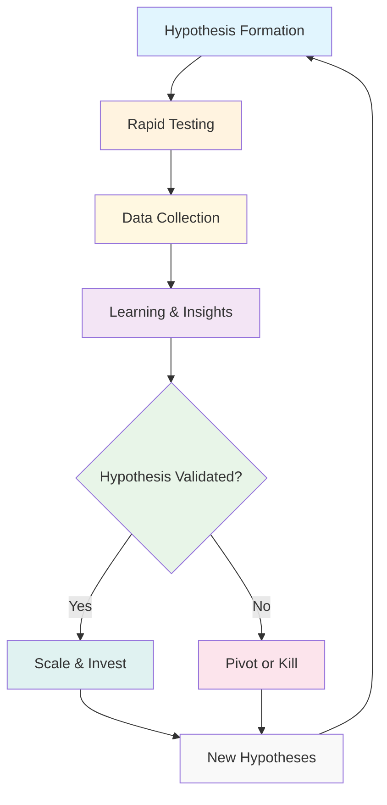
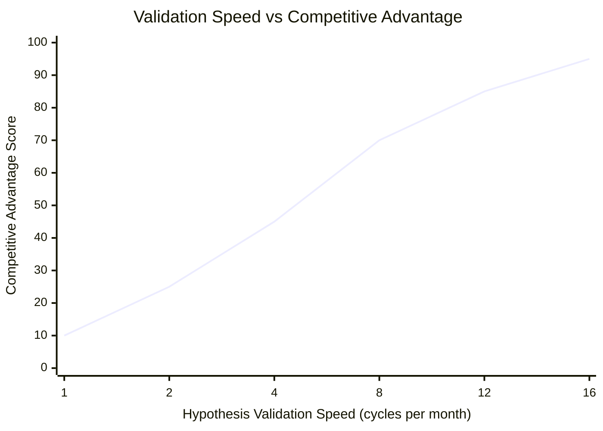

Product development is hypothesis testing. Every feature, user story, and strategic decision represents an assumption about value creation. The speed at which teams validate these hypotheses and pivot determines company survival in competitive markets.

Fast data collection and rapid direction changes define successful product organizations. This isn't about moving fast—it's about learning fast and making informed decisions before competitors recognize opportunities.

<!-- truncate -->

## Summary

**The core mindset shift:** Transform your team from feature-builders to hypothesis-testers. Fast data collection isn't just beneficial—it's the primary competitive advantage that determines market winners.

**Key transformation areas:**

- **Speed over perfection**: Collect imperfect data quickly rather than perfect data slowly
- **Evidence-based decisions**: Replace opinions and assumptions with rapid experimentation
- **Learning velocity**: Measure success by how fast you validate/invalidate assumptions
- **Economic mindset**: Treat information collection as an investment with quantifiable ROI

## Product Development as Hypothesis Testing

Every product decision represents a hypothesis: "If we do X, then Y will happen." Traditional development treats plans as commitments to execute. Hypothesis-driven approaches treat plans as experiments to validate.

This transforms feature prioritization from building what seems logical to building what can be tested quickly. Teams measure learning instead of completion, investing incrementally based on evidence. Speed compounds—teams that learn faster make better decisions, creating sustainable competitive advantages.

_Fast hypothesis validation cycles enable rapid learning and better resource allocation_

## The Economic Value of Fast Data Collection

Fast data collection creates measurable competitive advantages that compound over time:

_Teams that validate hypotheses faster gain exponentially greater competitive advantages_

[E18: The Principle of Buying Information](/docs/product/product-development/principles#e18-the-principle-of-buying-information-the-value-of-information-is-its-expected-economic-value) states information has quantifiable economic value—but only if you don't pay more than it creates.

Data collection reduces uncertainty, preventing costly mistakes and accelerating time-to-market. Infrastructure investment in fast collection typically delivers positive ROI through reduced [cost of delay](/docs/product/product-development/definitions#cost-of-delay) and higher success rates.

Learning faster than competitors creates substantial economic advantages when information value exceeds collection costs.

## Building Velocity for Data Collection

Creating fast feedback loops requires intentional system design and organizational capabilities. Teams must optimize for speed of learning, not just speed of delivery.

[Fast feedback loops reduce work-in-progress and delays](/blog/2024/12/17/first-we-aim-for-velocity-driving-fast-and-adaptive-product-development#reducing-queues-for-faster-feedback). By minimizing time between hypothesis formation and data collection, teams operate with smaller experiments, increase experiment frequency, and reduce context switching.

Successful teams invest in systems that make experimentation effortless: feature flags for controlled rollouts, real-time analytics dashboards, automated A/B testing frameworks, and user feedback collection systems. Instead of building complete features before testing, they create minimum viable tests, validate incrementally, and iterate based on data from each feedback cycle.

## Strategic Advantages of Fast Learning

Teams that master rapid hypothesis validation gain multiple competitive advantages that compound over time.

In fast-moving markets, the first team to validate and scale a successful approach often captures disproportionate value. Fast data collection enables early identification of market shifts, rapid response to opportunities, and preemptive competitive positioning before others recognize the opportunity.

[Teams operating with short turning radius don't need long planning horizons](/docs/product/product-development/principles#ff10-the-first-agility-principle-we-dont-need-long-planning-horizons-when-we-have-a-short-turning-radius). Fast validation enables just-in-time resource allocation, portfolio approaches to innovation, and reduced sunk cost fallacy since abandoning initiatives becomes easier with minimal investment.

Fast feedback loops create learning advantages extending beyond individual products. Teams develop better instincts through rapid experimentation cycles, accumulate systematic knowledge from each experiment, and become comfortable with uncertainty and rapid change.

## Building a Data-Driven Culture

Creating sustainable competitive advantage requires a cultural shift to evidence-based decision-making. Leaders must demand evidence for key decisions, celebrate learning over being right, and invest in measurement capabilities. Teams should treat product development as continuous experimentation through clear hypothesis formulation, valid experiment design, and statistical literacy.

While speed is crucial, teams must balance velocity with statistical validity. Experiments should:

- Run long enough to generate reliable results
- Focus on detecting meaningful differences, not just statistical significance
- Combine quantitative results with user insights to understand the "why" behind the data

## Practical Implementation Strategies

Start with low-risk experiments to build confidence:

1. **Choose one key hypothesis** for a simple A/B test
2. **Establish measurement infrastructure** for specific metrics
3. **Run experiments transparently** and share learnings
4. **Gradually expand** to more complex hypotheses

**Integration with existing workflows:**

- Include hypothesis statements in feature specs
- Allocate sprint capacity for experiment design
- Review results in retrospectives
- Use validated learnings for roadmap planning

## Overcoming Common Obstacles

**Analysis vs. Speed Tension:** Set analysis timelines upfront, use confidence intervals for practical significance, and establish clear decision criteria for proceed/iterate/abandon choices.

**Resource Constraints:** Start with manual processes before automation, leverage existing analytics platforms, and focus on high-impact experiments that could significantly change direction.

**Cultural Resistance:** Begin with interested team members, demonstrate clear value from early data-driven decisions, and address concerns about data replacing creativity directly.

## Conclusion: Speed as Sustainable Advantage

Organizations that master rapid hypothesis validation build decision-making capabilities that compound over time. The economic principle that information has quantifiable value provides a framework for investing in speed.

The path forward requires balancing [velocity with quality](/blog/2024/12/17/first-we-aim-for-velocity-driving-fast-and-adaptive-product-development), building experimentation capabilities, and fostering an evidence-based culture. Teams that make this transformation don't just respond to market changes—they anticipate and shape them.

As markets accelerate, the organizations that thrive will be those that learn fastest. The question isn't whether to invest in rapid hypothesis validation—it's how quickly you can build the capabilities to outlearn your competition.

---

_This approach builds on the [product development principles](/docs/product/product-development/principles) and [economic decision-making frameworks](/blog/2024/08/27/strategic-decision-making-always-account-for-economic-Impact-in-your-product-choices) documented in our open-source methodology._
