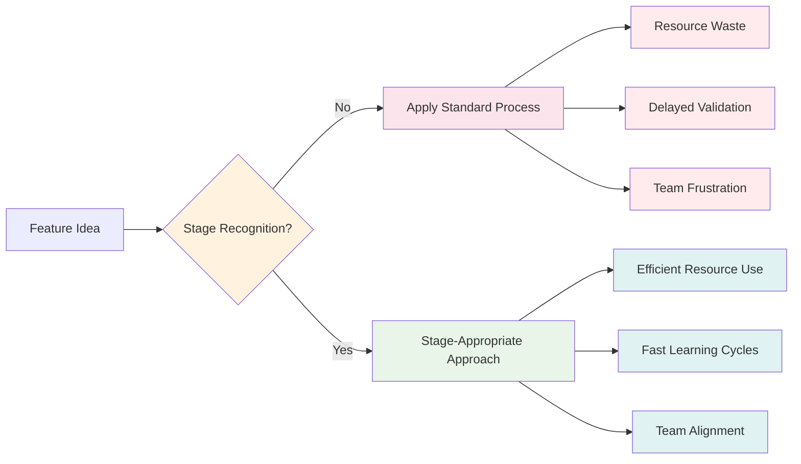
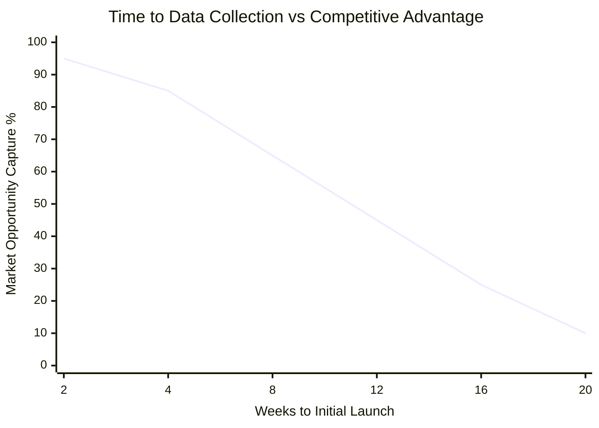
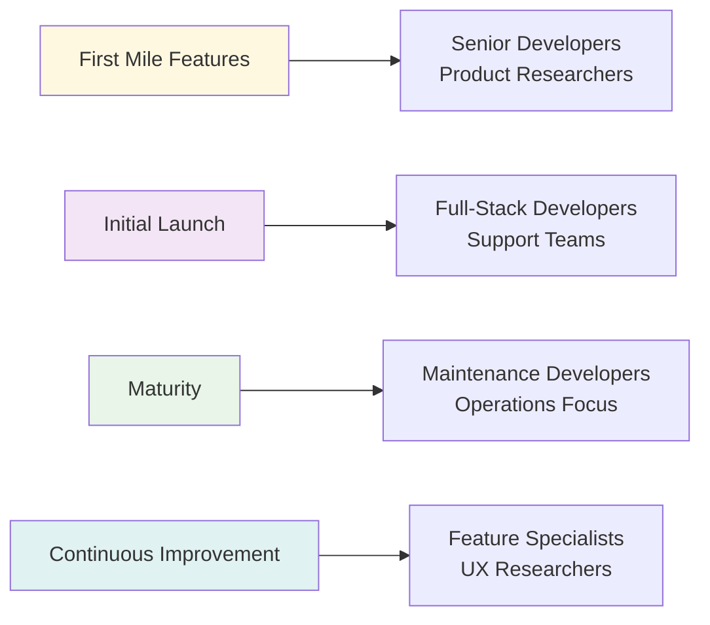

Most product teams unknowingly sabotage their own success. They build features without understanding the development lifecycle, hire the wrong people at critical moments, and abandon projects just before achieving stability. These mistakes aren't just inefficient—they're expensive and preventable.

Understanding the [feature lifecycle](/blog/2025/07/09/the-lifecycle-of-a-saas-feature-from-idea-to-sunset) reveals how strategic missteps compound into systematic failures. Teams that recognize these patterns can avoid costly mistakes and build sustainable competitive advantages.

<!-- truncate -->

## Summary

**The core problem:** Teams unknowingly sabotage their success by misunderstanding how features evolve through distinct lifecycle stages, leading to wasted resources, delayed launches, and technical debt accumulation.

**Five critical mistakes:**

1. **Lifecycle Blindness**: Applying identical processes to all features regardless of their development stage
2. **Data Collection Delays**: Perfecting features in isolation instead of optimizing for rapid user feedback
3. **First Mile Proliferation**: Starting multiple features simultaneously without completing any to stable operation
4. **Hiring Misalignment**: Matching wrong skill sets to current feature lifecycle needs
5. **Premature Abandonment**: Pivoting to new features before completing stabilization of existing ones

**The solution:** Master the [feature lifecycle framework](/blog/2025/07/09/the-lifecycle-of-a-saas-feature-from-idea-to-sunset) to make strategic decisions about resource allocation, hiring, and process optimization. Teams that recognize these patterns build sustainable competitive advantages through faster learning and higher-quality assets.

## The Hidden Cost of Development Mistakes

Product development failures rarely announce themselves. Features launch late, teams burn out, technical debt accumulates, and competitive advantages evaporate. The root cause often traces to fundamental misunderstandings about how features evolve from conception to maturity.

These five critical mistakes represent the most common and expensive patterns teams encounter. Each mistake compounds the others, creating cascading failures that can derail entire product initiatives.

## Mistake #1: Operating Without Lifecycle Awareness

**The Problem:** Teams treat all features the same, applying identical processes regardless of development stage.

Many teams approach feature development as a linear progression: requirements → design → development → launch → maintenance. This oversimplification ignores the reality that different stages require fundamentally different approaches, resources, and success metrics.

**Common Manifestations:**

- Using detailed project plans for experimental features
- Applying mature product quality standards to early prototypes
- Building comprehensive documentation before proving value
- Demanding production-ready infrastructure for validation experiments

**The Hidden Cost:** Teams waste resources on premature optimization while failing to invest appropriately in critical validation phases.

**Strategic Solution:** Explicitly identify each feature's current lifecycle stage and adapt processes accordingly. [Exploration requires rapid experimentation](/blog/2025/07/09/the-lifecycle-of-a-saas-feature-from-idea-to-sunset#2-exploration-rapid-learning-through-small-experiments), while [maturity demands operational excellence](/blog/2025/07/09/the-lifecycle-of-a-saas-feature-from-idea-to-sunset#5-maturity-stable-business-asset).

## Mistake #2: Delaying Data Collection and Initial Launch

**The Problem:** Teams perfect features in isolation instead of optimizing for rapid data collection and user feedback.

[Speed of hypothesis validation creates competitive advantage](/blog/2025/07/14/data-driven-hypothesis-validation-speed-as-competitive-advantage). Teams that prioritize polish over learning miss critical opportunities to validate assumptions, iterate based on real user behavior, and capture market opportunities before competitors.

**Common Manifestations:**

- Building complete feature sets before any user testing
- Waiting for perfect UI/UX before collecting usage data
- Requiring comprehensive QA cycles for experimental features
- Delaying launch until every edge case is handled

**The Economic Impact:** [Fast data collection has quantifiable economic value](/blog/2025/07/14/data-driven-hypothesis-validation-speed-as-competitive-advantage#the-economic-value-of-fast-data-collection) through reduced uncertainty and accelerated time-to-market. Teams that delay data collection pay opportunity costs in the form of wasted development effort and missed competitive positioning. This reflects [the cost of delay principle](/docs/product/product-development/principles#e3-the-principle-of-quantified-cost-of-delay-if-you-only-quantify-one-thing-quantify-the-cost-of-delay)—cycle time delays dominate product development economics.

**Strategic Solution:** Optimize development processes to reach [Initial Launch](/blog/2025/07/09/the-lifecycle-of-a-saas-feature-from-idea-to-sunset#4-initial-launch-broader-access-with-clear-expectations) as quickly as possible. Build minimum viable functionality, deploy behind feature flags, and prioritize learning over perfection.

_Delaying initial launch exponentially reduces market opportunity capture_

## Mistake #3: Feature Proliferation in First Mile

**The Problem:** Teams start multiple features simultaneously and get trapped in the First Mile phase, never achieving stable launches.

The [First Mile phase](/blog/2025/07/09/the-lifecycle-of-a-saas-feature-from-idea-to-sunset#3-first-mile-controlled-real-world-validation) represents the most critical validation period—real users engaging with functional software. Teams often mistake activity for progress, launching numerous features into First Mile without completing the journey to stable operation.

**Common Manifestations:**

- Starting new features before existing ones reach maturity
- Maintaining many features in experimental states
- Constantly switching context between unfinished initiatives
- Celebrating launches without measuring post-launch success

**The Resource Drain:** Multiple First Mile features create exponential complexity. Each feature requires monitoring, support, iteration, and decision-making. Teams spread thin across multiple experiments make shallow progress on all fronts.

**Strategic Solution:** Limit work-in-progress ruthlessly. Focus on completing the full journey from First Mile to Initial Launch before starting new experiments. This aligns with [queue control principles](/docs/product/product-development/principles#q13-the-first-queue-size-control-principle-dont-control-capacity-utilization-control-queue-size) that emphasize controlling queue size rather than utilization, creating sustainable learning cycles and reducing cognitive overhead.

## Mistake #4: Misaligned Hiring for Lifecycle Stages

**The Problem:** Teams hire based on general skill requirements instead of matching capabilities to current feature lifecycle needs.

Different lifecycle stages require fundamentally different skill sets and experience levels. [First Mile requires senior developers and product researchers](/blog/2025/07/09/the-lifecycle-of-a-saas-feature-from-idea-to-sunset#strategic-framework-benefits) who can abstract complex problems and make critical architectural decisions under uncertainty.

**Common Hiring Misalignments:**

- **First Mile with Junior Teams:** Junior developers struggle with ambiguous requirements and architectural decisions when features need rapid iteration and technical flexibility
- **Maturity with Innovation-Focused Teams:** Senior architects become frustrated maintaining stable features instead of building new capabilities
- **Exploration with Implementation-Heavy Teams:** Teams optimized for delivery struggle with the uncertainty and rapid pivoting required for validation

**The Capability Gap:** Hiring mismatches create fundamental capability gaps. Junior developers can't provide the technical leadership required during uncertain First Mile phases, while senior developers may be overqualified for mature feature maintenance.

**Strategic Solution:** Align hiring strategies with portfolio composition. Teams heavy in First Mile features need senior developers who excel in ambiguous environments. Mature product portfolios benefit from junior developers supervised by experienced maintainers.

## Mistake #5: Premature Feature Abandonment

**The Problem:** Teams pivot to new features when existing ones reach maturity, leaving technical debt and incomplete stabilization.

[Maturity represents a stable business asset](/blog/2025/07/09/the-lifecycle-of-a-saas-feature-from-idea-to-sunset#5-maturity-stable-business-asset) that requires final investment in documentation, refactoring, and test coverage. Teams often mistake reaching maturity for project completion, abandoning features just before they become reliable long-term assets.

**Common Abandonment Patterns:**

- Moving entire teams to new features after initial launch success
- Skipping documentation because "the code is self-explanatory"
- Deferring refactoring since the feature "works well enough"
- Avoiding test coverage for "stable" features that rarely change

**The Technical Debt Accumulation:** Premature abandonment creates maintenance burdens that compound over time. Features without proper documentation become knowledge silos. Unrefactored code becomes increasingly difficult to modify. Missing tests create fragility that surfaces during future changes.

**Strategic Solution:** Treat maturity as a critical investment phase, not a graduation ceremony. Allocate dedicated time for documentation, refactoring, and test coverage before reassigning team resources. This creates sustainable long-term assets instead of maintenance liabilities.

## Building Sustainable Development Practices

Avoiding these mistakes requires systematic changes to how teams approach feature development:

**Stage-Appropriate Resource Allocation:**

- **Exploration & First Mile:** Invest in senior talent and rapid experimentation capabilities
- **Initial Launch:** Focus on monitoring, support infrastructure, and user feedback systems
- **Maturity:** Complete documentation, refactoring, and testing before resource reallocation

**Process Optimization for Learning:**

- Optimize development workflows to reach data collection points quickly
- Limit work-in-progress to enable deep focus on completion
- Establish clear stage transition criteria and investment requirements

**Strategic Portfolio Management:**

- Regularly audit feature portfolio distribution across lifecycle stages
- Plan hiring and team allocation based on portfolio composition
- Balance innovation investment with maintenance excellence

This systematic approach implements [economic decision-making principles](/docs/product/product-development/principles#e8-the-principles-of-small-decisions-influence-the-many-small-decisions) by providing frameworks for the numerous small decisions that have enormous cumulative impact on product success.

## Conclusion: Systematic Success Through Lifecycle Mastery

Product development success isn't about avoiding individual mistakes—it's about building systematic capabilities that prevent entire categories of failures. Understanding feature lifecycles provides the framework for making strategic decisions about resource allocation, hiring, and process optimization.

Teams that master lifecycle management don't just build better features—they build sustainable competitive advantages through faster learning, more efficient resource utilization, and higher-quality long-term assets.

The path forward requires explicit recognition of lifecycle stages, optimization for rapid data collection, focused completion of initiatives, strategic hiring alignment, and commitment to feature stabilization. Teams that implement these practices systematically outperform those that treat development as an undifferentiated process.

---

_This analysis builds on the [feature lifecycle framework](/blog/2025/07/09/the-lifecycle-of-a-saas-feature-from-idea-to-sunset) and [data-driven development principles](/blog/2025/07/14/data-driven-hypothesis-validation-speed-as-competitive-advantage) documented in our open-source methodology._
