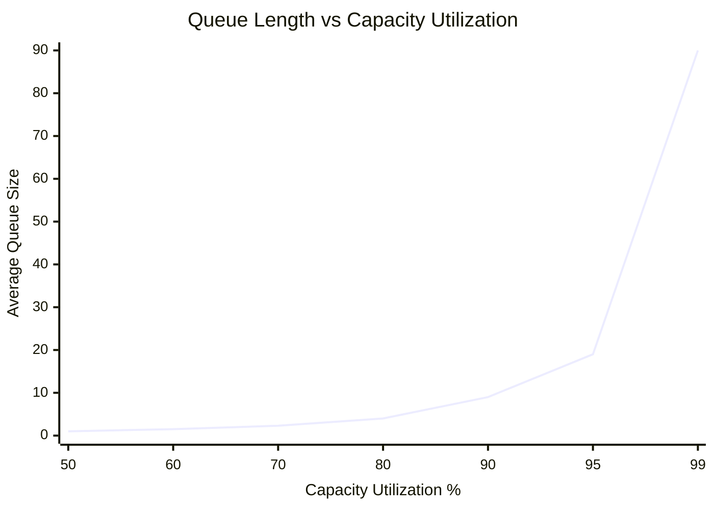

In product development, **queues** are one of the most critical yet invisible factors affecting your team's performance and economic outcomes. Unlike physical queues you can see, product development queues consist of information and work items waiting to be processed—making them financially and physically invisible.

Understanding queues is essential because they represent the root cause of most economic waste in product development, following [Q2: The Principle of Queueing Waste](/docs/product/product-development/principles#q2-the-principle-of-queueing-waste-queues-are-the-root-cause-of-the-majority-of-economic-waste-in-product-development).

<!-- truncate -->

## What Are Queues in Product Development?

A **queue** is a sequence of work items waiting to be processed. Unlike a physical line at a coffee shop, product development queues are digital—feature requests in backlogs, bugs in trackers, or pull requests awaiting review.

These queues form throughout your development pipeline. A feature request enters the backlog queue, moves to development when picked up by engineers, then flows through code review, testing, and deployment queues before reaching users.

Following [Q1: The Principle of Invisible Inventory](/docs/product/product-development/principles#q1-the-principle-of-invisible-inventory-product-development-inventory-is-physically-and-financially-invisible), these queues are virtually invisible—you can't see work accumulating like inventory in a warehouse. This invisibility makes queues dangerous because they grow silently, creating economic waste that goes unnoticed until it severely impacts delivery.

## Why Queues Matter Economically

The economic impact of queues extends far beyond delays. Understanding why queues create waste is crucial for resource allocation and process optimization. The relationship between queues and economic performance follows predictable patterns that can dramatically improve team effectiveness.

The most counterintuitive aspect is how rapidly queues grow as teams approach full capacity. Following [Q3: The Principle of Queueing Capacity Utilization](/docs/product/product-development/principles#q3-the-principle-of-queueing-capacity-utilization-capacity-utilization-increases-queues-exponentially), queue length increases exponentially as capacity approaches 100%. The difference between 80% and 95% utilization can mean the difference between manageable queues and system-breaking bottlenecks.

This creates a dangerous trap. When managers see idle time, the instinct is to add more work. However, this ignores exponential queue costs. A team at 95% capacity may appear more productive than one at 80%, but will experience dramatically longer cycle times, higher stress, and reduced ability to respond to urgent issues.

[Q4: The Principle of High-Queue States](/docs/product/product-development/principles#q4-the-principle-of-high-queues-states-most-of-the-damage-done-by-a-queue-is-caused-by-high-queues-states) reveals another insight: while queues spend most time in low states, economic damage concentrates during high-queue periods. These spikes cause delayed releases and missed opportunities. Teams often dismiss these incidents as anomalies rather than systemic issues.

Every queued item represents delayed value delivery, increasing [cost of delay](/docs/product/product-development/definitions#cost-of-delay) and reducing competitive advantage.

For a detailed analysis of the specific economic impacts, see our comprehensive guide on [The Hidden Costs of Queues in Product Development](/blog/2024/09/24/the-hidden-costs-of-queues-in-product-development), which explores seven critical forms of waste that queues create.

## Common Examples of Hidden Queues

To understand how queues manifest in real product development environments, consider these common scenarios that create hidden but significant economic waste.

**The CEO's Idea Backlog** represents one of the most pervasive queue problems in startups and small companies. When a CEO adds ideas to the product backlog "to not forget them," each unprocessed idea creates mental overhead for the team, unclear priorities, delayed decision-making, and lost context over time. The solution isn't to stop capturing ideas, but to process them quickly—even if the decision is to discard them. The cost of brief analysis is invariably lower than indefinite queue maintenance, and it provides clarity that enables better decision-making across the organization.

**Code Review Bottlenecks** illustrate how technical processes can create queues that ripple throughout development workflows. When pull requests wait for review, they don't just delay individual features—they block developers from completing work, increase context-switching costs, delay feedback loops, and reduce overall team velocity. These queues often form because organizations underestimate the time required for thorough code review or fail to distribute review responsibilities effectively across team members.

**Feature Request Accumulation** demonstrates how customer-facing queues can create unrealistic expectations and planning complexity. When customer feature requests accumulate without systematic triage, the organization faces mounting pressure to deliver everything while lacking clear criteria for prioritization. This creates resource allocation confusion and can lead to attempting to satisfy everyone while delighting no one—a classic economic inefficiency that queues enable and amplify.

## Managing Queues Effectively

Effective queue management requires shifting from traditional productivity thinking to economic flow optimization. Most organizations try to maximize resource utilization, creating the exponential queue growth problem. Instead, successful queue management focuses on optimizing flow and limiting work in progress.

[Q13: The First Queue Size Control Principle](/docs/product/product-development/principles#q13-the-first-queue-size-control-principle-dont-control-capacity-utilization-control-queue-size) emphasizes controlling queue size rather than maximizing utilization. This means actively limiting work entering your system, even accepting some idle time. The economic logic is clear: occasionally idle resources cost far less than exponentially growing queues.

Active management is essential because [Q16: The Intervention Principle](/docs/product/product-development/principles#q16-the-intervention-principle-we-cannot-rely-on-randomness-to-correct-a-random-queue) shows queues don't self-correct. This requires establishing clear size limits, monitoring performance, and taking corrective action before crisis levels.

Decision-making should follow [E1: The Principle of Quantified Overall Economics](/docs/product/product-development/principles#e1-the-principle-of-quantified-overall-economics-select-actions-based-on-quantified-overall-economic-impact), prioritizing based on economic impact rather than arbitrary factors.

## Frequently Asked Questions

### Q: How do I identify queues in my workflow?

**A:** Look for work items waiting between process steps. Common indicators include:

- Backlogs growing faster than processing rate
- Work sitting "in progress" for extended periods
- Handoffs between teams or individuals
- Regular status meetings discussing "what's blocking progress"

### Q: Is having any queue always bad?

**A:** No. [Q9: The Principle of Queue Size Optimization](/docs/product/product-development/principles#q9-the-principle-of-queue-size-optimization-optimum-queue-size-is-an-economic-trade-off) shows that optimal queue size is an economic trade-off. Some buffer prevents resource starvation, but excessive queues create waste.

### Q: How can I measure queue performance?

**A:** Use [Q12: Little's Formula](/docs/product/product-development/principles#q12-littles-formula-wait-time--queue-sizeprocessing-rate): **Wait Time = Queue Size ÷ Processing Rate**. Track both queue size and processing rate over time.

### Q: What's the difference between a queue and a backlog?

**A:** A backlog is a type of queue. The key distinction is management approach:

- **Queue**: Items are processed in order with focus on flow
- **Backlog**: Items may be reordered, but without flow focus, backlogs often become unmanaged queues

### Q: How do queues affect team motivation?

**A:** Large queues reduce urgency and motivation. When team members know their work will sit in a queue, they lack incentive to complete tasks quickly—a manifestation of Parkinson's Law.

### Q: Can queues be beneficial for variability management?

**A:** Yes, following [V11: The Buffer Principle](/docs/product/product-development/principles#v11-the-buffer-principle-buffers-trade-money-for-variability-reduction). Small queues can buffer against variability, but the economic cost must be justified.

### Q: What's the relationship between batch size and queues?

**A:** [B1: The Batch Size Queueing Principle](/docs/product/product-development/principles#b1-the-batch-size-queueing-principle-reducing-batch-size-reduces-cycle-time) shows that reducing batch size reduces cycle time by minimizing queue formation.

### Q: How do I convince leadership to focus on queue management?

**A:** Use [E21: The Show Me the Money Principle](/docs/product/product-development/principles#e21-the-show-me-the-money-principle-to-influence-financial-decisions-speak-the-language-of-money). Translate queue impact into economic terms: delayed revenue, increased costs, competitive risks.

## Key Takeaways

Understanding and managing queues represents a fundamental shift in how we think about productivity and efficiency in product development. The traditional focus on keeping everyone busy and maximizing resource utilization actually creates exponential increases in queue length, leading to longer cycle times, delayed value delivery, and frustrated teams.

The economic impact of queues extends far beyond simple delays. They create compound effects that touch every aspect of product development, from team motivation to competitive positioning. When work sits in queues, it's not just waiting—it's actively consuming economic value through increased cost of delay, reduced market responsiveness, and organizational inefficiency.

Successful queue management requires active intervention guided by economic principles rather than intuitive approaches. Teams must monitor queue sizes, set explicit limits on work in progress, and make prioritization decisions based on quantified economic impact. This approach may feel counterintuitive at first, especially the idea that some idle time is economically beneficial, but the mathematics of queueing theory clearly demonstrates why flow optimization outperforms utilization optimization.

The next time you encounter work "waiting" in your development process, recognize it as more than just a delay—it's an economic opportunity to optimize your entire development flow. By applying the economic thinking embedded in ttoss principles, teams can dramatically improve their delivery speed, quality, and competitive advantage while reducing the stress and uncertainty that come from overloaded systems.
