Your engineering team feels productive. Developers are coding, reviewers are reviewing, testers are testing. The flow board shows impressive activity with tasks moving through stages. Yet somehow, simple features take weeks to reach production, urgent fixes disappear into development black holes, and team velocity feels frustratingly slow despite everyone working hard.

The problem isn't lazy developers, bad code, or inadequate tools. The real culprit is something most teams can't see: **invisible work queues** that accumulate silently throughout your development pipeline and destroy velocity exponentially. Following [Q1: The Principle of Invisible Inventory](/docs/product/product-development/principles#q1-the-principle-of-invisible-inventory-product-development-inventory-is-physically-and-financially-invisible), these hidden bottlenecks are the root cause of most engineering productivity problems.

Understanding and eliminating invisible queues can transform team performance dramatically—often delivering 5-10x velocity improvements without adding resources or changing technical architecture. The key is learning to see what's hiding in plain sight.

<!-- truncate -->

## The Invisible Inventory Problem: Why Software Queues Hide

Unlike manufacturing, where inventory is physical and visible, software development operates with information-based inventory that's completely invisible. When Toyota has 1,000 car parts sitting in a warehouse, everyone can see the pile growing. When your engineering team has 15 features "in progress," 23 pull requests waiting for review, and 8 items "ready for testing," this massive inventory accumulation remains hidden from view.

This invisibility creates a dangerous trap. Following [Q2: The Principle of Queueing Waste](/docs/product/product-development/principles#q2-the-principle-of-queueing-waste-queues-are-the-root-cause-of-the-majority-of-economic-waste-in-product-development), queues are the root cause of most economic waste in product development, yet teams don't notice them building up until they reach catastrophic levels.

Engineering teams accumulate invisible inventory in five critical areas: partially completed features sitting in development branches, code reviews waiting in pull request queues, finished code waiting for testing and QA validation, tested features waiting for deployment windows, and completed work waiting for integration with other systems. Each of these queues grows silently, creating exponential delays that compound throughout the development pipeline.

_39 items of invisible inventory in a "productive" engineering pipeline_

## The Mathematics of Invisible Queue Damage

The exponential damage from invisible queues follows predictable mathematical patterns. Following [Q3: The Principle of Queueing Capacity Utilization](/docs/product/product-development/principles#q3-the-principle-of-queueing-capacity-utilization-capacity-utilization-increases-queues-exponentially), as teams approach full capacity utilization, queue lengths grow exponentially, not linearly.

Consider a development team operating at different capacity levels. At 70% utilization, average cycle time is 3.3x longer than actual work time—manageable but noticeable. At 80% utilization, cycle time jumps to 5x longer, entering dangerous territory. At 90% utilization, cycle time explodes to 10x longer than work time, meaning a 1-day coding task takes 10 days to complete due to queuing delays. Push to 95% utilization and you hit crisis mode with 20x longer cycle times.

**The Hidden Costs Multiply:**

Queue damage extends far beyond simple delays. Following [Q4: The Principle of High-Queue States](/docs/product/product-development/principles#q4-the-principle-of-high-queues-states-most-of-the-damage-done-by-a-queue-is-caused-by-high-queues-states), most damage occurs during high-queue states that can persist for weeks. When your code review queue hits 15 pending PRs, it doesn't just slow down new reviews—it creates cascading delays that affect the entire development pipeline.

Large invisible queues also destroy team motivation and urgency. Following [FF21: The Hurry-Up-and-Wait Principle](/docs/product/product-development/principles#ff21-the-hurry-up-and-wait-principle-large-queues-make-it-hard-to-create-urgency), when engineers know their work will sit in queues for weeks, they lose motivation for speed and quality. Why rush to finish a feature that will wait two weeks for code review?

## Identifying Your Invisible Queues: A Detection Framework

Most engineering teams have massive invisible inventory they don't realize exists. The first step to eliminating queue damage is making the invisible visible through systematic detection.

**Development Branch Inventory**: Count how many feature branches exist beyond the current flow. Each branch represents partially completed work that's consuming mental overhead and delaying integration. Teams often discover 15-20 "in progress" features that should have been completed weeks ago.

**Code Review Bottlenecks**: Track pull requests by age, not just count. A queue of 8 PRs where the oldest is 2 days old is manageable. A queue of 8 PRs where 3 are over a week old indicates serious flow problems. Following [Q15: The Diffusion Principle](/docs/product/product-development/principles#q15-the-diffusion-principle-over-time-queues-will-randomly-spin-seriously-out-of-control-and-will-remain-in-this-state-for-long-periods), queues can spin out of control and remain in high-load states for extended periods.

**Testing and QA Delays**: Measure time from "development complete" to "testing started." This invisible gap often reveals massive queues where finished code waits for testing resources. Many teams discover testing queues that add 5-10 days to every feature delivery.

**Deployment Pipeline Congestion**: Track completed features waiting for deployment windows. This queue often grows large because deployments feel "risky," causing teams to batch multiple features together and create artificial delays.

**Integration Dependencies**: Count features waiting for other teams, external APIs, or infrastructure changes. These external dependencies create invisible queues that can persist for weeks without active management.

```mermaid
flowchart LR
    subgraph "Invisible Inventory"
        A1[📊 Dev Branches: 18]
        A2[📊 Review Queue: 12 PRs]
        A3[📊 Testing Queue: 6 items]
        A4[📊 Deploy Queue: 4 items]
        A5[📊 Blocked Items: 7]
    end

    subgraph "Visible Workflow"
        B1[✅ Active Work: 3 items]
        B2[✅ Current Flow: 5 items]
        B3[✅ Done: 2 items]
    end

    A1 --> B1
    A2 --> B1
    A3 --> B1

    style A1 fill:#ffcccc
    style A2 fill:#ffcccc
    style A3 fill:#ffcccc
    style A4 fill:#ffcccc
    style A5 fill:#ffcccc
    style B1 fill:#ccffcc
    style B2 fill:#ccffcc
    style B3 fill:#ccffcc
```

_47 items of invisible inventory vs. 10 items of visible work_

## Eliminating Invisible Queues: Strategic Interventions

Once you can see your invisible queues, targeted interventions can dramatically improve flow. The key is addressing root causes, not just symptoms.

**Purge Stale Work**: Following [W7: The Principle of WIP Purging](/docs/product/product-development/principles#w7-the-principle-of-wip-purging-when-wip-is-high-purge-low-value-projects), when queues are high, purge low-value projects. Cancel or defer the oldest feature branches that no longer align with current priorities. Many teams discover they can eliminate 30-50% of "in progress" work without any business impact.

**Implement Queue Size Limits**: Following [W1: The Principle of WIP Constraints](/docs/product/product-development/principles#w1-the-principle-of-wip-constraints-constrain-wip-to-control-cycle-time-and-flow), constrain work-in-process to control cycle time and flow. Set maximum limits for each queue: 2 feature branches per developer, 5 PRs maximum in review, 3 items maximum in testing. When limits are reached, new work gets blocked until existing work completes.

**Attack Bottlenecks Systematically**: Following [W11: The Big Gun Principle](/docs/product/product-development/principles#w11-the-big-gun-principle-pull-high-powered-experts-to-emerging-bottlenecks), pull high-powered experts to emerging bottlenecks. If code reviews consistently create queues, temporarily assign multiple senior developers to clear the backlog and establish better review processes.

**Reduce Batch Sizes**: Following [B3: The Batch Size Feedback Principle](/docs/product/product-development/principles#b3-the-batch-size-feedback-principle-reducing-batch-sizes-accelerates-feedback), smaller batches accelerate feedback and reduce queue buildup. Instead of deploying 5 features together, deploy 1 feature daily. Instead of reviewing 500-line PRs, review 100-line PRs.

## Making Invisible Queues Permanently Visible

Sustainable queue management requires continuous visibility. Following [W23: The Principle of Visual WIP](/docs/product/product-development/principles#w23-the-principle-of-visual-wip-make-wip-continuously-visible), make work-in-process continuously visible through dashboards that track queue age, not just queue size. A queue of 5 items that are all less than 2 days old is healthy. A queue of 5 items where 2 are over a week old indicates serious problems.

Monitor leading indicators that predict queue problems before they become critical: average time in each stage, percentage of work that exceeds target cycle times, and frequency of emergency "rush" work that bypasses normal flow. Track economic indicators that show the business impact of queue reduction: time from idea to customer feedback, feature delivery frequency, and customer satisfaction with release cadence.

Common resistance patterns emerge when implementing queue visibility. Management often fears that limiting work means missing opportunities, but following [E1: The Principle of Quantified Overall Economics](/docs/product/product-development/principles#e1-the-principle-of-quantified-overall-economics-select-actions-based-on-quantified-overall-economic-impact), economic analysis consistently shows that faster delivery of fewer features generates more value than slower delivery of more features. Teams worry that idle time represents waste, but following [E5: The Inactivity Principle](/docs/product/product-development/principles#e5-the-inactivity-principle-watch-the-work-product-not-the-worker), the biggest waste is work products sitting idle in queues, not workers occasionally waiting for work.

## Overcoming Implementation Challenges

Three common challenges arise when implementing invisible queue detection and elimination. First, management fears idle time represents waste, but the solution is measuring economic value delivery rather than individual utilization—following [E5: The Inactivity Principle](/docs/product/product-development/principles#e5-the-inactivity-principle-watch-the-work-product-not-the-worker), focus on work products flowing through the system, not worker activity. Second, every request feels urgent, breaking queue discipline, which requires implementing [W18: Differential Service](/docs/product/product-development/principles#w18-the-principle-of-differential-service-differentiate-quality-of-service-by-workstream) with explicit emergency lanes that have their own queue limits. Third, teams fear limiting work means missing valuable opportunities, but economic decision rules solve this—if an opportunity's value exceeds the cost of queue buildup (including cycle time impact on other work), make the trade-off explicitly.

## The Path to Visible, Fast-Flowing Engineering

Most engineering velocity problems stem from invisible work queues that accumulate silently and destroy team performance exponentially. By learning to see these hidden bottlenecks and implementing systematic queue elimination, engineering teams unlock predictable delivery through stable cycle times, higher quality through better focus and reduced context switching, faster learning through shorter feedback cycles, improved morale through manageable workloads and visible progress, and economic optimization through faster value delivery.

Following [Q16: The Intervention Principle](/docs/product/product-development/principles#q16-the-intervention-principle-we-cannot-rely-on-randomness-to-correct-a-random-queue), random processes won't fix queue problems—teams must intervene quickly and decisively. The transformation begins the moment you make invisible inventory visible and start measuring queue age instead of just counting tasks in progress.

Start by auditing your current invisible inventory: count development branches, measure code review queue age, track testing delays, identify deployment bottlenecks, and map external dependencies. Most teams discover 3-5x more work in progress than they realized, explaining why everything feels slow despite high activity levels. The solution isn't working harder—it's working with visible, controlled flow that prioritizes finishing work over starting new work.

---

_This approach builds on the [product development principles](/docs/product/product-development/principles) documented in our methodology. For deeper understanding of queue mathematics, see [Why Your 'Fully Utilized' Team is Actually Slow](/blog/2025/07/28/why-your-fully-utilized-team-is-actually-slow) and [Understanding Queues: The Invisible Bottleneck in Product Development](/blog/2025/07/23/understanding-queues-the-invisible-bottleneck-in-product-development)._
