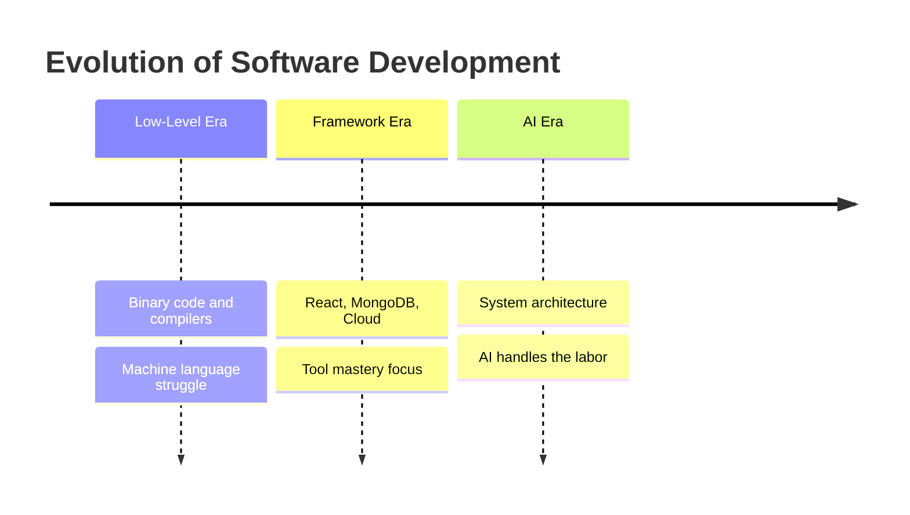

Farming didn't disappear when tractors arrived—it evolved. Software development is undergoing the same transformation with AI. The shift is from manual coding to system architecture.

<!-- truncate -->

## The "Commoditization" of Coding

A few years ago, "React Developer" was a sought-after title. Today, writing React, JavaScript, GraphQL, or managing basic cloud setups has become a commodity. If the "how-to-code" is now a commodity, what isn't?

## The Three Phases of Development

**The Low-Level Era**: Early on, energy was spent on binary code and compilers. We struggled with the machine's language.

**The Framework Era**: Development evolved so we could see changes in real-time. We spent 100% of our time mastering specific tools like React, MongoDB, and Cloud providers.

**The AI Era**: You no longer need to master every syntax detail. The AI handles the "labor," freeing you to focus on the bigger picture.

## The New Skill Set

If AI writes the code, your value now lies in **system design**—understanding how systems connect, managing global state, data consistency, and scalability. This means knowing the difference between eventual consistency and strong consistency, understanding when to use synchronous versus asynchronous patterns, not just how to write a React component.

**Problem decomposition** becomes critical. The ability to break complex problems into small, precise tasks that an AI can execute accurately is the new bottleneck. Following [agentic development principles](/docs/ai/agentic-development-principles) ensures you can direct AI effectively. Each task must be atomic, testable, and unambiguous.

You will spend more time **reading code than writing it**. Code review shifts from checking syntax to auditing for security flaws, performance bottlenecks, and catching AI hallucinations. Understanding what the system does becomes more valuable than knowing how to write it.

**Infrastructure and observability** matter more than ever. Knowing where the code runs, how it scales, and—most importantly—how to debug when it breaks separates effective developers from those still thinking in framework terms. Logs, metrics, and traces become your primary interface.

Finally, **collaboration and communication** with cross-functional teams ensures the system meets user needs and business goals. The ability to translate business requirements into system constraints and explain technical trade-offs to non-technical stakeholders is increasingly valuable.

The focus has shifted from the "bricks" to the "blueprint."
