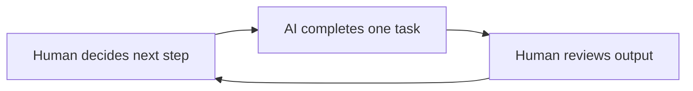
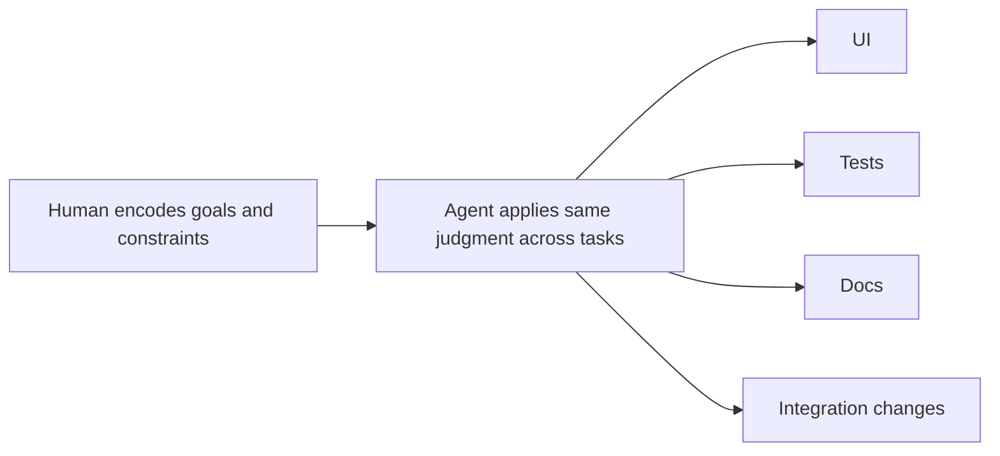
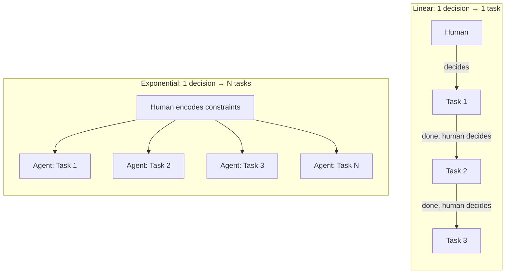

Most teams think AI becomes exponential when the model gets smarter.

The real shift occurs when the human starts delegating governing judgment rather than one step at a time.

<!-- truncate -->

This is the core of [The Principle of Compressed Delegation](/docs/ai/agentic-development-principles#the-principle-of-compressed-delegation): AI leverage is determined by how much human judgment is encoded into executable constraints before execution begins.

If the operator has to decide every next move, AI behaves like a fast typist. If the operator can encode goals, boundaries, interfaces, and acceptance checks once, AI can apply that judgment across many downstream tasks.

## Most AI Usage Is Still Linear

The common workflow looks like this:

1. Ask AI to write one function.
2. Review it.
3. Ask AI to update one test.
4. Review it.
5. Ask AI to change one component.
6. Review it.

This is useful, but it is still linear. One human decision creates one AI task — the real bottleneck is still the operator's rate of intervention.



In this mode, AI accelerates execution, but it does not fundamentally change the structure of work.

## Compressed Delegation Changes the Unit of Work

Compressed delegation starts when the human stops specifying steps and starts specifying governing logic.

The operator defines the reusable constraints that should hold across all tasks, rather than saying, "write this function, now write this test, now update this page."

For example:

```md
Goal: Add CSV export to the invoices flow.

Constraints:

- Reuse existing table toolbar patterns.
- Do not change the backend contract.
- Export only fields already visible to the user.
- Preserve current permission checks.
- Add automated coverage for formatter and access control.

Done when:

- UI exposes export from the existing toolbar.
- Backend response shape remains unchanged.
- Tests prove authorized and unauthorized cases.
```

This is a more compressed form of human judgment, rather than just a bigger prompt. It gives the agent enough structure to work across UI, permissions, formatting, and tests without asking for the next step every time.



The leverage comes from reusing one layer of judgment across many outputs.

## Linear vs. Exponential: One Task vs. N Tasks

The difference between linear and exponential AI usage also comes down to how many tasks a single human decision unlocks.

In the linear mode, one decision produces one task. If a developer needs to ship ten changes, they make ten sequential decisions. Throughput is bounded by the human's clock.

In the agent mode, one set of encoded constraints can spawn and govern N tasks simultaneously. The human's judgment — written once — applies across agents working on UI, tests, documentation, and integration at the same time.



The slope of output per human decision is what changes. Linear usage scales with the operator's time. Agent-governed usage scales with the quality of the encoded constraints.

## The Ceiling Is Still Verification

This is about strategic delegation, not unconditional delegation.

Its scale is limited by [The Principle of Verification Asymmetry](/docs/ai/agentic-development-principles#the-principle-of-verification-asymmetry). Teams can generate more work than they can safely verify. If a single instruction causes ten files to change, the benefit disappears when review, testing, and integration cannot keep up.

That is why compressed delegation only becomes reliable inside [The Principle of Automated Closed Loops](/docs/ai/agentic-development-principles#the-principle-of-automated-closed-loops). Tests, types, linters, and CI give the system fast feedback, reducing the cost of validating broader delegation.

This also connects directly to [B3: The Batch Size Feedback Principle](/docs/product/product-development/principles#b3-the-batch-size-feedback-principle-reducing-batch-sizes-accelerates-feedback). High leverage does not justify giant blind batches. The winning move is to delegate at a higher level while still keeping feedback loops tight.

## What Actually Changes for Developers

The shift is subtle but important.

The higher-value job for developers is to encode the judgment that should survive across many tasks, rather than only describing the next task.

That means writing better boundaries, better non-goals, better contracts, and better acceptance checks.

This is why AI changes the shape of engineering work. The scarce skill becomes "can you compress the right judgment into a form that scales safely" rather than "can you type the implementation."

## Conclusion

Most AI usage stays linear because most delegation is still linear.

The structure of the delegation is the main constraint, rather than the model itself.

When humans delegate one decision at a time, AI behaves like a faster executor. When humans compress judgment into reusable constraints, AI can execute across many tasks with the same governing logic.

That is the real transition from AI as assistance to AI as leverage.
