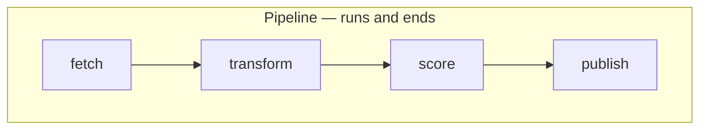
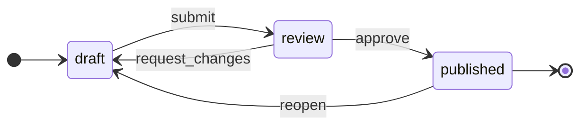
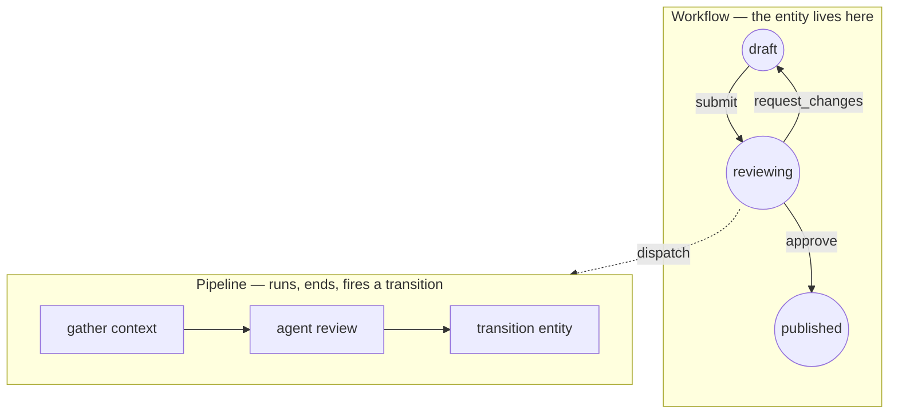

Every automation tool you have used gives you a directed acyclic graph. Airflow, Step
Functions, GitHub Actions, every agent framework shipped in the last two years. You declare
nodes, you draw edges, the engine walks them forward, the run ends.

Then someone asks for a support ticket that can reopen. A lead that goes `qualified →
negotiating → stalled → negotiating`. A kanban card dragged back a column. An invoice that
fails validation and returns to draft.

And you discover the tool cannot express it — not because a feature is missing, but because
the shape is wrong. The "A" in DAG is load-bearing. A graph that forbids cycles cannot
model a process whose defining characteristic is that it revisits states.

<!--truncate-->

## The mismatch is a topology error

The tell is that nobody experiences this as a modeling problem. They experience it as a
pile of application code.

You add a `status` column. Then a `status_history` table, because someone asks who moved
it. Then a guard function, because a ticket should not go from `draft` straight to
`published`. Then a `stalled_at` timestamp and a cron job, because things get stuck in
review and nobody notices for a week. Then a permissions check inside the guard, because
an intern should not be able to force a state.

None of that is business logic. It is a state machine, hand-rolled, one requirement at a
time, spread across a database schema and six service methods — and every team that hits
this builds their own, slightly wrong, with the audit trail bolted on last.

The reason it happens is that the tool answered a different question. A pipeline answers
_what steps run, in what order, until it finishes_. The process was asking _what states
can this thing be in, and who may move it between them_. Both are legitimate. They are not
interchangeable, and picking the wrong one does not fail loudly — it just relocates the
work into your codebase.

## Two shapes, two lifetimes

Put them side by side and the difference is not subtle.

The pipeline has a start and an end, and its lifetime is one execution. It holds a lease,
occupies a worker slot, and is expected to finish — measured in seconds or minutes. Its
state belongs to the engine.

The state machine has no end. Its lifetime is the lifetime of the _entity_ — days, weeks,
a quarter. It spends almost all of that time doing nothing at all, parked in a state,
waiting for a human or an event. Its state belongs to the domain, and the interesting
question is never "where is the cursor" but "who is allowed to move this, from here, and
was it recorded".

Those two lifetimes are so different that trying to serve the second with the first
produces a specific, recognizable bug: a run that waits. A process holding a lease and a
queue slot for three days while a human thinks about it. That is not a long pipeline, it
is a resource leak wearing a pipeline's clothes.

## The distinction that resolves it

The useful move is to stop treating this as one abstraction with a missing feature and name
two, with a hard line between them:

> A **pipeline** is a graph that _ends_. A **workflow** is a graph an entity _lives_ in.

Once the two are separate, the question at design time gets easy. Does this thing terminate
on its own? Pipeline. Does it sit somewhere, with a status someone reads on a board, until
something moves it? Workflow.

And critically: they compose. A workflow state does not do work — it _dispatches_ work. The
entity enters `reviewing`, that state kicks off a pipeline, the pipeline runs its steps and
ends, and its last act is to fire a named transition that moves the entity on. The outer
graph is cyclic and long-lived. The inner graph is acyclic and bounded. Each one is the
shape it should be.

Two rules keep the composition honest, and both are learned the hard way.

**The pipeline's edge back into the workflow must be fire-and-forget.** If a run waits for
the entity to reach some state, you have inverted the lifetimes again and reintroduced the
leak you just removed. Let the run end. Let the state machine carry things forward.

**Nothing will bound the composed cycle for you.** Cycle detection is per-graph, and the
workflow's cycles are deliberate — so a state whose pipeline transitions the entity back
into that same state loops forever, and both graphs are individually valid. That bound is
yours to enforce.

## Why this got urgent

You could get away with hand-rolling the state machine when humans drove every transition.
Humans are slow, and slow systems hide their modeling errors.

Agents are not slow, and they are not few. When an LLM can fire a transition, three
properties stop being nice-to-haves:

**Transitions must be the only way to move.** If state is directly writable, an agent will
write it, and every guard you wrote becomes advisory. One mutation path, or none.

**Every move must record its principal.** Not just "the system did it" — _which_ agent, on
whose authority, caused by which generation. When an automated hop cannot name the human or
key that set the chain going, your audit trail decays to noise at exactly the moment you
need it.

**A stuck entity must announce itself.** Automation fails silently far more often than it
fails loudly: a dispatch completes and no routing rule matches, and the entity sits there
looking healthy. Something has to notice that nothing happened.

Those are not features you bolt onto a `status` column. They are properties of having
modeled the thing as a state machine in the first place.

## Where to look

We built this distinction into [SOAT](https://soat.ttoss.dev) as two separate primitives
rather than one flexible one — orchestrations for the acyclic pipelines, workflows and tasks
for the cyclic state graphs, with an explicit dispatch edge between them. The state model,
the guards and transition history, and the composition patterns are written up in the
[Workflows & Tasks](https://soat.ttoss.dev/docs/modules/workflows) module documentation.

But the idea outlives the implementation. Before you add another `status` column, ask which
of the two shapes the thing in front of you actually has. If it can go backward, no amount
of pipeline will save you — and the code you are about to write is a state machine whether
you name it or not.
