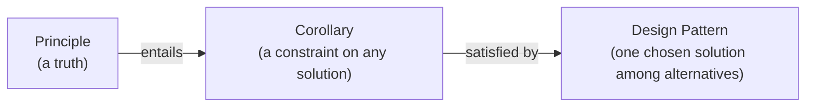

:::caution Work in Progress
These principles are under development. They will be refined and expanded as validated.
:::

_Agentic development means intentionally designing workflows, feedback loops, and decision boundaries to maximize the value of AI agents as development partners._

This section defines principles for integrating AI agents into product development workflows, building on [The Principles of Product Development Flow](/docs/product/product-development/principles) and focusing on effective human-AI collaboration. The principles are now organized by chapter so each page stays focused.

## Principles, Corollaries, and Design Patterns

This documentation is organized in three layers, and each layer makes a different kind of claim. Confusing them weakens all three, so the distinction is worth stating precisely.

A **Principle** is a fundamental truth or proposition that serves as the foundation for a chain of reasoning. It is not a best practice or a suggestion. It describes the underlying physics and economics of Human-AI interaction. A principle is purely descriptive: it tells you how the world is, whether or not you act on it.

A **Corollary** is a constraint that follows necessarily from one or more principles. Corollaries are allowed to be prescriptive ("verification must be structurally enforced"), but they are not optional advice: if you accept the principle, you cannot coherently reject its corollary. A corollary remains implementation-agnostic — it constrains every solution without choosing one.

A **Design Pattern** is a named, optional, concrete solution to a recurring problem within those constraints. Patterns have alternatives and trade-offs: a competent team can accept every principle and corollary and still legitimately solve the same problem with a different pattern. Patterns live in [Agentic Design Patterns](/docs/ai/agentic-design-patterns).

A simple litmus test: a true principle survives being prefixed with "It is true that…"; a practice survives being prefixed with "You should…". For the middle layer, ask: "Can I accept the principle but reject this?" — if no, it is a corollary; if yes, and it names one concrete mechanism among several viable ones, it is a design pattern.

For example: [The Principle of Asymmetric Risk](/docs/ai/agentic-development-principles/governance-of-agency#the-principle-of-asymmetric-risk) (truth: failure cost is convex while verification cost is linear) entails [The Corollary of Bounded Edit Radius](/docs/ai/agentic-development-principles/governance-of-agency#the-corollary-of-bounded-edit-radius) (constraint: the agent's editable surface must be bounded), which is satisfied by the [Layered Autonomy](/docs/ai/agentic-design-patterns#layered-autonomy) pattern (one solution: clearance levels) — but veto gates or sandboxing could satisfy the same constraint.

Each chapter includes the core principle statements, failure scenarios, and corollaries derived from those principles.

## Chapters

- [Foundations of Hybrid Allocation](/docs/ai/agentic-development-principles/foundations-of-hybrid-allocation) — What to delegate to AI versus code; the prerequisite structure for applying every other chapter.
- [Physics of AI Integration](/docs/ai/agentic-development-principles/physics-of-ai-integration) — How AI systems behave as probabilistic machines: context limits, pattern inertia, the closed-loop requirement, adversarial input conflation, proxy collapse, and substrate drift.
- [Economics of Interaction](/docs/ai/agentic-development-principles/economics-of-interaction) — The cost structure of prompts and model selection; why cheap generation does not mean cheap commitment.
- [Governance of Technical Debt](/docs/ai/agentic-development-principles/governance-of-technical-debt) — How debt accumulates invisibly in agentic workflows and the constraints that keep it recoverable.
- [Architecture of Flow](/docs/ai/agentic-development-principles/architecture-of-flow) — How context compounds, tools should be designed, and why architecture outlasts any individual artifact.
- [Protocol of Communication](/docs/ai/agentic-development-principles/protocol-of-communication) — Why instructions degrade over distance and how protocol standardization limits signal entropy.
- [Governance of Agency](/docs/ai/agentic-development-principles/governance-of-agency) — The asymmetric risk of AI autonomy and the structural constraints that bound it.
- [Symbiosis of Human-AI Agency](/docs/ai/agentic-development-principles/symbiosis-of-human-ai-agency) — The division of labor between humans and agents; what each side does better and what atrophies under automation.

---

_These principles are evolving. For team-level prerequisites, see [Agentic Engineering Foundations](/docs/ai/agentic-engineering-foundations). For implementation strategies, see [Agentic Design Patterns](/docs/ai/agentic-design-patterns). For foundational reasoning, see [Product Development Principles](/docs/product/product-development/principles)._
