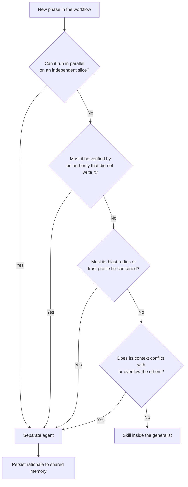

import TOCInline from '@theme/TOCInline';

While [Agentic Development Principles](/docs/ai/agentic-development-principles) define the immutable laws of physics and economics for AI integration, and [Agentic Engineering Foundations](/docs/ai/agentic-engineering-foundations) define what must be true of the team and codebase, this page defines the reusable engineering patterns required to build within those constraints.

These are not theoretical concepts; they are reusable design patterns. They provide specific solutions to the recurring problems of cost, latency, reliability, and risk that every agentic system encounters. Use these patterns to bridge the gap between abstract principles and production code.

A pattern differs from a principle and from a corollary: a principle is a truth (it survives being prefixed with "It is true that…"), a corollary is a constraint entailed by a principle (you cannot accept the principle and reject it), and a pattern is one chosen solution among alternatives (it survives "You should…", and a competent team could satisfy the same constraint differently). See [Principles, Corollaries, and Design Patterns](/docs/ai/agentic-development-principles#principles-corollaries-and-design-patterns) for the full distinction. Every pattern below cites the principle it serves; none of them is the only valid way to serve it.

## Table of Contents

<TOCInline toc={toc} />

## Architecture Patterns

### Immediate AI Feedback Loop

**The Problem:** Context switching and delays kill developer flow. When AI tools have latency, developers either wait (breaking concentration) or ignore the tool entirely.

**The Underlying Principle:** Derived from [The Principle of Cognitive Bandwidth Conservation](/docs/ai/agentic-development-principles/symbiosis-of-human-ai-agency#the-principle-of-cognitive-bandwidth-conservation) and [B3: The Batch Size Feedback Principle](/docs/product/product-development/principles#b3-the-batch-size-feedback-principle-reducing-batch-sizes-accelerates-feedback).

**The Strategy:** Integrate AI tools directly into the coding environment to deliver instant suggestions and error checking, minimizing context switching and delays.

**Failure Scenario:** A team uses an AI code completion tool with a 5-second delay. Developers either wait (breaking flow) or ignore the tool, resulting in inconsistent adoption and wasted potential.

### Small-Experiment Automation

**The Problem:** Large, monolithic changes carry high risk and slow feedback. Manual test creation is tedious and often skipped.

**The Underlying Principle:** Derived from [V7: The Principle of Small Experiments](/docs/product/product-development/principles#v7-the-principle-of-small-experiments-many-small-experiments-produce-less-variation-than-one-big-one).

**The Strategy:** Use AI agents to break down large tasks into small, verifiable experiments (e.g., auto-generated unit tests, code variations), reducing risk and enabling fast feedback.

**Failure Scenario:** An AI generates a massive, brittle test suite. Maintenance overhead grows, slowing development and negating the benefits of automation.

### Orchestrated Agent Parallelism

**The Problem:** Sequential agent execution creates bottlenecks. Without clear task boundaries, parallel agents conflict or duplicate work.

**The Underlying Principle:** Derived from [The Principle of Compounding Context](/docs/ai/agentic-development-principles/architecture-of-flow#the-principle-of-compounding-context) and [D10. The Main Effort Principle](/docs/product/product-development/principles#d10-the-main-effort-principle-designate-a-main-effort-and-subordinate-other-activities).

**The Strategy:** Agent parallelism is most effective when the critical path is clearly defined and agents are orchestrated to work on independent, non-overlapping tasks.

**Failure Scenario:** Agents are assigned tasks without regard to the critical path, resulting in duplicated effort, idle time, and delayed delivery.

#### Critical Path Conflict Mitigation

Assigning multiple agents to work simultaneously on the same critical path increases the risk of conflict, redundant work, and integration errors. Effective orchestration requires that only one agent (or a tightly coordinated group) operates on the critical path at any time.

### Shared Memory Layer

**The Problem:** Agent intelligence resets at task boundaries. Decisions, constraints, and conclusions produced in one session are lost when the context window closes, so downstream agents (and humans) repeatedly pay to reconstruct knowledge the system already produced.

**The Underlying Principle:** Derived from [The Principle of Compounding Context](/docs/ai/agentic-development-principles/architecture-of-flow#the-principle-of-compounding-context) and [The Principle of Finite Context Window](/docs/ai/agentic-development-principles/physics-of-ai-integration#the-principle-of-finite-context-window).

**The Strategy:** Design the workflow as interconnected layers where the output of each agent automatically persists into a shared, durable memory layer (docs, ADRs, tickets, structured knowledge bases) that becomes retrievable context for downstream agents. Treat every AI interaction as an artifact-generation step, not a conversation: decisions are written where the next agent will look, not where the last chat happened. Alternatives that satisfy the same constraint include long-lived orchestrator state or retrieval over a curated corpus — the pattern is the persistence boundary, not a specific storage technology.

**Failure Scenario:** A team uses AI to architect a new feature and agrees on specific constraints in the chat. Because the decision is never persisted into a shared memory layer, the agent that writes the code is unaware of the constraints. It generates code that works but violates the architecture, forcing a human to manually refactor it.

### Artificial Friction

**The Problem:** AI removes the natural "pain signal" of complexity. Manually, writing a tangled patch hurts enough to suggest refactoring; with AI, adding "just one more if-statement" is always the path of least resistance. When the cost of adding a patch drops below the cost of refactoring, systems inevitably trend toward entropy.

**The Underlying Principle:** Derived from [The Principle of Zero-Cost Erosion](/docs/ai/agentic-development-principles/economics-of-interaction#the-principle-of-zero-cost-erosion).

**The Strategy:** Re-introduce deliberate barriers, checks, and vetoes that force the agent to "pay" a cost (in time or compute) before committing low-quality work.

**Failure Scenario:** A team removes all barriers to "move fast," allowing agents to commit code directly. Within a month, the codebase bloats by 300% with redundant logic because there was no friction to stop the agent from taking the easiest path.

#### The Complexity Brake

The canonical implementation of Artificial Friction: configure CI/CD or agent orchestrators to calculate the cyclomatic complexity of the agent's output. If a PR increases the complexity score of a function beyond a threshold (e.g., >10), the system automatically rejects the change or demands a "Refactor Plan" before acceptance. An agent tasked with an edge case will otherwise add a 5th nested if/else block because it was the easiest valid solution—a human would have felt the pain and refactored; the agent felt nothing.

## Communication Patterns

### Explicit Intent Protocol

**The Problem:** LLMs are probabilistic machines that "auto-complete" based on statistical likelihood, not shared understanding. When instructions are vague, the model "hallucinates" the missing context, introducing noise and error into the workflow.

**The Underlying Principle:** Derived from [The Principle of Signal Entropy](/docs/ai/agentic-development-principles/protocol-of-communication#the-principle-of-signal-entropy).

**The Strategy:** Treat every prompt as a standalone communication packet that must contain all necessary context, constraints, and definitions. Do not rely on "implied" knowledge. Use structured formats (XML tags, JSON schemas) to force the model to parse intent rather than guess it.

**Failure Scenario:** A developer tells an agent to "refactor this code." Without explicit intent defining what "refactor" means (e.g., "optimize for readability," "reduce cyclomatic complexity," or "change variable names"), the agent aggressively shortens the code, removing critical error handling that it perceived as "clutter."

### Theory of Mind Prompting

**The Problem:** Agents lack "Theory of Mind"—the ability to model what the user knows or doesn't know. They often provide answers that are factually correct but contextually useless because they assume the wrong level of user expertise.

**The Underlying Principle:** Derived from [The Principle of Signal Entropy](/docs/ai/agentic-development-principles/protocol-of-communication#the-principle-of-signal-entropy).

**The Strategy:** Explicitly prime the agent with a specific "Persona" and "Audience" definition. Instruct the agent to simulate the mental state of the recipient (e.g., "Explain this to a Junior React Developer" vs. "Explain this to the CTO"). This forces the model to adjust its complexity and tone to match the cognitive bandwidth of the user.

**Failure Scenario:** A senior engineer asks for a "high-level summary" of a bug. The agent, lacking Theory of Mind, dumps 400 lines of stack trace logs. The engineer's cognitive bandwidth is flooded with low-level data, obscuring the high-level root cause.

### Chain of Thought Decomposition

**The Problem:** LLMs have a "cognitive attention limit." When a single prompt contains multiple distinct requests (e.g., "Analyze this, then summarize it, then translate it, and format it as JSON"), the model often suffers from the "Lost in the Middle" phenomenon. It prioritizes the beginning and end of the prompt, ignoring instructions buried in the center, or it degrades in quality because it is trying to optimize for too many variables simultaneously.

**The Underlying Principle:** Derived from [The Principle of Signal Entropy](/docs/ai/agentic-development-principles/protocol-of-communication#the-principle-of-signal-entropy).

**The Strategy:** Break complex workflows into a sequential chain of atomic prompts. Instead of a "One-Shot" attempt, force the model to generate an intermediate artifact (a plan, an outline, or a draft) before generating the final result. This allows the model to "reset" its attention span for each specific step.

- Step 1: Generate the logic/plan.
- Step 2: Execute based only on the output of Step 1.

**Failure Scenario:** A developer asks an agent to "Read this 50-page PDF, extract the financial risks, compare them to our internal policy, and write a memo in Spanish." The agent misses 3 critical risks because it was "distracted" by the translation requirement. Correct approach: (1) Extract risks. (2) Compare to policy. (3) Translate the final result.

### The Context Sanitizer

**The Problem:** Agents amplify the existing patterns in their context window. If a developer asks an agent to add a feature to a file containing "spaghetti code," the agent will mimic that messy style to ensure local consistency, effectively hardening the technical debt.

**The Underlying Principle:** Derived from [The Principle of Pattern Inertia](/docs/ai/agentic-development-principles/physics-of-ai-integration#the-principle-of-pattern-inertia).

**The Strategy:** Before an agent is allowed to generate code for a legacy module, the context must be "sanitized." This can be achieved by:

- **Gold Standard Injection:** Explicitly injecting a "Reference Implementation" of clean code into the prompt to serve as a stronger style guide than the existing file.
- **Pre-Flight Refactor:** Using a separate, cheaper agent to strictly reformat or comment the target file before the main agent attempts the task.

**Failure Scenario:** A developer asks an agent to fix a bug in a 2000-line legacy controller. The agent notices that the file relies on global variables and lacks type safety. To "fit in," the agent's fix also uses a global variable. The code works, but the debt is compounded.

### Co-Located Specification

**The Problem:** Requirements and business rules live in external tools (Confluence, Figma comments, Slack) or human memory. Agents see only the artifact — code, design file, doc, dashboard — which shows _what_ exists but not _why_ or _what constraints_ apply. This is domain-agnostic: it affects engineers, designers, PMs, and analysts equally.

**The Underlying Principle:** Derived from [The Principle of Context Compressibility](/docs/ai/agentic-development-principles/physics-of-ai-integration#the-principle-of-context-compressibility) and [The Corollary of Complementary Specification](/docs/ai/agentic-development-principles/physics-of-ai-integration#the-corollary-of-complementary-specification).

**The Strategy:** Embed specs _co-located with the artifacts they govern_, containing only what the artifact cannot express:

- **Intent**: Why this exists and the problem it solves.
- **Constraints**: Business rules, regulatory requirements, performance budgets, brand guidelines.
- **Acceptance criteria**: Verifiable conditions that define "done."
- **Boundaries**: What must not change, scope limits.
- **Non-goals**: What the work should _not_ do.

Exclude anything the agent can obtain by inspecting the artifact directly.

| Domain       | Artifact                 | Spec contains                                           | Co-location                        |
| ------------ | ------------------------ | ------------------------------------------------------- | ---------------------------------- |
| Engineering  | Code, types, tests       | Business rules, acceptance criteria, boundaries         | `feature.spec.md` next to module   |
| Design       | Figma components, tokens | Interaction constraints, accessibility, brand rationale | `component.spec.md` in design repo |
| Product/Docs | Existing pages           | Audience, tone, strategic goals                         | `page.spec.md` next to the doc     |
| Data         | Schema, queries          | Business definitions, alert thresholds, privacy rules   | `metric.spec.md` next to query     |

**Failure Scenario:** Requirements in Confluence; agent extends a payment flow seeing only code. It violates an undocumented rule ("refunds over \$500 require approval"). Same pattern for design (interaction flow in PM's head → visually correct but logically wrong modal) and docs (tone goal communicated verbally → grammatically improved but strategically unchanged rewrite).

### Ownership-Preserving Delegation

**The Problem:** When developers delegate implementation tasks to an AI agent in systems they do not fully master (operating in "Contracting" mode), the AI produces working code but obscures critical implementation details, side effects, and design rationales. Over time, this erodes the developer's mental model of the system, making it impossible to predict the side effects of future changes—directly violating the [Principle of Contextual Authority](/docs/ai/agentic-development-principles/governance-of-agency#the-principle-of-contextual-authority). The developer gradually becomes a mere approver of black-box patches, leading to progressive loss of ownership.

**The Underlying Principle:** Derived from [The Principle of Contextual Authority](/docs/ai/agentic-development-principles/governance-of-agency#the-principle-of-contextual-authority).

**The Strategy:** Structure every delegation of implementation tasks to mandate that the AI agent produces transparency artifacts alongside (or prior to) the final final code. These artifacts act as "living documentation" that actively maintain and update the human's mental model.

Required artifacts the agent can generate:

1. Detailed docstrings for all new or modified functions/classes:
   - Clear purpose description.
   - Explanation of parameters, returns, and exceptions.
   - Explicit side effects (e.g., modifies global state, performs I/O, depends on external configurations).

2. Usage examples (at least 2–3 realistic examples in the docstring or a dedicated section).
3. Step-by-step reasoning (Chain-of-Thought) explaining key design decisions and trade-offs.
4. Unit tests covering normal cases, edge cases, and expected failures (integrates well with The Semantic Validator).
5. Change summary (narrative diff): what was changed, why, and potential impacts on other parts of the system.

**Failure Scenario:**

- Delegating direct implementation without requiring artifacts → "black-box patches".
- Accepting only code + tests, skipping docstrings/examples → superficial mental model.
- Skipping intermediate artifact review → blind approvals.

## Governance Patterns

### Human-in-the-Loop Veto

**The Problem:** AI agents can act with high confidence even when completely wrong. In high-stakes environments (production databases, public communications), a single error can have infinite downside cost.

**The Underlying Principle:** Derived from [The Principle of Asymmetric Risk](/docs/ai/agentic-development-principles/governance-of-agency#the-principle-of-asymmetric-risk).

**The Strategy:** Implement a mandatory "Veto State" for all actions with non-linear downside. The agent can propose an action and prepare the payload, but it cannot execute without a cryptographically signed signal (e.g., clicking a button) from a human. The system defaults to "Deny."

**Failure Scenario:** An autonomous "Customer Support Agent" is allowed to issue refunds without oversight. A user discovers a prompt injection exploit and tricks the agent into refunding \$50,000. The system optimized for speed but failed on risk control.

### Layered Autonomy

**The Problem:** Different tasks carry different risk profiles. Applying a "zero-trust" policy to everything slows down development (micromanagement), while applying "full autonomy" to everything creates unacceptable risk.

**The Underlying Principle:** Derived from [The Principle of Asymmetric Risk](/docs/ai/agentic-development-principles/governance-of-agency#the-principle-of-asymmetric-risk).

**The Strategy:** Assign "Clearance Levels" to agents similar to security clearances.

Level 1 (Consultant): Can only read data and suggest code. (High autonomy).

Level 2 (Intern): Can write to non-production environments with test verification.

Level 3 (Employee): Can deploy to production, but only for specific, whitelisted scopes (e.g., updating docs).

**Failure Scenario:** A "Documentation Agent" is given the same permission set as a "DevOps Agent." A prompt injection in the documentation pipeline allows an attacker to gain write access to the production deployment keys.

### The Semantic Validator

**The Problem:** AI models excel at syntax (style, formatting) but struggle with semantics (logic, truth). They can generate code that looks "perfect" (correct indentation, professional comments) but contains subtle logical flaws or security vulnerabilities. The visual of the code deceives the human reviewer.

**The Underlying Principle:** Derived from [The Principle of Syntactic-Semantic Decoupling](/docs/ai/agentic-development-principles/architecture-of-flow#the-principle-of-syntactic-semantic-decoupling).

**The Strategy:** Invert the verification workflow. Do not rely on visual code review ("Does this look right?"). Instead, enforce Test-Driven Generation:

1. The agent must generate a failing test case before writing the implementation.
2. The implementation is only shown to the human after it passes the test.
3. The human reviews the test for logic, not just the implementation for visual.

**Failure Scenario:** An agent generates a Regex for validating emails. It looks complex and professional. The developer merges it. In reality, the Regex allows catastrophic backtracking (ReDoS), crashing the production server when a malicious user sends a long string. A simple functional test would have caught this, but the visual masked it.

### The Next Move Test

**The Problem:** AI-generated code that works today can still make tomorrow more expensive. Reviewers need a fast, repeatable way to decide "merge or rework" that accounts for structural cost, not just functional correctness.

**The Underlying Principle:** Derived from [The Principle of Architecture over Artifacts](/docs/ai/agentic-development-principles/architecture-of-flow#the-principle-of-architecture-over-artifacts) and [The Principle of Economic Technical Debt](/docs/ai/agentic-development-principles/governance-of-technical-debt#the-principle-of-economic-technical-debt).

**The Strategy:** At the decision point, evaluate the change by asking: "Does this make the next related feature easier or harder to implement?" If it requires duplication or increases complexity, reject it, even if it works — the cost of the next change is the interest rate on the debt you are incurring. Alternatives that price the same debt include automated complexity gates (see [Artificial Friction](/docs/ai/agentic-design-patterns#artificial-friction)); the Next Move Test is the human-judgment version, cheap enough to apply to every merge.

**Failure Scenario:** A developer accepts an AI-generated payment integration that adds conditional logic directly to a core function. It works immediately, but subsequent integrations follow the pattern, creating a fragile, nested monolith where every future change carries disproportionate risk.

## Orchestration Patterns

### Skilled Generalist vs. Specialist Pipeline

**The Problem:** A workflow spans several phases—product, design, implementation, test. Two topologies can deliver it: one agent that loads a skill per phase against a single growing context, or a chain of specialized agents each owning one phase. Choosing by fashion rather than by cost fails both ways—a generalist drowns when phases are independent, parallelizable, or high-blast-radius; a pipeline bleeds handoff taxes when phases are sequential, coupled, and rationale-heavy.

**The Underlying Principle:** Derived from [The Principle of the Decomposition Boundary](/docs/ai/agentic-development-principles/architecture-of-flow#the-principle-of-the-decomposition-boundary), [The Principle of Compounding Context](/docs/ai/agentic-development-principles/architecture-of-flow#the-principle-of-compounding-context), and [The Corollary of Agentic Single Responsibility](/docs/ai/agentic-development-principles/architecture-of-flow#the-corollary-of-agentic-single-responsibility).

**The Strategy:** Default to the skilled generalist—one agent, one compounding context, a skill loaded per phase—because most product work is sequential and coupled, and continuity is free only inside a single context. Promote a phase to its own agent only when it earns a boundary: it can run in parallel, it must be verified by something that did not write it, its blast radius or trust profile must be contained, or its context genuinely conflicts with the others. Most mature systems are hybrids: a generalist that spawns isolated sub-agents for the few phases that justify the wall, with a [Shared Memory Layer](/docs/ai/agentic-design-patterns#shared-memory-layer) carrying rationale across every seam.



**Failure Scenario:** A team copies a reference "agentic SDLC" of five chained role-agents into a codebase whose features are small and tightly coupled. Velocity drops: every change now requires orchestrating five context resets and reconstructing rationale lost at each handoff, where a single agent loading role-specific skills would have carried the full intent end to end. The topology was chosen by analogy, not by the cost of its boundaries.

### Role-Based Routing

**The Problem:** Not all failures are due to a lack of intelligence; many are due to a mismatch in ambiguity tolerance. Assigning a high-ambiguity task (e.g., "Analyze market trends") to an agent designed for rigid execution leads to crashes or hallucinated assumptions. Conversely, assigning a rote data-entry task to a creative "Reasoning Agent" often leads to "boredom errors," where the model over-complicates simple logic or tries to refactor data it was only meant to copy.

**The Underlying Principle:** Derived from [The Principle of Allocative Efficiency](/docs/ai/agentic-development-principles/economics-of-interaction#the-principle-of-allocative-efficiency) and [The Principle of Signal Entropy](/docs/ai/agentic-development-principles/protocol-of-communication#the-principle-of-signal-entropy).

**The Strategy:** Classify your agents not just by the model they use, but by their Functional Role, and route tasks based on the level of definition required, not just the difficulty.

**Failure Scenario:** A user asks a "Database Agent" (Executor Role) to "Find the best users." Because "best" is subjective and undefined, the agent—lacking the "Architect" permission to define terms—hallucinates a metric (e.g., purely alphabetical order or random selection) and returns confident, meaningless data. The task required an "Architect" agent to first define "best" or a "Collaborator" to ask the user, "By 'best', do you mean highest revenue or most recent login?"

#### Collaborative Ability Distinction

The role taxonomy that routing decisions are made against:

1. **The Executor (Doer):** Zero ambiguity tolerance. Follows strict Standard Operating Procedures (SOPs). Best for defined inputs/outputs (e.g., SQL queries, API calls).

2. **The Collaborator (Clarifier):** Moderate ambiguity tolerance. Has the explicit instruction and permission to ask questions back to the user if parameters are missing.

3. **The Architect (Planner):** High ambiguity tolerance. Breaks down abstract goals into concrete steps for Executors.

### Idempotent Handoffs

**The Problem:** Agents fail, timeout, and hallucinate. If an orchestrator simply "retries" a failed task without safety checks, it may execute a side-effect (like a payment or database write) twice, corrupting the system state.

**The Underlying Principle:** Derived from [The Principle of Distributed Unreliability](/docs/ai/agentic-development-principles/physics-of-ai-integration#the-principle-of-distributed-unreliability) and [The Corollary of Atomic State Isolation](/docs/ai/agentic-development-principles/physics-of-ai-integration#the-corollary-of-atomic-state-isolation).

**The Strategy:** Ensure every agent action is idempotent—meaning it can be applied multiple times without changing the result beyond the initial application. Use unique interaction_ids for every request. If an agent receives a task with an ID it has already processed, it should return the cached result rather than executing the logic again.

**Failure Scenario:** An agent is tasked with "Add \$50 credit to User A." The agent adds the credit but the connection times out before it reports success. The orchestrator thinks it failed and retries the task. The agent adds another \$50. The ledger is now corrupt.

### Automated Verification Pipeline

**The Problem:** AI generation scales infinitely; human review does not. When teams adopt AI agents for code generation, they often discover that the bottleneck shifts from "writing code" to "reviewing code." Engineers become full-time reviewers, velocity stalls, and the promised productivity gains evaporate.

**The Underlying Principle:** Derived from [The Principle of Verification Asymmetry](/docs/ai/agentic-development-principles/symbiosis-of-human-ai-agency#the-principle-of-verification-asymmetry) and [The Corollary of Verification Investment](/docs/ai/agentic-development-principles/symbiosis-of-human-ai-agency#the-corollary-of-verification-investment).

**The Strategy:** Shift verification burden from humans to machines by building a multi-layered automated verification pipeline:

1. **Static Analysis Layer:** Linters (ESLint, Prettier), type checkers (TypeScript), and style enforcers run first. These catch syntactic errors instantly with zero human cost.

2. **Semantic Validation Layer:** Unit tests, integration tests, and contract tests verify that the code does what it claims. AI-generated code must pass existing tests before human review.

3. **Complexity Gates:** Automated checks reject PRs that exceed complexity thresholds (cyclomatic complexity, file size, dependency count).

4. **Security Scanners:** SAST/DAST tools identify vulnerabilities before code reaches human eyes.

5. **AI-Assisted Review:** Use a separate AI agent to pre-review the output, flagging potential issues and reducing the cognitive load on human reviewers.

The human reviewer only sees code that has already passed all automated gates—transforming their role from "find all bugs" to "verify business logic and architectural alignment."

**Failure Scenario:** A team adopts AI coding agents without investing in CI/CD infrastructure. Every PR requires 45 minutes of manual review to catch formatting issues, type errors, and broken tests. The review queue grows to 50+ PRs. Engineers spend 80% of their time reviewing, 20% building. Net velocity decreases despite "10x code generation."

#### The Verification Funnel

Structure verification as a funnel where cheap, fast checks run first:

```
AI Output → Linter (1s) → Type Check (5s) → Unit Tests (30s) → Integration Tests (2m) → Human Review (30m)
```

Each layer filters out a category of errors, ensuring humans only review semantically valid, syntactically correct, tested code. The earlier a defect is caught, the cheaper it is to fix.
