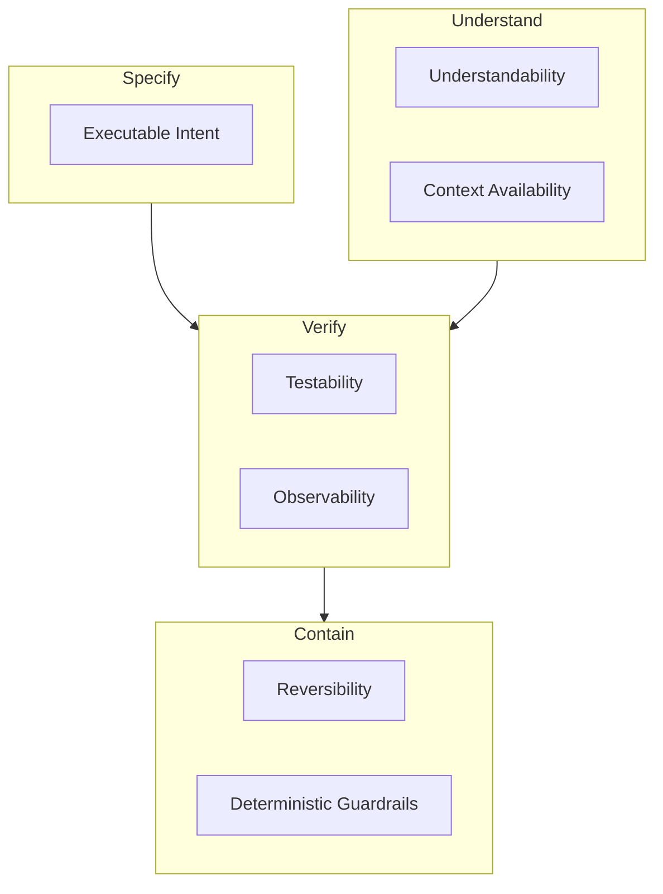

Agentic engineering is the engineering discipline required to make AI-assisted development economically useful, operationally safe, and structurally sustainable.

While [Agentic Development Principles](/docs/ai/agentic-development-principles) define the laws that govern human-AI collaboration, this section defines what must be true of the team and the codebase before agentic execution can scale. Each pillar is a precondition, not a practice: a property the delivery system must have, regardless of which tools or workflows the team chooses to build on top of it.

## What Changes in an Agentic Team

In a traditional team, engineers primarily transform intent into code by typing. In an agentic team, the scarce human work shifts upward and downward. Upward, into problem framing, constraint definition, and task decomposition. Downward, into validation, integration, and acceptance.

In this mode, the engineer becomes closer to a Product Engineer: someone who translates product intent into executable constraints, guides the agent through ambiguity, and decides whether the result is acceptable. This is guided vibe coding — humans spend less time manually typing implementation details and more time entering the problem space, exploring alternatives, steering the model, and validating outcomes. Unguided vibe coding is just probabilistic output consumption; the human role is not removed, it is elevated, as described by [The Principle of Role Elevation in Human-AI Hybridization](/docs/ai/agentic-development-principles/symbiosis-of-human-ai-agency#the-principle-of-role-elevation-in-human-ai-hybridization), [The Principle of Compressed Delegation](/docs/ai/agentic-development-principles/symbiosis-of-human-ai-agency#the-principle-of-compressed-delegation), and [The Principle of Contextual Authority](/docs/ai/agentic-development-principles/governance-of-agency#the-principle-of-contextual-authority).

This does not reduce the need for engineering discipline. It increases it. When code becomes cheap to generate, the quality of the system depends more heavily on the quality of intent, verification, and architectural judgment. A team that celebrates no longer reading code — prompting aggressively, merging quickly, accumulating output no one can explain or debug — collapses the moment incidents, edge cases, or architecture decisions appear. That is why agentic engineering is not "AI coding" as a tactic. It is an operating model, and the pillars below are its load-bearing structure.

## The Pillars

The pillars answer four questions the elevated human role depends on: can intent be expressed precisely, can outcomes be verified cheaply, can the system be understood by humans and agents alike, and can damage be bounded and undone.

- **[Executable Intent](/docs/ai/agentic-engineering-foundations/executable-intent)** — requirements exist as verifiable constraints, not conversations.
- **[Testability](/docs/ai/agentic-engineering-foundations/testability)** — changes can be verified cheaply, quickly, and deterministically.
- **[Understandability](/docs/ai/agentic-engineering-foundations/understandability)** — the codebase is legible to humans and agents alike.
- **[Context Availability](/docs/ai/agentic-engineering-foundations/context-availability)** — decisions and constraints live in artifacts agents can consume.
- **[Observability](/docs/ai/agentic-engineering-foundations/observability)** — systems fail loudly and explain their runtime behavior.
- **[Reversibility](/docs/ai/agentic-engineering-foundations/reversibility)** — any change can be undone cheaply and quickly.
- **[Deterministic Guardrails](/docs/ai/agentic-engineering-foundations/deterministic-guardrails)** — probabilistic execution is bounded by deterministic systems.

## What This Means for Engineering Teams

An engineering team becomes agentic not when it buys AI tools, but when it develops the foundations that let AI operate safely inside the delivery system. The practical shift is straightforward:

- Humans spend less time typing and more time specifying, steering, and validating.
- Codebases become easier to test, easier to understand, and easier to observe.
- Critical decisions move out of prompts and into enforceable engineering constraints.
- Team knowledge moves out of heads and chats into durable artifacts.
- Every change ships with a cheap way to detect that it is wrong and a cheap way to take it back.

Without these foundations, agents produce motion. With them, they produce leverage.

_This section defines the prerequisites for agentic execution. For the governing laws, see [Agentic Development Principles](/docs/ai/agentic-development-principles). For concrete implementation tactics, see [Agentic Design Patterns](/docs/ai/agentic-design-patterns)._
