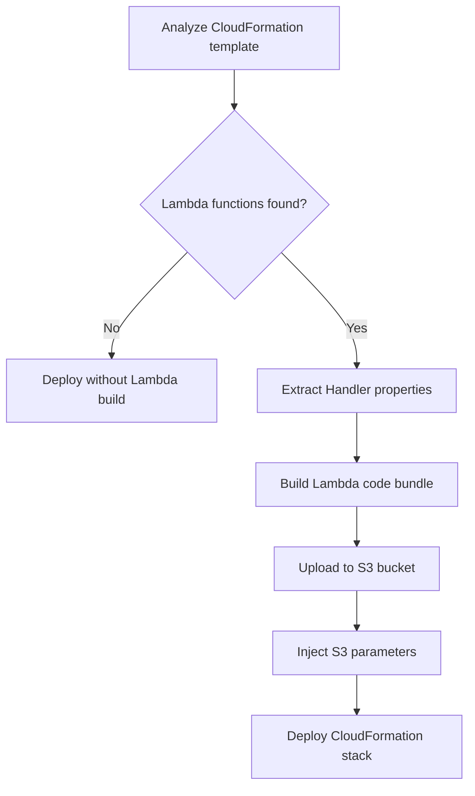

import Tabs from '@theme/Tabs';
import TabItem from '@theme/TabItem';

import { Algorithm } from '../../../src/components/Algorithm';
import { Carlin } from '../../../src/components/Carlin';
import { Examples } from '../../../src/components/Examples';
import { InnerHTML } from '../../../src/components/InnerHTML';
import { OptionAliasesInline } from '../../../src/components/OptionAliasesInline';
import { OptionsSection } from '../../../src/components/OptionsSection';

import { cliOptions } from '../../../.docusaurus/carlin/default/cliOptions';
import { cloudFormationOutputsComment } from '../../../.docusaurus/carlin/default/cloudFormationOutputsComment';
import { buildLambdaCodeComment } from '../../../.docusaurus/carlin/default/buildLambdaCodeComment';
import { defaultTemplatePaths } from '../../../.docusaurus/carlin/default/defaultTemplatePaths';
import { deployCommandExamples } from '../../../.docusaurus/carlin/default/deployCommandExamples';
import { deployCommandOptions } from '../../../.docusaurus/carlin/default/deployCommandOptions';
import { deployComment } from '../../../.docusaurus/carlin/default/deployComment';
import { destroyComment } from '../../../.docusaurus/carlin/default/destroyComment';
import { getCloudformationTemplateOptionsComment } from '../../../.docusaurus/carlin/default/getCloudformationTemplateOptionsComment';
import { optionsParametersComment } from '../../../.docusaurus/carlin/default/optionsParametersComment';
import { stackNameComment } from '../../../.docusaurus/carlin/default/stackNameComment';
import { stackNameWarningComment } from '../../../.docusaurus/carlin/default/stackNameWarningComment';

export const DefaultTemplatePaths = () => {
  return (
    <ol>
      {defaultTemplatePaths.map((path) => (
        <li key={path}>
          <code>{path}</code>,
        </li>
      ))}
    </ol>
  );
};

## Overview

```bash
carlin deploy
```

This command deploys the AWS cloud resources. <Carlin /> takes the template path defined by <OptionAliasesInline options={deployCommandOptions} option="template-path" to="/docs/carlin/commands/deploy#options" /> option. If this option has no value, the algorithm will search for these files to be used as template:

<DefaultTemplatePaths />

and deploy accordingly to the following algorithm:

:::note Algorithm

<Algorithm algorithm={deployComment} />

:::

<InnerHTML html={getCloudformationTemplateOptionsComment} />

### Stack Name

<Carlin /> creates automatically the
<a href="https://docs.aws.amazon.com/AWSCloudFormation/latest/UserGuide/cfn-using-console-create-stack-parameters.html">
  CloudFormation stack name
</a>
, unless it is already specified at the
<OptionAliasesInline
  options={deployCommandOptions}
  option="stack-name"
  to="/docs/carlin/commands/deploy#options"
/>
option. This name is very important because it'll track the deployment when a
update or a delete is performed.

:::caution

<InnerHTML html={stackNameWarningComment} />

::::

<InnerHTML html={stackNameComment} />

## Lambda

Carlin automatically handles Lambda functions in your CloudFormation templates by building and deploying code to S3. When Lambda functions are detected, Carlin analyzes `Handler` properties in `AWS::Lambda::Function` and `AWS::Serverless::Function` resources, builds the code, and uploads it to S3.

### Handler Format

Your `Handler` property must follow the format `path/to/file.exportedFunction`. For example, if you have `src/auth/index.ts` with export `validateUser`, set `Handler` to `auth/index.validateUser`. The base directory defaults to `src` but can be configured with <OptionAliasesInline options={deployCommandOptions} option="lambda-entry-points-base-dir" to="/docs/carlin/commands/deploy#options" />.

### Automatic S3 Parameters

Carlin automatically injects S3 parameters into your CloudFormation template:

<Tabs groupId="cfnTemplate">
  <TabItem value="ts" label="TypeScript" default>

    ```ts
    // Carlin adds these parameters automatically
    Parameters: {
      LambdaS3Bucket: { Type: 'String' },
      LambdaS3Key: { Type: 'String' },
      LambdaS3ObjectVersion: { Type: 'String' },
    }
    ```

  </TabItem>

  <TabItem value="yaml" label="Yaml">
    
    ```yml
    # Carlin adds these parameters automatically
    Parameters:
      LambdaS3Bucket:
        Type: String
      LambdaS3Key:
        Type: String
      LambdaS3ObjectVersion:
        Type: String
    ```
    
  </TabItem>
</Tabs>

### Lambda Resource Configuration

Reference the S3 parameters in your Lambda resources. If `Code` or `CodeUri` properties are undefined, Carlin sets them automatically:

<Tabs groupId="cfnTemplate">
  <TabItem value="ts" label="TypeScript" default>

    ```ts
    Resources: {
      MyLambda: {
        Type: 'AWS::Lambda::Function',
        Properties: {
          Handler: 'auth/index.validateUser',
          Code: {
            S3Bucket: { Ref: 'LambdaS3Bucket' },
            S3Key: { Ref: 'LambdaS3Key' },
            S3ObjectVersion: { Ref: 'LambdaS3ObjectVersion' },
          },
        },
      },
      MyServerlessFunction: {
        Type: 'AWS::Serverless::Function',
        Properties: {
          Handler: 'users/create.handler',
          CodeUri: {
            Bucket: { Ref: 'LambdaS3Bucket' },
            Key: { Ref: 'LambdaS3Key' },
            Version: { Ref: 'LambdaS3ObjectVersion' },
          },
        },
      },
    }
    ```

  </TabItem>

  <TabItem value="yaml" label="Yaml">

    ```yml
    Resources:
      MyLambda:
        Type: AWS::Lambda::Function
        Properties:
          Handler: auth/index.validateUser
          Code:
            S3Bucket: !Ref LambdaS3Bucket
            S3Key: !Ref LambdaS3Key
            S3ObjectVersion: !Ref LambdaS3ObjectVersion
      MyServerlessFunction:
        Type: AWS::Serverless::Function
        Properties:
          Handler: users/create.handler
          CodeUri:
            Bucket: !Ref LambdaS3Bucket
            Key: !Ref LambdaS3Key
            Version: !Ref LambdaS3ObjectVersion
    ```

  </TabItem>

</Tabs>

### Lambda Build Process



### Format Configuration

<InnerHTML html={buildLambdaCodeComment} />

Configure output format with <OptionAliasesInline options={deployCommandOptions} option="lambda-format" to="/docs/carlin/commands/deploy#options" />. Default is `esm` for modern JavaScript modules.

## Destroy

To destroy the stack, just pass the option <OptionAliasesInline options={deployCommandOptions} option="destroy" to="/docs/carlin/commands/deploy#options" /> to the deploy command:

```
carlin deploy --destroy
```

The destroy algorithm is the following:

:::note Algorithm

<Algorithm algorithm={destroyComment} />

:::

:::danger

This operation is irreversible. You must pay attention because you may destroy resources that contains your App data, like DynamoDB, using this command.
To overcome this problem, destroy will only delete the resources if termination protetion isn't enabled and if <OptionAliasesInline options={cliOptions} option="environment" to="/docs/carlin/configuration#global-options" /> isn't defined.

:::

## Examples

<Examples examples={deployCommandExamples} />

### Use Cases

- [Terezinha Farm API](https://github.com/ttoss/ttoss/tree/main/terezinha-farm/api)
- [POC - AWS Serverless REST API](https://github.com/ttoss/poc-aws-serverless-rest-api/tree/112df23a823294a8b29d0c70f1d0127373759ef1)

## Outputs

<InnerHTML html={cloudFormationOutputsComment} />

## API

### Options

<OptionsSection options={deployCommandOptions}>
  <OptionsSection.Option option="parameters">
    <InnerHTML html={optionsParametersComment} />
  </OptionsSection.Option>
</OptionsSection>
