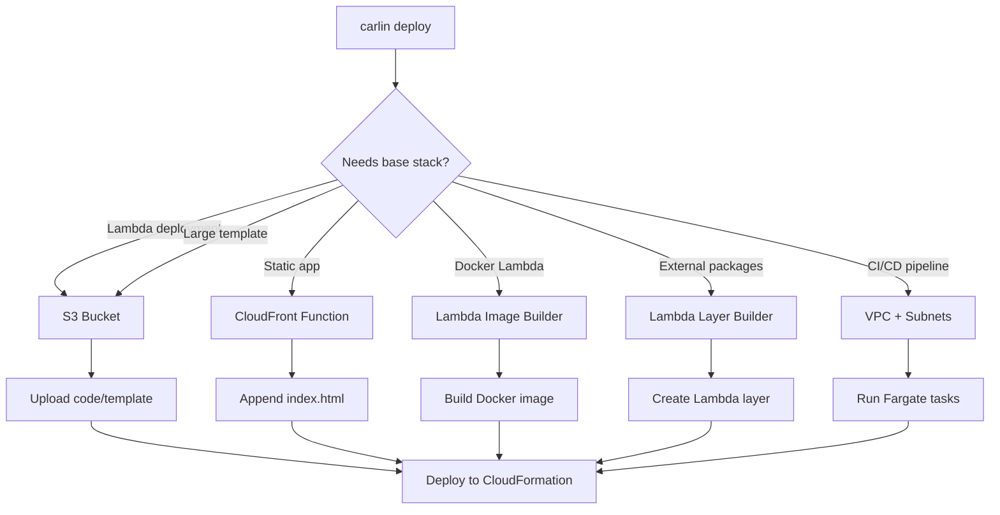

The base stack provides shared infrastructure resources used across multiple carlin deployments. It creates auxiliary resources that enable Lambda deployments, static app hosting, and CI/CD pipelines.

## What is the Base Stack?

The base stack is a CloudFormation stack containing:

- **S3 Bucket**: Stores Lambda code bundles and large CloudFormation templates
- **CloudFront Function**: Appends `index.html` to requests for static websites
- **Lambda Layer Builder**: CodeBuild project for creating Lambda layers
- **Lambda Image Builder**: CodeBuild project for building Docker-based Lambda images
- **VPC**: Network infrastructure for CI/CD Fargate operations

## When to Deploy Base Stack

Deploy the base stack **before** deploying resources that require:

1. **Lambda Functions**: Uploads Lambda code to base stack S3 bucket
2. **Large CloudFormation Templates**: Templates > 51,200 bytes must be stored in S3
3. **Static Websites**: Uses CloudFront function for URL rewriting
4. **Docker-based Lambdas**: Builds and stores container images
5. **Lambda Layers**: Creates optimized layers from external dependencies
6. **CI/CD Pipelines**: Requires VPC for Fargate task execution

## Deploying the Base Stack

Deploy once per AWS region and environment:

```bash
carlin deploy base-stack
```

With environment:

```bash
carlin deploy base-stack --environment production
```

With custom region:

```bash
carlin deploy base-stack --region eu-west-1
```

### Base Stack Naming

The base stack uses a fixed name: `carlin-base-stack-<region>`

Examples:

- `carlin-base-stack-us-east-1`
- `carlin-base-stack-eu-west-1`
- `carlin-base-stack-ap-southeast-1`

This ensures all deployments in the same region share the same base resources.

## Base Stack Resources

### S3 Bucket

Stores Lambda code and CloudFormation templates.

**Use cases**:

- Lambda function code bundles (`.zip` files)
- CloudFormation templates exceeding size limits
- Static website builds (temporary storage before CloudFront deployment)

**Bucket naming**: `carlin-base-stack-<region>-<account-id>-bucket`

**Example**:

```bash
carlin deploy
# Automatically uploads Lambda code to:
# s3://carlin-base-stack-us-east-1-123456789012-bucket/lambda-code/my-function-v1.zip
```

### CloudFront Function

Rewrites URLs to append `index.html` for static websites.

**Behavior**:

- Request: `/docs/guide` → Response: `/docs/guide/index.html`
- Request: `/about` → Response: `/about/index.html`

**Use case**: Deploy Docusaurus, VitePress, or static site generators with clean URLs.

**Example**:

```bash
carlin deploy static-app --append-index-html
# Uses CloudFront function from base stack
```

### Lambda Layer Builder

CodeBuild project for creating Lambda layers from `package.json` dependencies.

**Use case**: Optimize Lambda cold starts by extracting dependencies into layers.

**Example**:

```bash
carlin deploy --lambda-externals aws-sdk,@aws-sdk/client-s3
# Triggers base stack CodeBuild to create layer with specified packages
```

### Lambda Image Builder

CodeBuild project for building Docker images for Lambda functions.

**Use case**: Deploy Lambda functions with custom runtimes or large dependencies (> 250 MB).

**Example**:

```bash
carlin deploy --lambda-dockerfile Dockerfile
# Builds Docker image using base stack CodeBuild
# Pushes to ECR and updates Lambda function
```

### VPC (Virtual Private Cloud)

Network infrastructure for CI/CD Fargate tasks.

**Resources**:

- Public subnets across 2 availability zones
- Internet gateway for outbound connectivity
- Security groups for Fargate tasks

**Use case**: Run CI/CD deployments in isolated network environment.

**Example**:

```bash
carlin deploy cicd
# Creates Fargate tasks in base stack VPC
```

## Base Stack Architecture



## Verifying Base Stack

Check if base stack exists:

```bash
aws cloudformation describe-stacks --stack-name carlin-base-stack-us-east-1
```

List base stack resources:

```bash
aws cloudformation list-stack-resources --stack-name carlin-base-stack-us-east-1
```

Or use carlin:

```bash
carlin deploy base-stack describe
```

## Multi-Region Base Stacks

Deploy base stack to multiple regions for global applications:

```bash
# US East
carlin deploy base-stack --region us-east-1

# Europe
carlin deploy base-stack --region eu-west-1

# Asia Pacific
carlin deploy base-stack --region ap-southeast-1
```

Each region gets an independent base stack with region-specific resources.

## Multi-Environment Base Stacks

For development/staging/production separation, deploy base stacks per environment:

```bash
# Development base stack
carlin deploy base-stack

# Staging base stack
carlin deploy base-stack --environment staging

# Production base stack
carlin deploy base-stack --environment production
```

:::tip
Base stack has termination protection enabled by default to prevent accidental deletion of shared infrastructure.
:::

## Updating the Base Stack

Update base stack when upgrading carlin versions:

```bash
carlin deploy base-stack
```

carlin updates the stack with new resource configurations and features.

## Deleting the Base Stack

:::danger
Deleting the base stack removes shared infrastructure. Ensure no deployments depend on it.
:::

Disable termination protection first:

```bash
aws cloudformation update-termination-protection \
  --stack-name carlin-base-stack-us-east-1 \
  --no-enable-termination-protection
```

Delete the stack:

```bash
aws cloudformation delete-stack --stack-name carlin-base-stack-us-east-1
```

## Cost Considerations

Base stack resources incur AWS charges:

- **S3 Bucket**: Pay for storage (typically minimal for Lambda code)
- **CloudFront Function**: Free tier available, then pay per request
- **CodeBuild**: Pay per build minute (only when building images/layers)
- **VPC**: VPC itself is free; data transfer costs may apply
- **ECR**: Pay for Docker image storage

Estimated cost: **$5-20/month** depending on usage.

## Troubleshooting

### Base Stack Not Found

**Error**: `Base stack not found: carlin-base-stack-us-east-1`

**Solution**: Deploy the base stack:

```bash
carlin deploy base-stack
```

### Lambda Upload Fails

**Error**: `Cannot upload Lambda code to S3`

**Solution**: Verify base stack bucket exists:

```bash
aws s3 ls | grep carlin-base-stack
```

If missing, redeploy base stack:

```bash
carlin deploy base-stack
```

### Wrong Region Base Stack

**Error**: Deployment uses base stack from different region

**Solution**: Ensure base stack exists in deployment region:

```bash
carlin deploy base-stack --region eu-west-1
carlin deploy --region eu-west-1
```

### Permission Errors

**Error**: `Access denied when accessing base stack resources`

**Solution**: Verify IAM permissions for:

- `s3:PutObject`, `s3:GetObject` on base stack bucket
- `cloudformation:DescribeStacks` on base stack
- `codebuild:StartBuild` for image/layer builders

## Best Practices

### 1. Deploy Base Stack First

```bash
# Setup sequence
carlin deploy base-stack --environment production
carlin deploy --environment production
```

### 2. One Base Stack Per Region-Environment

```bash
# Production US
carlin deploy base-stack --environment production --region us-east-1

# Production EU
carlin deploy base-stack --environment production --region eu-west-1

# Staging US
carlin deploy base-stack --environment staging --region us-east-1
```

### 3. Document Base Stack Dependencies

Add to `README.md`:

````markdown
## Prerequisites

Deploy base stack before first deployment:

```bash
carlin deploy base-stack --environment production
```
````

```

### 4. Monitor Base Stack Costs

Set up AWS Cost Explorer alerts for base stack resources to track unexpected charges.

## Related Topics

- [Commands: deploy base-stack](/docs/carlin/commands/deploy-base-stack) - Detailed base stack deployment options
- [Lambda Functions](/docs/carlin/guides/lambda-functions) - Using base stack for Lambda deployments
- [Static Websites](/docs/carlin/guides/static-websites) - Using base stack for static app hosting
- [CI/CD Pipelines](/docs/carlin/guides/cicd-pipelines) - Using base stack VPC for CI/CD
```
