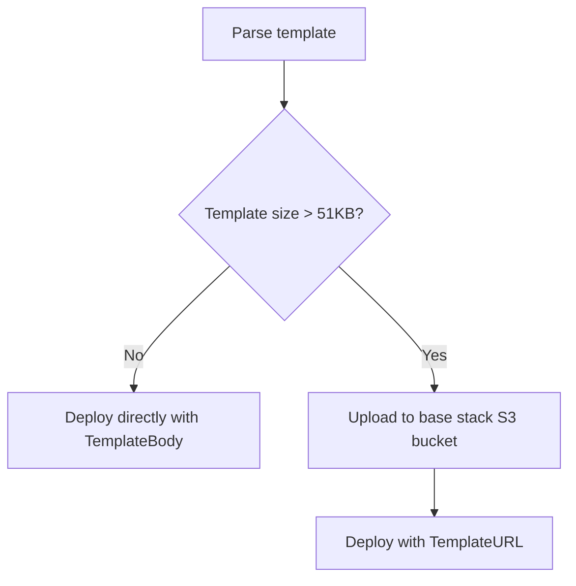

carlin uses CloudFormation templates to define AWS infrastructure. Templates can be written in TypeScript, YAML, or JSON, giving you flexibility in how you define resources.

## Template Formats

### TypeScript Templates (Recommended)

TypeScript templates provide type safety, IDE autocomplete, and dynamic generation:

```typescript
// cloudformation.ts
export const template = {
  Resources: {
    MyBucket: {
      Type: 'AWS::S3::Bucket',
      Properties: {
        BucketName: 'my-app-bucket',
        VersioningConfiguration: {
          Status: 'Enabled',
        },
      },
    },
    MyTable: {
      Type: 'AWS::DynamoDB::Table',
      Properties: {
        TableName: 'my-app-table',
        BillingMode: 'PAY_PER_REQUEST',
        AttributeDefinitions: [{ AttributeName: 'id', AttributeType: 'S' }],
        KeySchema: [{ AttributeName: 'id', KeyType: 'HASH' }],
      },
    },
  },
  Outputs: {
    BucketName: {
      Value: { Ref: 'MyBucket' },
      Export: { Name: 'MyAppBucketName' },
    },
    TableName: {
      Value: { Ref: 'MyTable' },
    },
  },
};
```

### YAML Templates

Standard CloudFormation YAML syntax:

```yaml
# cloudformation.yml
Resources:
  MyBucket:
    Type: AWS::S3::Bucket
    Properties:
      BucketName: my-app-bucket
      VersioningConfiguration:
        Status: Enabled

Outputs:
  BucketName:
    Value: !Ref MyBucket
    Export:
      Name: MyAppBucketName
```

### JSON Templates

Standard CloudFormation JSON syntax:

```json
{
  "Resources": {
    "MyBucket": {
      "Type": "AWS::S3::Bucket",
      "Properties": {
        "BucketName": "my-app-bucket"
      }
    }
  },
  "Outputs": {
    "BucketName": {
      "Value": { "Ref": "MyBucket" }
    }
  }
}
```

## Template Discovery

carlin automatically searches for templates in this order:

1. `cloudformation.ts`
2. `cloudformation.js`
3. `cloudformation.yml`
4. `cloudformation.yaml`
5. `cloudformation.json`
6. `template.yml`
7. `template.yaml`
8. `template.json`

Override with `--template-path`:

```bash
carlin deploy --template-path infrastructure/stack.ts
```

## TypeScript Template Benefits

### 1. Type Safety

```typescript
import { CloudFormationTemplate } from '@ttoss/cloudformation';

export const template: CloudFormationTemplate = {
  Resources: {
    Bucket: {
      Type: 'AWS::S3::Bucket',
      Properties: {
        // TypeScript validates property names
        BucketName: 'my-bucket',
        // Error: 'InvalidProperty' doesn't exist
        // InvalidProperty: 'value',
      },
    },
  },
};
```

### 2. Dynamic Generation

```typescript
const environments = ['dev', 'staging', 'prod'];

export const template = {
  Resources: environments.reduce(
    (acc, env) => ({
      ...acc,
      [`${env}Bucket`]: {
        Type: 'AWS::S3::Bucket',
        Properties: {
          BucketName: `my-app-${env}-bucket`,
        },
      },
    }),
    {}
  ),
};
```

### 3. Code Reusability

```typescript
// utils/resources.ts
export const createBucket = (name: string) => ({
  Type: 'AWS::S3::Bucket',
  Properties: {
    BucketName: name,
    VersioningConfiguration: { Status: 'Enabled' },
    PublicAccessBlockConfiguration: {
      BlockPublicAcls: true,
      BlockPublicPolicy: true,
      IgnorePublicAcls: true,
      RestrictPublicBuckets: true,
    },
  },
});

// cloudformation.ts
import { createBucket } from './utils/resources';

export const template = {
  Resources: {
    AssetsBucket: createBucket('my-app-assets'),
    BackupsBucket: createBucket('my-app-backups'),
  },
};
```

### 4. Environment Variables

```typescript
export const template = {
  Parameters: {
    Environment: {
      Type: 'String',
      Default: process.env.NODE_ENV || 'development',
    },
  },
  Resources: {
    Database: {
      Type: 'AWS::RDS::DBInstance',
      Properties: {
        DBInstanceClass:
          process.env.NODE_ENV === 'production' ? 'db.r5.large' : 'db.t3.micro',
      },
    },
  },
};
```

## Template Structure

### Parameters

Define configurable values:

```typescript
export const template = {
  Parameters: {
    DomainName: {
      Type: 'String',
      Description: 'Domain name for the application',
    },
    InstanceType: {
      Type: 'String',
      Default: 't3.micro',
      AllowedValues: ['t3.micro', 't3.small', 't3.medium'],
    },
  },
  Resources: {
    // Use parameters with Ref
    Instance: {
      Type: 'AWS::EC2::Instance',
      Properties: {
        InstanceType: { Ref: 'InstanceType' },
      },
    },
  },
};
```

Pass parameters during deployment:

```bash
carlin deploy --parameters '{"DomainName":"example.com","InstanceType":"t3.small"}'
```

### Resources

Define AWS resources:

```typescript
export const template = {
  Resources: {
    // S3 Bucket
    Bucket: {
      Type: 'AWS::S3::Bucket',
      Properties: {
        BucketName: 'my-bucket',
      },
    },

    // DynamoDB Table
    Table: {
      Type: 'AWS::DynamoDB::Table',
      Properties: {
        TableName: 'my-table',
        BillingMode: 'PAY_PER_REQUEST',
        AttributeDefinitions: [{ AttributeName: 'id', AttributeType: 'S' }],
        KeySchema: [{ AttributeName: 'id', KeyType: 'HASH' }],
      },
    },

    // Lambda Function
    Function: {
      Type: 'AWS::Lambda::Function',
      Properties: {
        Runtime: 'nodejs20.x',
        Handler: 'index.handler',
        Code: {
          S3Bucket: { Ref: 'LambdaS3Bucket' },
          S3Key: { Ref: 'LambdaS3Key' },
        },
      },
    },
  },
};
```

### Outputs

Export values for use in other stacks or for display:

```typescript
export const template = {
  Resources: {
    Api: {
      Type: 'AWS::ApiGateway::RestApi',
      Properties: {
        Name: 'MyApi',
      },
    },
  },
  Outputs: {
    ApiEndpoint: {
      Description: 'API Gateway endpoint URL',
      Value: {
        'Fn::Sub':
          'https://${Api}.execute-api.${AWS::Region}.amazonaws.com/prod',
      },
      Export: {
        Name: 'MyApiEndpoint', // Can be imported by other stacks
      },
    },
  },
};
```

View outputs after deployment:

```bash
carlin deploy describe
```

### Conditions

Create conditional resources:

```typescript
export const template = {
  Parameters: {
    Environment: {
      Type: 'String',
      AllowedValues: ['development', 'production'],
    },
  },
  Conditions: {
    IsProduction: {
      'Fn::Equals': [{ Ref: 'Environment' }, 'production'],
    },
  },
  Resources: {
    Database: {
      Type: 'AWS::RDS::DBInstance',
      Properties: {
        DBInstanceClass: {
          'Fn::If': ['IsProduction', 'db.r5.large', 'db.t3.micro'],
        },
        MultiAZ: {
          'Fn::If': ['IsProduction', true, false],
        },
      },
    },
  },
};
```

## Lambda Function Handling

carlin automatically builds and deploys Lambda functions when detected in templates.

### Auto-Detected Lambda

```typescript
export const template = {
  Resources: {
    MyFunction: {
      Type: 'AWS::Lambda::Function',
      Properties: {
        Runtime: 'nodejs20.x',
        Handler: 'handler.handler', // Points to src/handler.ts
        Code: {
          S3Bucket: { Ref: 'LambdaS3Bucket' },
          S3Key: { Ref: 'LambdaS3Key' },
          S3ObjectVersion: { Ref: 'LambdaS3ObjectVersion' },
        },
      },
    },
  },
};
```

Create `src/handler.ts`:

```typescript
export const handler = async (event: any) => {
  return {
    statusCode: 200,
    body: JSON.stringify({ message: 'Hello from Lambda!' }),
  };
};
```

carlin automatically:

1. Builds `src/handler.ts` using esbuild
2. Uploads bundle to S3
3. Injects S3 parameters into template
4. Deploys Lambda function

### Custom Lambda Entry Point

```bash
carlin deploy --lambda-entry-points-base-dir functions
```

Template references `functions/handler.ts` instead of `src/handler.ts`.

## Template Size Limits

CloudFormation templates have a 51,200-byte body limit. carlin automatically uploads large templates to S3.

**Automatic handling**:



No configuration needed—carlin handles this automatically.

## Template Validation

Validate templates before deployment:

```bash
aws cloudformation validate-template --template-body file://cloudformation.yml
```

Or deploy in validation mode:

```bash
carlin deploy --dry-run # (if supported)
```

## Best Practices

### 1. Use Parameters for Environment-Specific Values

```typescript
// ✅ Good
export const template = {
  Parameters: {
    DomainName: { Type: 'String' },
  },
  Resources: {
    Distribution: {
      Properties: {
        DomainName: { Ref: 'DomainName' },
      },
    },
  },
};

// ❌ Bad - hardcoded values
export const template = {
  Resources: {
    Distribution: {
      Properties: {
        DomainName: 'production.example.com',
      },
    },
  },
};
```

### 2. Export Important Outputs

```typescript
export const template = {
  Outputs: {
    ApiUrl: {
      Value: { 'Fn::GetAtt': ['Api', 'Url'] },
      Export: { Name: 'MyApiUrl' }, // Other stacks can import this
    },
  },
};
```

### 3. Use TypeScript for Complex Logic

```typescript
const regions = ['us-east-1', 'eu-west-1'];

export const template = {
  Resources: Object.fromEntries(
    regions.map((region) => [
      `Bucket${region.replace(/-/g, '')}`,
      {
        Type: 'AWS::S3::Bucket',
        Properties: {
          BucketName: `my-app-${region}`,
        },
      },
    ])
  ),
};
```

### 4. Organize Large Templates

```typescript
// infrastructure/buckets.ts
export const buckets = {
  AssetsBucket: {
    /* ... */
  },
  BackupsBucket: {
    /* ... */
  },
};

// infrastructure/databases.ts
export const databases = {
  MainTable: {
    /* ... */
  },
  CacheTable: {
    /* ... */
  },
};

// cloudformation.ts
import { buckets } from './infrastructure/buckets';
import { databases } from './infrastructure/databases';

export const template = {
  Resources: {
    ...buckets,
    ...databases,
  },
};
```

### 5. Add Resource Dependencies

```typescript
export const template = {
  Resources: {
    Bucket: {
      Type: 'AWS::S3::Bucket',
    },
    BucketPolicy: {
      Type: 'AWS::S3::BucketPolicy',
      DependsOn: 'Bucket', // Wait for bucket creation
      Properties: {
        Bucket: { Ref: 'Bucket' },
        PolicyDocument: {
          /* ... */
        },
      },
    },
  },
};
```

## Troubleshooting

### Template Validation Errors

**Error**: `Template format error: ...`

**Solution**: Validate syntax:

```bash
aws cloudformation validate-template --template-body file://cloudformation.yml
```

### Parameters Not Working

**Error**: Parameters not being passed to stack

**Solution**: Ensure correct JSON format:

```bash
carlin deploy --parameters '{"Key":"Value"}'
```

### Resource Creation Failed

**Error**: CloudFormation resource creation failed

**Solution**: Check CloudFormation console for detailed error messages and stack events.

## Related Topics

- [Lambda Functions Guide](/docs/carlin/guides/lambda-functions) - Deploying Lambda functions
- [Configuration](/docs/carlin/configuration) - Template path and parameter configuration
- [Commands: deploy](/docs/carlin/commands/deploy) - Template deployment options
