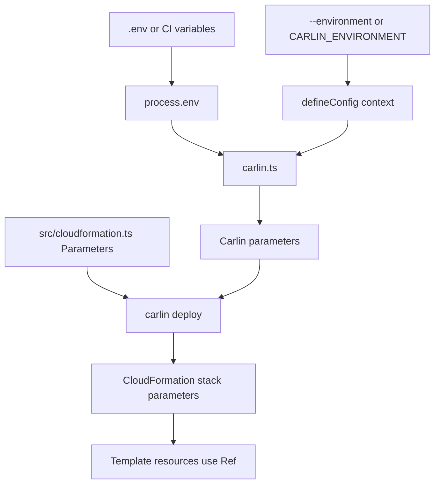

Use `carlin.ts` when deployment values need TypeScript, validation, or secrets from environment variables. The recommended API is `defineConfig` from `carlin/config`.

## Typed Configuration

```typescript
import { defineConfig, requiredEnv } from 'carlin/config';

const values = {
  Staging: {
    domainName: 'api-staging.example.com',
    databaseHost: 'staging.cluster.example.com',
  },
  Production: {
    domainName: 'api.example.com',
    databaseHost: 'production.cluster.example.com',
  },
};

export default defineConfig(({ environment }) => {
  const current = values[environment || 'Staging'];

  return {
    lambdaFormat: 'cjs',
    parameters: {
      DomainName: current.domainName,
      DatabaseHost: current.databaseHost,
      DatabaseUsername: requiredEnv({ name: 'DATABASE_USERNAME' }),
      DatabasePassword: requiredEnv({ name: 'DATABASE_PASSWORD' }),
    },
  };
});
```

`defineConfig` keeps autocomplete for Carlin options and validates the resolved config before deploy. It catches invalid `parameters`, missing parameter values, and invalid `environments` shape early. `requiredEnv` fails fast when a required `.env` or CI variable is missing.

## Configuration Flow



Carlin loads `.env` automatically, so values from `.env` and CI variables are available through `process.env`. Before loading `carlin.ts`, Carlin resolves the deployment context from `--environment`, `--env`, `-e`, `CARLIN_ENVIRONMENT`, or `ENVIRONMENT` and passes it to `defineConfig` function configs.

The object returned by `carlin.ts` becomes the CLI config. During `carlin deploy`, `parameters` are converted into CloudFormation stack parameters. Prefer the object form for ordinary values:

```typescript
parameters: {
  DomainName: 'api.example.com',
  DatabasePort: 5432,
}
```

Use the array form only when you need CloudFormation-specific fields such as `usePreviousValue`:

```typescript
parameters: [
  {
    key: 'DatabasePassword',
    usePreviousValue: true,
  },
];
```

Your template declares the same parameter names and uses `Ref` where resources need the values:

```typescript
export default {
  Parameters: {
    DomainName: { Type: 'String' },
    DatabasePassword: { Type: 'String', NoEcho: true },
  },
  Resources: {
    Function: {
      Type: 'AWS::Lambda::Function',
      Properties: {
        Environment: {
          Variables: {
            DOMAIN_NAME: { Ref: 'DomainName' },
            DATABASE_PASSWORD: { Ref: 'DatabasePassword' },
          },
        },
      },
    },
  },
};
```

Secrets should stay in `.env`, CI secret stores, or existing CloudFormation parameter values. When a secret is passed as a CloudFormation parameter, mark the template parameter with `NoEcho: true`.

## Environment Blocks

You can still use `environments` when you prefer declarative inheritance:

```typescript
import { defineConfig, requiredEnv } from 'carlin/config';

export default defineConfig({
  parameters: {
    DatabasePort: 5432,
  },
  environments: {
    Staging: {
      parameters: {
        DomainName: 'api-staging.example.com',
        DatabasePassword: requiredEnv({ name: 'STAGING_DATABASE_PASSWORD' }),
      },
    },
    Production: {
      parameters: {
        DomainName: 'api.example.com',
        DatabasePassword: requiredEnv({ name: 'PRODUCTION_DATABASE_PASSWORD' }),
      },
    },
  },
});
```

For secrets, prefer the function form when each environment has different required variables. It only reads the variables needed for the selected environment.
