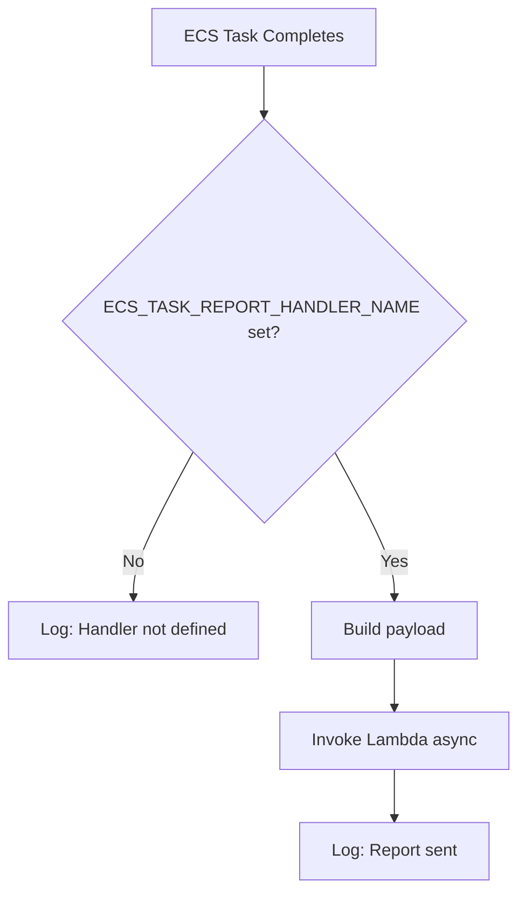

Internal command used by CI/CD ECS tasks to report execution status to a Lambda handler for monitoring, approval workflows, and pipeline orchestration.

:::info
This command is typically invoked automatically within ECS task containers and is not intended for manual use.
:::

## Overview

`cicd-ecs-task-report` sends a status payload to a designated Lambda function (`ECS_TASK_REPORT_HANDLER_NAME`) to track pipeline task outcomes (approved, rejected, or tag detection).

## Use Cases

| Scenario                | Status         | Purpose                           |
| ----------------------- | -------------- | --------------------------------- |
| Manual approval granted | `Approved`     | Trigger next pipeline stage       |
| Manual approval denied  | `Rejected`     | Halt pipeline; send notifications |
| Git tag detected        | `MainTagFound` | Initiate release workflow         |

## Usage

```bash
carlin cicd-ecs-task-report --status <Approved|Rejected|MainTagFound>
```

## Options

| Option     | Type   | Required | Description                                                 |
| ---------- | ------ | -------- | ----------------------------------------------------------- |
| `--status` | string | Yes      | Execution status: `Approved`, `Rejected`, or `MainTagFound` |

## Required Environment Variables

| Variable                       | Purpose                                  |
| ------------------------------ | ---------------------------------------- |
| `ECS_TASK_REPORT_HANDLER_NAME` | Lambda function name to invoke           |
| `ECS_TASK_ARN`                 | (Optional) ARN of the reporting ECS task |
| `PIPELINE_NAME`                | (Optional) Name of the CI/CD pipeline    |

## Event Payload

The command sends a JSON payload to the Lambda handler:

```json
{
  "status": "Approved",
  "ecsTaskArn": "arn:aws:ecs:us-east-1:123456789012:task/cluster/abc123",
  "pipelineName": "production-deploy"
}
```

## Execution Flow



## Example CI/CD Integration

Inside an ECS task entrypoint script:

```bash
#!/usr/bin/env bash
set -euo pipefail

# Run deployment
carlin deploy --environment production

# Report success
if [ $? -eq 0 ]; then
  carlin cicd-ecs-task-report --status Approved
else
  carlin cicd-ecs-task-report --status Rejected
fi
```

## Lambda Handler Pattern

The receiving Lambda might implement:

```typescript
export const handler = async (event: {
  status: 'Approved' | 'Rejected' | 'MainTagFound';
  ecsTaskArn?: string;
  pipelineName?: string;
}) => {
  console.log('Received report:', event);

  switch (event.status) {
    case 'Approved':
      // Trigger next stage
      await triggerNextStage(event.pipelineName);
      break;
    case 'Rejected':
      // Send failure notification
      await notifyFailure(event.pipelineName);
      break;
    case 'MainTagFound':
      // Start release process
      await startRelease(event.ecsTaskArn);
      break;
  }
};
```

## Behavior When Handler Not Set

If `ECS_TASK_REPORT_HANDLER_NAME` is undefined:

- Command logs informational message
- No Lambda invocation occurs
- Command exits successfully (non-blocking)

## IAM Permissions

The ECS task role requires:

```json
{
  "Version": "2012-10-17",
  "Statement": [
    {
      "Effect": "Allow",
      "Action": "lambda:InvokeAsync",
      "Resource": "arn:aws:lambda:*:*:function:*-ecs-task-report-handler"
    }
  ]
}
```

## Troubleshooting

| Issue                  | Cause                                  | Solution                                    |
| ---------------------- | -------------------------------------- | ------------------------------------------- |
| Handler not invoked    | `ECS_TASK_REPORT_HANDLER_NAME` missing | Set environment variable in task definition |
| Lambda not found       | Incorrect function name                | Verify handler deployed and name matches    |
| Permission denied      | Missing IAM policy                     | Add `lambda:InvokeAsync` to task role       |
| Payload missing fields | Environment variables not set          | Set `ECS_TASK_ARN` and `PIPELINE_NAME`      |

## Monitoring

Track report invocations via:

- CloudWatch Logs (ECS task logs)
- Lambda CloudWatch Logs (handler execution)
- X-Ray traces (if enabled on Lambda)

## Best Practices

- Always set `ECS_TASK_REPORT_HANDLER_NAME` for production pipelines
- Include `PIPELINE_NAME` for multi-pipeline observability
- Use `ECS_TASK_ARN` to correlate reports with specific task executions
- Implement idempotent handlers (reports may be retried)

## Related

- [deploy cicd Command](/docs/carlin/commands/deploy-cicd)
- [CI/CD Pipelines Guide](/docs/carlin/guides/cicd-pipelines)
- [Base Stack](/docs/carlin/core-concepts/base-stack)
