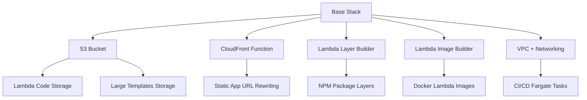
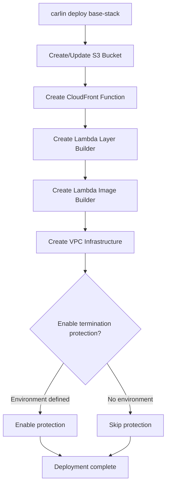

Deploy the base stack—shared infrastructure that supports Lambda deployments, static apps, and CI/CD pipelines.

## Overview

```bash
carlin deploy base-stack
```

This command creates foundational AWS resources used across multiple carlin deployments:

- **S3 Bucket**: Stores Lambda code and large CloudFormation templates
- **CloudFront Function**: URL rewriting for static websites
- **Lambda Layer Builder**: CodeBuild project for creating layers
- **Lambda Image Builder**: CodeBuild project for Docker-based Lambdas
- **VPC**: Network infrastructure for CI/CD operations

## When to Deploy

Deploy base stack **once per region and environment** before:

- Deploying Lambda functions
- Deploying static websites with `--append-index-html`
- Creating Lambda layers
- Using Docker-based Lambda functions
- Setting up CI/CD pipelines

## Quick Start

Deploy base stack to default region:

```bash
carlin deploy base-stack
```

With specific environment:

```bash
carlin deploy base-stack --environment production
```

With custom region:

```bash
carlin deploy base-stack --region eu-west-1
```

## Stack Name

Base stack uses fixed naming: `carlin-base-stack-<region>`

**Examples**:

- `carlin-base-stack-us-east-1`
- `carlin-base-stack-eu-west-1`
- `carlin-base-stack-ap-southeast-1`

This ensures all deployments in the same region share base resources.

## Resources Created

### 1. S3 Bucket

**Purpose**: Store Lambda code bundles and CloudFormation templates

**Bucket name**: `carlin-base-stack-<region>-<account-id>-bucket`

**Usage**:

```bash
carlin deploy # Automatically uploads Lambda code to base stack bucket
```

**Use cases**:

- Lambda function code (`.zip` files)
- CloudFormation templates > 51,200 bytes
- Temporary storage for static app builds

### 2. CloudFront Function

**Purpose**: URL rewriting for static websites

**Function**: Appends `index.html` to request URIs

**Usage**:

```bash
carlin deploy static-app --append-index-html
```

**Behavior**:

- Request: `/docs/guide` → Serves: `/docs/guide/index.html`
- Request: `/about` → Serves: `/about/index.html`

**Use case**: Clean URLs for Docusaurus, VitePress, or static site generators

### 3. Lambda Layer Builder

**Purpose**: CodeBuild project for creating Lambda layers from NPM packages

**Usage**:

```bash
carlin deploy lambda-layer --packages lodash@4.17.21
```

**Process**:

1. Installs NPM packages
2. Creates `nodejs/node_modules/` structure
3. Zips layer contents
4. Uploads to S3
5. Creates Lambda layer version

### 4. Lambda Image Builder

**Purpose**: CodeBuild project for building Docker images for Lambda functions

**Usage**:

```bash
carlin deploy --lambda-dockerfile Dockerfile
```

**Process**:

1. Builds Docker image from Dockerfile
2. Pushes to ECR repository
3. Updates Lambda function with image URI

**Use case**: Lambda functions with custom runtimes or large dependencies (> 250 MB)

### 5. VPC and Networking

**Purpose**: Network infrastructure for CI/CD Fargate tasks

**Components**:

- 2 public subnets (across availability zones)
- Internet gateway
- Route tables
- Security groups

**Usage**:

```bash
carlin deploy cicd
```

**Use case**: Run CI/CD deployments in isolated network environment

## Options

### --region

AWS region for base stack deployment.

```bash
carlin deploy base-stack --region eu-west-1
```

**Default**: `us-east-1`

**Note**: Deploy base stack to each region where you deploy resources.

### --environment

Environment name (enables termination protection).

```bash
carlin deploy base-stack --environment production
```

**Default**: None

**Effect**: Adds termination protection to prevent accidental deletion

## Examples

### Default Deployment

```bash
carlin deploy base-stack
```

Creates base stack in `us-east-1` without environment.

### Production Environment

```bash
carlin deploy base-stack --environment production
```

Creates base stack with termination protection enabled.

### Multi-Region Setup

```bash
# US East
carlin deploy base-stack --region us-east-1 --environment production

# Europe
carlin deploy base-stack --region eu-west-1 --environment production

# Asia Pacific
carlin deploy base-stack --region ap-southeast-1 --environment production
```

### Multi-Environment Setup

```bash
# Development
carlin deploy base-stack

# Staging
carlin deploy base-stack --environment staging

# Production
carlin deploy base-stack --environment production
```

## Architecture



## Deployment Flow



## Verifying Deployment

Check base stack exists:

```bash
aws cloudformation describe-stacks --stack-name carlin-base-stack-us-east-1
```

List base stack resources:

```bash
aws cloudformation list-stack-resources --stack-name carlin-base-stack-us-east-1
```

Or use carlin:

```bash
carlin deploy base-stack describe
```

## Updating Base Stack

Update base stack when upgrading carlin:

```bash
carlin deploy base-stack
```

carlin updates resources with new configurations and features.

## Deleting Base Stack

:::danger
Deleting base stack removes shared infrastructure. Ensure no deployments depend on it.
:::

**Prerequisites**:

1. Delete all dependent stacks (Lambda functions, static apps, CI/CD)
2. Disable termination protection

Disable protection:

```bash
aws cloudformation update-termination-protection \
  --stack-name carlin-base-stack-us-east-1 \
  --no-enable-termination-protection
```

Delete stack:

```bash
aws cloudformation delete-stack --stack-name carlin-base-stack-us-east-1
```

## Cost Considerations

Base stack resources incur AWS charges:

| Resource            | Pricing                          | Estimated Cost |
| ------------------- | -------------------------------- | -------------- |
| S3 Bucket           | $0.023/GB/month storage          | $1-5/month     |
| CloudFront Function | Free tier: 2M requests/month     | $0-2/month     |
| CodeBuild           | $0.005/build minute              | Pay per use    |
| VPC                 | Free (data transfer costs apply) | $0/month       |
| ECR                 | $0.10/GB/month storage           | $1-5/month     |

**Total estimated**: $5-20/month depending on usage

### Cost Optimization

- Delete old Lambda code from S3 bucket
- Remove unused Docker images from ECR
- Use lifecycle policies for S3 objects
- Delete base stack in unused regions

## Multi-Region Strategy

Deploy base stack to regions where you deploy applications:

```bash
# Primary region (US East)
carlin deploy base-stack --region us-east-1 --environment production

# Secondary region (EU West)
carlin deploy base-stack --region eu-west-1 --environment production

# Deploy application to both regions
carlin deploy --region us-east-1 --environment production
carlin deploy --region eu-west-1 --environment production
```

Each region maintains independent base stack resources.

## Troubleshooting

### Base Stack Not Found

**Error**: `Base stack not found: carlin-base-stack-us-east-1`

**Solution**: Deploy base stack:

```bash
carlin deploy base-stack
```

### Cannot Upload Lambda Code

**Error**: `Failed to upload Lambda code to S3`

**Solution**: Verify base stack bucket exists:

```bash
aws s3 ls | grep carlin-base-stack
```

If missing, redeploy base stack:

```bash
carlin deploy base-stack
```

### Wrong Region

**Error**: Using base stack from different region

**Solution**: Deploy base stack in deployment region:

```bash
carlin deploy base-stack --region eu-west-1
carlin deploy --region eu-west-1
```

### Permission Errors

**Error**: Access denied to base stack resources

**Solution**: Ensure IAM permissions:

- `cloudformation:*` for stack operations
- `s3:*` for bucket access
- `codebuild:*` for build projects
- `ec2:*` for VPC resources
- `ecr:*` for Docker image storage

### Termination Protection Enabled

**Error**: Cannot delete stack with termination protection

**Solution**: Disable protection first:

```bash
aws cloudformation update-termination-protection \
  --stack-name carlin-base-stack-us-east-1 \
  --no-enable-termination-protection

aws cloudformation delete-stack --stack-name carlin-base-stack-us-east-1
```

## Best Practices

### 1. Deploy Base Stack First

```bash
# Initial setup
carlin deploy base-stack --environment production

# Then deploy applications
carlin deploy --environment production
```

### 2. One Base Stack Per Region-Environment

```bash
# Production US
carlin deploy base-stack --environment production --region us-east-1

# Production EU
carlin deploy base-stack --environment production --region eu-west-1

# Staging US
carlin deploy base-stack --environment staging --region us-east-1
```

### 3. Enable Termination Protection for Production

```bash
# ✅ Protected production base stack
carlin deploy base-stack --environment production

# ⚠️ Unprotected development base stack
carlin deploy base-stack
```

### 4. Document Base Stack Dependencies

Add to project `README.md`:

````markdown
## Prerequisites

Deploy base stack before first deployment:

```bash
carlin deploy base-stack --environment production
```
````

```

### 5. Monitor Costs

Set up AWS Cost Explorer alerts for base stack resources:

- S3 bucket storage growth
- CodeBuild usage spikes
- ECR image storage

## Related Topics

- [Core Concepts: Base Stack](/docs/carlin/core-concepts/base-stack) - Detailed base stack explanation
- [Commands: deploy](/docs/carlin/commands/deploy) - Lambda deployments using base stack
- [Commands: deploy static-app](/docs/carlin/commands/deploy-static-app) - Static apps using base stack
- [Commands: deploy lambda-layer](/docs/carlin/commands/deploy-lambda-layer) - Layers using base stack builder
```
