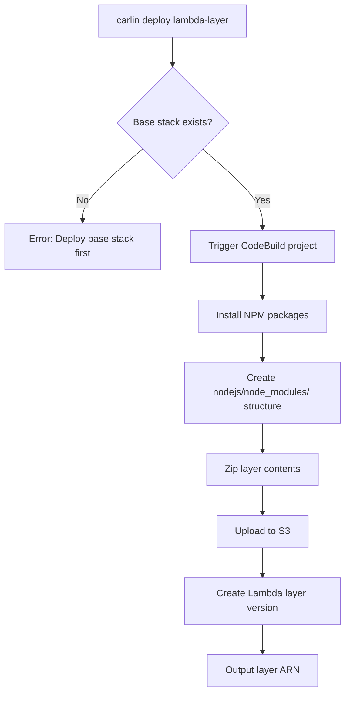

Deploy Lambda layers from NPM packages to optimize function cold starts and share dependencies across multiple Lambda functions.

## Overview

```bash
carlin deploy lambda-layer --packages @aws-sdk/client-s3@3.0.0
```

This command creates Lambda layers from specified NPM packages, enabling you to:

- Reduce Lambda deployment package size
- Share common dependencies across functions
- Improve cold start performance
- Simplify dependency management

## What are Lambda Layers?

Lambda layers allow you to package dependencies separately from function code. Benefits:

- **Smaller deployments**: Function code excludes layer dependencies
- **Faster updates**: Update code without re-uploading dependencies
- **Shared packages**: Multiple functions use the same layer
- **Cold start optimization**: Layers are cached separately

## Quick Start

Deploy AWS SDK as a layer:

```bash
carlin deploy lambda-layer --packages @aws-sdk/client-s3@3.500.0
```

carlin:

1. Creates CodeBuild project in base stack
2. Installs specified packages
3. Builds layer structure (`nodejs/node_modules/`)
4. Uploads to S3
5. Creates Lambda layer version
6. Outputs layer ARN

Use in Lambda function:

```typescript
// cloudformation.ts
export const template = {
  Resources: {
    MyFunction: {
      Type: 'AWS::Lambda::Function',
      Properties: {
        Runtime: 'nodejs20.x',
        Handler: 'index.handler',
        Layers: [
          'arn:aws:lambda:us-east-1:123456789012:layer:aws-sdk-client-s3:1',
        ],
        Code: {
          S3Bucket: { Ref: 'LambdaS3Bucket' },
          S3Key: { Ref: 'LambdaS3Key' },
        },
      },
    },
  },
};
```

## Options

### --packages (required)

NPM packages to include in the layer. Must follow format: `package@version`.

```bash
carlin deploy lambda-layer --packages lodash@4.17.21
```

Multiple packages:

```bash
carlin deploy lambda-layer \
  --packages \
    lodash@4.17.21 \
    axios@1.6.0 \
    dayjs@1.11.10
```

**Package format**: `package-name@version` or `@scope/package@version`

**Examples**:

- `lodash@4.17.21`
- `@aws-sdk/client-s3@3.500.0`
- `axios@^1.6.0` (semver ranges supported)

### --stack-name

Custom stack name for the layer.

```bash
carlin deploy lambda-layer \
  --packages lodash@4.17.21 \
  --stack-name my-utilities-layer
```

**Default**: Auto-generated from package name and branch/environment

## Examples

### Single Package Layer

```bash
carlin deploy lambda-layer --packages dayjs@1.11.10
```

### Multi-Package Utility Layer

```bash
carlin deploy lambda-layer \
  --packages \
    lodash@4.17.21 \
    ramda@0.29.0 \
    date-fns@3.0.0
```

### AWS SDK Layer

```bash
carlin deploy lambda-layer \
  --packages \
    @aws-sdk/client-s3@3.500.0 \
    @aws-sdk/client-dynamodb@3.500.0 \
    @aws-sdk/lib-dynamodb@3.500.0
```

### Environment-Specific Layer

```bash
# Development layer
carlin deploy lambda-layer \
  --packages axios@1.6.0 \
  --environment development

# Production layer (same packages, different version)
carlin deploy lambda-layer \
  --packages axios@1.6.0 \
  --environment production
```

## Layer Structure

carlin creates layers with correct directory structure:

```
layer.zip
└── nodejs/
    └── node_modules/
        ├── lodash/
        ├── axios/
        └── dayjs/
```

This structure is required for Node.js Lambda runtime to find packages.

## Using Layers in Functions

### Reference Layer ARN

After deploying layer, use ARN in Lambda function:

```typescript
export const template = {
  Resources: {
    UtilitiesLayer: {
      Type: 'AWS::Lambda::LayerVersion',
      Properties: {
        LayerName: 'utilities',
        Content: {
          S3Bucket: 'my-layers-bucket',
          S3Key: 'utilities.zip',
        },
        CompatibleRuntimes: ['nodejs20.x'],
      },
    },
    MyFunction: {
      Type: 'AWS::Lambda::Function',
      Properties: {
        Runtime: 'nodejs20.x',
        Handler: 'index.handler',
        Layers: [{ Ref: 'UtilitiesLayer' }],
        Code: {
          /* ... */
        },
      },
    },
  },
};
```

### Import Packages in Code

```typescript
// Function code can import packages from layer
import _ from 'lodash';
import axios from 'axios';
import dayjs from 'dayjs';

export const handler = async (event: any) => {
  const uniqueIds = _.uniq(event.ids);
  const response = await axios.get('https://api.example.com');
  const date = dayjs().format('YYYY-MM-DD');

  return { uniqueIds, response, date };
};
```

## Build Process



## Layer Versioning

Each deployment creates a new layer version:

```bash
# First deployment
carlin deploy lambda-layer --packages lodash@4.17.21
# Output: arn:aws:lambda:us-east-1:123456789012:layer:my-layer:1

# Second deployment (same packages, new version)
carlin deploy lambda-layer --packages lodash@4.17.21
# Output: arn:aws:lambda:us-east-1:123456789012:layer:my-layer:2
```

Lambda functions continue using the version they reference until updated.

## Layer Limits

AWS Lambda layer limits:

- **Layer size (unzipped)**: 250 MB maximum
- **Total deployment package**: 250 MB (function + layers)
- **Layers per function**: 5 maximum
- **Layer versions**: Unlimited (but old versions can be deleted)

## Optimizing Layers

### Group Related Packages

```bash
# ✅ Good: Related utilities together
carlin deploy lambda-layer \
  --packages lodash@4.17.21 ramda@0.29.0

# ❌ Avoid: Mixing unrelated packages
carlin deploy lambda-layer \
  --packages lodash@4.17.21 @aws-sdk/client-s3@3.500.0
```

### Use Specific Versions

```bash
# ✅ Good: Pinned versions for consistency
carlin deploy lambda-layer --packages axios@1.6.0

# ⚠️ Caution: Semver ranges may change
carlin deploy lambda-layer --packages axios@^1.6.0
```

### Minimize Layer Size

```bash
# Check package size before deploying
npm info lodash dist.unpackedSize
# 1.4 MB

# Consider lighter alternatives for large packages
npm info date-fns dist.unpackedSize  # 2.8 MB
npm info dayjs dist.unpackedSize     # 97 KB ✅ Smaller
```

## Sharing Layers Across Stacks

Export layer ARN for use in other stacks:

```typescript
// Layer stack
export const template = {
  Resources: {
    SharedLayer: {
      Type: 'AWS::Lambda::LayerVersion',
      Properties: {
        LayerName: 'shared-utilities',
        Content: {
          /* ... */
        },
      },
    },
  },
  Outputs: {
    LayerArn: {
      Value: { Ref: 'SharedLayer' },
      Export: { Name: 'SharedUtilitiesLayerArn' },
    },
  },
};
```

Import in function stack:

```typescript
// Function stack
export const template = {
  Resources: {
    MyFunction: {
      Type: 'AWS::Lambda::Function',
      Properties: {
        Layers: [{ 'Fn::ImportValue': 'SharedUtilitiesLayerArn' }],
      },
    },
  },
};
```

## Cost Considerations

Lambda layers storage costs:

- **S3 storage**: ~$0.023/GB/month for layer archives
- **Lambda storage**: First 500 MB free, then $0.0000000309/GB-second
- **Layer versions**: Each version consumes storage

**Cost optimization**:

- Delete old layer versions
- Share layers across multiple functions
- Use layers for large dependencies only

## Prerequisites

Deploy base stack before creating layers:

```bash
carlin deploy base-stack
```

Base stack includes CodeBuild project for building layers.

## Troubleshooting

### Base Stack Not Found

**Error**: `Base stack not found`

**Solution**: Deploy base stack first:

```bash
carlin deploy base-stack
carlin deploy lambda-layer --packages lodash@4.17.21
```

### Invalid Package Format

**Error**: `Package name is invalid`

**Solution**: Use correct format `package@version`:

```bash
# ❌ Wrong
carlin deploy lambda-layer --packages lodash

# ✅ Correct
carlin deploy lambda-layer --packages lodash@4.17.21
```

### Package Not Found

**Error**: `npm ERR! 404 Not Found - GET https://registry.npmjs.org/package-name`

**Solution**: Verify package exists on NPM:

```bash
npm info package-name
```

### Layer Too Large

**Error**: `Layer size exceeds 250 MB limit`

**Solution**: Split into multiple layers or exclude dev dependencies:

```bash
# Check package sizes
npm info @aws-sdk/client-s3 dist.unpackedSize

# Split into multiple layers
carlin deploy lambda-layer --packages @aws-sdk/client-s3@3.500.0
carlin deploy lambda-layer --packages @aws-sdk/client-dynamodb@3.500.0
```

## Best Practices

### 1. Version Layers Semantically

```bash
# Use layer stack names with versions
carlin deploy lambda-layer \
  --packages lodash@4.17.21 \
  --stack-name utilities-layer-v1
```

### 2. Document Layer Contents

```typescript
// Document which layer provides which packages
Resources: {
  MyFunction: {
    Properties: {
      Layers: [
        // AWS SDK layer (client-s3, client-dynamodb)
        'arn:aws:lambda:...:layer:aws-sdk:1',
        // Utilities layer (lodash, dayjs)
        'arn:aws:lambda:...:layer:utilities:1',
      ],
    },
  },
}
```

### 3. Update Layers Separately

```bash
# Update layer independently of functions
carlin deploy lambda-layer --packages axios@2.0.0

# Functions continue using old version until updated
```

### 4. Test Layer Compatibility

Test new layer versions before production:

```bash
# Deploy to staging
carlin deploy lambda-layer --packages lodash@5.0.0 --environment staging

# Test functions in staging
# Then deploy to production
carlin deploy lambda-layer --packages lodash@5.0.0 --environment production
```

## Related Topics

- [Base Stack](/docs/carlin/core-concepts/base-stack) - Layer builder CodeBuild project
- [Lambda Functions Guide](/docs/carlin/guides/lambda-functions) - Using layers with functions
- [Commands: deploy](/docs/carlin/commands/deploy) - Lambda function deployment
