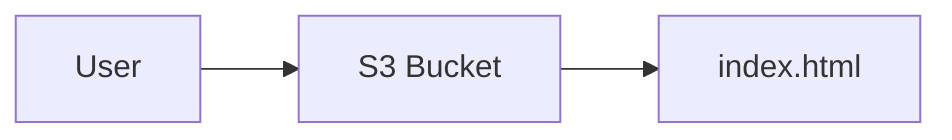
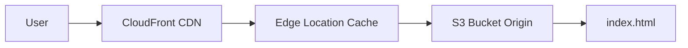
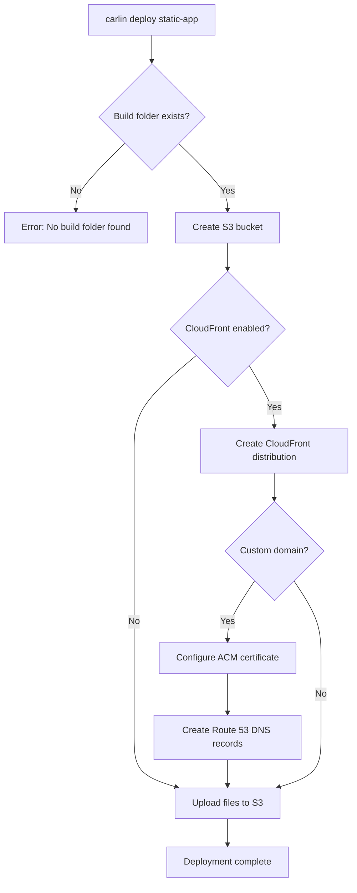

Deploy static websites (React, Vue, Angular, Docusaurus) to S3 with optional CloudFront distribution.

## Overview

```bash
carlin deploy static-app
```

This command:

1. Finds your built static files (`build/`, `dist/`, `.next/`, etc.)
2. Creates S3 bucket for hosting
3. Optionally creates CloudFront distribution
4. Uploads files to S3
5. Configures caching and CDN

## Quick Start

Build and deploy a Vite app:

```bash
# Build your app
pnpm build

# Deploy to S3 only
carlin deploy static-app

# Deploy to S3 + CloudFront
carlin deploy static-app --cloudfront
```

Deploy with custom domain:

```bash
carlin deploy static-app \
  --cloudfront \
  --aliases app.example.com \
  --acm arn:aws:acm:us-east-1:123456789012:certificate/abc123 \
  --hosted-zone-name example.com
```

## Options

### --build-folder

Specify build output folder.

```bash
carlin deploy static-app --build-folder dist
```

**Default**: Auto-detects `build/`, `dist/`, `.next/`, `out/`, or `public/`

### --cloudfront

Create CloudFront distribution.

```bash
carlin deploy static-app --cloudfront
```

**Benefits**:

- Global CDN (faster load times)
- HTTPS support
- Custom domains
- Caching

**Default**: `false` (S3 only)

### --aliases

CloudFront custom domain names (CNAMEs).

```bash
carlin deploy static-app --cloudfront --aliases app.example.com www.app.example.com
```

**Requires**: `--acm` (SSL certificate)

**Related**: [CloudFront Alternate Domain Names](https://docs.aws.amazon.com/AmazonCloudFront/latest/DeveloperGuide/CNAMEs.html)

### --acm

SSL certificate ARN or exported CloudFormation value name.

```bash
# Direct ARN
carlin deploy static-app --acm arn:aws:acm:us-east-1:123456789012:certificate/abc123

# CloudFormation export
carlin deploy static-app --acm MyCertificateArn
```

**Requires**: Certificate in `us-east-1` region for CloudFront

**Related**: [AWS Certificate Manager](https://aws.amazon.com/certificate-manager/)

### --hosted-zone-name

Route 53 hosted zone for automatic DNS configuration.

```bash
carlin deploy static-app \
  --hosted-zone-name example.com \
  --aliases app.example.com
```

carlin automatically creates DNS records pointing aliases to CloudFront distribution.

**Example**: For hosted zone `example.com` and alias `app.example.com`, carlin creates A record `app.example.com` → CloudFront.

### --append-index-html

Append `index.html` to request URIs (for Docusaurus, VitePress, static site generators).

```bash
carlin deploy static-app --append-index-html
```

**Behavior**:

- Request: `/docs/guide` → Serves: `/docs/guide/index.html`
- Request: `/about` → Serves: `/about/index.html`

**Use case**: Clean URLs without `.html` extension

### --spa

Enable Single Page Application (SPA) mode.

```bash
carlin deploy static-app --spa
```

**Behavior**: All 404 errors serve `index.html` (for client-side routing)

**Use case**: React Router, Vue Router, Angular Router

### --skip-upload

Update CloudFormation without uploading files.

```bash
carlin deploy static-app --skip-upload
```

**Use case**: Update CloudFront configuration without re-uploading files

### --region

:::note
Static app deployments always use `us-east-1` (CloudFront requirement). This option is ignored.
:::

## Examples

### Vite/React App

```bash
# Build
pnpm build

# Deploy with CloudFront and custom domain
carlin deploy static-app \
  --cloudfront \
  --spa \
  --aliases app.example.com \
  --acm arn:aws:acm:us-east-1:123456789012:certificate/abc123 \
  --hosted-zone-name example.com
```

### Docusaurus Documentation

```bash
# Build
pnpm build

# Deploy with clean URLs
carlin deploy static-app \
  --cloudfront \
  --append-index-html \
  --aliases docs.example.com \
  --acm arn:aws:acm:us-east-1:123456789012:certificate/abc123
```

### Next.js Static Export

```bash
# Build static export
pnpm build

# Deploy
carlin deploy static-app \
  --build-folder out \
  --cloudfront \
  --spa
```

### Multi-Environment Deployment

```bash
# Staging
carlin deploy static-app \
  --environment staging \
  --cloudfront \
  --aliases staging.app.example.com

# Production
carlin deploy static-app \
  --environment production \
  --cloudfront \
  --aliases app.example.com www.app.example.com
```

## Architecture

### S3 Only



**Pros**: Simple, low cost
**Cons**: No CDN, no HTTPS, slower for global users

### S3 + CloudFront



**Pros**: Fast globally, HTTPS, custom domains, caching
**Cons**: Slightly higher cost

## Deployment Flow



## SSL Certificate Setup

Create SSL certificate in AWS Certificate Manager (must be in `us-east-1`):

```bash
# Request certificate
aws acm request-certificate \
  --domain-name app.example.com \
  --subject-alternative-names www.app.example.com \
  --validation-method DNS \
  --region us-east-1

# Note the certificate ARN
# arn:aws:acm:us-east-1:123456789012:certificate/abc123
```

Validate certificate via DNS or email, then use ARN in deployment:

```bash
carlin deploy static-app \
  --acm arn:aws:acm:us-east-1:123456789012:certificate/abc123 \
  --aliases app.example.com
```

## Caching Strategy

CloudFront caches files based on file type:

- **HTML files**: No cache (always fetch latest)
- **JS/CSS/Images**: Long cache (1 year) with content hash in filename

**Recommended build setup** (Vite example):

```typescript
// vite.config.ts
export default {
  build: {
    rollupOptions: {
      output: {
        entryFileNames: 'assets/[name].[hash].js',
        chunkFileNames: 'assets/[name].[hash].js',
        assetFileNames: 'assets/[name].[hash].[ext]',
      },
    },
  },
};
```

## Updating Deployments

Update files:

```bash
pnpm build
carlin deploy static-app
```

carlin uploads changed files and invalidates CloudFront cache automatically.

Update CloudFront configuration only:

```bash
carlin deploy static-app --skip-upload
```

## Cost Considerations

### S3 Only

- **Storage**: ~$0.023/GB/month
- **Requests**: $0.0004 per 1,000 GET requests
- **Data transfer**: $0.09/GB (first 10 TB)

**Estimated**: $1-5/month for small apps

### S3 + CloudFront

- **CloudFront requests**: $0.0075 per 10,000 requests
- **CloudFront data transfer**: $0.085/GB (first 10 TB)
- **S3 storage**: Same as above

**Estimated**: $5-20/month for small apps

## Troubleshooting

### Build Folder Not Found

**Error**: `Build folder not found`

**Solution**: Build your app first or specify folder:

```bash
pnpm build
carlin deploy static-app --build-folder dist
```

### Certificate Not in us-east-1

**Error**: `Certificate must be in us-east-1 region`

**Solution**: Create certificate in `us-east-1`:

```bash
aws acm request-certificate --region us-east-1 --domain-name app.example.com
```

### CloudFront Propagation Delay

**Problem**: Changes take 15-30 minutes to appear globally

**Solution**: This is normal CloudFront behavior. Wait for distribution deployment to complete.

Check status:

```bash
aws cloudfront list-distributions
```

### SPA Routes Return 404

**Problem**: Client-side routes (e.g., `/about`, `/contact`) return 404

**Solution**: Use `--spa` flag:

```bash
carlin deploy static-app --spa
```

## Related Topics

- [Base Stack](/docs/carlin/core-concepts/base-stack) - CloudFront function for `--append-index-html`
- [Static Websites Guide](/docs/carlin/guides/static-websites) - Complete static app deployment guide
- [Environments](/docs/carlin/core-concepts/environments) - Multi-environment deployments
