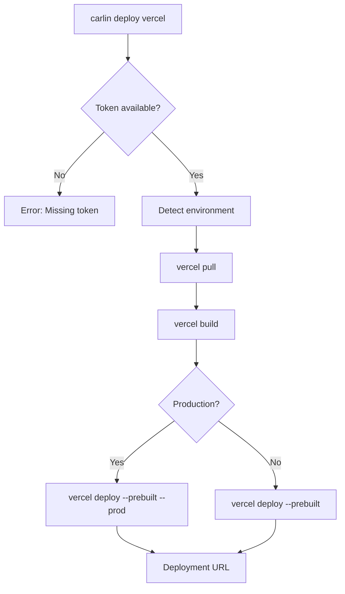

Deploy applications to Vercel using the Vercel CLI with environment-specific configuration and automatic build orchestration.

## Overview

`carlin deploy vercel` wraps the Vercel CLI to:

- Pull environment variables and project settings
- Build the project locally
- Deploy prebuilt output to Vercel

This command is useful for integrating Vercel deployments into existing carlin-based CI/CD workflows.

## Prerequisites

- Vercel account and project configured
- Vercel token (obtained from [Vercel account settings](https://vercel.com/account/tokens))
- `vercel` CLI installed (automatically used by carlin)

## Usage

```bash
carlin deploy vercel --token <VERCEL_TOKEN>
```

Or set token via environment variable:

```bash
export VERCEL_TOKEN=your_token_here
carlin deploy vercel
```

## Options

| Option    | Type   | Description                                                      |
| --------- | ------ | ---------------------------------------------------------------- |
| `--token` | string | Vercel authorization token (can also use `VERCEL_TOKEN` env var) |

## Execution Flow



## Environment Mapping

carlin environment detection maps to Vercel environments:

| carlin Environment | Vercel Environment | Production Flag |
| ------------------ | ------------------ | --------------- |
| `Production`       | `production`       | `--prod`        |
| Others             | `preview`          | (none)          |

## Examples

### Basic Deployment

```bash
carlin deploy vercel --token abc123xyz
```

### CI/CD Integration

```yaml
# GitHub Actions example
- name: Deploy to Vercel
  env:
    VERCEL_TOKEN: ${{ secrets.VERCEL_TOKEN }}
  run: carlin deploy vercel
```

### Multi-Environment Setup

```bash
# Preview environment
export ENVIRONMENT=staging
carlin deploy vercel --token $VERCEL_TOKEN

# Production environment
export ENVIRONMENT=Production
carlin deploy vercel --token $VERCEL_TOKEN
```

## Vercel CLI Steps Executed

1. **Pull**: `vercel pull --yes --environment=<env> --token=<token>`
   - Downloads project settings and environment variables

2. **Build**: `vercel build [--prod] --token=<token>`
   - Builds project locally using Vercel build pipeline

3. **Deploy**: `vercel deploy --prebuilt [--prod] --token=<token>`
   - Deploys prebuilt output to Vercel

## Project Configuration

Ensure `vercel.json` or project settings define:

```json
{
  "buildCommand": "pnpm build",
  "outputDirectory": "dist",
  "framework": "vite"
}
```

## Environment Variables

Vercel environment variables are pulled automatically. Define them in:

- Vercel dashboard → Project Settings → Environment Variables
- `.env` files (for local development)

## Troubleshooting

| Issue                      | Cause                                           | Solution                               |
| -------------------------- | ----------------------------------------------- | -------------------------------------- |
| Missing token error        | No `--token` or `VERCEL_TOKEN`                  | Set token via CLI or env var           |
| Build fails                | Missing dependencies or incorrect build command | Check `vercel.json` buildCommand       |
| Deployment hangs           | Network issues or large bundle                  | Retry; consider optimizing bundle size |
| Wrong environment deployed | Environment detection mismatch                  | Explicitly set `ENVIRONMENT` variable  |

## Best Practices

- **Store tokens securely**: Use GitHub Secrets or AWS Parameter Store
- **Separate environments**: Use Vercel preview deployments for non-production
- **Optimize builds**: Enable caching in Vercel project settings
- **Monitor deployments**: Check Vercel dashboard for deployment logs

## Limitations

- Destroy operation not yet implemented
- Relies on Vercel CLI availability
- Token must have project access permissions

## Related

- [deploy cicd Command](/docs/carlin/commands/deploy-cicd)
- [Static Websites Guide](/docs/carlin/guides/static-websites)
- [Multi-Environment Setup](/docs/carlin/guides/multi-environment-setup)
- [Vercel CLI Documentation](https://vercel.com/docs/cli)
