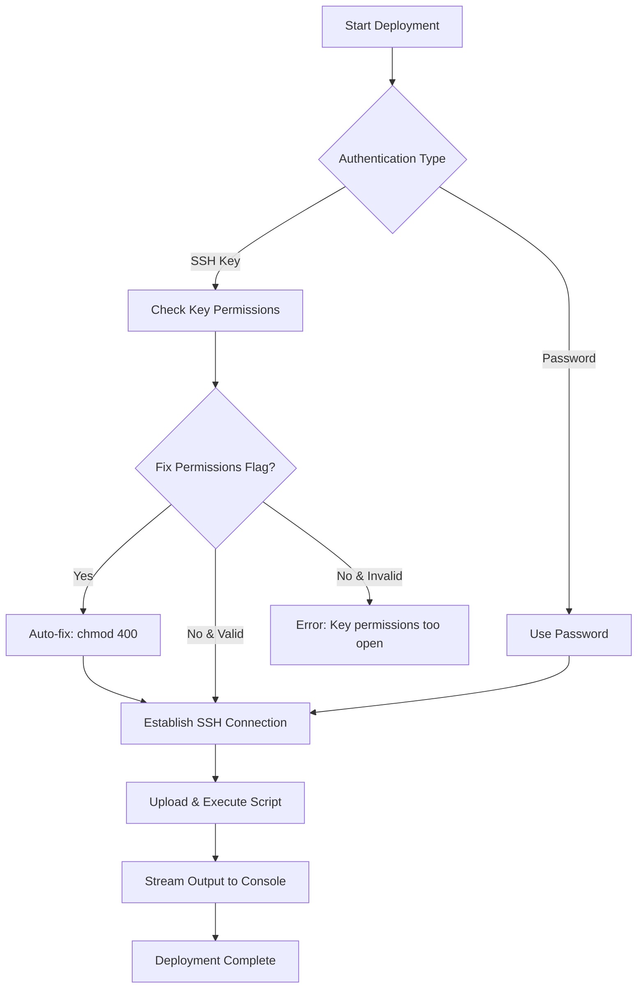

## Overview

Deploy scripts to remote Virtual Machines via SSH with automated file transfer, permission management, and execution orchestration.

```bash
carlin deploy vm --user-name ubuntu --host 192.168.1.100 --script-path ./deploy.sh --key-path ~/.ssh/my-key.pem
```

## What It Does

The VM deployment command:

- Establishes secure SSH connections using key-based or password authentication
- Transfers deployment scripts to the target VM
- Optionally fixes SSH key file permissions if they're too open (when using key-based auth)
- Executes scripts remotely and streams output
- Provides detailed logging for troubleshooting

## Use Cases

- Deploy application updates to VMs without manual SSH sessions
- Execute maintenance scripts across multiple servers
- Automate configuration management tasks
- Orchestrate multi-step deployment workflows

## Requirements

- **Carlin**: Version 1.40.0 or higher (feature currently in development)
- **Node.js**: Version 24.x or higher
- **Network Access**: SSH connectivity to target VM (port 22 by default)
- **Authentication**: Valid SSH key or password credentials
- **VM Access**: User account with appropriate permissions on target VM

## Quick Examples

### Deploy With SSH Key

```bash
carlin deploy vm \
  --user-name ubuntu \
  --host 10.0.1.50 \
  --script-path ./scripts/deploy-app.sh \
  --key-path ~/.ssh/production.pem
```

### Deploy With Password Authentication

```bash
carlin deploy vm \
  --user-name root \
  --host example.com \
  --script-path ./deploy.sh \
  --password $DEPLOY_PASSWORD
```

### Deploy With Custom Port and SSH Key Permission Fix

```bash
carlin deploy vm \
  --user-name deploy \
  --host 192.168.1.100 \
  --port 2222 \
  --script-path ./deploy.sh \
  --key-path ~/.ssh/deploy-key \
  --fix-permissions
```

## Common Options

| Option              | Type      | Required | Default | Description                                       |
| ------------------- | --------- | -------- | ------- | ------------------------------------------------- |
| `--user-name`       | `string`  | ✅       | -       | SSH username for VM authentication                |
| `--host`            | `string`  | ✅       | -       | VM hostname or IP address                         |
| `--script-path`     | `string`  | ✅       | -       | Local path to deployment script                   |
| `--key-path`        | `string`  | ⚠️       | -       | Path to SSH private key (required if no password) |
| `--password`        | `string`  | ⚠️       | -       | SSH password (required if no key)                 |
| `--port`            | `number`  | ❌       | `22`    | SSH port number                                   |
| `--fix-permissions` | `boolean` | ❌       | `false` | Automatically fix SSH key file permissions if too open |

**Authentication Note**: Provide either `--key-path` or `--password`, not both.

## Execution Flow



## Security Best Practices

- **Use SSH Keys**: Prefer key-based authentication over passwords for production deployments
- **Restrict Key Access**: Set proper file permissions on private keys (`chmod 600`)
- **Principle of Least Privilege**: Use dedicated deployment users with minimal required permissions
- **Secure Password Storage**: Never hardcode passwords; use environment variables or secure vaults
- **Audit Logs**: Enable SSH logging on target VMs for security monitoring
- **Network Isolation**: Deploy through bastion hosts or VPNs for production environments

## Troubleshooting

| Issue                             | Cause                              | Fix                                                                                                                                      |
| --------------------------------- | ---------------------------------- | ---------------------------------------------------------------------------------------------------------------------------------------- |
| `Permission denied (publickey)`   | SSH key not authorized             | Add public key to `~/.ssh/authorized_keys` on VM                                                                                         |
| `Connection refused`              | SSH service not running / firewall | Verify SSH daemon status; check security group rules                                                                                     |
| `Script not found`                | Invalid local path                 | Verify `--script-path` points to existing file                                                                                           |
| `Invalid SSH key permissions`     | SSH key file permissions too open  | Use `--fix-permissions` flag or manually run `chmod 400 ~/.ssh/your-key.pem`                                                             |
| `Permission denied` on execute    | Script not executable on remote VM | Ensure script has shebang line (e.g., `#!/bin/bash`) or manually SSH and run `chmod +x` on the uploaded script                          |
| `Host key verification failed`    | SSH host key not trusted           | Verify the VM's SSH host key fingerprint and add it to `~/.ssh/known_hosts` (for example using `ssh` or `ssh-keyscan`); do not disable host key checking |
| `Connection timeout`              | Network unreachable / wrong port   | Verify host reachability; check `--port` value                                                                                           |

## Integration With CI/CD

Automate VM deployments in your pipeline:

```yaml
# GitHub Actions example
- name: Deploy to VM
  env:
    SSH_KEY: ${{ secrets.DEPLOY_KEY }}
  run: |
    echo "$SSH_KEY" > deploy-key.pem
    carlin deploy vm \
      --user-name ubuntu \
      --host ${{ secrets.VM_HOST }} \
      --script-path ./scripts/deploy.sh \
      --key-path ./deploy-key.pem \
      --fix-permissions
    rm deploy-key.pem
```

## Script Requirements

Your deployment script should:

- Include shebang line (e.g., `#!/bin/bash`)
- Handle errors gracefully with proper exit codes
- Log important operations for debugging
- Be idempotent when possible (safe to run multiple times)

**Example deployment script:**

```bash
#!/bin/bash
set -euo pipefail

echo "Starting deployment..."

# Pull latest code
cd /var/www/app
git pull origin main

# Install dependencies
npm ci

# Restart service
sudo systemctl restart app

echo "Deployment completed successfully!"
```

## Advanced Usage

### Multiple VM Deployments

Deploy to multiple VMs sequentially:

```bash
for host in vm1.example.com vm2.example.com vm3.example.com; do
  carlin deploy vm \
    --user-name deploy \
    --host "$host" \
    --script-path ./deploy.sh \
    --key-path ~/.ssh/deploy-key
done
```

### Automatic SSH Key Permission Fixing

The `--fix-permissions` flag automatically fixes SSH private key file permissions if they're too open (not 400 or 600). This is useful when deploying from CI/CD environments where key files may be created with default permissions:

```bash
carlin deploy vm \
  --user-name ubuntu \
  --host 10.0.1.50 \
  --script-path ./deploy.sh \
  --key-path ~/.ssh/key.pem \
  --fix-permissions
```

**Note**: This flag only affects the **local SSH key file** permissions, not the script permissions on the remote VM. If your deployment script needs execution permissions on the remote VM, ensure it includes a proper shebang line (e.g., `#!/bin/bash`).

## Related Commands

- [deploy cicd](/docs/carlin/commands/deploy-cicd) - Automate deployments using serverless CI/CD
- [Base Stack](/docs/carlin/commands/deploy-base-stack) - Foundation for cloud infrastructure
- [generate-env](/docs/carlin/commands/generate-env) - Generate environment files for deployments
