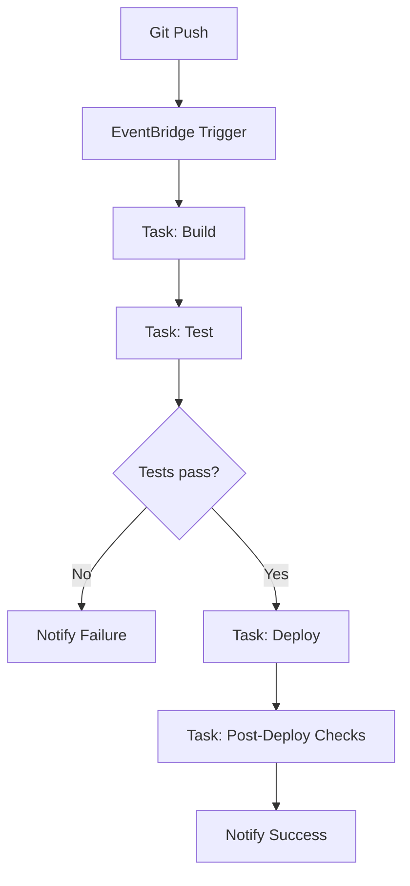

Design and deploy serverless CI/CD pipelines using `carlin deploy cicd` with Fargate task execution, on-demand resource usage, and artifact generation.

## Overview

Instead of maintaining persistent runners, carlin provisions ephemeral compute (Fargate tasks) triggered by GitHub events or schedules to run builds, tests, migrations, and deployment steps.

## Core Components

| Component            | Purpose                                      |
| -------------------- | -------------------------------------------- |
| EventBridge Rules    | Trigger pipeline tasks (push, tag, schedule) |
| Fargate Tasks        | Execute pipeline commands on demand          |
| ECR Image (optional) | Pre-baked environment (Node, tools)          |
| VPC + SG             | Secure network runtime                       |
| Log Groups           | Observability and failure analysis           |
| S3 (optional)        | Artifact storage (coverage, bundles)         |

## Pipeline Trigger Patterns

| Pattern        | Example           | Use Case                     |
| -------------- | ----------------- | ---------------------------- |
| Branch Push    | `main`, `staging` | Continuous deployment        |
| Tag Push       | `v*`              | Release version packaging    |
| Cron Schedule  | `rate(1 day)`     | Nightly security scans       |
| Manual Trigger | API / CLI         | On-demand infrastructure ops |

## Recommended Image (Dockerfile)

```Dockerfile
FROM node:20-alpine
RUN apk add --no-cache bash git openssh
WORKDIR /workspace
COPY package.json pnpm-lock.yaml ./
RUN corepack enable && pnpm install --frozen-lockfile
COPY . .
ENV CI=true
ENTRYPOINT ["bash", "./ci/entrypoint.sh"]
```

Example `ci/entrypoint.sh`:

```bash
#!/usr/bin/env bash
set -euo pipefail

case "${PIPELINE_STEP:-build}" in
  build)
    pnpm build
    ;;
  test)
    pnpm test -- --ci --reporters=default --reporters=jest-junit
    ;;
  deploy)
    carlin deploy --environment production
    ;;
  migrate)
    node scripts/migrate.js
    ;;
  *)
    echo "Unknown PIPELINE_STEP=$PIPELINE_STEP"; exit 1
    ;;
fi
```

## Passing Pipeline Parameters

Use task environment variables for dynamic behavior:

| Variable        | Purpose                                             |
| --------------- | --------------------------------------------------- |
| `PIPELINE_STEP` | Select stage (`build`, `test`, `deploy`, `migrate`) |
| `STACK_NAME`    | Override deployment target                          |
| `ENVIRONMENT`   | Set deployment environment                          |
| `BRANCH`        | Inject git branch context                           |

## Multi-Step Pipeline Strategy

Break pipeline into discrete Fargate tasks for reliability & isolation:



## Artifact Handling

Store outputs in S3 or emit via logs:

```bash
# Inside entrypoint
if [ -d coverage ]; then
  aws s3 sync coverage "s3://$ARTIFACT_BUCKET/coverage/$BRANCH/" --delete
fi
```

Version control build artifacts:

```bash
aws s3 cp dist "s3://$ARTIFACT_BUCKET/builds/$BRANCH/$GIT_SHA/" --recursive
```

## Example GitHub Workflow (Hybrid Model)

Use GitHub for orchestration; offload heavy tasks:

```yaml
name: Hybrid CI
on:
  push:
    branches: [main, staging]

jobs:
  build-test-deploy:
    runs-on: ubuntu-latest
    steps:
      - name: Start Build Task
        run:
          aws ecs run-task --cluster carlin-cicd --task carlin-ci --launch-type FARGATE \
          --overrides '{"containerOverrides":[{"name":"ci","environment":[{"name":"PIPELINE_STEP","value":"build"}]}]}'
      - name: Start Test Task
        run:
          aws ecs run-task --cluster carlin-cicd --task carlin-ci --launch-type FARGATE \
          --overrides '{"containerOverrides":[{"name":"ci","environment":[{"name":"PIPELINE_STEP","value":"test"}]}]}'
      - name: Start Deploy Task
        if: github.ref == 'refs/heads/main'
        run:
          aws ecs run-task --cluster carlin-cicd --task carlin-ci --launch-type FARGATE \
          --overrides '{"containerOverrides":[{"name":"ci","environment":[{"name":"PIPELINE_STEP","value":"deploy"},{"name":"ENVIRONMENT","value":"production"}]}]}'
```

## Observability

Create CloudWatch alarms for pipeline reliability:

```json
{
  "AlarmName": "CI-Failures",
  "MetricName": "Errors",
  "Namespace": "AWS/ECS",
  "Dimensions": [{ "Name": "ClusterName", "Value": "carlin-cicd" }],
  "Statistic": "Sum",
  "Period": 300,
  "EvaluationPeriods": 1,
  "Threshold": 1,
  "ComparisonOperator": "GreaterThanOrEqualToThreshold"
}
```

## Scaling Considerations

| Scenario                   | Solution                                |
| -------------------------- | --------------------------------------- |
| Heavy parallel test suites | Increase Fargate task CPU/memory        |
| High frequency triggers    | Add branch filtering / debounce logic   |
| Large dependency installs  | Pre-bake image with dependencies        |
| Long-running builds        | Use larger Fargate sizes or split tasks |

## Security Practices

- Restrict IAM role to required AWS services (CloudFormation, S3, ECS only)
- Use read-only roles for test stages, privileged for deploy stages
- Encrypt S3 artifact bucket + enforce SSL
- Avoid embedding secrets; inject via Parameter Store or Secrets Manager

## Failure Handling

| Failure Type      | Mitigation                                           |
| ----------------- | ---------------------------------------------------- |
| Build fails       | Fail fast; notify channel (Slack webhook)            |
| Tests flaky       | Isolate problematic suites; rerun selectively        |
| Deploy fails      | Roll back via CloudFormation previous stack revision |
| Artifacts missing | Verify bucket permissions; add existence checks      |
| Task timeout      | Increase Fargate timeout or split step               |

## Cost Optimization

- Use smallest viable Fargate configuration (e.g., 0.5 vCPU / 1GB for light builds)
- Consolidate tasks when overhead cost > execution savings
- Clean up old artifacts with lifecycle rules (e.g., expire after 30 days)
- Prefer pre-built images to reduce repeated dependency installation time

## Promotion Workflow

```mermaid
flowchart TD
    A[Feature Task (Build/Test)] --> B[Merge]
    B --> C[Staging Pipeline]
    C --> D[Manual Approval?]
    D -->|Approved| E[Production Pipeline]
    E --> F[Post-Deploy Verification]
    F --> G[Notify Success]
```

## Checklist

- [ ] Base stack deployed
- [ ] CICD stack deployed
- [ ] Image built / ECR repo available
- [ ] Branch filters defined
- [ ] Environment variables documented
- [ ] Artifact bucket + lifecycle policy configured
- [ ] Alarms set for failure detection
- [ ] Secrets stored securely

## Related

- [deploy cicd Command](/docs/carlin/commands/deploy-cicd)
- [Base Stack](/docs/carlin/core-concepts/base-stack)
- [Lambda Functions Guide](/docs/carlin/guides/lambda-functions)
- [Multi-Environment Setup](/docs/carlin/guides/multi-environment-setup)
