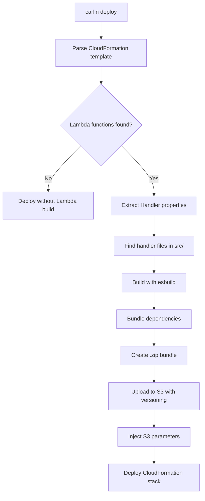

Complete guide for deploying Lambda functions with carlin, from basic setup to advanced patterns.

## Overview

carlin automates Lambda function deployment by detecting functions in CloudFormation templates, building code with esbuild, uploading to S3, and injecting parameters automatically.

## Quick Start

### 1. Create Lambda Handler

Create handler function:

```typescript
// src/api/handler.ts
export const handler = async (event: any) => {
  return {
    statusCode: 200,
    body: JSON.stringify({
      message: 'Hello from Lambda!',
      timestamp: new Date().toISOString(),
    }),
  };
};
```

### 2. Define CloudFormation Template

```typescript
// cloudformation.ts
export const template = {
  Resources: {
    ApiFunction: {
      Type: 'AWS::Lambda::Function',
      Properties: {
        Runtime: 'nodejs20.x',
        Handler: 'api/handler.handler', // Points to src/api/handler.ts
        MemorySize: 1024,
        Timeout: 30,
        Code: {
          S3Bucket: { Ref: 'LambdaS3Bucket' },
          S3Key: { Ref: 'LambdaS3Key' },
          S3ObjectVersion: { Ref: 'LambdaS3ObjectVersion' },
        },
      },
    },
  },
};
```

### 3. Deploy

```bash
carlin deploy
```

carlin automatically:

1. ✅ Finds `src/api/handler.ts` based on `Handler` property
2. ✅ Builds code with esbuild (bundles dependencies)
3. ✅ Uploads to S3 with versioning
4. ✅ Injects S3 parameters (`LambdaS3Bucket`, `LambdaS3Key`, `LambdaS3ObjectVersion`)
5. ✅ Deploys Lambda function

## Handler Property Format

The `Handler` property must follow: `path/to/file.exportedFunction`

**Examples**:

| Handler Value              | File Path           | Export Name                  |
| -------------------------- | ------------------- | ---------------------------- |
| `handler.handler`          | `src/handler.ts`    | `export const handler`       |
| `api/users.createUser`     | `src/api/users.ts`  | `export const createUser`    |
| `auth/index.validateToken` | `src/auth/index.ts` | `export const validateToken` |

**Base directory**: Defaults to `src/`. Change with `--lambda-entry-points-base-dir`:

```bash
carlin deploy --lambda-entry-points-base-dir functions
# Now Handler: 'api/users.createUser' → functions/api/users.ts
```

## Automatic S3 Parameters

carlin injects these parameters into your template:

```typescript
Parameters: {
  LambdaS3Bucket: { Type: 'String' },
  LambdaS3Key: { Type: 'String' },
  LambdaS3ObjectVersion: { Type: 'String' },
}
```

Use them in Lambda `Code` property:

```typescript
Code: {
  S3Bucket: { Ref: 'LambdaS3Bucket' },
  S3Key: { Ref: 'LambdaS3Key' },
  S3ObjectVersion: { Ref: 'LambdaS3ObjectVersion' },
}
```

Or omit `Code` entirely—carlin sets it automatically.

## Build Process



## Code Bundling

carlin uses esbuild to bundle Lambda code with optimizations:

- **Tree shaking**: Removes unused code
- **Minification**: Reduces bundle size
- **ESM output**: Modern JavaScript modules
- **TypeScript**: Automatic compilation
- **Source maps**: Optional debugging support

### Bundle Configuration

Default esbuild config:

```typescript
{
  bundle: true,
  platform: 'node',
  target: 'node20',
  format: 'esm',
  minify: true,
  sourcemap: false,
  external: ['@aws-sdk/*'], // AWS SDK excluded by default
}
```

Override with `--lambda-format`:

```bash
carlin deploy --lambda-format cjs  # CommonJS output
carlin deploy --lambda-format esm  # ES Modules (default)
```

## Multiple Lambda Functions

Deploy multiple functions in one template:

```typescript
export const template = {
  Resources: {
    CreateUserFunction: {
      Type: 'AWS::Lambda::Function',
      Properties: {
        Handler: 'users/create.handler',
        Runtime: 'nodejs20.x',
        Code: {
          S3Bucket: { Ref: 'LambdaS3Bucket' },
          S3Key: { Ref: 'LambdaS3Key' },
        },
      },
    },
    GetUserFunction: {
      Type: 'AWS::Lambda::Function',
      Properties: {
        Handler: 'users/get.handler',
        Runtime: 'nodejs20.x',
        Code: {
          S3Bucket: { Ref: 'LambdaS3Bucket' },
          S3Key: { Ref: 'LambdaS3Key' },
        },
      },
    },
    DeleteUserFunction: {
      Type: 'AWS::Lambda::Function',
      Properties: {
        Handler: 'users/delete.handler',
        Runtime: 'nodejs20.x',
        Code: {
          S3Bucket: { Ref: 'LambdaS3Bucket' },
          S3Key: { Ref: 'LambdaS3Key' },
        },
      },
    },
  },
};
```

Create handlers:

```typescript
// src/users/create.ts
export const handler = async (event) => {
  /* ... */
};

// src/users/get.ts
export const handler = async (event) => {
  /* ... */
};

// src/users/delete.ts
export const handler = async (event) => {
  /* ... */
};
```

carlin builds all handlers into a single bundle and deploys all functions.

## Environment Variables

Pass environment variables to Lambda functions:

```typescript
export const template = {
  Resources: {
    ApiFunction: {
      Type: 'AWS::Lambda::Function',
      Properties: {
        Handler: 'api/handler.handler',
        Runtime: 'nodejs20.x',
        Environment: {
          Variables: {
            TABLE_NAME: { Ref: 'UsersTable' },
            API_KEY: { Ref: 'ApiKeyParameter' },
            STAGE: { Ref: 'Environment' },
          },
        },
        Code: {
          S3Bucket: { Ref: 'LambdaS3Bucket' },
          S3Key: { Ref: 'LambdaS3Key' },
        },
      },
    },
    UsersTable: {
      Type: 'AWS::DynamoDB::Table',
      Properties: {
        /* ... */
      },
    },
  },
  Parameters: {
    Environment: {
      Type: 'String',
      Default: 'staging',
    },
    ApiKeyParameter: {
      Type: 'String',
    },
  },
};
```

Access in handler:

```typescript
export const handler = async (event: any) => {
  const tableName = process.env.TABLE_NAME;
  const apiKey = process.env.API_KEY;
  const stage = process.env.STAGE;

  // Use environment variables
};
```

## IAM Permissions

Grant Lambda function permissions:

```typescript
export const template = {
  Resources: {
    ApiFunction: {
      Type: 'AWS::Lambda::Function',
      Properties: {
        Handler: 'api/handler.handler',
        Runtime: 'nodejs20.x',
        Role: { 'Fn::GetAtt': ['FunctionRole', 'Arn'] },
      },
    },
    FunctionRole: {
      Type: 'AWS::IAM::Role',
      Properties: {
        AssumeRolePolicyDocument: {
          Version: '2012-10-17',
          Statement: [
            {
              Effect: 'Allow',
              Principal: { Service: 'lambda.amazonaws.com' },
              Action: 'sts:AssumeRole',
            },
          ],
        },
        ManagedPolicyArns: [
          'arn:aws:iam::aws:policy/service-role/AWSLambdaBasicExecutionRole',
        ],
        Policies: [
          {
            PolicyName: 'DynamoDBAccess',
            PolicyDocument: {
              Version: '2012-10-17',
              Statement: [
                {
                  Effect: 'Allow',
                  Action: [
                    'dynamodb:GetItem',
                    'dynamodb:PutItem',
                    'dynamodb:Query',
                  ],
                  Resource: { 'Fn::GetAtt': ['UsersTable', 'Arn'] },
                },
              ],
            },
          },
        ],
      },
    },
    UsersTable: {
      Type: 'AWS::DynamoDB::Table',
      Properties: {
        /* ... */
      },
    },
  },
};
```

## Lambda with API Gateway

Create REST API with Lambda integration:

```typescript
export const template = {
  Resources: {
    Api: {
      Type: 'AWS::ApiGateway::RestApi',
      Properties: {
        Name: 'MyApi',
      },
    },
    UsersResource: {
      Type: 'AWS::ApiGateway::Resource',
      Properties: {
        RestApiId: { Ref: 'Api' },
        ParentId: { 'Fn::GetAtt': ['Api', 'RootResourceId'] },
        PathPart: 'users',
      },
    },
    UsersMethod: {
      Type: 'AWS::ApiGateway::Method',
      Properties: {
        RestApiId: { Ref: 'Api' },
        ResourceId: { Ref: 'UsersResource' },
        HttpMethod: 'POST',
        AuthorizationType: 'NONE',
        Integration: {
          Type: 'AWS_PROXY',
          IntegrationHttpMethod: 'POST',
          Uri: {
            'Fn::Sub':
              'arn:aws:apigateway:${AWS::Region}:lambda:path/2015-03-31/functions/${CreateUserFunction.Arn}/invocations',
          },
        },
      },
    },
    CreateUserFunction: {
      Type: 'AWS::Lambda::Function',
      Properties: {
        Handler: 'users/create.handler',
        Runtime: 'nodejs20.x',
        Code: {
          S3Bucket: { Ref: 'LambdaS3Bucket' },
          S3Key: { Ref: 'LambdaS3Key' },
        },
      },
    },
    LambdaPermission: {
      Type: 'AWS::Lambda::Permission',
      Properties: {
        FunctionName: { Ref: 'CreateUserFunction' },
        Action: 'lambda:InvokeFunction',
        Principal: 'apigateway.amazonaws.com',
        SourceArn: {
          'Fn::Sub':
            'arn:aws:execute-api:${AWS::Region}:${AWS::AccountId}:${Api}/*',
        },
      },
    },
  },
  Outputs: {
    ApiEndpoint: {
      Value: {
        'Fn::Sub':
          'https://${Api}.execute-api.${AWS::Region}.amazonaws.com/prod',
      },
    },
  },
};
```

## External Dependencies

### Option 1: Bundle with Function (Default)

Dependencies are bundled into Lambda code:

```typescript
// package.json
{
  "dependencies": {
    "axios": "^1.6.0",
    "lodash": "^4.17.21"
  }
}

// src/handler.ts
import axios from 'axios';
import _ from 'lodash';

export const handler = async (event: any) => {
  const response = await axios.get('https://api.example.com');
  const uniqueIds = _.uniq(event.ids);
  return { response, uniqueIds };
};
```

carlin bundles `axios` and `lodash` into the Lambda deployment package.

### Option 2: Use Lambda Layers

Extract dependencies to layers for faster deployments:

```bash
# Create layer with dependencies
carlin deploy lambda-layer --packages axios@1.6.0 lodash@4.17.21
# Output: arn:aws:lambda:us-east-1:123456789012:layer:my-layer:1
```

Reference layer in template:

```typescript
export const template = {
  Resources: {
    ApiFunction: {
      Type: 'AWS::Lambda::Function',
      Properties: {
        Handler: 'api/handler.handler',
        Runtime: 'nodejs20.x',
        Layers: ['arn:aws:lambda:us-east-1:123456789012:layer:my-layer:1'],
        Code: {
          S3Bucket: { Ref: 'LambdaS3Bucket' },
          S3Key: { Ref: 'LambdaS3Key' },
        },
      },
    },
  },
};
```

Handler code remains the same—imports work from layer.

## Troubleshooting

### Handler File Not Found

**Error**: `Cannot find handler file: src/api/handler.ts`

**Solution**: Ensure file exists and matches `Handler` property:

```typescript
Handler: 'api/handler.handler';
// Expects: src/api/handler.ts with export const handler
```

### Build Failed

**Error**: `Build failed: Cannot resolve module 'some-package'`

**Solution**: Install missing dependency:

```bash
pnpm add some-package
```

### Bundle Too Large

**Error**: `Lambda deployment package size exceeds 250 MB`

**Solution**: Use Lambda layers or Docker-based deployment:

```bash
# Option 1: Extract dependencies to layer
carlin deploy lambda-layer --packages large-package@1.0.0

# Option 2: Use Docker
carlin deploy --lambda-dockerfile Dockerfile
```

### Cold Start Performance

**Problem**: Lambda cold starts are slow

**Solutions**:

1. **Reduce bundle size**: Extract dependencies to layers
2. **Increase memory**: More memory = faster cold starts
3. **Use provisioned concurrency**: Keep functions warm
4. **Optimize code**: Remove unused imports, minimize dependencies

## Best Practices

### 1. Organize Handlers by Feature

```
src/
├── users/
│   ├── create.ts
│   ├── get.ts
│   └── delete.ts
├── auth/
│   ├── login.ts
│   └── validate.ts
└── shared/
    └── utils.ts
```

### 2. Use TypeScript for Type Safety

```typescript
import { APIGatewayProxyEvent, APIGatewayProxyResult } from 'aws-lambda';

export const handler = async (
  event: APIGatewayProxyEvent
): Promise<APIGatewayProxyResult> => {
  return {
    statusCode: 200,
    body: JSON.stringify({ message: 'Success' }),
  };
};
```

### 3. Environment-Specific Configuration

```typescript
export const template = {
  Parameters: {
    Environment: { Type: 'String' },
  },
  Resources: {
    ApiFunction: {
      Properties: {
        MemorySize: {
          'Fn::If': [
            { 'Fn::Equals': [{ Ref: 'Environment' }, 'production'] },
            3008, // Production: max memory
            1024, // Non-production: standard memory
          ],
        },
      },
    },
  },
};
```

### 4. Monitor and Alarm

```typescript
export const template = {
  Resources: {
    ApiFunction: {
      /* ... */
    },
    FunctionErrorAlarm: {
      Type: 'AWS::CloudWatch::Alarm',
      Properties: {
        AlarmName: 'ApiFunction-Errors',
        MetricName: 'Errors',
        Namespace: 'AWS/Lambda',
        Statistic: 'Sum',
        Period: 300,
        EvaluationPeriods: 1,
        Threshold: 10,
        Dimensions: [
          {
            Name: 'FunctionName',
            Value: { Ref: 'ApiFunction' },
          },
        ],
      },
    },
  },
};
```

## Related Topics

- [Commands: deploy](/docs/carlin/commands/deploy) - Lambda deployment options
- [Commands: deploy lambda-layer](/docs/carlin/commands/deploy-lambda-layer) - Creating layers
- [CloudFormation Templates](/docs/carlin/core-concepts/cloudformation-templates) - Template structure
- [Base Stack](/docs/carlin/core-concepts/base-stack) - S3 bucket for Lambda code
