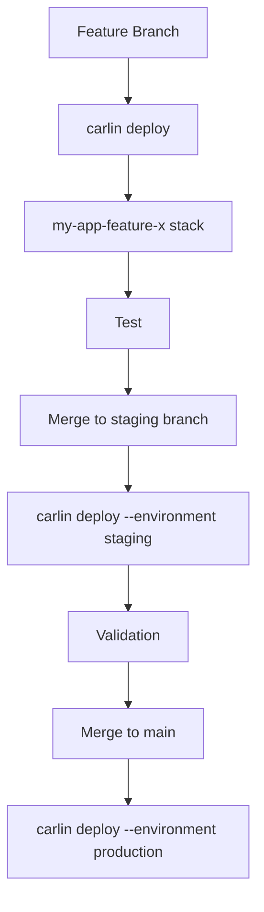

Deploy separate stacks for development, staging, and production with consistent naming, configuration isolation, and safe termination protection.

## Overview

carlin enables environment separation using the `--environment` option, configuration files, and branch-based automatic stack naming.

## Environment Strategy Models

| Model              | Development      | Staging             | Production                             | Notes                                   |
| ------------------ | ---------------- | ------------------- | -------------------------------------- | --------------------------------------- |
| Branch-Based Only  | Feature branches | `main`              | `main` with `--environment production` | Simple, limited isolation               |
| Classic 3 Envs     | `feature/*`      | `staging` stack     | `production` stack                     | Recommended baseline                    |
| Multi-Region       | `us-east-1` dev  | `us-east-1` staging | `us-east-1` + `eu-west-1` prod         | High availability                       |
| Segmented Accounts | Dev account      | Staging account     | Production account                     | Strong isolation + blast radius control |

## Naming Conventions

| Environment | Stack Naming Pattern | Example               |
| ----------- | -------------------- | --------------------- |
| Development | `my-app-<branch>`    | `my-app-feature-auth` |
| Staging     | `my-app-staging`     | `my-app-staging`      |
| Production  | `my-app-production`  | `my-app-production`   |

Override with `--stack-name` for special cases:

```bash
carlin deploy --stack-name shared-vpc --environment production
```

## Configuration Files

Create base config:

```yaml
# carlin.yml
region: us-east-1
parameters:
  InstanceType: t3.micro
```

Environment-specific configs:

```yaml
# carlin.staging.yml
environment: staging
parameters:
  InstanceType: t3.small
  DomainName: staging.example.com
```

```yaml
# carlin.production.yml
environment: production
parameters:
  InstanceType: t3.large
  DomainName: example.com
  EnableAlarms: true
```

Deploy using explicit config:

```bash
carlin deploy --config carlin.staging.yml
carlin deploy --config carlin.production.yml
```

## Parameter Differentiation

Use CloudFormation parameters for environment variability:

```typescript
export const template = {
  Parameters: {
    Environment: { Type: 'String' },
    InstanceType: { Type: 'String' },
    EnableAlarms: { Type: 'String', Default: 'false' },
  },
  Resources: {
    AppInstance: {
      Type: 'AWS::EC2::Instance',
      Properties: {
        InstanceType: { Ref: 'InstanceType' },
        Monitoring: {
          'Fn::If': [
            { 'Fn::Equals': [{ Ref: 'EnableAlarms' }, 'true'] },
            true,
            false,
          ],
        },
      },
    },
  },
};
```

Pass parameters:

```bash
# Staging
carlin deploy --environment staging --parameters '{"InstanceType":"t3.small","EnableAlarms":"false"}'

# Production
carlin deploy --environment production --parameters '{"InstanceType":"t3.large","EnableAlarms":"true"}'
```

## Termination Protection

Enabled automatically when `--environment` is provided (e.g., staging, production).

Delete protected stack explicitly:

```bash
carlin deploy --destroy --stack-name my-app-production
```

## Git Branch Workflow



## Multi-Region Production

Deploy production to multiple regions for low latency / redundancy:

```bash
# Primary region
carlin deploy --environment production --region us-east-1

# Secondary region
carlin deploy --environment production --region eu-west-1
```

Add global resources (e.g., Route 53 / CloudFront) in a separate stack referencing both.

## Shared vs Isolated Resources

| Resource        | Shared Across Envs          | Separate Per Env | Recommendation                       |
| --------------- | --------------------------- | ---------------- | ------------------------------------ |
| VPC             | ✅ Possible                 | ✅ Common        | Separate for strong isolation        |
| S3 Buckets      | ⚠️ Risk (naming collisions) | ✅               | Separate (avoid accidental data mix) |
| DynamoDB Tables | ⚠️ Data bleed risk          | ✅               | Separate (prefix with env)           |
| CloudFront      | ❌                          | ✅               | Separate (different domains)         |
| Lambda Layers   | ✅                          | ✅               | Share only stable, versioned layers  |

## Environment Variable Files

Generate `.env` per environment using stack outputs:

```bash
carlin generate-env --stack-name my-app-staging --default-environment Staging
carlin generate-env --stack-name my-app-production --default-environment Production
```

Source when running builds:

```bash
source .env.Staging
pnpm build
```

## Promotion Strategy

Avoid mutating production stack directly from development changes—rebuild from source:

1. Deploy feature stack: `my-app-feature-x`
2. Merge to staging; deploy staging stack
3. Validate staging (tests, smoke)
4. Merge to main; deploy production stack anew

## Observability Differences

Enable stricter alarms only in production:

```typescript
export const template = {
  Parameters: { EnableAlarms: { Type: 'String', Default: 'false' } },
  Conditions: {
    EnableProdAlarms: { 'Fn::Equals': [{ Ref: 'EnableAlarms' }, 'true'] },
  },
  Resources: {
    ErrorAlarm: {
      Type: 'AWS::CloudWatch::Alarm',
      Condition: 'EnableProdAlarms',
      Properties: {
        /* ... */
      },
    },
  },
};
```

## Drift Detection

Schedule periodic drift detection for production only (manual or via EventBridge + Lambda).

## Cleanup Strategy

Remove old feature stacks periodically:

```bash
# List stacks matching pattern
aws cloudformation list-stacks --stack-status-filter CREATE_COMPLETE | jq '.StackSummaries[] | select(.StackName | test("my-app-feature-"))'

# Destroy manually
carlin deploy --destroy --stack-name my-app-feature-old-branch
```

## Common Pitfalls

| Pitfall                                        | Impact                      | Fix                                             |
| ---------------------------------------------- | --------------------------- | ----------------------------------------------- |
| Using same stack for staging & prod            | Config/security leakage     | Separate with `--environment`                   |
| Not parameterizing environment-specific values | Hard to promote             | Use `Parameters` + `--parameters`               |
| Forgetting termination protection              | Accidental deletion         | Always set `--environment production`           |
| Sharing mutable buckets                        | Data overwrite risk         | Prefix bucket names with env or separate stacks |
| Mixing region deployments                      | Latency / config divergence | Document explicit region strategy               |

## Checklist

- [ ] Separate stack names per environment
- [ ] Termination protection enabled for production
- [ ] Config files per environment committed
- [ ] Parameter overrides documented
- [ ] Outputs exported for cross-stack use
- [ ] Feature stack deletion scheduled

## Related

- [Stack Naming](/docs/carlin/core-concepts/stack-naming)
- [Environments Concept](/docs/carlin/core-concepts/environments)
- [generate-env Command](/docs/carlin/commands/generate-env)
- [CloudFormation Templates](/docs/carlin/core-concepts/cloudformation-templates)
