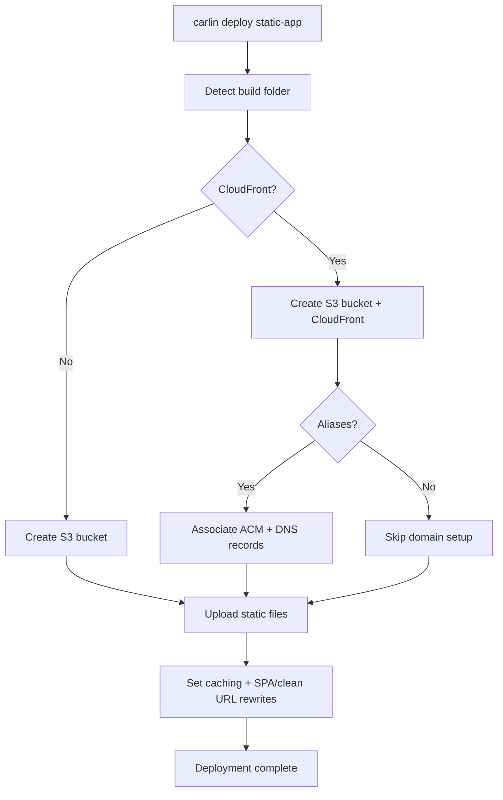

Comprehensive guide to deploying static websites (React, Vite, Next.js export, Docusaurus) using `carlin deploy static-app`.

## Overview

carlin simplifies static site deployment by automating S3 bucket creation, optional CloudFront distribution, DNS records, caching strategy, and clean URLs.

## Supported Frameworks

| Framework           | Build Command                         | Default Output Folder |
| ------------------- | ------------------------------------- | --------------------- |
| Vite / React        | `pnpm build`                          | `dist/`               |
| Next.js (export)    | `pnpm next build && pnpm next export` | `out/`                |
| Docusaurus          | `pnpm build`                          | `build/`              |
| Vue / Nuxt (static) | `pnpm build`                          | `dist/`               |

## Quick Start (Vite)

```bash
pnpm build
carlin deploy static-app --cloudfront --aliases app.example.com --acm <CERT_ARN>
```

## Directory Detection

If `--build-folder` is not provided, carlin searches for (in order):

```
build/
dist/
out/
.next/
public/
```

Specify explicitly:

```bash
carlin deploy static-app --build-folder dist
```

## Clean URLs vs SPA Mode

| Mode       | Flag                  | Behavior                                      |
| ---------- | --------------------- | --------------------------------------------- |
| Clean URLs | `--append-index-html` | `/docs/guide` serves `/docs/guide/index.html` |
| SPA        | `--spa`               | All 404 => `index.html` (client-side routing) |

You can combine both when needed:

```bash
carlin deploy static-app --cloudfront --append-index-html --spa
```

## Custom Domain + SSL

1. Request certificate in `us-east-1` (CloudFront required region).
2. Validate certificate (DNS or email).
3. Deploy with aliases:

```bash
carlin deploy static-app \
  --cloudfront \
  --aliases app.example.com www.app.example.com \
  --acm arn:aws:acm:us-east-1:123456789012:certificate/abc123 \
  --hosted-zone-name example.com
```

carlin:

- Associates certificate with CloudFront
- Creates Route 53 DNS A/AAAA records for each alias

## Cache Strategy

| Asset Type      | Suggested TTL | Reason                                  |
| --------------- | ------------- | --------------------------------------- |
| HTML            | 0–300s        | Frequent content updates                |
| JS/CSS (hashed) | 1 year        | Immutable with content hash             |
| Images          | 1 year        | Rarely change; use hash/versioned names |
| Fonts           | 1 year        | Immutable assets                        |

Add hashed filenames (Vite example):

```ts
// vite.config.ts
export default {
  build: {
    rollupOptions: {
      output: {
        entryFileNames: 'assets/[name].[hash].js',
        chunkFileNames: 'assets/[name].[hash].js',
        assetFileNames: 'assets/[name].[hash].[ext]',
      },
    },
  },
};
```

## Advanced Deployment Patterns

### Multi-Environment Sites

```bash
# Staging docs
carlin deploy static-app --environment staging --cloudfront --aliases staging.docs.example.com --acm <ARN>

# Production docs
carlin deploy static-app --environment production --cloudfront --aliases docs.example.com --acm <ARN>
```

### Monorepo Multiple Apps

```
apps/
  marketing/ (build => dist/)
  dashboard/ (build => build/)
  docs/ (build => build/)
```

Deploy each:

```bash
cd apps/marketing
pnpm build
carlin deploy static-app --cloudfront --aliases marketing.example.com --acm <ARN>

cd ../dashboard
pnpm build
carlin deploy static-app --cloudfront --aliases app.example.com --acm <ARN>
```

### Incremental Updates (No File Upload)

Update CloudFront config only:

```bash
carlin deploy static-app --skip-upload --cloudfront --aliases app.example.com
```

### Forced Re-Upload (Cache Bust)

Change build output hash or invalidate distribution manually:

```bash
aws cloudfront create-invalidation --distribution-id <ID> --paths '/*'
```

## Security Best Practices

- Enable `--cloudfront` for HTTPS everywhere
- Use long, random S3 bucket names (automatic via carlin)
- Restrict S3 public access except via CloudFront
- Use OAC (Origin Access Control) for private S3 origin (future enhancement)
- Avoid exposing `/index.html` directly when using clean URLs

## Troubleshooting

| Problem                       | Cause                              | Solution                                                |
| ----------------------------- | ---------------------------------- | ------------------------------------------------------- |
| 404 on nested docs pages      | Missing `--append-index-html`      | Redeploy with `--append-index-html`                     |
| SPA routes broken (refresh)   | No SPA fallback                    | Add `--spa` flag                                        |
| Certificate validation failed | Wrong region or DNS not propagated | Ensure certificate in `us-east-1`, wait DNS propagation |
| Aliases ignored               | Missing `--acm` with aliases       | Provide both `--aliases` and `--acm`                    |
| High TTFB globally            | No CDN                             | Add `--cloudfront`                                      |
| Stale assets after deploy     | Browser caching hashed assets      | Ensure hashed filenames; invalidate only if necessary   |

## Cost Overview

| Component      | Approx Monthly (small site)         |
| -------------- | ----------------------------------- |
| S3 Storage     | $0.10–$1                            |
| S3 Requests    | &lt;$0.50                           |
| CloudFront     | $2–$10                              |
| DNS (Route 53) | $0.50 per hosted zone + query costs |
| SSL (ACM)      | Free                                |

## Deployment Flow



## Best Practices Summary

- Prefer hashed asset filenames for long cache lifetimes
- Use `--append-index-html` for static site generators with nested routes
- Use `--spa` for single-page apps with client-side routing
- Separate staging and production domains for safer iteration
- Keep build output small (tree shaking, code splitting)

## Related

- [Command: deploy static-app](/docs/carlin/commands/deploy-static-app)
- [Base Stack](/docs/carlin/core-concepts/base-stack)
- [Multi-Environment Guide](/docs/carlin/guides/multi-environment-setup) (to be added)
