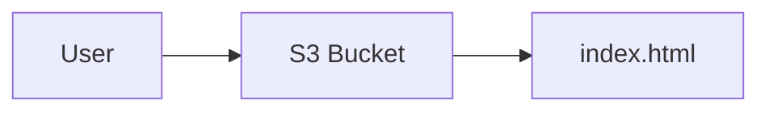
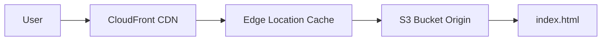
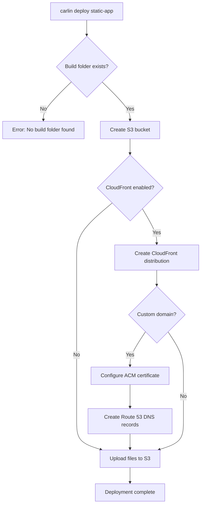

Deploy static websites (React, Vue, Angular, Docusaurus) to S3 with optional CloudFront distribution.

## Overview

```bash
carlin deploy static-app
```

This command:

1. Finds your built static files (`build/`, `out/`, `storybook-static/`, `dist/`)
2. Creates S3 bucket for hosting
3. Optionally creates CloudFront distribution
4. Uploads files to S3
5. Configures caching and CDN

## Quick Start

Build and deploy a Vite app:

```bash
# Build your app
pnpm build

# Deploy to S3 only
carlin deploy static-app

# Deploy to S3 + CloudFront
carlin deploy static-app --cloudfront
```

Deploy with custom domain:

```bash
carlin deploy static-app \
  --cloudfront \
  --aliases app.example.com \
  --acm arn:aws:acm:us-east-1:123456789012:certificate/abc123 \
  --hosted-zone-name example.com
```

## Options

### --build-folder

Specify build output folder.

```bash
carlin deploy static-app --build-folder dist
```

**Default**: Auto-detects `build/`, `out/`, `storybook-static/`, or `dist/`

### --cloudfront

Create CloudFront distribution.

```bash
carlin deploy static-app --cloudfront
```

**Benefits**:

- Global CDN (faster load times)
- HTTPS support
- Custom domains
- Caching

**Default**: `false` (S3 only)

### --aliases

CloudFront custom domain names (CNAMEs).

```bash
carlin deploy static-app --cloudfront --aliases app.example.com www.app.example.com
```

**Requires**: `--acm` (SSL certificate)

**Related**: [CloudFront Alternate Domain Names](https://docs.aws.amazon.com/AmazonCloudFront/latest/DeveloperGuide/CNAMEs.html)

### --acm

SSL certificate ARN or exported CloudFormation value name.

```bash
# Direct ARN
carlin deploy static-app --acm arn:aws:acm:us-east-1:123456789012:certificate/abc123

# CloudFormation export
carlin deploy static-app --acm MyCertificateArn
```

**Requires**: Certificate in `us-east-1` region for CloudFront

**Related**: [AWS Certificate Manager](https://aws.amazon.com/certificate-manager/)

### --hosted-zone-name

Route 53 hosted zone for automatic DNS configuration.

```bash
carlin deploy static-app \
  --hosted-zone-name example.com \
  --aliases app.example.com
```

carlin automatically creates DNS records pointing aliases to CloudFront distribution.

**Example**: For hosted zone `example.com` and alias `app.example.com`, carlin creates A record `app.example.com` → CloudFront.

### --append-index-html

Append `index.html` to request URIs (for Docusaurus, VitePress, static site generators).

```bash
carlin deploy static-app --append-index-html
```

**Behavior**:

- Request: `/docs/guide` → Serves: `/docs/guide/index.html`
- Request: `/about` → Serves: `/about/index.html`

**Use case**: Clean URLs without `.html` extension

### --spa

Enable Single Page Application (SPA) mode.

```bash
carlin deploy static-app --spa
```

**Behavior**: All 404 errors serve `index.html` (for client-side routing)

**Use case**: React Router, Vue Router, Angular Router

### --response-headers

Headers that CloudFront adds to every response it sends to viewers.

```bash
carlin deploy static-app --cloudfront --response-headers.x-robots-tag=noindex
```

Header values such as a content security policy are long and awkward to quote
on a command line, so prefer the configuration file:

```typescript
import { defineConfig } from 'carlin/config';

export default defineConfig({
  cloudfront: true,
  responseHeaders: {
    'content-security-policy': "default-src 'self'",
    'permissions-policy': 'geolocation=()',
  },
});
```

Headers defined this way override the ones received from the origin. Use the
array form when a header should be sent only when the origin doesn't send it:

```typescript
responseHeaders: [
  {
    header: 'x-robots-tag',
    value: 'noindex',
    override: false,
  },
];
```

**Requires**: `--cloudfront`. The headers are added by CloudFront, so a bucket
only deploy has nothing to attach them to.

Every deploy uses the managed `CORS-with-preflight-and-SecurityHeadersPolicy`,
which sends `Strict-Transport-Security`, `X-Content-Type-Options`,
`X-Frame-Options`, `Referrer-Policy`, `X-XSS-Protection` and the CORS headers.
Defining response headers replaces that managed policy with one carlin creates,
which reproduces those settings so both deploys behave the same. Defining one
of the security headers above replaces the managed value with yours. The CORS
headers are configured as a unit and cannot be replaced individually — use
`--response-headers-policy` when you need to change them.

Changing headers updates the distribution, which takes a few minutes to reach
every edge location. No invalidation is needed: the headers are applied to
cache hits too.

### --response-headers-policy

The id of an existing [response headers policy](https://docs.aws.amazon.com/AmazonCloudFront/latest/DeveloperGuide/modifying-response-headers.html),
or the name of an exported value whose value is the id, to associate to the
distribution instead of the default managed one.

```bash
# Managed or custom policy id
carlin deploy static-app --cloudfront --response-headers-policy 67f7725c-6f97-4210-82d7-5512b31e9d03

# CloudFormation export
carlin deploy static-app --cloudfront --response-headers-policy MyResponseHeadersPolicyId
```

Use this when the policy is managed elsewhere, or when you need settings that
`--response-headers` doesn't reach, such as CORS or removing headers. carlin
takes the policy as given and adds nothing to it.

**Requires**: `--cloudfront`. **Conflicts with**: `--response-headers`. A cache
behavior takes a single response headers policy.

### --skip-upload

Update CloudFormation without uploading files.

```bash
carlin deploy static-app --skip-upload
```

**Use case**: Update CloudFront configuration without re-uploading files

### --upload-source-maps

Upload source map (`.map`) files to S3.

```bash
carlin deploy static-app --upload-source-maps
```

**Default**: `false` — source maps are excluded from the upload.

The bucket this command publishes to is public, and a source map embeds your
application's original source, so publishing one discloses that source to
anyone who requests it. carlin therefore never uploads `.map` files unless you
ask for it explicitly.

:::caution
Before enabling this, consider uploading your source maps to your error
tracking provider instead. That gives you readable stack traces without
serving the source publicly.
:::

carlin only decides which files are uploaded — it does not modify file
contents. If your bundler emits `sourceMappingURL` comments and you leave this
option off, those comments will point at files that return 404. Strip them at
build time (most source-map upload tools do this for you) if that matters to
you.

### --region

:::note
Static app deployments always use `us-east-1` (CloudFront requirement). This option is ignored.
:::

## Examples

### Vite/React App

```bash
# Build
pnpm build

# Deploy with CloudFront and custom domain
carlin deploy static-app \
  --cloudfront \
  --spa \
  --aliases app.example.com \
  --acm arn:aws:acm:us-east-1:123456789012:certificate/abc123 \
  --hosted-zone-name example.com
```

### Docusaurus Documentation

```bash
# Build
pnpm build

# Deploy with clean URLs
carlin deploy static-app \
  --cloudfront \
  --append-index-html \
  --aliases docs.example.com \
  --acm arn:aws:acm:us-east-1:123456789012:certificate/abc123
```

### Next.js Static Export

```bash
# Build static export
pnpm build

# Deploy
carlin deploy static-app \
  --build-folder out \
  --cloudfront \
  --spa
```

### Multi-Environment Deployment

```bash
# Staging
carlin deploy static-app \
  --environment staging \
  --cloudfront \
  --aliases staging.app.example.com

# Production
carlin deploy static-app \
  --environment production \
  --cloudfront \
  --aliases app.example.com www.app.example.com
```

## Architecture

### S3 Only



**Pros**: Simple, low cost
**Cons**: No CDN, no HTTPS, slower for global users

### S3 + CloudFront



**Pros**: Fast globally, HTTPS, custom domains, caching
**Cons**: Slightly higher cost

## Deployment Flow



## SSL Certificate Setup

Create SSL certificate in AWS Certificate Manager (must be in `us-east-1`):

```bash
# Request certificate
aws acm request-certificate \
  --domain-name app.example.com \
  --subject-alternative-names www.app.example.com \
  --validation-method DNS \
  --region us-east-1

# Note the certificate ARN
# arn:aws:acm:us-east-1:123456789012:certificate/abc123
```

Validate certificate via DNS or email, then use ARN in deployment:

```bash
carlin deploy static-app \
  --acm arn:aws:acm:us-east-1:123456789012:certificate/abc123 \
  --aliases app.example.com
```

## Caching Strategy

CloudFront caches files based on file type:

- **HTML files**: No cache (always fetch latest)
- **JS/CSS/Images**: Long cache (1 year) with content hash in filename

**Recommended build setup** (Vite example):

```typescript
// vite.config.ts
export default {
  build: {
    rollupOptions: {
      output: {
        entryFileNames: 'assets/[name].[hash].js',
        chunkFileNames: 'assets/[name].[hash].js',
        assetFileNames: 'assets/[name].[hash].[ext]',
      },
    },
  },
};
```

## Updating Deployments

Update files:

```bash
pnpm build
carlin deploy static-app
```

carlin uploads changed files and invalidates CloudFront cache automatically.

Update CloudFront configuration only:

```bash
carlin deploy static-app --skip-upload
```

## Cost Considerations

See [AWS S3 Pricing](https://aws.amazon.com/s3/pricing/) and [CloudFront Pricing](https://aws.amazon.com/cloudfront/pricing/) for current rates.

## Troubleshooting

### Build Folder Not Found

**Error**: `Build folder not found`

**Solution**: Build your app first or specify folder:

```bash
pnpm build
carlin deploy static-app --build-folder dist
```

### Certificate Not in us-east-1

**Error**: `Certificate must be in us-east-1 region`

**Solution**: Create certificate in `us-east-1`:

```bash
aws acm request-certificate --region us-east-1 --domain-name app.example.com
```

### CloudFront Propagation Delay

**Problem**: Changes take 15-30 minutes to appear globally

**Solution**: This is normal CloudFront behavior. Wait for distribution deployment to complete.

Check status:

```bash
aws cloudfront list-distributions
```

### Source Maps Return 404

**Problem**: `.map` files that used to be served now return 404

**Cause**: source maps are excluded from the upload by default. This changed in
carlin v2 — earlier versions published everything in the build folder,
including source maps.

**Solution**: if you intend to serve them publicly, opt back in:

```bash
carlin deploy static-app --upload-source-maps
```

### SPA Routes Return 404

**Problem**: Client-side routes (e.g., `/about`, `/contact`) return 404

**Solution**: Use `--spa` flag:

```bash
carlin deploy static-app --spa
```

## Related Topics

- [Base Stack](/docs/carlin/core-concepts/base-stack) - CloudFront function for `--append-index-html`
- [Environments](/docs/carlin/core-concepts/environments) - Multi-environment deployments
