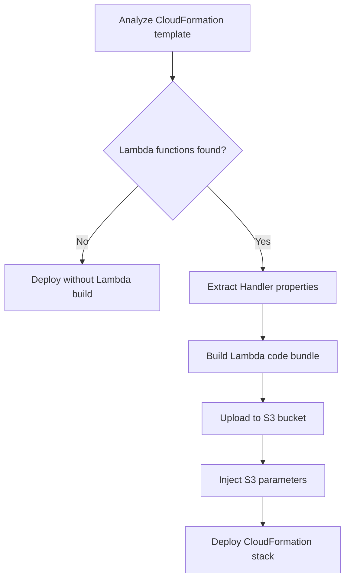
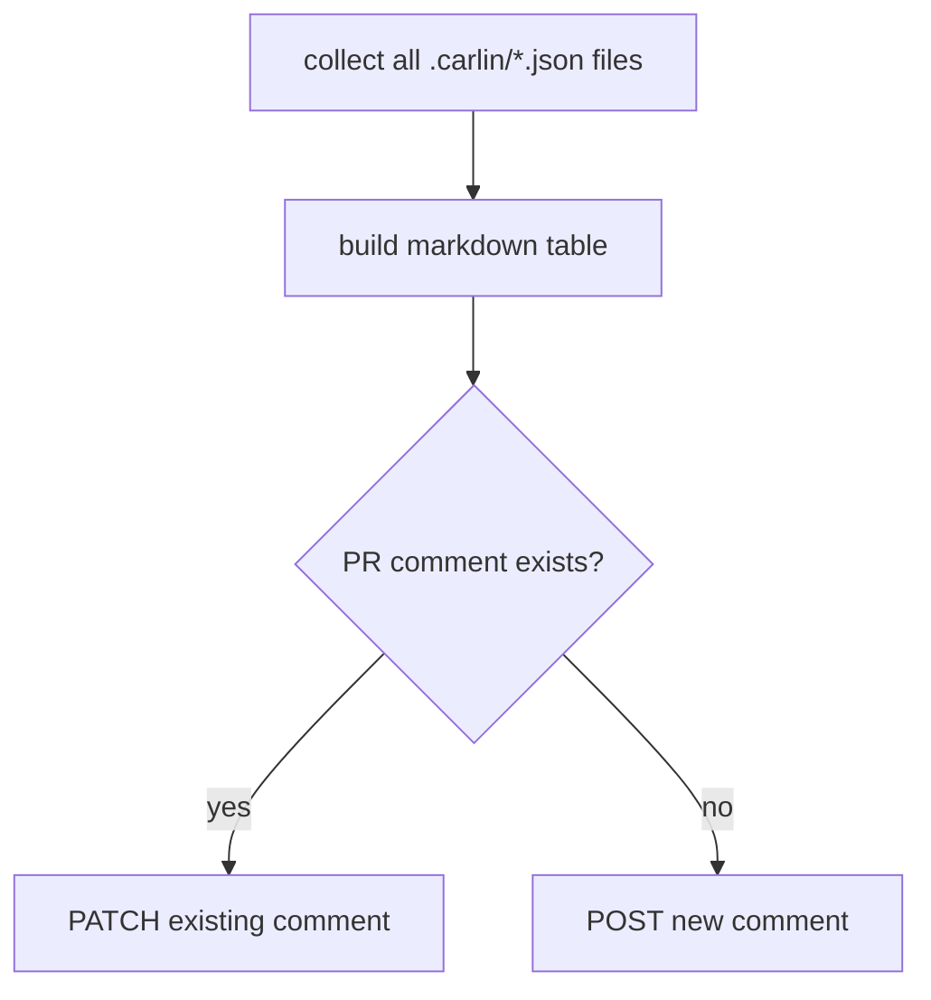

import Tabs from '@theme/Tabs';
import TabItem from '@theme/TabItem';

import { Carlin } from '../../../src/components/Carlin';

## Overview

```bash
carlin deploy
```

This command deploys AWS cloud resources from a CloudFormation template. <Carlin /> uses `--template-path` when provided. Otherwise, it searches these files in order:

1. `./src/cloudformation.ts`
2. `./src/cloudformation.js`
3. `./src/cloudformation.yaml`
4. `./src/cloudformation.yml`
5. `./src/cloudformation.json`

When a TypeScript template exports a function, carlin calls it with the CLI options plus `stackName`, `environment`, `packageName`, and `projectName`.

### Stack Name

<Carlin /> creates automatically the CloudFormation stack name. See [Stack
Naming](/docs/carlin/core-concepts/stack-naming) for the full naming algorithm
and examples.

You can override the automatic name with `--stack-name`.

:::caution

Changing the stack name targets a different CloudFormation stack. Use explicit stack names carefully, especially for production resources.

::::

## Lambda

Carlin automatically handles Lambda functions in your CloudFormation templates by building and deploying code to S3. When Lambda functions are detected, Carlin analyzes `Handler` properties in `AWS::Lambda::Function` and `AWS::Serverless::Function` resources, builds the code, and uploads it to S3.

### Handler Format

Your `Handler` property must follow the format `path/to/file.exportedFunction`. For example, if you have `src/auth/index.ts` with export `validateUser`, set `Handler` to `auth/index.validateUser`. The base directory defaults to `src` and can be changed with `--lambda-entry-points-base-dir`.

### Automatic S3 Parameters

Carlin automatically injects S3 parameters into your CloudFormation template:

<Tabs groupId="cfnTemplate">
  <TabItem value="ts" label="TypeScript" default>

    ```ts
    // Carlin adds these parameters automatically
    Parameters: {
      LambdaS3Bucket: { Type: 'String' },
      LambdaS3Key: { Type: 'String' },
      LambdaS3ObjectVersion: { Type: 'String' },
    }
    ```

  </TabItem>

  <TabItem value="yaml" label="Yaml">
    
    ```yml
    # Carlin adds these parameters automatically
    Parameters:
      LambdaS3Bucket:
        Type: String
      LambdaS3Key:
        Type: String
      LambdaS3ObjectVersion:
        Type: String
    ```
    
  </TabItem>
</Tabs>

### Lambda Resource Configuration

Reference the S3 parameters in your Lambda resources. If `Code` or `CodeUri` properties are undefined, Carlin sets them automatically:

<Tabs groupId="cfnTemplate">
  <TabItem value="ts" label="TypeScript" default>

    ```ts
    Resources: {
      MyLambda: {
        Type: 'AWS::Lambda::Function',
        Properties: {
          Handler: 'auth/index.validateUser',
          Code: {
            S3Bucket: { Ref: 'LambdaS3Bucket' },
            S3Key: { Ref: 'LambdaS3Key' },
            S3ObjectVersion: { Ref: 'LambdaS3ObjectVersion' },
          },
        },
      },
      MyServerlessFunction: {
        Type: 'AWS::Serverless::Function',
        Properties: {
          Handler: 'users/create.handler',
          CodeUri: {
            Bucket: { Ref: 'LambdaS3Bucket' },
            Key: { Ref: 'LambdaS3Key' },
            Version: { Ref: 'LambdaS3ObjectVersion' },
          },
        },
      },
    }
    ```

  </TabItem>

  <TabItem value="yaml" label="Yaml">

    ```yml
    Resources:
      MyLambda:
        Type: AWS::Lambda::Function
        Properties:
          Handler: auth/index.validateUser
          Code:
            S3Bucket: !Ref LambdaS3Bucket
            S3Key: !Ref LambdaS3Key
            S3ObjectVersion: !Ref LambdaS3ObjectVersion
      MyServerlessFunction:
        Type: AWS::Serverless::Function
        Properties:
          Handler: users/create.handler
          CodeUri:
            Bucket: !Ref LambdaS3Bucket
            Key: !Ref LambdaS3Key
            Version: !Ref LambdaS3ObjectVersion
    ```

  </TabItem>

</Tabs>

### Lambda Build Process



### Format Configuration

Carlin builds Lambda entry points with esbuild, uploads the bundle to S3, and passes the generated S3 object parameters into the CloudFormation stack. Configure output format with `--lambda-format`. Default is `esm`; use `cjs` when a dependency requires CommonJS.

### Runtime Configuration

You can specify the Node.js runtime version for Lambda functions using `--lambda-runtime`. Default is `nodejs24.x`.

Supported runtimes:

- `nodejs20.x` - Node.js 20
- `nodejs22.x` - Node.js 22
- `nodejs24.x` - Node.js 24 (default)

Example:

```bash
carlin deploy --lambda-runtime nodejs20.x
```

This option affects:

- Lambda function runtime version
- Lambda Layer compatible runtimes
- CodeBuild runtime for Lambda Layer builder

## Deploy Report

```bash
carlin deploy report --channel=github-pr
```

After all packages in a monorepo are deployed, `deploy report` collects every `.carlin/*.json` output file across the workspace and publishes a consolidated summary. Use `--channel` to control where the summary is sent.

### `--channel=github-pr`

Posts (or updates) a single PR comment containing a table of all deploy outputs from every package deployed during the CI run. Carlin identifies the PR from the current branch, finds any existing comment it previously posted, and patches it in place — so the comment never duplicates across pushes.



The comment looks like this:

| Package     | Stack            | Output Key   | Output Value |
| ----------- | ---------------- | ------------ | ------------ |
| `@acme/api` | `acme-api-pr-42` | `ApiUrl`     | https://...  |
| `@acme/web` | `acme-web-pr-42` | `BucketName` | acme-web-... |

#### Required environment variables

| Variable            | Description                                                              |
| ------------------- | ------------------------------------------------------------------------ |
| `GH_TOKEN`          | GitHub token with `pull-requests: write` permission.                     |
| `GITHUB_REPOSITORY` | Repository in `owner/repo` format (set automatically by GitHub Actions). |
| `CARLIN_BRANCH`     | The branch being built (used to look up the open PR).                    |

#### Usage in CI

In the ttoss monorepo this command runs at the end of the PR pipeline, after all packages are deployed:

```bash
# Deploy all packages changed since main
pnpm turbo run build test deploy --filter=[main]

# Build carlin explicitly so the CLI is available even when no packages changed
pnpm turbo run build --filter=carlin

# Post or update a single PR comment with consolidated deploy outputs
pnpm carlin deploy report --channel=github-pr
```

Because Carlin uses `GITHUB_PR_COMMENT_MARKER` as an HTML comment inside the body, it identifies its own comment reliably across multiple pushes to the same PR without creating duplicates.

## Destroy

To destroy the stack, pass `--destroy` to the deploy command:

```
carlin deploy --destroy
```

:::danger

This operation is irreversible. You must pay attention because you may destroy resources that contains your App data, like DynamoDB, using this command.
To reduce accidental deletion, destroy only deletes resources when termination protection is disabled and `--environment` is not defined.

:::

## Examples

```bash
carlin deploy -t src/cloudformation.template1.yml
carlin deploy -e Production
carlin deploy --lambda-runtime nodejs20.x
carlin deploy --lambda-format cjs
carlin deploy --destroy --stack-name StackToBeDeleted
```

### Use Cases

- [Terezinha Farm API](https://github.com/ttoss/ttoss/tree/main/terezinha-farm/api)
- [POC - AWS Serverless REST API](https://github.com/ttoss/poc-aws-serverless-rest-api/tree/112df23a823294a8b29d0c70f1d0127373759ef1)

## Outputs

After deployment, outputs are saved to `.carlin/$STACK_NAME.json` and `.carlin/latest-deploy.json`.

## API

### Options

| Option                           | Description                                                  |
| -------------------------------- | ------------------------------------------------------------ |
| `--template-path`, `-t`          | Path to the CloudFormation template.                         |
| `--stack-name`                   | Explicit CloudFormation stack name.                          |
| `--parameters`, `-p`             | CloudFormation parameters as an object or parameter array.   |
| `--destroy`                      | Destroy the selected stack.                                  |
| `--lambda-format`                | Lambda bundle format: `esm` or `cjs`.                        |
| `--lambda-runtime`               | Lambda runtime: `nodejs20.x`, `nodejs22.x`, or `nodejs24.x`. |
| `--lambda-external`              | Modules excluded from the Lambda bundle.                     |
| `--lambda-entry-points-base-dir` | Base directory for Lambda handler entry points.              |
| `--skip-deploy`                  | Skip deployment after config resolution.                     |
| `--channel`                      | Report deploy outputs to a channel. Supported: `github-pr`.  |

`--parameters` accepts a simple object:

```json
{ "DomainName": "api.example.com", "DatabasePort": 5432 }
```

It also accepts CloudFormation-style parameter entries when you need fields such as `usePreviousValue`:

```json
[{ "key": "DatabasePassword", "usePreviousValue": true }]
```
