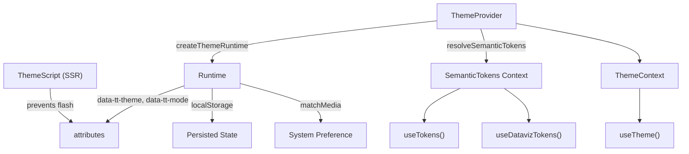

The Theme Provider is the React integration layer for `@ttoss/theme2`. It manages theme switching, mode resolution (light / dark / system), SSR flash prevention, and exposes semantic tokens to your component tree.

## Quick Start

```tsx
import { ThemeProvider, ThemeScript } from '@ttoss/theme2/react';
import { defaultBundle, auroraBundle } from '@ttoss/theme2';

// In your root layout (e.g. Next.js app/layout.tsx):
export default function RootLayout({ children }) {
  return (
    <html lang="en">
      <head>
        <ThemeScript defaultTheme="default" />
      </head>
      <body>
        <ThemeProvider
          bundles={{ default: defaultBundle, aurora: auroraBundle }}
        >
          {children}
        </ThemeProvider>
      </body>
    </html>
  );
}
```

## ThemeProvider

Wraps your application and manages theme/mode state. Applies `data-tt-theme` and `data-tt-mode` attributes on `<html>`, persists user preference to `localStorage`, and listens to `prefers-color-scheme` changes.

### Props

| Prop | Type | Default | Description |
|:--|:--|:--|:--|
| `bundles` | `Record<string, ThemeBundle>` | — | Bundle registry. When provided, `useTokens()` becomes available to descendants |
| `defaultTheme` | `string` | `'default'` | Theme ID when no persisted value is found |
| `defaultMode` | `ThemeMode` | `'system'` | Mode when no persisted value is found. One of `'light'`, `'dark'`, `'system'` |
| `storageKey` | `string` | `'tt-theme'` | `localStorage` key for persistence |
| `children` | `ReactNode` | — | Your application tree |

### How Bundles Work

A `ThemeBundle` contains a base theme plus an optional alternate semantic override for the secondary mode. When the resolved mode differs from the bundle's `baseMode`, the provider deep-merges the alternate semantics over the base — keeping core tokens immutable. See [Modes](/docs/design/design-system/design-tokens/modes) for the full mode remapping contract.

```tsx
import { createThemeBundle, defaultTheme } from '@ttoss/theme2';

const myBundle = createThemeBundle({
  name: 'my-theme',
  baseMode: 'light',
  base: defaultTheme,
  alternate: {
    semantic: {
      colors: {
        /* dark mode overrides */
      },
    },
  },
});
```

## ThemeScript

Inline `<script>` that prevents theme flash on SSR/SSG. It runs synchronously before paint, reads persisted state from `localStorage`, resolves system mode, and applies `data-tt-theme`, `data-tt-mode`, and `color-scheme` on `<html>`.

Place it in `<head>` **before** stylesheets.

### Props

| Prop | Type | Default | Description |
|:--|:--|:--|:--|
| `defaultTheme` | `string` | `'default'` | Fallback theme |
| `defaultMode` | `ThemeMode` | `'system'` | Fallback mode |
| `storageKey` | `string` | `'tt-theme'` | Must match the provider's `storageKey` |
| `nonce` | `string` | — | CSP nonce for the inline script |

:::tip
Keep `defaultTheme`, `defaultMode`, and `storageKey` consistent between `<ThemeScript>` and `<ThemeProvider>` — otherwise the hydrated state may not match the SSR bootstrap.
:::

## Hooks

### useTheme

Access current theme state and imperatively switch theme or mode.

```tsx
import { useTheme } from '@ttoss/theme2/react';

const ThemeSwitcher = () => {
  const { themeId, mode, resolvedMode, setTheme, setMode } = useTheme();

  return (
    <>
      <p>
        {themeId} — {resolvedMode}
      </p>
      <button onClick={() => setTheme('aurora')}>Aurora</button>
      <button onClick={() => setMode('dark')}>Dark</button>
      <button onClick={() => setMode('system')}>System</button>
    </>
  );
};
```

**Return value:**

| Field | Type | Description |
|:--|:--|:--|
| `themeId` | `string` | Active theme ID |
| `mode` | `ThemeMode` | User-selected mode (`'light'` \| `'dark'` \| `'system'`) |
| `resolvedMode` | `'light' \| 'dark'` | Resolved mode after system preference |
| `setTheme` | `(id: string) => void` | Switch the active theme |
| `setMode` | `(mode: ThemeMode) => void` | Switch the active mode |

### useTokens

Access the current theme's **semantic tokens only**. This is the consumption boundary — components receive `ThemeTokensV2['semantic']` and cannot access `core.*` tokens, enforcing the [design token contract](/docs/design/design-system/design-tokens).

Requires `bundles` on the provider.

```tsx
import { useTokens } from '@ttoss/theme2/react';

const Card = () => {
  const tokens = useTokens();
  // tokens.colors.content.primary.text.default ✔
  // tokens.text.heading.lg ✔
  // No access to core.* tokens — enforced by type system
  return <div />;
};
```

### useDatavizTokens

Access dataviz semantic tokens. Available from the `@ttoss/theme2/dataviz` entry point.

Requires the active theme to include the dataviz extension via `withDataviz()`. Throws a descriptive error if the theme lacks dataviz tokens.

```tsx
import { useDatavizTokens } from '@ttoss/theme2/dataviz';
import { withDataviz, defaultWithDataviz } from '@ttoss/theme2/dataviz';

// 1. Compose your theme with dataviz tokens
const myTheme = defaultWithDataviz; // or: withDataviz(myCustomTheme)

// 2. Use in components
const ChartLegend = ({ categories }: { categories: string[] }) => {
  const dataviz = useDatavizTokens();
  return (
    <ul>
      {categories.map((name, i) => (
        <li key={name} style={{ color: dataviz.color.series[i + 1] }}>
          {name}
        </li>
      ))}
    </ul>
  );
};
```

## Architecture



The runtime layer (`createThemeRuntime`) is framework-agnostic — it manages DOM attributes, `localStorage`, and system preference listeners. The React layer wraps it with context and hooks.

## CSS Custom Properties

`ThemeProvider` sets `data-tt-theme` and `data-tt-mode` on `<html>`. Your CSS selectors should scope token overrides to these attributes. Use `bundleToCssVars()` from `@ttoss/theme2` to generate the CSS:

```ts
import { bundleToCssVars, defaultBundle } from '@ttoss/theme2';

const css = bundleToCssVars(defaultBundle, {
  themeAttr: 'data-tt-theme',
  modeAttr: 'data-tt-mode',
});
// Inject `css.base` and `css.alt` into your stylesheet or <style> tag
```

See the [Design Tokens](/docs/design/design-system/design-tokens) documentation for the full token grammar and output format details.
