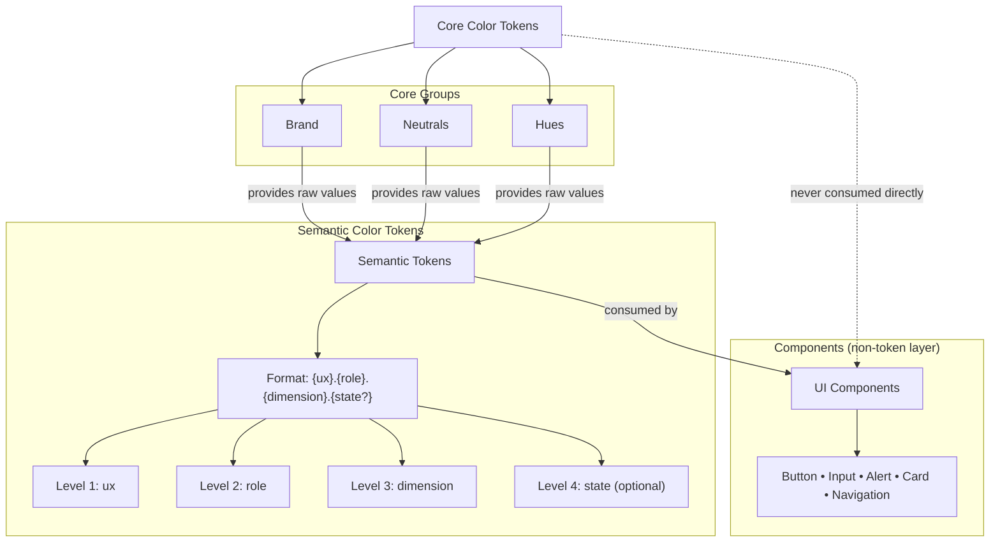

# Colors

Colors are a foundational part of the design system, being one of the most expressive design elements. They express brand identity, communicate meaning, support hierarchy, and ensure accessibility across interfaces.

This system is built on **two explicit layers**:

1. **Core Colors** — raw, brand-level and hue color values
2. **Semantic Colors** — contextual usage tokens applied in UI

Components must always consume **semantic colors**, never core colors directly.

> **Rule:** Core colors are never referenced in components.

---

## Color Architecture Overview

```
Core Colors  →  Semantic Colors  →  Components
(raw values)    (intent & usage)    (implementation)
```

- **Core** answers: _what colors exist?_
- **Semantic** answers: _where and why is a color used?_
- **Components** never decide colors; they apply semantics.



---

## Core Colors

Core colors are **raw, brand-defined, hue values**.  
They do **not** express intent, hierarchy, or state.

They exist to:

- define the visual identity of the brand
- provide stable primitives for theming (hue palettes)
- serve as the source of truth for semantic tokens

### Core Color Groups

Typical core groups include:

- **Brand** — primary brand colors
- **Neutrals** — grays, black, white
- **Hues** — colors that harmonize with the brand

#### Brand Colors

| Color           | Purpose                                                | Example   |
| --------------- | ------------------------------------------------------ | --------- |
| `main`          | Primary brand color for key actions and brand presence | `#292C2a` |
| `complimentary` | Secondary brand color that complements the main color  | `#f4f3f3` |
| `accent`        | Accent color for emphasis and call-to-action elements  | `#0469E3` |
| `darkNeutral`   | Dark neutral for text and strong contrast              | `#325C82` |
| `lightNeutral`  | Light neutral for backgrounds and subtle elements      | `#F8F8F8` |

#### Hue colors

Are usually defined as **scales**, not single values.

#### Example (Core Color Definition)

```javascript
const coreColors = {
  /* Brand */
  main: '#292C2a',
  complimentary: '#f4f3f3',
  accent: '#0469E3',
  lightNeutral: '#F8F8F8',
  darkNeutral: '#325C82',

  /* Neutrals */
  white: '#ffffff',
  gray50: '#f8fafc',
  gray100: '#f1f5f9',
  gray200: '#e2e8f0',
  gray300: '#cbd5e1',
  gray500: '#64748b',
  gray700: '#334155',
  gray900: '#0f172a',
  black: '#000000',

  /* Hue */
  red100: '#ffebeb',
  red200: '#fdbfbf',
  red300: '#f99595',
  red400: '#f56c6c',
  red500: '#ef4444',
  red600: '#e42828',
  red700: '#c62121',
};
```

## Semantic Colors

Semantic colors translate raw color values into **meaningful, contextual usage**.

They describe:

- _what the color is used for_
- _in which UX context_
- _with which role_
- _in which interaction state_

### Token Structure

Composed of 4 levels, where the names must follow the order below, and the state level is optional.

```
{ux}.{role}.{dimension}.{state?}
```

**Examples:**

- `action.primary.background.default`
- `input.negative.border.focused`
- `content.muted.text.default`
- `navigation.primary.text.current`

### Semantic Levels:

| Level     | Defines                                                                 |
| :-------- | :---------------------------------------------------------------------- |
| ux        | **Where in the experience** the color is applied by UX functional area. |
| role      | **Intent or emphasis**, not appearance.                                 |
| dimension | **What part of the UI** the color affects.                              |
| state     | **Interaction or system state**.                                        |

### Semantic Levels Summary Table

| level                 | value           | description                                                                                 | usage example                                               |
| :-------------------- | :-------------- | :------------------------------------------------------------------------------------------ | :---------------------------------------------------------- |
| **ux**                | `navigation`    | Movement and orientation elements; excludes inline content links (which belong to Content). | Nav bars, menus, breadcrumbs, pagination, tab navigation    |
| **ux**                | `discovery`     | Exploratory controls that help locate or refine content—not for structural navigation.      | Search bars, filter panels, sort buttons, result highlights |
| **ux**                | `input`         | User data entry or selection; distinct from actions that submit or trigger flows.           | Text fields, dropdowns, checkboxes, date pickers            |
| **ux**                | `action`        | Triggers user actions or state changes; separate from Input and Utility actions.            | Buttons (primary/secondary), icon triggers, toggles, CTAs   |
| **ux**                | `feedback`      | Reactive messages following user or system actions—validation, errors, status.              | Inline validation, error banners, toasts, loaders           |
| **ux**                | `guidance`      | Preventive instructional UI—onboarding, tips, coachmarks—not reactive.                      | Tooltips, walkthrough overlays, help modals                 |
| **ux**                | `content`       | Core informational surfaces and typography—not action or navigation.                        | Page layouts, cards, headings, body text, media blocks      |
| **ux** _(expandable)_ | `analytics`     | Quantitative data representation—distinct from content or interactive areas.                | Charts, dashboards, KPI tiles, data visualizations          |
| **ux** _(expandable)_ | `social`        | User interaction features—comments, reactions, shares—distinct from gamified engagement.    | Comments, likes, share buttons, mentions                    |
| **ux** _(expandable)_ | `commerce`      | Transactional and pricing-related visuals—modular for products with commerce flows.         | Price tags, promo badges, checkout flows, stock labels      |
| **ux** _(expandable)_ | `gamification`  | Engagement-driven indicators—achievement and progress motifs.                               | Progress bars, badges, points, leaderboards                 |
| **role**              | `primary`       | Highest emphasis; use sparingly to preserve hierarchy.                                      | Main buttons, key headings, active nav items                |
| **role**              | `secondary`     | Supporting or subordinate emphasis.                                                         | Secondary buttons/text, secondary nav items                 |
| **role**              | `accent`        | Visual highlight—best used for small areas.                                                 | Links, badges, emphasis markers                             |
| **role**              | `muted`         | Low-contrast, subdued visuals—ensure legibility where needed.                               | Helper text, placeholder text, subtle borders               |
| **role**              | `negative`      | Error/destructive meaning.                                                                  | Error banners, destructive buttons                          |
| **role**              | `positive`      | Success or confirmation meaning.                                                            | Success toasts, confirmation signals                        |
| **role**              | `caution`       | Warning or attention without failure.                                                       | Warnings, pending status indicators                         |
| **dimension**         | `background`    | Fill surfaces—ensure contrast; not for glyphs.                                              | Card background, button fill, selection highlight           |
| **dimension**         | `border`        | Outline or separation lines; also focus indicators.                                         | Input outlines, dividers, focus rings                       |
| **dimension**         | `text`          | Foreground content—including icons that behave like text.                                   | Copy text, labels, icons, link text                         |
| **state**             | `default`       | resting/base appearance                                                                     | any                                                         |
| **state**             | `hover`         | pointer hover feedback                                                                      | interactive targets only                                    |
| **state**             | `active`        | momentary press/drag feedback                                                               | interactive targets only                                    |
| **state**             | `focused`       | keyboard/programmatic focus                                                                 | focusable targets only                                      |
| **state**             | `disabled`      | unavailable/non-interactive                                                                 | only if truly disabled                                      |
| **state**             | `selected`      | selected item in a set _(non-boolean)_                                                      | tabs/options/rows                                           |
| **state**             | `checked`       | boolean on/off control                                                                      | checkbox/radio/switch                                       |
| **state**             | `pressed`       | toggle button on/off                                                                        | toggle buttons                                              |
| **state**             | `expanded`      | disclosure open/closed                                                                      | accordions/menus/combobox                                   |
| **state**             | `current`       | “you are here” in a set/sequence                                                            | nav/breadcrumbs/steps                                       |
| **state**             | `visited`       | visited link state                                                                          | link text only (`:visited` limitations)                     |
| **state**             | `indeterminate` | mixed/unknown state                                                                         | tri-state checkbox / progress w/o value (`:indeterminate`)  |
| **state**             | `droptarget`    | valid drop target highlight                                                                 | drag-and-drop drop zones (“drop target”)                    |

---

## Usage Rules (Non-Negotiable)

### ✅ Do

- Always use **semantic tokens** in components
- Choose tokens based on **UX intent**, not appearance
- Let themes remap semantic tokens to different core values

### ❌ Don’t

- Do not use core colors directly in components
- Do not invent ad-hoc semantic names
- Do not encode status using color alone
- Do not mix elevation (depth) with color semantics

---

## Accessibility

Semantic colors are designed to meet accessibility requirements by contract.

### Contrast Guidelines

- Text (normal): **≥ 4.5:1** (WCAG AA)
- Text (large): **≥ 3:1**
- Non-text UI (icons, borders, focus rings): **≥ 3:1**
- Critical text combinations should target **7:1** when possible

Contrast validation happens at the **semantic level**, not per component.

---

## Relationship to Elevation

- Color expresses **meaning and intent**
- Elevation expresses **depth and layering**

Shadows used for elevation are **not semantic colors**.
They belong to the Elevation foundation and must not be encoded as color roles.

---

## Theming

Themes (light, dark, branded variants) work by creating a new theme:

- redefining **core color values if really necessary**
- remapping **semantic colors** to different core colors

Semantic token names **never change across themes**.

---

## Summary

- Core colors define **what colors exist**
- Semantic colors define **how colors are used**
- Components consume **only semantic tokens**
- This separation ensures:
  - consistency
  - accessibility
  - scalability
  - multi-brand support
