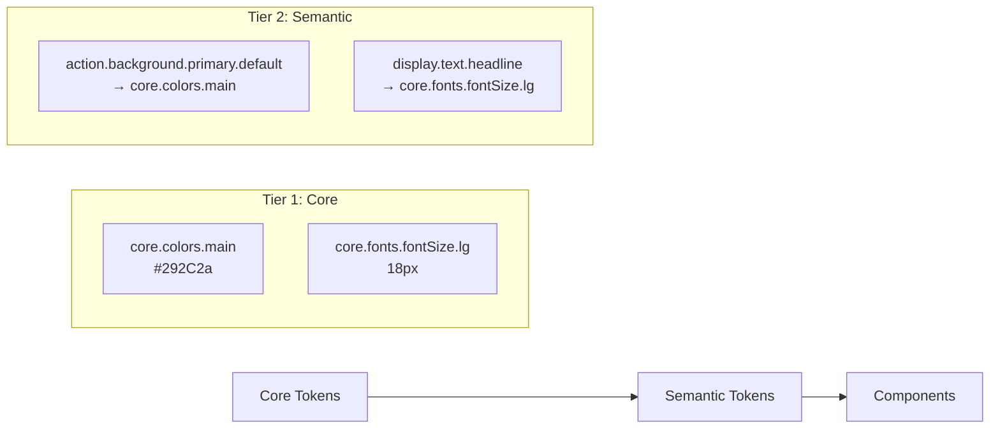

# Design Tokens

Design tokens are the foundation of our design system - they capture design decisions as data and make them reusable across platforms and technologies.

## What are Design Tokens?

Design tokens are **named entities that store visual design attributes**. Instead of hardcoding values like `#FF6B6B` or `16px`, we use meaningful names like `colors.action.background.negative.default` or `core.fonts.fontSize.base`.

## Why Use Design Tokens?

- **Consistency**: Same values used everywhere
- **Maintainability**: Change once, update everywhere
- **Scalability**: Support multiple themes and brands
- **Cross-platform**: Use same tokens in web, mobile, and design tools
- **Semantic Meaning**: Names explain intent, not just appearance

## Token Architecture

We use a **2-tier token system** for maximum flexibility and clarity:



### Tier 1: [Core Tokens](/docs/design/design-system/design-tokens/core-tokens)

**Purpose**: Store raw values with minimal abstraction

- **Brand-based**: Reflect brand identity (`core.colors.main`, `core.fonts.brand.primary`)
- **Abstract naming**: Describe what it is, not where it's used
- **Platform agnostic**: Work across web, mobile, design tools

**Examples**:

```
core.colors.main: #292C2a
core.fonts.fontSize.lg: 18px
core.spacing.md: 16px
```

### Tier 2: [Semantic Tokens](/docs/design/design-system/design-tokens/semantic-tokens)

**Purpose**: Define contextual usage with high abstraction

- **Intent-based**: Names describe purpose (`action.background.primary`, `feedback.text.error`)
- **Context-specific**: Organized by UI context (action, display, input, feedback, navigation)
- **Reference core tokens**: Never contain raw values

**Examples**:

```
action.background.primary.default: core.colors.main
input.text.error.default: core.colors.red700
navigation.text.primary.default: core.colors.black
```

## Token Naming Convention

Our tokens follow a structured hierarchy:

### Core Tokens Pattern

```
core.{category}.{name}.{variant?}

Examples:
core.colors.main
core.colors.gray.500
core.fonts.fontSize.lg
core.spacing.xl
```

### Semantic Tokens Pattern

```
{ux}.{context}.{nature}.{state?}

Examples:
action.background.primary.default
input.border.error.focused
display.text.secondary.hover
```

## Token Categories

### Colors

- **Core**: Brand colors, gray scales, functional colors
- **Semantic**: Background, text, border colors by context

### Typography

- **Core**: Font families, sizes, weights, spacing
- **Semantic**: Text styles for specific use cases

### Spacing

- **Core**: Base spacing scale
- **Semantic**: Component-specific spacing

### Sizing

- **Core**: Size scale for components
- **Semantic**: Context-specific sizes

### Borders

- **Core**: Border weights and radius values
- **Semantic**: Border styles by component type

## Using Tokens in Code

### React Components

```tsx
import { Box, Button } from '@ttoss/ui';

// Using semantic tokens through sx prop
<Box
  sx={{
    backgroundColor: 'action.background.primary.default',
    color: 'action.text.secondary.default',
    padding: 'lg',
    borderRadius: 'sm'
  }}
>
  Content
</Box>

// Component variants use tokens automatically
<Button variant="primary">Click me</Button>
```

### Theme Access

```tsx
import { useTheme } from '@ttoss/ui';

const MyComponent = () => {
  const { theme } = useTheme();

  // Access token values directly
  const primaryColor = theme.colors.action.background.primary.default;

  return <div style={{ color: primaryColor }}>Content</div>;
};
```

## Next Steps

- **[Core Tokens](/docs/design/design-system/design-tokens/core-tokens)**: Explore foundation tokens
- **[Semantic Tokens](/docs/design/design-system/design-tokens/semantic-tokens)**: Understand contextual usage
- **[Theme Definition](/docs/design/design-system/theme)**: Complete theme implementation
- **[Components](/docs/design/design-system/components)**: How tokens are used in components
- **[Implementation Guide](/docs/design/design-system/design-tokens/implementation)**: Technical details
