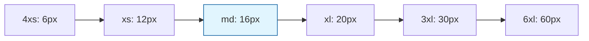

# Core Typography

Core typography tokens define the fundamental text properties that create consistent and accessible typography across our design system.

## Font Families

Core font families establish the typographic voice of your brand:

| Token                | Font Family                         | Purpose                              |
| -------------------- | ----------------------------------- | ------------------------------------ |
| `core.fonts.body`    | "Atkinson Hyperlegible", sans-serif | Body text, optimized for readability |
| `core.fonts.heading` | "Work Sans", sans-serif             | Headings and titles                  |
| `core.fonts.mono`    | "Inconsolata", sans-serif           | Code and monospaced content          |

### Usage Example

```tsx
<Text sx={{ fontFamily: 'body' }}>
  Readable body text using Atkinson Hyperlegible
</Text>

<Heading sx={{ fontFamily: 'heading' }}>
  Heading using Work Sans
</Heading>
```

## Font Sizes

Harmonious scale for all text sizes:

| Token | Value | rem      | Usage                |
| ----- | ----- | -------- | -------------------- |
| `4xs` | 6px   | 0.375rem | Fine print, captions |
| `3xs` | 8px   | 0.5rem   | Small labels         |
| `2xs` | 10px  | 0.625rem | Secondary text       |
| `xs`  | 12px  | 0.75rem  | Small text           |
| `sm`  | 14px  | 0.875rem | Small body text      |
| `md`  | 16px  | 1rem     | **Base body text**   |
| `lg`  | 18px  | 1.125rem | Large body text      |
| `xl`  | 20px  | 1.25rem  | Small headings       |
| `2xl` | 24px  | 1.5rem   | Medium headings      |
| `3xl` | 30px  | 1.875rem | Large headings       |
| `4xl` | 36px  | 2.25rem  | XL headings          |
| `5xl` | 48px  | 3rem     | Display text         |
| `6xl` | 60px  | 3.75rem  | Hero text            |

## Font Weights

Consistent weight scale for emphasis and hierarchy:

| Token        | Value | Usage                 |
| ------------ | ----- | --------------------- |
| `thin`       | 100   | Ultra-light text      |
| `extralight` | 200   | Very light text       |
| `light`      | 300   | Light text            |
| `normal`     | 400   | **Default body text** |
| `medium`     | 500   | Emphasis              |
| `semibold`   | 600   | Strong emphasis       |
| `bold`       | 700   | Headings              |
| `extrabold`  | 800   | Strong headings       |
| `black`      | 900   | Display text          |

## Letter Spacing

Fine-tune character spacing for readability:

| Token     | Value    | Usage               |
| --------- | -------- | ------------------- |
| `tighter` | -0.05em  | Tight headlines     |
| `tight`   | -0.025em | Slightly tight      |
| `normal`  | 0em      | **Default spacing** |
| `wide`    | 0.025em  | Comfortable reading |
| `wider`   | 0.05em   | Very readable       |
| `widest`  | 0.1em    | Display text        |

## Line Heights

Vertical rhythm for optimal readability:

| Token  | Value   | Usage                 |
| ------ | ------- | --------------------- |
| `xs`   | 1em     | Very tight            |
| `sm`   | 1.25em  | Tight                 |
| `base` | 1.5em   | **Default body text** |
| `lg`   | 1.625em | Comfortable           |
| `xl`   | 2em     | Very comfortable      |
| `2xl`  | 2.25em  | Spacious              |

## Complete Typography Implementation

### In Theme Configuration

```typescript
const coreFonts = {
  body: '"Atkinson Hyperlegible", sans-serif',
  heading: '"Work Sans", sans-serif',
  mono: '"Inconsolata", sans-serif',
};

const fontSizes = {
  '4xs': '0.375rem', // 6px
  '3xs': '0.5rem', // 8px
  // ... rest of scale
  '6xl': '3.75rem', // 60px
};

const fontWeights = {
  thin: 100,
  extralight: 200,
  light: 300,
  normal: 400,
  medium: 500,
  semibold: 600,
  bold: 700,
  extrabold: 800,
  black: 900,
};
```

### Component Usage

```tsx
// Using typography tokens in components
<Text sx={{
  fontFamily: 'body',
  fontSize: 'md',
  fontWeight: 'normal',
  lineHeight: 'base',
  letterSpacing: 'normal'
}}>
  Optimized body text
</Text>

<Heading sx={{
  fontFamily: 'heading',
  fontSize: '3xl',
  fontWeight: 'bold',
  lineHeight: 'sm',
  letterSpacing: 'wide'
}}>
  Heading with proper spacing
</Heading>
```

## Typography Scale Relationships

Our scale follows mathematical relationships for visual harmony:



**Base size (md: 16px)** serves as the foundation, with other sizes creating harmonious relationships.

## Accessibility Considerations

Our typography tokens ensure:

- **Readable font sizes**: Minimum 16px for body text
- **Sufficient line height**: At least 1.5 for body text
- **Clear hierarchy**: Distinct size differences between levels
- **High contrast**: Proper color combinations
- **Font loading**: Web font fallbacks included

### Font Loading Strategy

```typescript
// Fonts load with fallbacks
fonts: {
  body: '"Atkinson Hyperlegible", Arial, sans-serif',
  heading: '"Work Sans", Helvetica, sans-serif',
  mono: '"Inconsolata", "Courier New", monospace'
}
```

## Responsive Typography

Typography scales appropriately across breakpoints:

```tsx
// Responsive font sizes
<Heading
  sx={{
    fontSize: ['2xl', '3xl', '4xl'], // Mobile, tablet, desktop
    lineHeight: ['sm', 'base', 'lg'],
  }}
>
  Responsive heading
</Heading>
```

## Multi-Theme Typography

Different themes can use different font families while maintaining the same structure:

```typescript
// Bruttal Theme
fonts: {
  body: '"Atkinson Hyperlegible", sans-serif',
  heading: '"Work Sans", sans-serif'
}

// Oca Theme
fonts: {
  body: '"Source Sans Pro", sans-serif',
  heading: '"Outfit", sans-serif'
}
```
