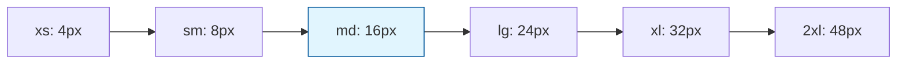

# Core Spacing

Core spacing tokens provide a consistent scale for margins, padding, gaps, and other spatial relationships throughout the design system.

## Spacing Scale

Our spacing scale follows a harmonious progression based on a 4px base unit:

| Token | Value | rem     | Usage                 |
| ----- | ----- | ------- | --------------------- |
| `0`   | 0px   | 0rem    | No spacing            |
| `1`   | 4px   | 0.25rem | Tiny spacing          |
| `2`   | 8px   | 0.5rem  | Small spacing         |
| `3`   | 12px  | 0.75rem | Compact spacing       |
| `4`   | 16px  | 1rem    | **Base spacing unit** |
| `5`   | 20px  | 1.25rem | Medium spacing        |
| `6`   | 24px  | 1.5rem  | Comfortable spacing   |
| `8`   | 32px  | 2rem    | Large spacing         |
| `10`  | 40px  | 2.5rem  | Extra large spacing   |
| `12`  | 48px  | 3rem    | Spacious              |
| `16`  | 64px  | 4rem    | Very spacious         |
| `20`  | 80px  | 5rem    | Maximum spacing       |

## Semantic Spacing Names

For better readability, we also provide semantic names:

| Semantic Token | Numeric Value | Usage               |
| -------------- | ------------- | ------------------- |
| `xs`           | `1` (4px)     | Minimal spacing     |
| `sm`           | `2` (8px)     | Small spacing       |
| `md`           | `4` (16px)    | **Default spacing** |
| `lg`           | `6` (24px)    | Large spacing       |
| `xl`           | `8` (32px)    | Extra large spacing |
| `2xl`          | `12` (48px)   | Maximum spacing     |

## Usage Examples

### Component Spacing

```tsx
// Using numeric scale
<Box sx={{
  padding: 4,        // 16px
  margin: 2,         // 8px
  gap: 3            // 12px
}}>
  Content
</Box>

// Using semantic names
<Box sx={{
  padding: 'md',     // 16px
  margin: 'sm',      // 8px
  gap: 'lg'         // 24px
}}>
  Content
</Box>
```

### Layout Spacing

```tsx
// Stack with consistent spacing
<Stack sx={{ gap: 'md' }}>
  <Card sx={{ padding: 'lg' }}>Card 1</Card>
  <Card sx={{ padding: 'lg' }}>Card 2</Card>
</Stack>

// Responsive spacing
<Box sx={{
  padding: ['sm', 'md', 'lg'], // Mobile, tablet, desktop
  margin: [2, 4, 6]
}}>
  Responsive content
</Box>
```

## Spacing Relationships

Our spacing scale maintains mathematical relationships for visual harmony:



**Base unit (md: 16px)** serves as the foundation for all spacing calculations.

## Implementation

### In Theme Configuration

```typescript
const spacing = {
  0: '0px',
  1: '0.25rem', // 4px
  2: '0.5rem', // 8px
  3: '0.75rem', // 12px
  4: '1rem', // 16px
  5: '1.25rem', // 20px
  6: '1.5rem', // 24px
  8: '2rem', // 32px
  10: '2.5rem', // 40px
  12: '3rem', // 48px
  16: '4rem', // 64px
  20: '5rem', // 80px
};

// Semantic aliases
const semanticSpacing = {
  xs: spacing[1], // 4px
  sm: spacing[2], // 8px
  md: spacing[4], // 16px
  lg: spacing[6], // 24px
  xl: spacing[8], // 32px
  '2xl': spacing[12], // 48px
};
```

### Component Integration

```tsx
// Theme UI automatically maps spacing values
<Box
  sx={{
    p: 4, // padding: 1rem (16px)
    m: 2, // margin: 0.5rem (8px)
    px: 'lg', // padding-left/right: 1.5rem (24px)
    py: 'sm', // padding-top/bottom: 0.5rem (8px)
  }}
/>
```

## Spacing Guidelines

### Content Spacing

- **Text blocks**: Use `md` (16px) for paragraph spacing
- **Headings**: Use `lg` (24px) for section separation
- **Lists**: Use `sm` (8px) between list items

### Component Spacing

- **Card padding**: Use `lg` (24px) for comfortable content area
- **Button padding**: Use `sm` to `md` (8px-16px) for touch targets
- **Form spacing**: Use `md` (16px) between form fields

### Layout Spacing

- **Section gaps**: Use `xl` to `2xl` (32px-48px) for major sections
- **Grid gaps**: Use `md` to `lg` (16px-24px) for content grids
- **Container padding**: Use `lg` to `xl` (24px-32px) for page margins

## Responsive Spacing

Spacing can adapt to different screen sizes:

```tsx
// Responsive spacing array
<Box sx={{
  padding: [
    'sm',  // Mobile: 8px
    'md',  // Tablet: 16px
    'lg'   // Desktop: 24px
  ]
}} />

// Responsive numeric values
<Stack sx={{
  gap: [2, 4, 6] // 8px, 16px, 24px
}}>
  <Item />
  <Item />
</Stack>
```

## Accessibility

Proper spacing improves accessibility by:

- **Touch targets**: Minimum 44px (11 units) for interactive elements
- **Reading flow**: Adequate spacing between text blocks
- **Visual hierarchy**: Clear separation between content sections
- **Focus indicators**: Sufficient padding around focusable elements
