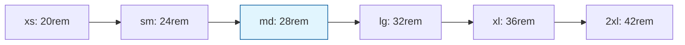

# Core Sizing

Core sizing tokens define width and height values for components, containers, and layout elements.

## Size Scale

Our size scale provides semantic names for common sizing needs:

| Token  | Value          | Usage                          |
| ------ | -------------- | ------------------------------ |
| `max`  | max-content    | Shrink to content size         |
| `min`  | min-content    | Expand to minimum needed       |
| `full` | 100%           | Full width/height of container |
| `3xs`  | 14rem (224px)  | Very small components          |
| `2xs`  | 16rem (256px)  | Small components               |
| `xs`   | 20rem (320px)  | Small containers               |
| `sm`   | 24rem (384px)  | Medium containers              |
| `md`   | 28rem (448px)  | Standard containers            |
| `lg`   | 32rem (512px)  | Large containers               |
| `xl`   | 36rem (576px)  | Extra large containers         |
| `2xl`  | 42rem (672px)  | Very large containers          |
| `3xl`  | 48rem (768px)  | Maximum containers             |
| `4xl`  | 56rem (896px)  | Ultra wide containers          |
| `5xl`  | 64rem (1024px) | Huge containers                |
| `6xl`  | 72rem (1152px) | Massive containers             |
| `7xl`  | 80rem (1280px) | Enormous containers            |
| `8xl`  | 90rem (1440px) | Maximum width                  |

## Container Sizes

Predefined container sizes for layouts:

| Token          | Value  | Usage                        |
| -------------- | ------ | ---------------------------- |
| `container.sm` | 640px  | Mobile breakpoint container  |
| `container.md` | 768px  | Tablet breakpoint container  |
| `container.lg` | 1024px | Desktop breakpoint container |
| `container.xl` | 1280px | Large desktop container      |

## Usage Examples

### Component Sizing

```tsx
// Card with predefined size
<Card sx={{ width: 'md', height: 'sm' }}>
  Standard card size
</Card>

// Modal with responsive sizing
<Modal sx={{
  width: ['full', 'lg', 'xl'], // Mobile, tablet, desktop
  height: ['full', 'auto', 'auto']
}}>
  Modal content
</Modal>
```

### Container Layouts

```tsx
// Responsive container
<Container sx={{ maxWidth: 'container.lg' }}>
  Centered content with max width
</Container>

// Flexible sizing
<Box sx={{
  width: 'full',    // Takes full width
  minWidth: 'sm',   // Minimum width
  maxWidth: 'lg'    // Maximum width
}}>
  Flexible content
</Box>
```

### Form Components

```tsx
// Input with standard sizing
<Input sx={{ width: 'md' }} />

// Button with adaptive sizing
<Button sx={{
  width: ['full', 'auto'], // Full width on mobile, auto on desktop
  minWidth: 'xs'          // Minimum touch target
}}>
  Submit
</Button>
```

## Implementation

### In Theme Configuration

```typescript
const sizes = {
  // Utility sizes
  max: 'max-content',
  min: 'min-content',
  full: '100%',

  // Component sizes
  '3xs': '14rem',
  '2xs': '16rem',
  xs: '20rem',
  sm: '24rem',
  md: '28rem',
  lg: '32rem',
  xl: '36rem',
  '2xl': '42rem',
  '3xl': '48rem',
  '4xl': '56rem',
  '5xl': '64rem',
  '6xl': '72rem',
  '7xl': '80rem',
  '8xl': '90rem',

  // Container sizes
  container: {
    sm: '640px',
    md: '768px',
    lg: '1024px',
    xl: '1280px',
  },
};
```

### Component Integration

```tsx
// Using size tokens in components
<Box sx={{
  width: 'lg',      // 32rem (512px)
  height: 'md',     // 28rem (448px)
  maxWidth: 'full'  // 100%
}} />

// Responsive sizing
<Grid sx={{
  width: 'full',
  maxWidth: ['container.sm', 'container.md', 'container.lg']
}}>
  <GridItem />
</Grid>
```

## Sizing Guidelines

### Component Sizing

- **Cards**: Use `sm` to `lg` for content cards
- **Modals**: Use `md` to `xl` for modal dialogs
- **Sidebars**: Use `xs` to `sm` for navigation sidebars
- **Forms**: Use `md` to `lg` for form containers

### Container Sizing

- **Page containers**: Use `container.*` tokens for main content areas
- **Section containers**: Use `4xl` to `8xl` for full-width sections
- **Content containers**: Use `2xl` to `4xl` for readable content width

### Responsive Sizing

- **Mobile first**: Start with smaller sizes, scale up
- **Breakpoint alignment**: Use container sizes that match breakpoints
- **Fluid sizing**: Combine fixed sizes with percentage-based sizing

## Responsive Sizing Patterns

### Mobile-First Approach

```tsx
// Start small, scale up
<Box
  sx={{
    width: ['full', 'lg', 'xl'], // Mobile, tablet, desktop
    padding: ['sm', 'md', 'lg'],
  }}
>
  Responsive content
</Box>
```

### Container Queries

```tsx
// Adaptive to container size
<Card
  sx={{
    width: 'full',
    maxWidth: 'container.md',
    '& .content': {
      width: ['full', 'lg'],
    },
  }}
>
  Container-aware content
</Card>
```

## Accessibility Considerations

Proper sizing improves accessibility:

- **Touch targets**: Minimum 44px (11 spacing units) for interactive elements
- **Reading width**: Maximum 75 characters per line for readability
- **Viewport sizing**: Responsive sizing for different devices
- **Zoom support**: Relative units (rem) scale with user preferences

### Recommended Minimums

```tsx
// Interactive elements
<Button sx={{
  minWidth: '2.75rem',  // 44px minimum
  minHeight: '2.75rem'  // 44px minimum
}} />

// Content areas
<Text sx={{
  maxWidth: '65ch',     // Optimal reading width
  lineHeight: 'base'    // Comfortable line spacing
}} />
```

## Size Relationships

Sizes follow logical relationships for visual harmony:



Each size step provides meaningful differentiation while maintaining visual balance.

## Multi-Theme Sizing

Sizing tokens remain consistent across themes, but components may interpret them differently:

```typescript
// Same size tokens
sizes: {
  md: '28rem',
  lg: '32rem'
}

// Different component implementations
// Bruttal Theme - bold, larger components
// Oca Theme - minimal, compact components
```
