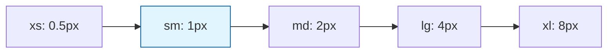

# Core Borders

Core border tokens define border widths and border radius values that create consistent edges and shapes throughout the design system.

## Border Widths

Standard border width scale for components:

| Token  | Value       | Usage               |
| ------ | ----------- | ------------------- |
| `none` | 0px solid   | No border           |
| `xs`   | 0.5px solid | Hairline border     |
| `sm`   | 1px solid   | **Standard border** |
| `md`   | 2px solid   | Medium border       |
| `lg`   | 4px solid   | Thick border        |
| `xl`   | 8px solid   | Extra thick border  |

## Border Radius

Border radius scale for rounded corners:

| Token  | Value     | rem  | Usage                   |
| ------ | --------- | ---- | ----------------------- |
| `none` | 0         | 0rem | Sharp corners           |
| `2xs`  | 0.0625rem | 1px  | Minimal rounding        |
| `xs`   | 0.125rem  | 2px  | Subtle rounding         |
| `sm`   | 0.25rem   | 4px  | **Standard rounding**   |
| `md`   | 0.375rem  | 6px  | Medium rounding         |
| `lg`   | 0.5rem    | 8px  | Large rounding          |
| `xl`   | 0.75rem   | 12px | Extra large rounding    |
| `2xl`  | 1rem      | 16px | Very large rounding     |
| `3xl`  | 1.5rem    | 24px | Huge rounding           |
| `4xl`  | 2rem      | 32px | Maximum rounding        |
| `full` | 9999px    | -    | **Perfect circle/pill** |

## Usage Examples

### Component Borders

```tsx
// Card with standard border
<Card sx={{
  border: 'sm',           // 1px solid
  borderColor: 'muted',   // Uses semantic color
  borderRadius: 'md'      // 6px
}}>
  Card content
</Card>

// Button with thick border
<Button sx={{
  border: 'lg',           // 4px solid
  borderRadius: 'sm'      // 4px
}}>
  Bold button
</Button>
```

### Input Components

```tsx
// Input with focus styles
<Input sx={{
  border: 'sm',                    // 1px solid
  borderRadius: 'sm',              // 4px
  ':focus': {
    border: 'md'                   // 2px solid on focus
  }
}} />

// Rounded search input
<Input sx={{
  border: 'sm',
  borderRadius: 'full'             // Pill shape
}} />
```

### Layout Elements

```tsx
// Section with subtle border
<Box sx={{
  borderTop: 'xs',                 // 0.5px hairline
  borderRadius: 'none'             // Sharp corners
}}>
  Section content
</Box>

// Modal with rounded corners
<Modal sx={{
  border: 'none',                  // No border
  borderRadius: 'xl'               // 12px rounding
}}>
  Modal content
</Modal>
```

## Implementation

### In Theme Configuration

```typescript
const borders = {
  none: '0px solid',
  xs: '0.5px solid',
  sm: '1px solid', // Most common
  md: '2px solid',
  lg: '4px solid',
  xl: '8px solid',
};

const radii = {
  none: '0',
  '2xs': '0.0625rem', // 1px
  xs: '0.125rem', // 2px
  sm: '0.25rem', // 4px - Most common
  md: '0.375rem', // 6px
  lg: '0.5rem', // 8px
  xl: '0.75rem', // 12px
  '2xl': '1rem', // 16px
  '3xl': '1.5rem', // 24px
  '4xl': '2rem', // 32px
  full: '9999px', // Perfect circle
};
```

### Theme UI Integration

```tsx
// Border properties map automatically
<Box sx={{
  border: 'sm',                    // Uses borders.sm
  borderColor: 'primary',          // Uses color token
  borderRadius: 'md'               // Uses radii.md
}} />

// Individual border sides
<Box sx={{
  borderTop: 'md',
  borderLeft: 'sm',
  borderRight: 'sm',
  borderBottom: 'lg'
}} />
```

## Border Guidelines

### Component Borders

- **Cards**: Use `sm` (1px) border with `md` (6px) radius
- **Buttons**: Use `sm` to `md` borders with `sm` (4px) radius
- **Inputs**: Use `sm` (1px) border with `sm` (4px) radius
- **Modals**: Use `none` border with `lg` to `xl` radius

### Border Radius Usage

- **Subtle rounding**: `sm` (4px) for most components
- **Comfortable rounding**: `md` (6px) for cards and containers
- **Pill shapes**: `full` for badges, tags, and rounded buttons
- **Large rounding**: `xl`+ for modals and hero sections

### Border Color Combinations

```tsx
// Standard component border
<Card sx={{
  border: 'sm',
  borderColor: 'display.border.muted.default'  // Semantic color
}} />

// Error state border
<Input sx={{
  border: 'md',
  borderColor: 'input.border.negative.default'  // Error color
}} />

// Focus state border
<Button sx={{
  border: 'sm',
  ':focus': {
    border: 'md',
    borderColor: 'action.border.primary.default'
  }
}} />
```

## Responsive Borders

Borders can adapt to different screen sizes:

```tsx
// Responsive border thickness
<Card sx={{
  border: ['xs', 'sm', 'md'],      // Thicker on larger screens
  borderRadius: ['sm', 'md', 'lg'] // More rounding on larger screens
}} />

// Mobile-first approach
<Box sx={{
  border: 'sm',
  borderRadius: ['none', 'sm'],    // No rounding on mobile
  '@media (max-width: 640px)': {
    border: 'xs'                   // Thinner border on mobile
  }
}} />
```

## Accessibility Considerations

Border design affects accessibility:

- **Focus indicators**: Use thicker borders (`md`-`lg`) for focus states
- **High contrast**: Ensure sufficient contrast between borders and backgrounds
- **Touch targets**: Borders don't reduce touch target size (use outline for focus)
- **Reduced motion**: Border radius changes should respect `prefers-reduced-motion`

### Accessible Focus Styles

```tsx
<Button
  sx={{
    border: 'sm',
    ':focus': {
      // Don't use border for focus (affects layout)
      outline: '2px solid',
      outlineColor: 'action.border.primary.default',
      outlineOffset: '2px',
    },
  }}
/>
```

## Border Relationships

Border values follow logical progressions:



**Standard border (sm: 1px)** serves as the most common border weight.

## Theme Variations

Different themes can emphasize borders differently:

```typescript
// Bruttal Theme - Bold borders
radii: {
  sm: '0.25rem',    // Minimal rounding
  md: '0.25rem',    // Consistent minimal
  lg: '0.25rem'     // Sharp, bold aesthetic
}

// Oca Theme - Soft borders
radii: {
  sm: '0.375rem',   // More rounding
  md: '0.5rem',     // Comfortable
  lg: '0.75rem'     // Soft, friendly aesthetic
}
```
