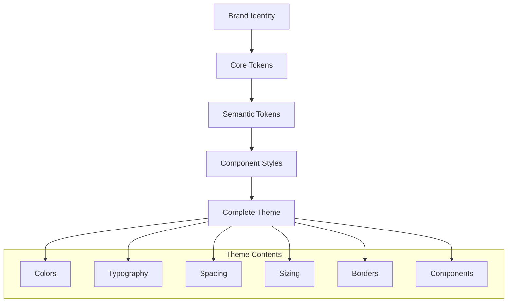

# Theme

A theme is a complete design system implementation that combines core tokens, semantic tokens, and component styles to create a cohesive visual identity.

## What is a Theme?

A theme represents a **complete visual personality** for your application - it's where design decisions become code that components can consume.



## Theme Architecture

### Core Token Foundation

Themes start with [core tokens](/docs/design/design-system/design-tokens/core-tokens) that define brand essentials:

```typescript
// Core brand colors
const coreColors = {
  main: '#292C2a', // Primary brand color
  accent: '#0469E3', // Secondary brand color
  complimentary: '#f4f3f3', // Supporting color
  // ... functional colors
};
```

### Semantic Token Layer

[Semantic tokens](/docs/design/design-system/design-tokens/semantic-tokens) map core tokens to UI contexts:

```typescript
colors: {
  action: {
    background: {
      primary: { default: coreColors.main },
      secondary: { default: coreColors.gray200 }
    },
    text: {
      primary: { default: coreColors.black },
      secondary: { default: coreColors.white }
    }
  }
}
```

### Component Integration

Components consume semantic tokens through variants:

```typescript
buttons: {
  primary: {
    backgroundColor: 'action.background.primary.default',
    color: 'action.text.secondary.default',
    ':hover': {
      filter: 'brightness(90%)'
    }
  }
}
```

## Theme Examples

### Bruttal Theme

Bold, high-contrast design with sharp edges:

| Aspect         | Approach                                       |
| -------------- | ---------------------------------------------- |
| **Colors**     | High contrast, bold brand colors               |
| **Typography** | Strong, readable fonts (Atkinson Hyperlegible) |
| **Borders**    | Minimal radius, sharp corners                  |
| **Spacing**    | Generous, clear hierarchy                      |

```typescript
// Bruttal theme characteristics
const bruttalColors = {
  main: '#292C2a', // Deep charcoal
  accent: '#0469E3', // Bright blue
  complimentary: '#f4f3f3', // Off-white
};

const bruttalRadii = {
  sm: '0.25rem', // Minimal rounding
  md: '0.25rem', // Consistent minimal
  lg: '0.25rem', // Sharp aesthetic
};
```

### Oca Theme

Soft, friendly design with rounded elements:

| Aspect         | Approach                             |
| -------------- | ------------------------------------ |
| **Colors**     | Softer contrasts, warm palette       |
| **Typography** | Approachable fonts (Source Sans Pro) |
| **Borders**    | Generous radius, soft corners        |
| **Spacing**    | Comfortable, inviting hierarchy      |

```typescript
// Oca theme characteristics
const ocaColors = {
  main: '#111827', // Soft black
  accent: '#03FF7A', // Bright green
  complimentary: '#FFFFFF', // Pure white
};

const ocaRadii = {
  sm: '0.375rem', // More rounding
  md: '0.5rem', // Comfortable
  lg: '0.75rem', // Soft aesthetic
};
```

## Theme Structure

### Complete Theme Definition

```typescript
export const MyTheme: Theme = {
  // 1. Core tokens (inherited from defaults)
  fontSizes: defaultTheme.fontSizes,
  space: defaultTheme.space,

  // 2. Theme-specific core tokens
  fonts: {
    body: '"Custom Font", sans-serif',
    heading: '"Custom Heading", sans-serif',
  },

  // 3. Semantic color tokens
  colors: {
    action: {
      background: {
        primary: { default: coreColors.main },
        secondary: { default: coreColors.gray200 },
      },
      text: {
        primary: { default: coreColors.black },
        secondary: { default: coreColors.white },
      },
    },
    // ... other contexts
  },

  // 4. Component styles
  buttons: {
    primary: {
      backgroundColor: 'action.background.primary.default',
      color: 'action.text.secondary.default',
    },
  },

  // 5. Global styles
  styles: {
    root: {
      fontFamily: 'body',
      backgroundColor: 'navigation.background.primary.default',
    },
  },
};
```

## Theme Implementation

### Creating a Theme

1. **Define Core Brand Values**

```typescript
const coreColors = {
  main: '#your-brand-color',
  accent: '#your-accent-color',
  // ... other brand colors
};
```

2. **Map to Semantic Contexts**

```typescript
colors: {
  action: {
    background: {
      primary: { default: coreColors.main }
    }
  }
}
```

3. **Configure Components**

```typescript
buttons: {
  primary: {
    backgroundColor: 'action.background.primary.default';
  }
}
```

4. **Test Across Components**

```bash
npm run storybook
```

### Using a Theme

```tsx
import { ThemeProvider } from '@ttoss/ui';
import { BruttalTheme } from '@ttoss/theme/Bruttal';

export const App = () => (
  <ThemeProvider theme={BruttalTheme}>
    <YourAppContent />
  </ThemeProvider>
);
```

## Theme Benefits

### Consistency

- **Unified appearance** across all components
- **Predictable behavior** for similar UI elements
- **Coherent user experience** throughout the application

### Maintainability

- **Single source of truth** for design decisions
- **Centralized updates** propagate everywhere
- **Easy theme switching** without code changes

### Scalability

- **New components** automatically inherit theme values
- **Design system evolution** doesn't break existing code
- **Multi-brand support** through different themes

## Multi-Theme Support

Themes enable brand flexibility while maintaining code consistency:

```typescript
// Same component, different themes
<Button variant="primary">Click me</Button>

// Bruttal theme: Bold, sharp button
// Oca theme: Soft, rounded button
// Custom theme: Your brand's personality
```

### Theme Switching

```tsx
const [currentTheme, setTheme] = useState(BruttalTheme);

return (
  <ThemeProvider theme={currentTheme}>
    <ThemeSelector onThemeChange={setTheme} />
    <YourApp />
  </ThemeProvider>
);
```

## Best Practices

### Theme Organization

- **Start with core tokens** before semantic mapping
- **Define complete semantic contexts** for consistency
- **Configure all component variants** used in your app
- **Test theme switching** to ensure robustness

### Token Usage

- **Use semantic tokens** in components, not core tokens directly
- **Maintain consistent naming** across themes
- **Include all interaction states** (hover, focus, disabled)
- **Document theme-specific decisions** for future maintainers

### Performance

- **Freeze core tokens** to prevent mutations
- **Lazy load themes** for multi-theme applications
- **Optimize bundle size** by importing only needed themes

## Accessibility in Themes

Themes must maintain accessibility standards:

- **Color contrast ratios** meet WCAG guidelines
- **Focus indicators** are clearly visible
- **Interactive states** provide clear feedback
- **Text remains readable** at all sizes

```typescript
// Ensure sufficient contrast
colors: {
  action: {
    background: { primary: { default: '#0066cc' } }, // 4.5:1 contrast
    text: { secondary: { default: '#ffffff' } }       // High contrast
  }
}
```

## Next Steps

- **[Components](/docs/design/design-system/components)**: How themes are consumed by components
- **[Core Tokens](/docs/design/design-system/design-tokens/core-tokens)**: Foundation values for themes
- **[Semantic Tokens](/docs/design/design-system/design-tokens/semantic-tokens)**: Contextual token application
- **[Implementation Guide](/docs/design/design-system/design-tokens/implementation)**: Technical implementation details
- **[Storybook](https://storybook.ttoss.dev)**: See themes in action
