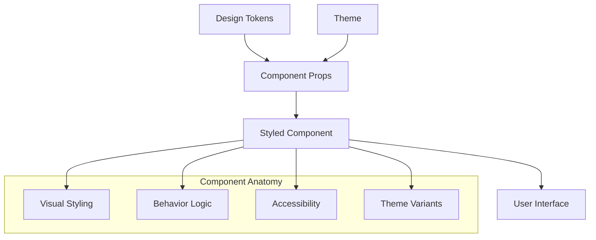

# Components

Components are the building blocks of the ttoss design system. They are reusable UI elements that consume [design tokens](/docs/design/design-system/design-tokens) and [themes](/docs/design/design-system/theme) to create consistent, accessible interfaces.

## What is a Component?

A **component** in our design system is a reusable piece of UI that combines:

- **Visual styling** from design tokens
- **Interaction behavior** through props and state
- **Accessibility features** built-in by default
- **Theme integration** for consistent appearance



## Component Architecture

### Foundation Components

**Purpose**: Basic building blocks for interfaces

Examples: `Button`, `Input`, `Text`, `Box`, `Flex`

```tsx
// Simple foundation component
import { Button } from '@ttoss/ui';

<Button variant="primary">Click me</Button>;
```

### Pattern Components

**Purpose**: Complex compositions combining multiple foundation components

Examples: `Card`, `Modal`, `Drawer`, `Table`

```tsx
// Pattern component combining multiple elements
import { Card } from '@ttoss/ui';

<Card>
  <Card.Title>Card Header</Card.Title>
  <Card.Body>Main content goes here</Card.Body>
  <Card.Footer>Actions or metadata</Card.Footer>
</Card>;
```

## How Components Use Tokens

### Semantic Token Integration

Components consume [semantic tokens](/docs/design/design-system/design-tokens/semantic-tokens) through theme variants:

```tsx
// Component variants defined in theme
export const BruttalTheme: Theme = {
  buttons: {
    primary: {
      backgroundColor: 'action.background.primary.default',
      color: 'action.text.secondary.default',
      ':hover': {
        backgroundColor: 'action.background.primary.active',
      },
    },
  },
};

// Component automatically applies variant styles
<Button variant="primary">Primary Button</Button>;
```

### Direct Token Access

Components can also access tokens directly through the `sx` prop:

```tsx
<Box
  sx={{
    backgroundColor: 'display.background.secondary.default',
    color: 'display.text.primary.default',
    padding: 'lg',
    borderRadius: 'md',
  }}
>
  Custom styled content
</Box>
```

## Component Types

### Basic Components

Single-purpose elements with straightforward APIs:

```tsx
// Text component
<Text variant="body">Simple text content</Text>

// Input component
<Input
  placeholder="Enter text..."
  leadingIcon="search"
  trailingIcon="close"
/>
```

### Compound Components

Components that provide multiple related sub-components:

```tsx
// Card compound component
<Card>
  <Card.Title>Project Overview</Card.Title>
  <Card.Body>
    <Text>Project details and statistics</Text>
  </Card.Body>
  <Card.Footer>
    <Button variant="primary">View Details</Button>
  </Card.Footer>
</Card>

// Layout compound component
<Layout>
  <Layout.Header>
    <Text variant="heading">App Title</Text>
  </Layout.Header>
  <Layout.Sidebar>
    <Navigation />
  </Layout.Sidebar>
  <Layout.Main>
    <MainContent />
  </Layout.Main>
</Layout>
```

### Higher-Order Components

Components that wrap and enhance other components:

```tsx
// FormField wraps input components with labels and validation
<FormField name="email" label="Email Address">
  <Input type="email" />
</FormField>

// Modal wraps content with overlay and positioning
<Modal isOpen={isOpen} onClose={handleClose}>
  <ModalContent />
</Modal>
```

## Component Implementation Patterns

### Theme-Aware Styling

All components use the Theme UI `sx` prop for styling:

```tsx
export const Button = ({ variant = 'primary', ...props }) => {
  return (
    <button
      {...props}
      sx={{
        // Maps to theme.buttons[variant]
        variant: `buttons.${variant}`,
        cursor: 'pointer',
        ':disabled': {
          cursor: 'not-allowed',
        },
        ...props.sx, // Allow style overrides
      }}
    />
  );
};
```

### Responsive Design

Components support responsive values through arrays:

```tsx
<Box
  sx={{
    padding: ['sm', 'md', 'lg'], // Responsive padding
    fontSize: ['md', 'lg', 'xl'], // Responsive font size
    flexDirection: ['column', 'row'], // Responsive layout
  }}
>
  Responsive content
</Box>
```

### Accessibility Built-In

Components include accessibility features by default:

```tsx
export const IconButton = ({ 'aria-label': ariaLabel, ...props }) => {
  return (
    <button
      {...props}
      type="button"
      aria-label={ariaLabel}
      sx={{
        cursor: 'pointer',
        ':focus': {
          outline: '2px solid',
          outlineColor: 'action.border.accent.default',
        },
      }}
    />
  );
};
```

## Using Components

### Installation and Setup

```bash
npm install @ttoss/ui @ttoss/theme
```

```tsx
import { ThemeProvider } from '@ttoss/ui';
import { BruttalTheme } from '@ttoss/theme/Bruttal';

export const App = () => (
  <ThemeProvider theme={BruttalTheme}>
    <YourApplication />
  </ThemeProvider>
);
```

### Basic Usage

```tsx
import { Button, Box, Text, Flex } from '@ttoss/ui';

export const Example = () => (
  <Box sx={{ padding: 'lg' }}>
    <Text variant="heading">Welcome</Text>
    <Flex sx={{ gap: 'md', marginTop: 'md' }}>
      <Button variant="primary">Get Started</Button>
      <Button variant="secondary">Learn More</Button>
    </Flex>
  </Box>
);
```

### Advanced Patterns

```tsx
import { Card, Badge, Input, Select } from '@ttoss/ui';

export const UserProfile = () => (
  <Card>
    <Card.Title>
      <Flex sx={{ alignItems: 'center', justifyContent: 'space-between' }}>
        <Text>User Profile</Text>
        <Badge variant="positive">Active</Badge>
      </Flex>
    </Card.Title>
    <Card.Body>
      <Flex sx={{ flexDirection: 'column', gap: 'md' }}>
        <Input label="Full Name" placeholder="Enter your name" />
        <Select
          label="Role"
          options={[
            { label: 'Admin', value: 'admin' },
            { label: 'User', value: 'user' },
          ]}
        />
      </Flex>
    </Card.Body>
    <Card.Footer>
      <Flex sx={{ gap: 'sm', justifyContent: 'flex-end' }}>
        <Button variant="secondary">Cancel</Button>
        <Button variant="primary">Save Changes</Button>
      </Flex>
    </Card.Footer>
  </Card>
);
```

## Component Categories

### Layout Components

- **`Box`**: Basic container with styling capabilities
- **`Flex`**: Flexbox container for flexible layouts
- **`Grid`**: CSS Grid container for complex layouts
- **`Container`**: Centered container with max-width

### Form Components

- **`Input`**: Text input with icons and validation states
- **`Select`**: Dropdown selection with search capabilities
- **`Button`**: Interactive buttons with multiple variants
- **`Checkbox`**, **`Radio`**: Selection controls
- **`Switch`**: Toggle switch for boolean values

### Data Display

- **`Text`**: Typography with semantic variants
- **`Heading`**: Heading hierarchy (h1-h6)
- **`Badge`**: Status indicators and labels
- **`Card`**: Content containers with header/body/footer
- **`Table`**: Data tables with sorting and filtering

### Feedback Components

- **`Spinner`**: Loading indicators
- **`Toast`**: Temporary notifications
- **`Modal`**: Overlay dialogs
- **`Tooltip`**: Contextual help information

## Semantic Icons and Centralized Icon Tokens

To ensure visual consistency and maintainability, ttoss components use a centralized set of semantic icon tokens defined in the design system. These tokens include icons for common UI states and feedback, such as `info`, `warning`, `error`, and `success`.

### Tooltip Icon in Labels

For example, the `Label` component always uses the `info` icon from the design system as the tooltip trigger. This principle applies across all ttoss components: whenever a component needs a semantic icon (for tooltips, warnings, errors, etc.), it references the central icon token defined in the design system.

This approach guarantees:

- Consistent iconography across all components
- Easy updates and theme customization
- Clear mapping between UI states and their visual representation

#### Example

```tsx
import { Label } from '@ttoss/ui';

<Label tooltip={{ children: 'More info', place: 'top' }}>Field Label</Label>;
```

In this example, the tooltip icon is always the `info` icon, as defined in the design system's icon tokens. Other components (e.g., `Input`, `Button`, `Badge`) use the appropriate semantic icon for their state, such as `warning` for caution or `error` for validation errors.

> **See all defined icons:** [Design System Icons Storybook](https://storybook.ttoss.dev/?path=/docs/design-system-icons--docs)

#### Icon Token Reference

All semantic icons are defined centrally and can be themed or replaced as needed. See [semantic tokens documentation](/docs/design/design-system/design-tokens/semantic-tokens/semantic-colors) for details on customizing icon tokens.

> **Tip:** By using centralized icon tokens, you ensure that your UI remains visually coherent and easy to maintain as your design system evolves.

---

## Best Practices

### Component Usage

- **Use semantic variants** instead of custom styling when possible
- **Leverage compound components** for complex UI patterns
- **Apply responsive design** through token arrays
- **Maintain accessibility** by providing proper labels and ARIA attributes

### Styling Guidelines

```tsx
// ✅ Good: Use semantic tokens and variants
<Button variant="primary">Submit</Button>

<Box sx={{
  backgroundColor: 'display.background.secondary.default',
  padding: 'lg'
}}>
  Content
</Box>

// ❌ Avoid: Direct CSS values
<Button style={{ backgroundColor: '#0066cc' }}>Submit</Button>
```

### Accessibility Considerations

- Always provide meaningful labels for interactive elements
- Use proper heading hierarchy
- Ensure sufficient color contrast
- Test with keyboard navigation
- Include screen reader support

## Next Steps

- **[Browse all components](https://storybook.ttoss.dev)** - Interactive component library
- **[Explore themes](/docs/design/design-system/theme)** - How components integrate with themes
- **[Design tokens](/docs/design/design-system/design-tokens)** - Understand the foundation layer

## Resources

- **[Component Storybook](https://storybook.ttoss.dev)** - Interactive examples and documentation
- **[Theme UI Documentation](https://theme-ui.com/)** - Underlying styling system
- **[Accessibility Guidelines](https://www.w3.org/WAI/WCAG21/quickref/)** - WCAG compliance reference
