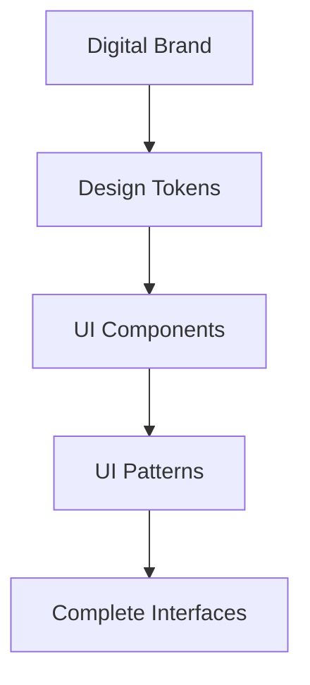

# Design System

The ttoss Design System provides a comprehensive foundation for building consistent, accessible, and scalable digital products.

## Core Principles

**1. Easy to use**  
Make it simple for newcomers to adopt our system. Easy to use means easy to change and experiment with, enabling rapid iteration.

**2. Simple with minimal dependencies**  
Focus on small, focused APIs that cover common use cases while keeping complexity low.

**3. Flexible, not rigid**  
Balance standardization with creative freedom. Enable both efficient standard builds and innovative custom solutions.

## System Architecture

Our design system follows an **inside-out architecture** - each layer builds upon the previous one:

### Layer 1: Digital Brand

**Purpose**: Define brand guidelines for digital interfaces

- Logo usage and variations
- Brand color palette
- Typography hierarchy
- Photography and imagery styles
- Voice and tone guidelines

### Layer 2: [Design Tokens](/docs/design/design-system/design-tokens)

**Purpose**: Codify brand concepts into reusable values

- **[Core Tokens](/docs/design/design-system/design-tokens/core-tokens)**: Raw brand values (colors, fonts, spacing)
- **[Semantic Tokens](/docs/design/design-system/design-tokens/semantic-tokens)**: Context-specific applications (button colors, text hierarchy)
- **[Theme Definition](/docs/design/design-system/theme)**: Complete implementations combining tokens and component styles

### Layer 3: [UI Components](/docs/design/design-system/components)

**Purpose**: Provide building blocks for interfaces

- **Foundations**: Basic elements (Button, Input, Text)
- **Patterns**: Complex compositions (Forms, Navigation, Cards)

### Layer 4: UI Patterns

**Purpose**: Complete interface solutions

- Page templates
- Layout patterns
- Interaction flows

## Multi-Brand Support

Our system excels at supporting multiple brands through:

- **Theme Switching**: Different brands using the same component library
- **Token Override**: Brand-specific values while maintaining structure
- **Flexible Components**: Adaptable to various visual styles

## Key Benefits

- **Single Source of Truth**: Centralized design decisions
- **Cross-Team Collaboration**: Shared vocabulary between design and engineering
- **Rapid Prototyping**: Quick testing and iteration
- **Visual Consistency**: Unified experience across products
- **Scalability**: Support for multiple products and brands

## Getting Started

1. **[Install the packages](/docs/design/getting-started)** - Quick setup guide
2. **[Explore tokens](/docs/design/design-system/design-tokens)** - Understand the foundation
3. **[Browse components](https://storybook.ttoss.dev)** - See what's available
