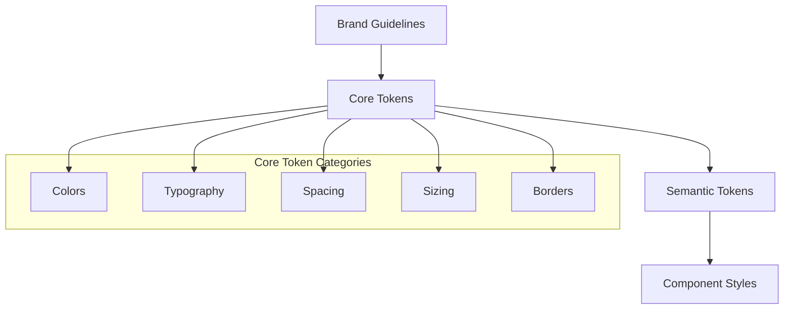

# Core Tokens Overview

Core tokens are the foundation of our design system - they store raw brand values that get referenced by semantic tokens throughout the system.

## Purpose

Core tokens capture **essential brand attributes** with minimal abstraction:

- Store the actual brand values (colors, fonts, spacing)
- Provide consistent foundation across all themes
- Enable brand flexibility while maintaining system structure
- Serve as single source of truth for brand decisions

## Naming Philosophy

Core tokens use **descriptive naming** that reflects **what** the value is, not **where** it's used:

✅ **Good**: `core.colors.main`, `core.fonts.fontSize.lg`  
❌ **Avoid**: `core.colors.buttonBackground`, `core.fonts.headerSize`

## Token Categories

### [Colors](/docs/design/design-system/core-tokens/colors)

Brand colors organized by type and variation:

```
core.colors.main: #292C2a
core.colors.accent: #0469E3
core.colors.gray.500: #929292
core.colors.red.700: #c62121
```

### [Typography](/docs/design/design-system/core-tokens/typography)

Font families, sizes, weights, and spacing:

```
core.fonts.brand.main: "Atkinson Hyperlegible"
core.fonts.fontSize.lg: 18px
core.fonts.fontWeight.bold: 700
core.fonts.letterSpacing.wide: 0.05em
```

### [Spacing](/docs/design/design-system/core-tokens/spacing)

Base spacing scale for margins, padding, and gaps:

```
core.spacing.xs: 4px
core.spacing.md: 16px
core.spacing.xl: 32px
core.spacing.2xl: 48px
```

### [Sizing](/docs/design/design-system/core-tokens/sizing)

Size values for components and layout:

```
core.sizes.sm: 24rem
core.sizes.container.lg: 1024px
core.sizes.icon.md: 24px
```

### [Borders](/docs/design/design-system/core-tokens/borders)

Border weights and border radius values:

```
core.borders.sm: 1px solid
core.borders.lg: 4px solid
core.radii.sm: 0.25rem
core.radii.full: 9999px
```

## Current Implementation

Our core tokens are implemented in the theme files and available through:

```tsx
// Access through theme object
const { theme } = useTheme();
const mainColor = theme.colors.main; // Maps to core.colors.main

// Use in sx prop (automatic token resolution)
<Box sx={{ color: 'main', padding: 'lg' }} />;
```

## Token Hierarchy



## Multi-Brand Support

Core tokens enable multiple brands by:

1. **Consistent Structure**: Same token names across brands
2. **Different Values**: Each brand defines its own values
3. **Theme Switching**: Runtime theme changes without code changes

**Example**:

```tsx
// Bruttal Theme
core.colors.main: #292C2a

// Oca Theme
core.colors.main: #111827

// Same semantic token, different values
action.background.primary.default: core.colors.main
```

## Next Steps

- **[Core Colors](/docs/design/design-system/core-tokens/colors)**: Complete color system
- **[Core Typography](/docs/design/design-system/core-tokens/typography)**: Font and text tokens
- **[Semantic Tokens](/docs/design/design-system/semantic-tokens)**: How core tokens are used
