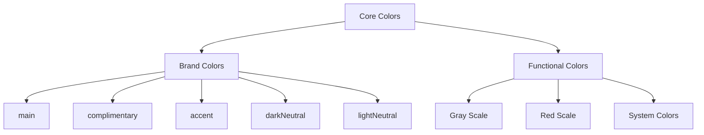

# Core Colors

Core color tokens define the essential brand colors that form the foundation of our visual identity.

## Color Organization

Core colors are organized into **Brand Colors** and **Functional Colors**:



## Brand Colors

Core brand colors define your brand's visual identity:

| Color           | Purpose                                                | Value (Bruttal Theme) |
| --------------- | ------------------------------------------------------ | --------------------- |
| `main`          | Primary brand color for key actions and brand presence | `#292C2a`             |
| `complimentary` | Secondary brand color that complements the main color  | `#f4f3f3`             |
| `accent`        | Accent color for emphasis and call-to-action elements  | `#0469E3`             |
| `darkNeutral`   | Dark neutral for text and strong contrast              | `#325C82`             |
| `lightNeutral`  | Light neutral for backgrounds and subtle elements      | `#F8F8F8`             |

### Usage Examples

```tsx
// Accessing brand colors in components
<Box sx={{ backgroundColor: 'main', color: 'lightNeutral' }}>
  Primary brand section
</Box>

<Button sx={{ backgroundColor: 'accent' }}>
  Accent action
</Button>
```

## Functional Colors

### Gray Scale

Provides neutral colors for text, backgrounds, and borders:

| Token     | Value     | Usage                 |
| --------- | --------- | --------------------- |
| `black`   | `#000000` | High contrast text    |
| `gray100` | `#f9f9f9` | Subtle backgrounds    |
| `gray200` | `#dedede` | Light borders         |
| `gray300` | `#c4c4c4` | Disabled states       |
| `gray400` | `#ababab` | Placeholder text      |
| `gray500` | `#929292` | Secondary text        |
| `gray600` | `#7a7a7a` | Primary text on light |
| `gray700` | `#626262` | Strong text           |
| `gray800` | `#4c4c4c` | Very strong text      |
| `gray900` | `#323232` | Maximum contrast      |
| `white`   | `#ffffff` | Pure white            |

### Red Scale

Error states and negative actions:

| Token    | Value     | Usage              |
| -------- | --------- | ------------------ |
| `red100` | `#ffebeb` | Error backgrounds  |
| `red200` | `#fdbfbf` | Light error states |
| `red300` | `#f99595` | Medium error       |
| `red400` | `#f56c6c` | Error borders      |
| `red500` | `#ef4444` | Primary error      |
| `red600` | `#e42828` | Strong error       |
| `red700` | `#c62121` | Critical error     |

### System Colors

Additional functional colors:

| Token      | Value     | Usage          |
| ---------- | --------- | -------------- |
| `amber600` | `#d97706` | Warning states |
| `teal600`  | `#0d9488` | Success states |

## Token Implementation

### In Theme Files

```typescript
const coreColors = {
  // Brand colors
  main: '#292C2a',
  complimentary: '#f4f3f3',
  accent: '#0469E3',
  darkNeutral: '#325C82',
  lightNeutral: '#F8F8F8',

  // Gray scale
  black: '#000000',
  gray100: '#f9f9f9',
  gray200: '#dedede',
  // ... etc

  // Functional colors
  red700: '#c62121',
  amber600: '#d97706',
  teal600: '#0d9488',
};
```

### In Components

```tsx
// Direct color access
<Box sx={{ color: 'main' }}>Brand color</Box>

// Through semantic tokens (recommended)
<Box sx={{
  backgroundColor: 'action.background.primary.default',  // Uses core.colors.main
  color: 'action.text.secondary.default'                // Uses core.colors.white
}}>
  Semantic approach
</Box>
```

## Color Accessibility

All core colors are chosen to ensure:

- **WCAG AA compliance** when used in appropriate combinations
- **Sufficient contrast ratios** for text readability
- **Color-blind friendly** color relationships
- **High contrast mode** compatibility

### Recommended Combinations

| Background | Text Color | Contrast Ratio |
| ---------- | ---------- | -------------- |
| `white`    | `gray600`  | 4.5:1 (AA)     |
| `main`     | `white`    | 8.2:1 (AAA)    |
| `accent`   | `white`    | 7.1:1 (AAA)    |
| `red700`   | `white`    | 6.3:1 (AAA)    |

## Multi-Theme Example

Same token names, different values across themes:

```typescript
// Bruttal Theme
core.colors.main: #292C2a
core.colors.accent: #0469E3

// Oca Theme
core.colors.main: #111827
core.colors.accent: #03FF7A
```

This enables seamless theme switching while maintaining component structure.

## Next Steps

- **[Semantic Colors](/docs/design/design-system/semantic-tokens/colors)**: How core colors are applied
