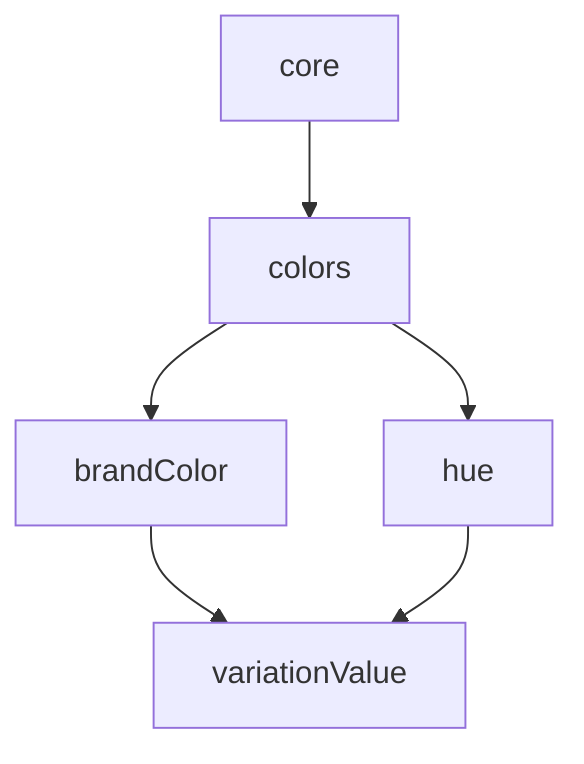

The core color tokens are divided into 2 hierarchical levels, first the color [Name](#color-name) is defined and second the [Variation](#color-variation) if any.  
This standard intend to be exhaustive in the needs of using colors in the core layer. You can create as many colors as necessary at [Name](#color-name) set, where the only requirement is just keep them at a low level of abstraction. Then apply variations if needed, making it possible to extend the [Name](#color-name) palette by varying the color parameters (e.g. lightness, saturation or transparency).

> Name Pattern: `core.colors.{colorName}.{variationValue}`

## Color Name

The first definition of Core Colors Tokens is the name of the color which are divided into 2 categories: [Brand Colors](#brand-colors) and [Hue Colors](#hue-colors).

Both have mandatory pre-defined names for standardization and scalability purposes in multi-branding scenarios.  
Despite this requirement, you can expand the colors by creating new ones as needed, just fit the new name into some of the categories and, in the case of Brand Color, keep the name with a low level of abstraction.

### Brand Colors

| Brand Color          | Description                                                                                                                                                | Name Pattern                     |
| :------------------- | :--------------------------------------------------------------------------------------------------------------------------------------------------------- | :------------------------------- |
| `main`               | This color will be used for grabbing attention, highlighting important information, and used for calls to action. This color should be memorable.          | `core.colors.main`               |
| `complimentary`      | This color contrasts and compliments the `main` color. It can be useful to use the color wheel for picking a complementary color.                          | `core.colors.complimentary`      |
| `accent`             | This is a neutral shade that pairs well with the main and complementary colors. This will help ground the colors and can be used as an accent color.       | `core.colors.accent`             |
| `darkNeutral`        | A dark neutral color that aligns with the rest of your color scheme. This color will be used mostly for paragraph text and dark backgrounds.               | `core.colors.darkNeutral`        |
| `lightNeutral`       | This color will be used for background and supporting elements. This color will not take the limelight and will be used to add depth to the brand palette. | `core.colors.lightNeutral`       |
| `{customBrandColor}` | You could create new brand colors as needed, the requirement is to keep it at a low abstraction level.                                                     | `core.colors.{customBrandColor}` |

### Hue Colors

| Hue           | Description                                                                                                                                         | Name Pattern              |
| :------------ | :-------------------------------------------------------------------------------------------------------------------------------------------------- | :------------------------ |
| `gray`        | Brand gray color, by default we create a palette with shades of gray adding [variation](#color-variation).                                          | `core.colors.gray`        |
| `{customHue}` | You could create new hue colors as needed. The name of the color must refer to its hue, even creating custom names like: sky, ocean, flamingo, etc. | `core.colors.{customHue}` |

## Color Variation

Color variations can be created as needed. Despite this flexibility, we strongly recommend following the variations group recommendations and choosing one of the suggested scales to maintain standardization and usability when changing or creating new design themes in multi-branding scenarios.  
The sets of values are divided into 3 groups: [Lightness](#lightness), [Saturation](#saturation) and [Transparency](#transparency). The values of each group can be represented in numeric or ordinal scales as follows.

### Lightness

| Scale   | Variation Value                                                                                                                                                                                                                |
| :------ | :----------------------------------------------------------------------------------------------------------------------------------------------------------------------------------------------------------------------------- |
| Numeric | `0` to `1000` -- `0` is white and `1000` is black. The value represents the level of darkness applied to the color, typically used in increments of 100 -- `50`, `100`, `200`, `300`, `400`, `500`, `600`, `700`, `800`, `900` |
| Ordinal | `light`, `default`, `dark`                                                                                                                                                                                                     |

### Saturation

| Scale   | Variation Value              |
| :------ | :--------------------------- |
| Ordinal | `bright`, `default`, `muted` |

### Transparency

:::info

In progress

:::
