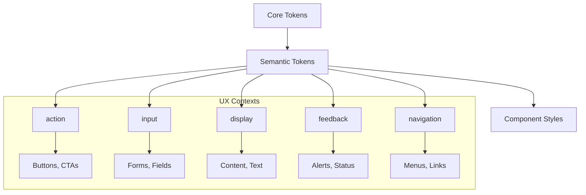

# Semantic Tokens Overview

Semantic tokens provide contextual meaning to design values by describing **what** they're used for rather than **what** they look like.

## Purpose

Semantic tokens bridge the gap between core brand values and component implementation:

- **Contextual meaning**: Names describe purpose (`action.background.primary`)
- **Consistent usage**: Same semantic token used across similar contexts
- **Theme flexibility**: Same semantic meaning, different visual treatment
- **Component integration**: Direct mapping to component variants

## Semantic Token Architecture



## Naming Convention

Semantic tokens follow a structured hierarchy:

```
{ux}.{context}.{nature}.{state?}

Examples:
action.background.primary.default
input.text.error.focused
display.border.muted.hover
navigation.text.secondary.active
```

### Naming Breakdown

1. **UX Context**: Where the token is used (`action`, `input`, `display`, `feedback`, `navigation`)
2. **Context**: What aspect is being styled (`background`, `text`, `border`)
3. **Nature**: Semantic meaning (`primary`, `secondary`, `muted`, `error`, `success`)
4. **State**: Interaction state (`default`, `hover`, `active`, `focused`, `disabled`)

## UX Context Categories

### [Action](/docs/design/semantic-tokens/colors#action-context)

Interactive elements that trigger user actions:

- Buttons and CTAs
- Links and navigation
- Interactive cards
- Toggle switches

### [Input](/docs/design/semantic-tokens/colors#input-context)

Form elements and data entry:

- Text inputs and fields
- Select dropdowns
- Checkboxes and radios
- Form validation states

### [Display](/docs/design/semantic-tokens/colors#display-context)

Content presentation and information:

- Text and headings
- Cards and containers
- Data tables
- Content areas

### [Feedback](/docs/design/semantic-tokens/colors#feedback-context)

Status communication and user feedback:

- Success messages
- Error alerts
- Warning notifications
- Loading states

### [Navigation](/docs/design/semantic-tokens/colors#navigation-context)

Wayfinding and site navigation:

- Main navigation
- Breadcrumbs
- Pagination
- Menu systems

## Token Categories

### [Colors](/docs/design/semantic-tokens/colors)

Context-specific color applications:

```
action.background.primary.default: core.colors.main
input.border.error.default: core.colors.red700
display.text.secondary.default: core.colors.gray600
```

### [Typography](/docs/design/semantic-tokens/typography)

Text styles for specific use cases:

```
display.text.headline: { fontSize: '3xl', fontWeight: 'bold' }
input.text.label: { fontSize: 'sm', fontWeight: 'medium' }
navigation.text.link: { fontSize: 'md', textDecoration: 'underline' }
```

### [Interaction States](/docs/design/semantic-tokens/interaction-states)

State-specific styling:

```
action.background.primary.hover: { filter: 'brightness(110%)' }
input.border.default.focused: { borderWidth: 'md' }
display.text.link.visited: { color: 'core.colors.accent' }
```

## Implementation in Components

### Direct Token Usage

```tsx
// Using semantic tokens in custom components
<Box
  sx={{
    backgroundColor: 'action.background.primary.default',
    color: 'action.text.secondary.default',
    ':hover': {
      backgroundColor: 'action.background.primary.hover',
    },
  }}
>
  Custom button
</Box>
```

### Component Variants

```tsx
// Semantic tokens power component variants
<Button variant="primary">    {/* Uses action.* tokens */}
<Button variant="secondary">  {/* Uses action.* tokens */}
<Button variant="destructive"> {/* Uses action.* tokens */}

<Input variant="default">     {/* Uses input.* tokens */}
<Input variant="error">       {/* Uses input.* tokens */}
```

### Theme Integration

```typescript
// Semantic tokens in theme configuration
const theme = {
  colors: {
    // Action context
    action: {
      background: {
        primary: {
          default: coreColors.main,
          hover: coreColors.complimentary,
          active: coreColors.accent,
        },
      },
    },

    // Input context
    input: {
      border: {
        default: { default: coreColors.gray300 },
        error: { default: coreColors.red700 },
      },
    },
  },
};
```

## Multi-Theme Support

Semantic tokens enable consistent component behavior across themes:

```typescript
// Bruttal Theme
action.background.primary.default: coreColors.main  // #292C2a

// Oca Theme
action.background.primary.default: coreColors.main  // #111827

// Same button component, different appearance
<Button variant="primary">Click me</Button>
```

## Accessibility Benefits

Semantic tokens improve accessibility by:

- **Consistent contrast**: Color relationships maintained across themes
- **Meaningful states**: Clear visual feedback for interactions
- **Focus indicators**: Dedicated tokens for focus states
- **Error communication**: Specific tokens for error states

## Best Practices

### Naming Guidelines

- Use **descriptive names** that explain purpose
- Follow **consistent hierarchy** (UX → Context → Nature → State)
- Avoid **appearance-based names** (no "blueButton" or "darkText")
- Include **state modifiers** when needed (hover, focus, disabled)

### Token Organization

- **Group by UX context** first, then by property
- **Reference core tokens** exclusively (no raw values)
- **Include all necessary states** for interactive elements
- **Document usage patterns** for complex tokens

### Component Integration

- **Map semantic tokens** to component variants
- **Use consistent patterns** across similar components
- **Provide hover/focus states** for interactive elements
- **Include disabled states** for form components

## Next Steps

- **[Semantic Colors](/docs/design/semantic-tokens/colors)**: Color token implementation
- **[Semantic Typography](/docs/design/semantic-tokens/typography)**: Text styling tokens
- **[Implementation Guide](/docs/design/design-system/design-tokens/implementation)**: Technical implementation
