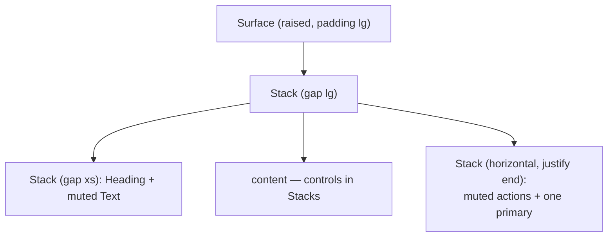

The [Entity contract](/docs/design/design-system/components/component-model) guarantees that a UI is _semantically correct_ — the right token for the right meaning, consistent across theme and mode. It does not, on its own, guarantee that the result is _well designed_. Correctness and beauty are orthogonal: a screen where every component is legal can still read as an undifferentiated pile of controls. These guidelines close that gap. They are the taste layer — the small set of composition decisions that make the default projection look like a considered product, not a form dump.

They are expressed through the [presentational primitives](/docs/design/ui-components) (`Surface`, `Heading`, `Text`, `Stack`) and the control catalog. Nothing here reaches for a raw `font-size`, `gap`, or shadow — the whole point is that quality comes from the system, so it survives a theme change.

## Depth: layer surfaces, don't flatten them

Every region that is conceptually a distinct object — a card, a panel, a sheet, a dialog body — is a `Surface`, not a bordered `div`. Pick the `level` by how the surface sits relative to the page, never by how it should look:

- `flat` — flush with the page (a section that organizes without lifting).
- `raised` — the default card/panel: sits above the page.
- `overlay` — floats above raised content (menus, popovers).
- `blocking` — the strongest in-flow depth (dialogs).

Depth reads in both modes because `Surface` pairs the elevation shadow with the tonal surface colour at that stratum. In light, shadow carries the lift; in dark, the surface _lightens_ as it rises (a near-black canvas swallows shadows). Do not try to reproduce this by hand — a raised card built from a border alone is the single most common way a dark UI reads as flat and cheap.

Nesting is legal and encouraged: a `raised` card may hold a `flat` sub-region. Keep the ladder shallow — two or three live levels on a screen is plenty.

## Hierarchy: one clear entry point per surface

A surface with no typographic hierarchy gives the eye nowhere to land. Lead each meaningful surface with a `Heading`, and let supporting copy recede:

```tsx
<Surface level="raised" padding="lg">
  <Stack gap="lg">
    <Stack gap="xs">
      <Heading level={3}>Account settings</Heading>
      <Text variant="body-sm" tone="muted">
        Manage how your workspace behaves.
      </Text>
    </Stack>
    {/* controls */}
  </Stack>
</Surface>
```

Choose `Heading level` for document structure (screen-reader order), not for size; reach for `size` only when the visual step must differ from the rank. `tone="muted"` is the sanctioned lever for secondary copy — captions, hints, metadata. Building hierarchy _is_ choosing which text recedes.

## Rhythm: space from the scale, generously

Lay everything out with `Stack`, never a hand-rolled flex `div`. `direction="vertical"` reads the `gap.stack` scale; `direction="horizontal"` reads `gap.inline`. Group related things tightly and separate unrelated groups loosely — a title and its caption sit at `gap="xs"`, whole sections at `gap="lg"`. Consistent rhythm is more legible than dense packing; when in doubt, give a surface more room, not less.

## Action: exactly one primary per surface

The fastest way to make a screen look amateur is a row of equally-weighted solid buttons. A surface should present **one** primary action; everything else is `muted` or `secondary`:

```tsx
// ✅ one clear primary, the rest recede
<Stack direction="horizontal" gap="sm" justify="end">
  <Button evaluation="muted">Cancel</Button>
  <Button evaluation="primary">Save</Button>
</Stack>

// ❌ four solid CTAs competing — no hierarchy of action
<Stack direction="horizontal" gap="sm">
  <Button evaluation="primary">Save</Button>
  <Button evaluation="accent">Publish</Button>
  <Button evaluation="primary">Duplicate</Button>
  <Button evaluation="negative" consequence="destructive">Delete</Button>
</Stack>
```

A destructive action belongs behind a `ConfirmationDialog`, not sitting armed next to the primary. If a surface seems to need several primaries, it is probably several surfaces.

## Colour: let neutrals carry the structure

The brand accent is a spotlight, not a wash. Structure — surfaces, borders, most text — is carried by the neutral ramp; the accent marks the one thing that matters most on the surface (the primary action, the active tab, a selected item). A screen where everything is branded has nothing emphasized. Feedback colours (`positive` / `caution` / `negative`) express state, never decoration.

## Motion and focus come for free

Do not hand-animate. Transitions and the focus ring are already tokenised and honour `prefers-reduced-motion`; controls carry them. Adding bespoke motion or a custom focus outline breaks the one consistent behaviour a user relies on.

## The shape of a good surface



Read it top to bottom: a depth-bearing container, a rhythmic stack, a titled header, content, and a single primary action anchored at the end. Every decision is a named token or primitive — which is exactly why the result stays coherent when the theme changes underneath it.
